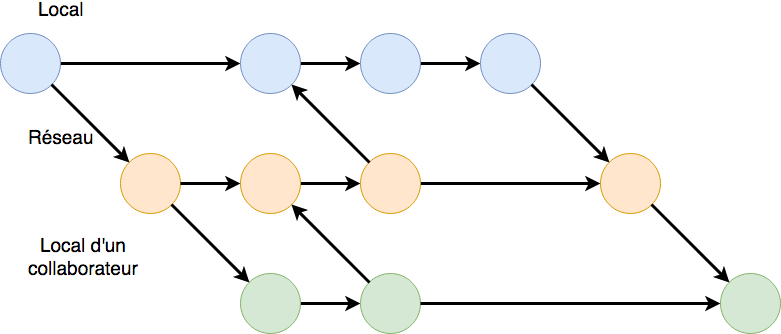

# (PART) Cours I: visualisation et inférence {-}

# Introduction {#intro}

```{r setup, include=FALSE}
knitr::opts_chunk$set(comment = "#", fig.align = "center")
```

#### Objectifs : {-}

- Appréhender ce qu'est la science des données et les (bio)statistiques.

- S'initier à des outils de base (SciViews Box, RStudio, Markdown, git, Github).

- Se sensibiliser à l'importance d'une présence web au niveau professionnel.


## Comment le monde était-il y a 25 ans ? {#donnees}

Il y a 25 ans, pas d'internet, pas de smartphone. Essayez d'imaginer ce que serait votre vie aujourd'hui si ces outils qui font partie de votre quatidien n'existaient pas.

- Les révolutions indistrielles:
    * 1770 (1756) révolution 1: mécanisation
    * 1870 révolution 2: maîtrise de l'énergie
    * 1970 (1979) révolution 3: informatique
    * 1990 révolution 4: internet (1990 Web, 1992 ISOC = Internet society, 1993 = premier navigateur web)
    * 2000 révolution 5: numérique. GAFA = Google - Apple - Facebook - Amazon + Microsoft = GAFAM aux USA et BATX en Chine = Baidu - Alibaba - Tencent - Xiaomi. Aussi NATU = Netflix - Airbnb - Tesla - Uber.
    2010 révolution 6: NBIC = nanotechnologies - biotechnologies - informatique - sciences cognitives.
    2020 = date prévue pour que l'ordinateur ait la même puissance de traitement de l'information que le cerveau humain
    2030 = transhumanisme: ordinateur plus puissant que l'homme et le remplacera probablement dans de nombreuses tâches.

- Valeur estimée des données et informations mises à disposition par les utilisateurs du net: 1000 milliards de dollar par an (écrivez ce nombre en chiffres pour vous donner une meilleure idée de ce que cela représente)!

- En 2020, quantité d'information ajoutée sur le net: 1000 milliards de milliards par semaine (écrivez ce nombre en chiffres également).

- Comparaison de puissance de traitement du cerveau humain _versus_ un ordinateur: 89 milliards de neurones, mais travail en multitâche alors qu'un processeur est monotâche => difficile à comparer. Une étude a montré en 2017 que l'un des 5 ordinateurs les plus puissants a été capable de simuler le fonctionnement d'environ 1% du cerveau humain en 1 sec. Il lui a fallu 40 min de calcul pour y arriver. Intel estime que l'évolution permettra d'égaler le cerveau humain en terme de vitesse de traitement vers 2020.

- Consommation électrique du supercalculateur: se mesure en mégawatts, alors que le cerveau humain consomme 12-13W seulement!

- "Le **transhumanisme** est une approche interdisciplinaire qui nous amène à comprendre et à évaluer les avenues qui nous permettrons de surmonter nos limites biologiques par les progrès technologiques. Les transhumanistes cherchent à développer les possibilités techniques afin que les gens vivent plus longtemps et ..."

Vous pouvez maintenant avoir un aperçu de l'importance d'avoir des outils performants afin d'appréhender les données dont le nombre croit de manière exponentielle. Pour ce cours de sciences des données,  plusieurs outils puissants sont mis à votre disposition (Vous trouverez sur l'hyperlien suivant, un poster présentant la philosophie du cours <https://github.com/BioDataScience-Course/RencontresRRennes2018>)


## Découverte des outils
La science des données est complexe et requiert d'employer des outils performants. Nous avons sélectionné ces outils pour vous.

### Machine virtuelle

La **SciViews Box** est une machine virtuelle (un ordinateur complet, mais totalement indépendant du matériel -le hardware- et qui peut être déployé sur pratiquement n'importe quel ordinateur physique). Cette SciViews Box est complètement configurée et dédiée à la sciences des données biologiques. Elle contient tout ce qu’il faut pour importer et analyser vos données, et ensuite écrire des rapports ou d'autres documents prêts à publication ou à présentation. Elle vous servira également à collaborer avec d'autres chercheurs qui peuvent facilement utiliser exactement la même machine virtuelle (aspect reproductible de vos analyses).

Des explications détaillées se trouvent dans l'annexe \@ref(svbox) dédiée à l'installation et la configuration de la SciViews Box.

```{r echo=FALSE, out.width="256px", fig.cap="Logo de la SciViews Box"}
knitr::include_graphics('images/svBox-256.png')
```

```{block, type = 'bdd'}
Une fois loggé dans la machine virtuelle, réalisez l'activité : **Découverte de la machine virtuelle**
<https://github.com/BioDataScience-Course/sdd_lesson/blob/master/sdd1_01/presentations/sdd1_01_sv_box.pdf>

Après avoir réalisé l'activité, un document récapitulatif est mis à votre disposition : 
<https://github.com/BioDataScience-Course/sdd_lesson/blob/master/sdd1_01/exercises/sdd1_01_svbox.md>
```

Des explications détaillées se trouvent dans l'annexe \@ref(svbox_use) dédiée à l'utilisation de la SciViews Box.


### RStudio

RStudio est l'outil au sein de la SciViews Box que vous allez utiliser le plus fréquemment durant ce cours. 


Il fournit un environnement complet et optimisé pour réaliser vos analyses, vos graphiques et vos rapports. RStudio travaille main dans la main avec le logiciel R qui effectue l'ensemble des traitements.


Rstudio est divisé en 4 zones importantes (A-D) avec une barre d'outils général au dessus : 

- A : Une zone d'édition 

- B : Plusieurs onglets sont présents comme `Environement`, `History` ou encore `Connections`. Par exemple, les différents items (on parle d’objets) chargés en mémoire dans R se trouveront dans l'environnement (mais pour l’instant, il n’y a encore rien).

- C : La `Console` étant le zone d'instruction où vous pouvez entrer des instructions dans R pour manipuler vos données

- D : Plusieurs onglets sont présents comme `Files`, `Help` ou encore `Viewer`. 

Des explications détaillées se trouvent dans l'annexe \@ref(rs) dédiée à l'utilisation de R Studio.

Vous avez à votre disposition un aide-mémoire afin d'appréhender cette interface [RStudio IDE Cheat Sheet](https://github.com/rstudio/cheatsheets/raw/master/rstudio-ide.pdf). 

#### Pour en savoir plus ...

- [RStudio](https://www.rstudio.com/). Site de Rstudio comprennant un ensemble de ressource en anglais afin d'appréhender RStudio.

- [RStudio, un environnement de développement pour R](https://quanti.hypotheses.org/488/). Site proposant une brève explication de RStudio en français.

- [RStudio : sa vie, son oeuvre, ses ressources](https://elementr.hypotheses.org/237). Site proposant une explication de RStudio en français.

### Markdown

Afin de réaliser vos analyses dans RStudio, nous employons le language `Markdown` dans la zone d'édition. Ce language a été mis au point afin de séparer  la mise en forme et le fond. Ce language a la volontée de revenir au fondamental de l'écriture, le fond.


Son avantage principal réside dans sa simplicité d'apprentissage. Quels sont les commandes et instructions indispensables lorsque l'on rédige un rapport ?  Des titres et sous-titres, mise en évidence (mise en italiques ou mise en gras), des listes,... Il ne faut au final que très peu de commandes que pour réaliser un rapport de qualité avec une mise en page minimaliste et épurée. 

Vous avez à votre disposition deux aide-mémoires afin d'appréhender ce language avec l'aide mémoire [R Markdown Cheat](https://github.com/rstudio/cheatsheets/raw/master/rmarkdown-2.0.pdf) Sheet qui comprend une section relative au language markdown et la première page de l'aide mémoire [R Markdown Reference Guide](https://www.rstudio.com/wp-content/uploads/2015/03/rmarkdown-reference.pdf)

Après avoir rédiger votre document, vous devez cliquer sur `Preview`.

```{block, type = 'bdd'}
Une fois loggé dans la machine virtuelle, réalisez l'activité : **Découverte de rstudio et rmarkdown**
<https://github.com/BioDataScience-Course/sdd_lesson/blob/master/sdd1_01/presentations/sdd1_01_markdown.pdf>

Après avoir réalisé l'activité, un document récapitulatif est mis à votre disposition : 
<https://github.com/BioDataScience-Course/sdd_lesson/blob/master/sdd1_01/exercises/sdd1_01_markdown.md>
```

#### Pour en savoir plus...

- [Markdown](https://daringfireball.net/projects/markdown/). Explication en anglais de l'intérêt d'employer markdown ainsi que la syntax à employer.

- [Rédigez en Markdown !](https://openclassrooms.com/fr/courses/1304236-redigez-en-markdown)


- [Un guide pour bien commencer avec markdown](https://blog.wax-o.com/2014/04/tutoriel-un-guide-pour-bien-commencer-avec-markdown/). Explication détaillée en français sur le language markdown

- [Le Markdown comme langage d’écriture universel ?](https://blog.genma.fr/?Le-Markdown-comme-langage-d-ecriture-universel)

- [Comment écrire confortablement et professionnellement ? Le markdown !](https://dolys.fr/forums/topic/comment-ecrire-confortablement-professionnellement-markdown/). Utilisation de Markdown afin de revenir à l'essence de la rédaction.

- [Écrire tout simplement – Introduction à Markdown](http://www.boiteaoutils.info/2013/02/ecrire-tout-simplement-introduction/). Explication en français des raisons de l'utilisation de markdown.

### Gestionnaire de version 

Lors de la rédaction de travaux comme par exemple lors de l'écriture d'un travail de fin d'étude ou d'un rapport assez important. On se retrouve rapidement avec plusieurs fichiers correspondant à des états d'avancements de ce dernier : 

- TFE_final
- TFE_final1
- TFE_final2
- TFE_final3
- TFE_final...
- TFE_final99

Lors de différents essais, on va avoir tendance à tout garder dans différents fichiers afin de ne rien supprimer d'important. Cette pratique bien que très courante comporte le gros désavantage de prendre énormément de place sur le disque de votre ordinateur et de n'être pas pratique.
Les questions suivantes peuvent se poser  : 

Que se cache t'il dans la version TFE_final 2 ? Après 1 mois sans travailler sur ce projet, seriez vous capable de specifier la différence entre le fichier TFE_final 2 et le TFE_final3 ? 

Et cela peut encore se compliquer lorsque plusieurs personnes collaborent sur un même projet. Ils vont devoir s'envoyer par mail tous les fichiers, avec chacun y apportant ses idées. 

- TFE_final
- TFE_final1
- TFE_final1_jacques
- TFE_final1_pierre
- TFE_final2
- TFE_final2_jules
- TFE_final...
- TFE_final99

Dans quel fichier se trouve la dernière version de chaque personne ayant collaboré sur le projet ? Une petit peu dans chaque fichier. 

Différentes avancées ont été réalisées pour améliorer le travail collaboratif comme :

- L'utilisation de partage de fichiers en ligne ( [Dropbox](https://www.dropbox.com/business/landing-t68fl?_tk=sem_b_goog&_camp=sem-b-goog-emea-be-fre-exact-restructure&_kw=dropbox|e&_ad=244691468861|1t1|c&gclid=CjwKCAjwzenbBRB3EiwAItS-u3vb9iSK6F4MFnw3oWaEq0gwxQk74_ekOASIah0P-9u_pYFis8hxFxoCdOIQAvD_BwE), [Google Drive](https://www.google.com/drive/), [One Drive](https://onedrive.live.com/about/fr-be/))

Il en est fini le temps où l'on s'envoyait un dossier comprenend chacune des avancées par mails. Cette option ne règle toujours pas le problème de collaboration sur le même fichier. 

- L'utilisation de programme d'édition collaboratif et en temps réel ( [etherpad](http://etherpad.org/), [Google Drive - Docs](https://www.google.com/intl/fr_be/docs/about/), [Gobby](https://gobby.github.io/) ). 

Il est possible de travailler en même temps sur un même fichier d'édition. Cette option ne règle pas le problème du retour en arrière. Lorsqu'une modification a été réalisée l'ancienne version est tout simplement écrasée. Il est donc impossible de revenir dessus. 

- La meilleur combinaison pour gérer ses versions et collaborer : [*Git*](https://git-scm.com/) et [Git Hub](https://github.com/)

Ces outils ont l'étiquette d'être des outils fait par et pour des geeks. Cependant, ils permettent de gérer et collaborer de manière efficace sur un même projet contenant du code ou non. 

#### Git

La gestion de versions est gérée par *Git*. Cet outil va remplacer les nombreuses copies d'un même fichier par une sorte d'arbre que l'on peut représenter schématiquement comme ci-dessous :


Comme vous pouvez le voir ci-dessus, on peut suivre la progression de notre projet via les boules bleues. Chaque boule représente l'état de notre projet lorsque l'on a décidé de l'enregistrer. Pour envoyer une nouvelle version de votre projet, vous réalisez un **commit** qui sera accompagné d'un message qui spécifie les modifications apportées. Il est possible de revenir en arrière avec un **checkout**.

Git comprend de nombreux outils très intéressant pour la gestion de versions que vous utiliserez par la suite.

#### Git Hub

Afin de sauvegarder vos projets en ligne, de les partager et de collaborer avec d'autres personnes, un réseau social a été conçu pour héberger vos projets  qui se nomme **Git Hub** (tout comme Facebook ou LinkedIn). On retrouve deux mots dans Git Hub. Il y a tout d'abord Git qui exprime la gestion de version  et ensuite hub qui exprime le reseau. Il s'agit donc d'un réseau social qui permet de collaborer sur des projets.

Lorsque l'on travaille seul tout en utilisant le reseau social l'évolution de notre projet va ressembler à l'arbre ci-dessous: 


On réalise un envoi **push** lorsque l'on souhaite envoyer sur le réseau social l'état dans lequel le projet se trouve. De ce fait plusieurs **Comit** peuvent être envoyé avec un seul **push** sur le réseau.

L'avantage de **Git Hub** ne réside pas vraiment dans la posibilité de réaliser une sauvegarde en ligne mais réside dans la possibilité de collaborer avec d'autres personnes présent sur ce réseau comme l'illustre la figure ci-dessous. 

Deux scientifiques (les boules bleues et les boules vertes) collaborent sur un même projet que l'on appele **dépot** ( **repository** en anglais ) lorsqu'il est en ligne. Le premier chercheur (boule bleue) va initier le dépot et réaliser un push pour le placer sur le réseau. Son collaborateur (boule verte) va **cloner** (**clone** en anglais) le dépot sur son ordinateur afin d'y travailler également en local. Après avoir fait progresser le travail, il réalise également un **push** sur le réseau. Le premier scientifique avant de travailler à nouveau sur le projet va réaliser un **pull** afin d'obtenir en local l'ensemble des modifications fournie par ses collaborateurs. 



Vous venez d'apprendre différents mots technique indispensable pour une bonne compréhension de git et github

- **repository**

- **commit**

- **clone**

- **push**

- **pull**

Ceci n'est qu'une rapide explication de ces deux programmes, retrouve une explication détaillée à l'annexe...  

##### Pour en savoir plus 

- [Gérez vos codes source avec Git ](https://openclassrooms.com/fr/courses/1233741-gerez-vos-codes-source-avec-git). Explication en français sur l'utilisation de Git. 

- [Quel logiciel de gestion de versions devriez-vous utiliser ?](https://www.codebuilder.fr/blog/developpement-collaboratif-logiciels-gestion-versions/). Explication en français sur l'utilisation des logiels de gestion de versions.

- [Git: comprendre la gestion de versions](https://blog.axopen.com/2017/02/git-comprendre-la-gestion-de-versions/). Explication en français sur l'utilisation de Git.


- [Git](https://git-scm.com/). Site en anglais comprendant toute la document de Git.

- <http://www.lsv.fr/~hirschi/pdfs/git.pdf>

- <https://www.christopheducamp.com/2013/12/15/github-pour-nuls-partie-1/>

#### Git Hub Classroom {#classroom}

**Git Hub Classroom** est une extension de Git Hub qui s'emploie pour les utilisateurs comme Git Hub. Vous serez amené à cloner des dépots, modifier des dépots pour réaliser des commit,...  Le tout va être suivi pour des administrateurs. Différents exercices vous seront proposés via ce programme. 

Par exemple, le projet initial pour réaliser votre site web se trouve sur ce programme.

## Site web professionnel {#site}

De nos jours, un nombre important de données sont collectées sur nous. A la fin de vos études, vous serez amenés à rechercher un travail (dans le milieu de la recherche universitaire, dans la recherche en entreprise, dans les métiers de l'éco-conseils, etc.). Cependant, tous les recruteurs utilisent actuellement les données que l'on a semé sur le net afin de réaliser un profil détaillé sur nous. Il est donc de votre intérêt d'avoir le meilleur profil possible sur Internet. Nous allons vous y aider !

Les réseaux sociaux sont une mine d'or sur nos habitudes de vie comme Facebook, Twitter ou encore Instagram. On peut parler de l'image numérique d'une personne. Afin de mettre l'accent sur les compétences professionnels, de plus en plus de personnes utilisent des réseaux plus profesionnels comme LinkedIn ou encore des sites webs personnels professionels (par exemple : <http://phgrosjean.sciviews.org/>, <http://www.guyliann.be/>).

Dans le cadre de ce premier module, vous allez réaliser votre premier site professionnel (contenant également une section "blog" que vous pourrez alimenter, entre autres, avec vos considérations concernant vos cours, les analyse de données, et autres). Ce site sera immédiatement disponible sur le web et ce, de manière entièrement gratuite! Afin de mener à bien ce premier projet, divers outils vous seront nécessaires. Ces outils seront complétés plus trd par d'autres pour que vous ayez une boite à outils complète pour vos futures analyses de données professionnelles.

### A vous de jouer 

```{block, type = 'bdd'}
Maintenant que vous avez appréhendé les différents outils, lancez vous dans la création de votre site web professionnel via l'addresse suivante : <https://github.com/BioDataScience-Course/blogdown.source>
```


