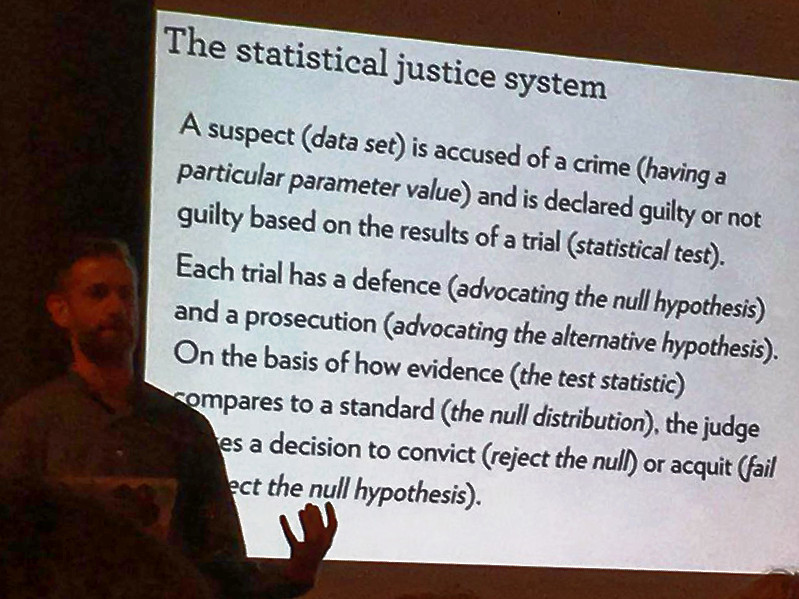

# Moyenne {#moyenne}

```{r setup, include=FALSE, echo=FALSE, message=FALSE, results='hide'}
knitr::opts_chunk$set(comment = '#', fig.align = "center")
SciViews::R
```

##### Objectifs {-}

- De manière générale, pouvoir répondre à différentes questions concernant une ou deux moyennes

- Découvrir la distribution *t* de Student

- Comprendre le principe de la distribution d'un échantillon

- Appréhender l'intervalle de confiance, savoir le calculer et l'utiliser

- Comprendre les différentes variantes du test *t* de Student et être capable de l'utiliser pour résoudre des questions pratiques en biologie

- Connaître également le test de Wilcoxon-Mann-Withney, et pouvoir déterminer quand l'utiliser à la place du test de Student


##### Prérequis {-}

Ce module élabore sur les notions vues au module \@ref(proba) concernant les lois de distribution statistiques et sur le concept de test d'hypothèse abordé dans le module \@ref(chi2). Ces deux précédents modules doivent donc être maîtrisés avant d'aller plus avant ici.


## Une histoire de bière...

Les belges, c'est connu, apprécient la bière. Mais ils ne sont pas les seuls, et c'est très heureux\ ! Car c'est en effet grâce à un certain William Sealy Gosset, brasseur et statisticien (et oui, ça ne s'invente pas) que l'un des tests d'hypothèses des plus utilisés en biologie a vu le jour\ : le test de "Student" qui permet de comparer des moyennes.

Pour la petite histoire, Gosset a travaillé pour une certaine brasserie irlandaise du nom de Guiness au début du 20^ème^siècle. C'est en étudiant la variabilité de sa bière d'un cru à l'autre que Gosset a découvert la façon dont la moyenne d'un échantillon se distribue. Il a pu dériver une formulation mathématique de cette distribution, la **distribution *t* de Student**, et à partir de là, nous verrons que de nombreuses applications en découlent. Nous pourrons, par exemple, dire si deux moyennes diffèrent *significativement* l'une de l'autre ou pas.

Mais au fait, pourquoi, cette distribution porte-t-elle le nom de "Student"\ ? Visionnez la vidéo suivante (malheureusement en anglais) pour le découvrir^[Vous pouvez activer les sous-titres en anglais via la barre de boutons en bas de la vidéo pour vous aider à comprendre l'histoire.].

```{r, echo=FALSE}
vembedr::embed_youtube("GFzCIA9kppM", width = 770, height = 433)
```

Le contrat que Gosset a signé avec son employeur l'empêchait de publier des résultats scientifiques sous son vrai nom. Ainsi, il décida de publier sa trouvaille qui occupe aujourd'hui une place très importante en statistiques sous le pseudonyme de "Student" (l'étudiant). Ce n'est qu'à sa mort, en 1937, que l'on pu révéler le nom de l'auteur qui est derrière cette fantastique trouvaille. Mais au fait, de quoi s'agit-il exactement\ ? Nous allons le découvrir dans la section suivante.


## Distribution d'échantillonnage

Pour rappel, nous faisons de l'**inférence** sur base d'un échantillon parce que nous sommes incapables de mesurer tous les individus d'une population. Il faut au préalable que l'échantillon soit *représentatif*, donc réalisé dans les règles de l'art (par exemple, un échantillonnage aléatoire simple de la population). Nous pouvons calculer la moyenne d'un échantillon facilement (eq. \@ref(eq:moyenne). 

\begin{equation} 
  \bar{x}=\sum_{i=1}^n{\frac{x_i}{n}}
  (\#eq:moyenne)
\end{equation} 

où $x$ est une variable quantitative (donc `numeric` dans R) et $n$ est la taille de l'échantillon, donc le nombre d'individus mesurés. On notera $\bar{x}$ la moyenne de $x$, que l'on prononcera "x barre".

En fait, ce qui nous intéresse, ce n'est pas vraiment la moyenne de l'échantillon, mais celle de la population que l'on notera $\mu$^[Notez que les lettres latines sont utilisées pour se référer aux variables et aux descripteurs statistiques telle que la moyenne pour l'échantillon, alors que les paramètres équivalents de la population, qui sont inconnus, sont représentés par des lettres grecques en statistiques.]. D'où la question\ : comment varie la moyenne d'un échantillon à l'autre\ ?

Nous pouvons répondre à cette question de manière empirique en utilisant le générateur pseudo-aléatoire de R. Partons d'une distribution théorique de la population qui soit normale, de moyenne *\mu$ = 8 et d'écart type $\sigma$ = 2. Nous pouvons échantillonner neuf individus. Cela donne\ :

```{r}
set.seed(8431641)
smpl1 <- rnorm(9, mean = 8, sd = 2)
smpl1
mean(smpl1)
```

Dans ce cas-ci, nous obtenons une moyenne de 7,8. Ce n'est pas égal à 8. Le hasard de l'échantillonnage en est responsable. La moyenne de l'échantillon tendra vers la moyenne de la population seulement lorsque $n \longrightarrow \infty$. Réalisons un second échantillonnage fictif.

```{r}
mean(rnorm(9, mean = 8, sd = 2))
```

Cette fois-ci, nous obtenons une moyenne de 8,7. Nous savons que la moyenne $\mu$ qui nous intéresse est très probablement différente de la moyenne de notre échantillon, **mais de conbien\ ?** Pour le déterminer, nous devons définir comment la moyenne de l'échantillon varie d'un échantillon à l'autre, c'est ce qu'on appelle la **distribution d'échantillonnage**. Nous pouvons le déterminer expérimentalement en échantillonnant un grand nombre de fois. On appelle cela une **méta-expérience.** En pratique, c'est difficile à faire, mais avec notre ordinateur et le générateur de nombres pseudo-aléatoires de R, pas de problèmes. Donc, comment se distribue la moyenne entre, ... disons dix mille échantillons différents de neufs individus tirés de la même population^[Nous utilisons pour se faire une boucle `for` dans R qui réitère un calcul sur chaque élément d'un vecteur, ici, une séquence 1, 2, 3, ..., 10000 obtenue à l'aide de l'instruction `1:10000`.]\ ?

```{r}
means_n9 <- numeric(10000) # Vecteur de 10000 valeurs
for (i in 1:10000)
  means_n9[i] <- mean(rnorm(9, mean = 8, sd = 2))
chart(data = NULL, ~ means_n9) +
  geom_histogram(bins = 30)
```

Nous obtenons une distribution symétrique centrée autour de 8. Elle ressemble à une distribution normale, mais ce n'en est pas une. C'est précisément ici que William Gosset intervient. Il est, en effet, arrivé à décrire cette loi de distribution de la moyenne d'échantillonnage. C'est la distribution *t* de Student qui admet trois paramètres\ : une moyenne $\mu_x$, un écart type $\sigma_x$, et des degrés de liberté ddl ou $\nu$. Les degrés de liberté sont en lien avec la taille de l'échantillon. Ils valent\ :

$$ddl = n-1$$

Concernant la moyenne, et l'écart type, nous pouvons les calculer sur base de notre distribution d'échantillonnage empirique contenue dans le vecteur `means`\ :

```{r}
mean(means_n9)
sd(means_n9)
```

La moyenne de la distribution d'échantillonnage est donc égale à la moyenne de la population. Elle peut donc être approximée par la moyenne d'un échantillon. Quant à l'écart type, il vaut 2/3 environ, soit l'écart type de la population divisé par 3.

Effectuons une autre méta-expérience toujours à partir de la même population, mais avec des échantillons plus petits, par exemple, avec $n = 4$\ :

```{r}
means_n4 <- numeric(10000) # Vecteur de 10000 valeurs
for (i in 1:10000)
  means_n4[i] <- mean(rnorm(4, mean = 8, sd = 2))
chart(data = NULL, ~ means_n4) +
  geom_histogram(bins = 30)
```

La distribution est plus étalée. Ses paramètres sont\ :

```{r}
mean(means_n4)
sd(means_n4)
```

La moyenne vaut toujours 8, mais cette fois-ci, l'écart type est plus grand, et il vaut 1, soit 2/2. Qu'est-ce que cela donne avec un échantillon nettement plus grand, disons $n = 100$\ ?

```{r}
means_n100 <- numeric(10000) # Vecteur de 10000 valeurs
for (i in 1:10000)
  means_n100[i] <- mean(rnorm(100, mean = 8, sd = 2))
chart(data = NULL, ~ means_n100) +
  geom_histogram(bins = 30)
```

```{r}
mean(means_n100)
sd(means_n100)
```

On obtient toujours 8 comme moyenne, mais cette fois-ci, l'écart type est de 0,2, soit 2/10.

*Pouvez-vous deviner comment l'écart type de la distribution t de Student varie sur base de ces trois méta-expériences\ ? Réfléchissez un petit peu avant de lire la suite.*

La première bonne nouvelle, c'est que la moyenne des moyennes des échantillons vaut $\mu_x = \mu$, la moyenne de la population que nous recherchons.

La seconde bonne nouvelle, c'est que la distribution des moyennes des échantillons est plus resserrée que la distribution d'origine. En fait, son écart type dépend à la fois de l'écart type de la population de départ et de $n$, la taille de l'échantillon. Elle varie, en fait, comme $\sigma_x = \frac{\sigma}{\sqrt{n}}$. Ainsi, avec $n = 9$ nous obtenions $\sigma_x = \frac{2}{\sqrt{9}} = \frac{2}{3}$\ ; avec $n = 4$, nous avions $\sigma_x = \frac{2}{\sqrt{4}} = \frac{2}{2}$\ ; enfin, avec $n = 100$, nous observions $\sigma_x = \frac{2}{\sqrt{100}} = \frac{2}{10}$.


### Loi de distribution de Student

On dira\ :

$$\mu_x \sim t(\mu, \frac{\sigma}{\sqrt{n}}, n-1)$$

La moyenne de l'échantillon suit une distribution *t* de Student avec pour moyenne, la moyenne de la population, pour écart type, l'écart type de la population divisé par la racine carrée de *n*, et comme degrés de liberté *n* moins un. La distribution *t* de Student dans R est représentée par `<x>t()`. Donc, `qt()` calcule un quantile à partir d'une probabilité, `pt()` une probabilité à partir d'un quantile, `rt()` renvoie un ou plusieurs nombres pseudo-aléatoires selon une distribution *t*, et `dt()` renvoie la densité de probabilité de la distribution. Dans la SciViews Box, vous y accédez également via les "snippets" à partie de `.it` pour `(d)istribution: t (Student)`\ :


Le calcul est un peu plus complexe car les fonctions `<x>t()` ne considèrent que les distributions *t* de Student *réduites* (donc avec moyenne valant zéro et écart type de un). Nous devons ruser pour transformer le résultat en fonction des valeurs désirées. Mais heureusement, les "snippets" nous aident en nous prémâchant la besogne. Considérons le cas $n = 9$ avec un moyenne de 8 et un écart type de 2/3. Voici quelques exemples de calculs réalisables\ :

- Quelle est la probabilité que la moyenne d'un échantillon soit égale ou supérieure à 8,5\ ?

```{r}
.mu <- 8; .s <- 2/3; pt((8.5 - .mu)/.s, df = 8, lower.tail = FALSE)
```

Elle est de 24% environ. Notez que nous avons renseigné la moyenne et l'écart type de la distribution *t* dans `.mu` et `.s`, respectivement. Ensuite, les degrés de liberté (9 - 1) sont indiqués dans l'argument `df =`. Enfin, nous avons précisé `lower.tail =  FALSE` pour obtenir l'aire à droite dans la distribution.

- Considérant une aire à gauche de 5%, quelle est la moyenne de l'échantillon qui la délimite\ ?

```{r}
.mu <- 8; .s <- 2/3; .mu + .s * qt(0.05, df = 8, lower.tail = TRUE)
```

Il s'agit du quantile 6,76. Le graphique correspondant est le suivant\ :

```{r tdistri1, echo=FALSE, fig.cap="Une distribution de Student avec aire à gauche de 5% mise en évidence en rouge. La distribution normale équivalente est superposée en bleu clair."}
# Student's t distribution (density probability) with parameters:
.mu <- 8; .s <- 2/3; .df <- 8 # .mu, .s (sigma) and .df
.col <- 1; .add <- FALSE # Plot parameters
.x <- seq(-4.5*.s + .mu, 4.5*.s + .mu, l = 1000) # Quantiles
.d <- function(x) dt((x - .mu)/.s, df = .df)/.s  # Distribution function
.q <- function(p) qt(p, df = .df) * .s + .mu     # Quantile for lower-tail prob

# Normal distribution (density probability) with parameters:s
.d2 <- function(x) dnorm(x, mean = .mu, sd = .s) # Distribution function

# Data to represent the 5% area at left in red
.x2 <- .x
.x2[.x > 6.7603] <- NA

chart(data = tibble(Quantiles = .x, Prob = .d(.x), Prob_N = .d2(.x)),
  Prob ~ Quantiles) +
  geom_hline(yintercept = 0, col = "gray") +
  geom_ribbon(x = .x, ymin = 0, ymax = .d(.x), fill = "gray", alpha = 0.2) +
  geom_ribbon(x = .x2, ymin = 0, ymax = .d(.x2), fill = "red", alpha = 0.2) +
  geom_line() +
  # Normal distribution superposed in blue
  geom_line(aes(y = Prob_N), col = "lightblue3") +
  xlab("Quantile") +
  ylab("Densité de probabilité") +
  annotate("text", x = 6.5, y = 0.02, label = "5%", col = "red")
```

Nous pouvons voir sur la Fig. \@ref(fig:tdistri1) que la distribution *t* de Student est plus resserrée en son centre, mais plus étalée aux extrémités que la distribution normale de même moyenne et écart type. Néanmoins, elle est d'autant plus proche d'une normale que les degrés de libertés sont grands. On dit qu'elle converge vers une normale lorsque $dll \longrightarrow \infty$. En pratique, pour des degrés de liberté égaux ou supérieurs à 30, nous pourrons considérer que les deux distributions sont pratiquement confondues.

Revenons à nos calculs de quantiles et probabilités. Les questions que l'on se posera seront plutôt\ :

- Quelle est la probabilité que la moyenne d'un échantillon diffère de 0,5 unités de la vraie valeur\ ? Au lieu de considérer l'aire à gauche ou à droite, on considèrera **une aire répartie symétriquement à moitié à gauche et à moitié à droite**. La réponse à la question est\ :

```{r}
# Aire à gauche de 8 -0.5 :
.mu <- 8; .s <- 2/3
(left_area <- pt((7.5 - .mu)/.s, df = 8, lower.tail = TRUE))
# Aire à droite de 8 + 0.5 :
(right_area <- pt((8.5 - .mu)/.s, df = 8, lower.tail = FALSE))
# Résultat final
left_area + right_area
```

Vous avez remarqué quelque chose de particulier\ ? Oui, les deux aires sont identiques. C'est parce que la distribution est symétrique. On peut donc simplifier le calcul en calculant d'un seul côté et en multipliant le résultat par deux\ :

```{r}
.mu <- 8; .s <- 2/3
pt((7.5 - .mu)/.s, df = 8, lower.tail = TRUE) * 2
```

Dans l'autre sens, il suffit donc de diviser la probabilité (= l'aire) par deux, parce qu'elle se répartit à parts égales à gauche et à droite dans les régions les plus extrêmes de la distribution. Ainsi, les quantiles qui définissent une aire extrême de 5% dans notre distribution sont (notez que la valeur de probabilité utilisée ici est 0,025, soit 2,5%)\ :

```{r}
# Quantile à gauche
.mu <- 8; .s <- 2/3; .mu + .s * qt(0.025, df = 8, lower.tail = TRUE)
# Quantile à droite
.mu <- 8; .s <- 2/3; .mu + .s * qt(0.025, df = 8, lower.tail = FALSE)
```

```{block2, type='note'}
On pourra aussi dire que la moyenne d'un échantillon de neuf observations issu de notre population théorique de référence sera comprise entre 6,5 et 9,5 (ou 8 ± 1,5) dans 95% des cas. La Fig. \@ref(fig:tdistri2) le montre graphiquement.
```

```{r tdistri2, echo=FALSE, fig.cap="Une distribution de Student avec aire extrême de 5% mise en évidence en rouge."}
# Student's t distribution (density probability) with parameters:
.mu <- 8; .s <- 2/3; .df <- 8 # .mu, .s (sigma) and .df
.col <- 1; .add <- FALSE # Plot parameters
.x <- seq(-4.5*.s + .mu, 4.5*.s + .mu, l = 1000) # Quantiles
.d <- function(x) dt((x - .mu)/.s, df = .df)/.s  # Distribution function
.q <- function(p) qt(p, df = .df) * .s + .mu     # Quantile for lower-tail prob

# Data to represent the 5% area at both extremes in red
.x2 <- .x1 <- .x
.x1[.x > 6.4627] <- NA
.x2[.x < 9.5373] <- NA

chart(data = tibble(Quantiles = .x, Prob = .d(.x), Prob_N = .d2(.x)),
  Prob ~ Quantiles) +
  geom_hline(yintercept = 0, col = "gray") +
  geom_ribbon(x = .x, ymin = 0, ymax = .d(.x), fill = "gray", alpha = 0.2) +
  geom_ribbon(x = .x1, ymin = 0, ymax = .d(.x1), fill = "red", alpha = 0.2) +
  geom_ribbon(x = .x2, ymin = 0, ymax = .d(.x2), fill = "red", alpha = 0.2) +
  geom_line() +
  xlab("Quantile") +
  ylab("Densité de probabilité") +
  annotate("text", x = c(6.25, 9.75), y = 0.015, label = c("2.5%", "2.5%"), col = "red")
```


### Intervalle de confiance

Le dernier exemple que nous venons de calculer (Fig. \@ref(fig:tdistri2)) n'est rien d'autre que l'**intervalle de confiance à 95%** de la moyenne.

```{block2, type='note'}
Un **intervalle de confiance** à x% autour d'une valeur estimée définit une zone à gauche et à droite de la valeur estimée telle que la vraie valeur se situe x% du temps dans cet intervalle.
```

En fait, la distribution est centrée sur $\mu$, la valeur inconnue que l'on recherche, mais l'intervalle peut être translaté sur l'axe pour se centrer sur la moyenne $\bar{x}$ d'un échantillon en particulier. Il définit alors une région sur l'axe qui comprend avec une probabilité correspondante, $\mu$ la moyenne inconnue.

Avec ce nouvel outil, nous pouvons donc préciser nos estimations de la moyenne de la population $\mu$ en associant à la valeur estimée *via* la moyenne de l'échantillon $\bar{x}$ un intervalle de confiance. Si nous notons $t_p^{n-1}$ le quantile correspondant à l'aire à gauche valant *p* pour une distribution *t* réduite de $n-1$ degrés de liberté, on pourra écrire\ :

$$\mathrm{IC}(1 - \alpha) = \mu_x \pm t_{\alpha/2}^{n-1} \cdot \sigma_x$$

On notera aussi $\hat{\mu}$ ou "mu chapeau" comme l'**estimateur** de $\mu$, c'est-à-dire, la valeur que nous utilisons pour l'approximer au mieux. Ici, il s'agit de $\bar{x}$, la moyenne de notre échantillon. De même, $\hat{\sigma}$ est l'estimateur de l'écart type de la population. La valeur que nous avons à disposition est $s_x$, l'écart type de notre échantillon. Nous pourrons aussi écrire\ :

$$\mathrm{IC}(1 - \alpha) \simeq \hat{\mu} \pm t_{\alpha/2}^{n-1} \cdot \frac{\hat{\sigma}}{\sqrt{n}}$$

... et en remplaçant les estimateurs\ :

$$\mathrm{IC}(1 - \alpha) \simeq \bar{x} \pm t_{\alpha/2}^{n-1} \cdot \frac{s_x}{\sqrt{n}}$$

Ce qui est intéressant avec cette dernière formulation, c'est que l'IC est calculable sur base de notre échantillon uniquement.

```{block, type='info'}
Analogie avec l'homme invisible qui promène son chien. Si vous avez des difficultés à comprendre l'IC, imaginez plutôt que vous recherchez l'homme invisible (c'est $\mu$). Vous ne savez pas où il est, mais vous savez qu'il promène son chien en laisse. Or, le chien est visible (c'est $\bar{x}$ la moyenne de l'échantillon). La laisse est également invisible, mais vous connaissez sa longueur maximale (c'est votre IC). Donc, vous pouvez dire, voyant le chien que l'homme invisible est à distance maximale d'une longueur de laisse du chien.
```

##### Valeur α {-}

Quel est l'impact du choix de $\alpha$ sur le calcul de l'IC\ ? Plus $\alpha$ sera petit, plus le risque de se tromper sera faible. Cela peut paraître intéressant, donc, de réduire $\alpha$ le plus possible. Mais alors, la longueur de l'IC augmente. Si nous poussons à l'extrême, pour $\alpha$ = 0%, nous aurons toujours un IC compris entre $-\infty$ et $+\infty$. Et cela, nous en sommes certains à 100%\ ! Trivial, non\? Et pas très utile.

Comme pour tout en statistique, nous devons accepter un certain risque de nous tromper si nous voulons obtenir des résultats utilisables. Plus ce risque est grand, plus la réponse est précise (ici, plus l'IC sera petit, voir Fig. \@ref(fig:tdistri3)), mais plus le risque de se tromper augmente. On cherchera alors un compromis qui se matérialise souvent par le choix de $\alpha$ = 5%. Nous nous tromperons une fois sur vingt, et nous aurons un IC généralement raisonnable pour ce prix. Naturellement, rien ne vous oblige à utiliser 5%. Vous pouvez aussi choisir 1% ou 0,1% si vous voulez limiter les risques.

```{r tdistri3, echo=FALSE, fig.cap="Une distribution de Student avec comparaison de l'IC 95% (entre les aires en rouge) et l'IC 90% (entre les aires en orange)."}
# Student's t distribution (density probability) with parameters:
.mu <- 8; .s <- 2/3; .df <- 8 # .mu, .s (sigma) and .df
.col <- 1; .add <- FALSE # Plot parameters
.x <- seq(-4.5*.s + .mu, 4.5*.s + .mu, l = 1000) # Quantiles
.d <- function(x) dt((x - .mu)/.s, df = .df)/.s  # Distribution function
.q <- function(p) qt(p, df = .df) * .s + .mu     # Quantile for lower-tail prob

# Data to represent the 5% area at both extremes in red
.x4 <- .x3 <- .x2 <- .x1 <- .x
.x1[.x > 6.4627] <- NA
.x2[.x < 9.5373] <- NA
.x3[.x > .mu + .s * qt(0.05, df = 8, lower.tail = TRUE)] <- NA
.x4[.x < .mu + .s * qt(0.05, df = 8, lower.tail = FALSE)] <- NA

chart(data = tibble(Quantiles = .x, Prob = .d(.x), Prob_N = .d2(.x)),
  Prob ~ Quantiles) +
  geom_hline(yintercept = 0, col = "gray") +
  geom_ribbon(x = .x, ymin = 0, ymax = .d(.x), fill = "gray", alpha = 0.2) +
  geom_ribbon(x = .x1, ymin = 0, ymax = .d(.x1), fill = "red", alpha = 0.2) +
  geom_ribbon(x = .x2, ymin = 0, ymax = .d(.x2), fill = "red", alpha = 0.2) +
  geom_ribbon(x = .x3, ymin = 0, ymax = .d(.x3), fill = "orange", alpha = 0.2) +
  geom_ribbon(x = .x4, ymin = 0, ymax = .d(.x4), fill = "orange", alpha = 0.2) +
  geom_line() +
  xlab("Quantile") +
  ylab("Densité de probabilité") +
  annotate("text", x = c(6.25, 9.75, 6.65, 9.35), y = 0.015,
    label = c("2.5%", "2.5%", "5%", "5%"), col = "red")
```


### Théorème central limite (encore)

Jusqu'ici, nous avons considéré une population au départ qui a une distribution normale, mais rien ne dit que ce soit le cas. Que se passe-t-il lorsque la distribution est différentes\ ? Ici encore, nous pouvons effectuer une méta-expérience. Considérons, par exemple, une distribution uniforme de même moyenne = 8 et écart type = 2. Sachant que l'écart type d'une distribution uniforme vaut $\frac{max - min}{\sqrt{12}}$, voir [ici](https://fr.wikiversity.org/wiki/Variables_aléatoires_continues/Loi_uniforme), l'intervalle est de\ : $2 \cdot \sqrt{12} = 6,928$. Nous avons donc\ :

```{r}
(xmin <- 8 - sqrt(12))
(xmax <- 8 + sqrt(12))
```

Vérification\ :

```{r}
sd(runif(10000, min = xmin, max = xmax))
```

Quelle est la distribution de la moyenne d'échantillonnage lorsque $n$ = 4\ ?

```{r}
set.seed(678336)
m_unif_n4 <- numeric(10000) # Vecteur de 10000 valeurs
for (i in 1:10000)
  m_unif_n4[i] <- mean(runif(4, min = xmin, max = xmax))
# Distribution de Student correspondante pour comparaison
.mu <- 8; .s <- 2/2; .df <- 3 # .mu, .s (sigma) and .df
.x <- seq(-4.5*.s + .mu, 4.5*.s + .mu, l = 1000) # Quantiles
.d <- function(x) dt((x - .mu)/.s, df = .df)/.s  # Distribution function
chart(data = NULL, ~ m_unif_n4) +
  geom_histogram(bins = 30) +
  geom_line(aes(x = .x, y = .d(.x) * 3000))
```

Cette distribution *n'est pas* une Student. Par contre, elle y ressemble plus qu'à la distribution uniforme de départ. Avec $n$ = 9 elle s'en rapproche très, très fort, et pour $n$ = 100, nous avons une *t* de Student parfaite.

```{r tdistri4, echo=FALSE, fig.cap="Distribution d'échantillonnage à partir d'une distribution uniforme, n = 9. Ajustement d'une distribution de Student équivalente par dessus l'histogramme."}
m_unif_n9 <- numeric(10000) # Vecteur de 10000 valeurs
for (i in 1:10000)
  m_unif_n9[i] <- mean(runif(9, min = xmin, max = xmax))
# Distribution de Student correspondante pour comparaison
.mu <- 8; .s <- 2/3; .df <- 8 # .mu, .s (sigma) and .df
.x <- seq(-4.5*.s + .mu, 4.5*.s + .mu, l = 1000) # Quantiles
.d <- function(x) dt((x - .mu)/.s, df = .df)/.s  # Distribution function
chart(data = NULL, ~ m_unif_n9) +
  geom_histogram(bins = 30) +
  geom_line(aes(x = .x, y = .d(.x) * 2000))
```

```{r tdistri5, echo=FALSE, fig.cap="Une distribution de Student avec comparaison de l'IC 95% (entre les aires en rouge) et l'IC 90% (entre les aires en orange)."}
m_unif_n100 <- numeric(10000) # Vecteur de 10000 valeurs
for (i in 1:10000)
  m_unif_n100[i] <- mean(runif(100, min = xmin, max = xmax))
# Distribution de Student correspondante pour comparaison
.mu <- 8; .s <- 2/10; .df <- 99 # .mu, .s (sigma) and .df
.x <- seq(-4.5*.s + .mu, 4.5*.s + .mu, l = 1000) # Quantiles
.d <- function(x) dt((x - .mu)/.s, df = .df)/.s  # Distribution function
chart(data = NULL, ~ m_unif_n100) +
  geom_histogram(bins = 30) +
  geom_line(aes(x = .x, y = .d(.x) * 610))
```

Nous venons de montrer de manière empirique que lorsque la distribution de la population est différente d'une distribution normale, la distribution d'échantillonnage tend vers une *t* de Student pour un $n$ grand. Ceci se démontre de manière mathématique par le fameux **théorème central limite** que nous avons déjà abordé et qui est si cher aux statisticiens (nous vous épargnons cette démonstration ici).


##### Conditions de validité de l'IC {-}

L'IC sera pertinent si\ :

- l'échantillon est représentatif (par exemple, échantillonnage aléatoire),
- les observations au sein de l'échantillon sont indépendantes les unes des autres,
- la distribution de la population...
    + est normale, alors l'IC basé sur la distribution *t* de Student sera exact,
    + est approximativement normale, l'IC sera approximativement exact,
    + est non normale, l'IC sera approximativement exact si $n$ est grand.


## Représentation graphique

Présentation graphique: dynamite plot + barres d’erreurs. Transformation des données pour linéariser et ou rendre symétrique autour de la moyenne. Comparaison moyenne/médiane => paramétrique versus non paramétrique.



Pour terminer, bien que la moyenne est un descripteur statistique très utile, il est parfois utilisé de manière abusive. Une distribution statistique ne se résume pas à un nombre, fût-ce la moyenne. De plus, si la distribution est *asymétrique*, la moyenne est un mauvais choix (préférer alors la médiane, ou transformer les données pour rendre la distribution plus symétrique). La vidéo suivante détaille le problème qui peut se produire\ :


```{r, echo=FALSE}
vembedr::embed_youtube("uIx2xvdwIIo", width = 770, height = 433)
```
