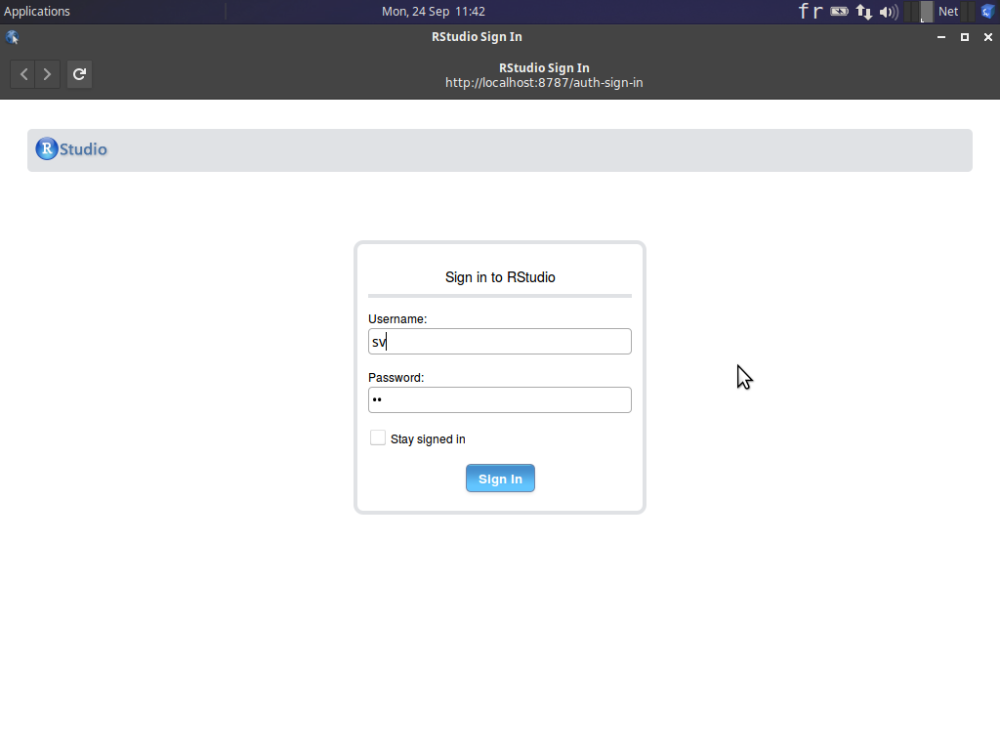
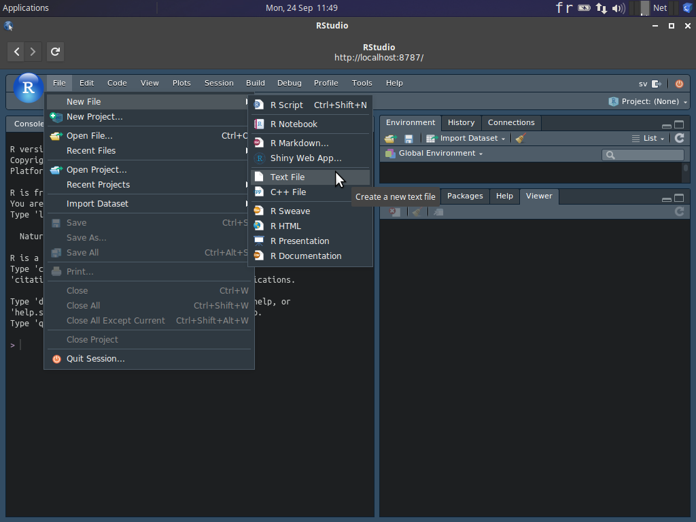
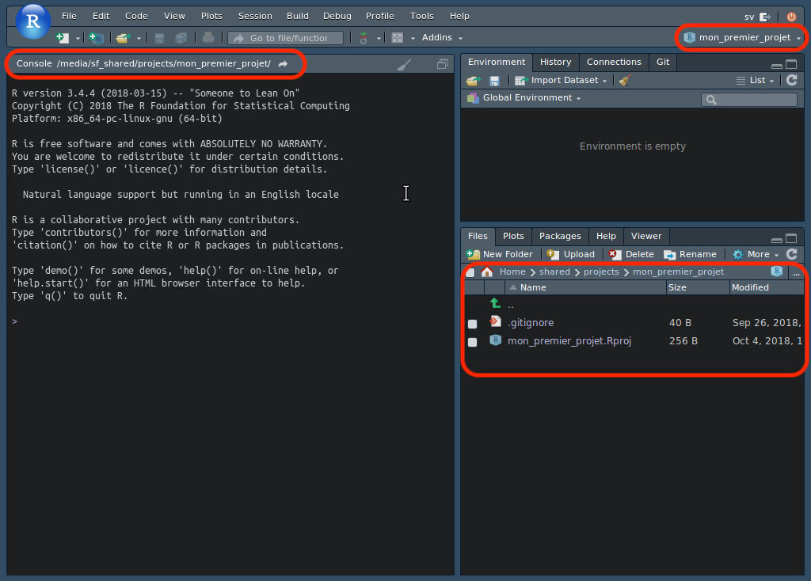
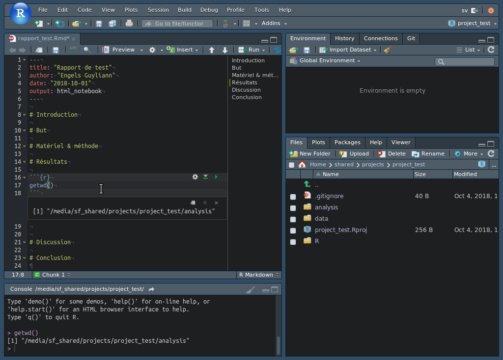
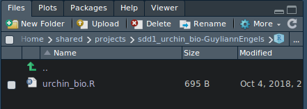
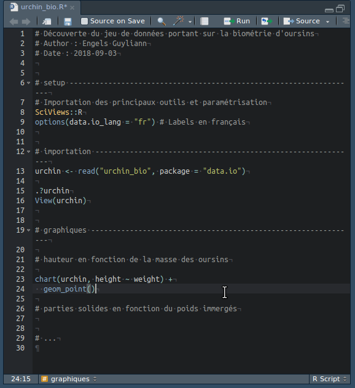
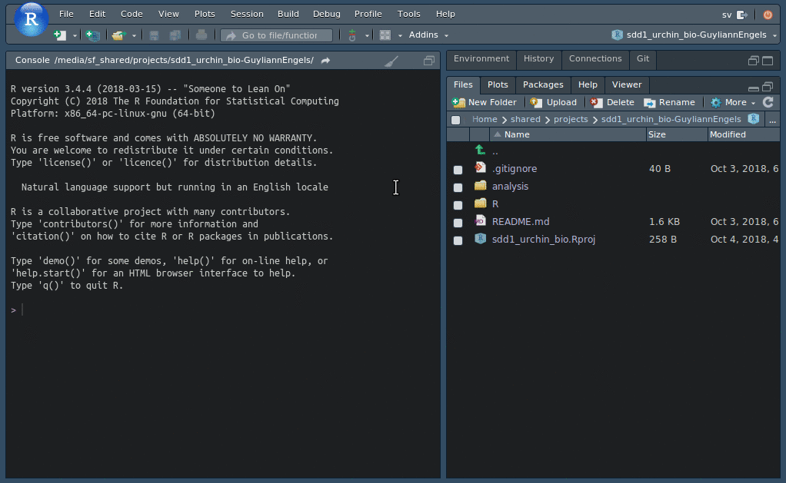

# Prise en main {#prise}

Cette annexe comprend une description détaillée des différents outils utilisés dans la cadre de cette formation. 

Passez à la section suivante pour découvrir les outils. (ex: B.1 RStudio)

## RStudio {#rs}

Sélectionnez le raccourci **RStudio** dans le dock. Un login vers RStudio apparaît. Il faut y entrer les informations suivantes :

- Username : **sv**
- Password : **sv**
- Cochez éventuellement **Stay signed in** pour éviter de devoir réentrer ces informations continuellement : 



RStudio s'ouvre. C'est votre interface de travail à partir de laquelle vous allez piloter **R**. La fenêtre principale comporte différents éléments :


- Une barre de menu et une barre d'outils générale en haut 
- Un panneau à gauche intitulée **Console** où vous pouvez entrer des instructions dans **R** pour manipuler vos données
- Un panneau à droite en haut qui comprend plusieurs onglets, dont **Environnement** qui vous indique les différents items (on parle d'**objets**) chargés en mémoire dans **R** (mais pour l’instant, il n'y a encore rien).
- Un panneau en bas à droite comportant lui aussi plusieurs onglets. Vous devriez voir le contenu de **Files** au démarrage, un explorateur de fichiers simplifié relatif au contexte de travail actuel dans RStudio.

Pour l'instant, aucun document de travail n'est encore ouvert. Pour en créer un, ou ouvrir un document existant, vous utilisez le menu **Files**, ou encore, le premier bouton de la barre d'outils générale :



Le menu **Session** permet d'interagir directement avec **R** qui est lancé automatiquement en arrière plan dès que RStudio est ouvert. Par exemple, il est possible de relancer **R** à partir d'une entrée dans ce menu :


Le menu **Help** propose différentes possibilités pour accéder à la documentation de **R** ou de **RStudio**. Les **aide-mémoires** ("cheatsheets" en anglais) sont très pratiques lors de l'apprentissage. Nous conseillons de les imprimer et de les consulter régulièrement.


Le dernier bouton de la barre d'outils générale, intitulé **Project** permet d'ouvrir, fermer, et gérer les projets RStudio.


Vous avez maintenant repéré les éléments fondamentaux de l'interface de RStudio.

_A ce stade vous pouvez vous familiariser avec la cheatsheet relative à l'IDE RStudio. Vous verrez qu'il y a beaucoup de fonctionnalités accessibles à partir de la fenêtre principale de RStudio. Ne vous laissez pas intimider : vous les apprendrez progressivement au fur et à mesure de l'utilisation du logiciel._

### Projet dans RStudio {#rs_projet} 

Un projet dans RStudio est un outil proposé par RStudio afin d'organiser son travail. Un projet va regrouper l'ensemble des **jeux de données**, des **rapports**, des **présentations**, des **scripts** d'une **analyse**

**La question est de savoir qu'est ce qu'une analyse:**

Une analyse d'un point de vue scientifique (et dans notre cas pour la biologie) est une **expérience**. 
 
 


Notez en que le nom du projet est mentionné en haut à droite. Notez également, que le répertoire de base de votre projet est le répertoire actif dans l'onglet **Console** (`~/Shared/Projects/mon_premier_projet/`), et que l'onglet **Files** affiche son contenu. Un fichier `mon_premier_projet.Rproj` y  est placé automatiquement par RStudio. Ce fichier contient les paramètres de configuration propres à ce projet^[N'éditer **jamais** à la main un fichier `.Rproj`. Laisser RStudio s'en occuper tout seul.]. C'est aussi une excellente façon de repérer qu'un répertoire est la base d'un projet RStudio, en repérant ce fameux fichier `.Rproj`.

#### Création d'un projet

Creez votre premier projet en suivant les 4 étapes suivantes 

- **Étape 1.**  Dans RStudio, Sélectionnez le bouton **Project** tout à droite dans la barre d'outils générale de RStudio. Un menu contextuel apparaît. 


- **Étape 2.** Une boite de dialogue s'ouvre. Sélectionnez **New Directory**. Il est également possible d'employer un dossier existant.


- **Étape 3.** Sélectionnez **Empty Project**.

- **Étape 4.** Ensuite, RStudio vous demander quelques informations pour configurer votre projet. 
    + Nommez le projet : **Directory name**
    + Indiquez où vous voulez le placer : **Create project as subdirectory of**
    + Sélectionnez **Create a git repository**
    + Désélectionnez **Use packrat with this project**


Pour créer un nouveau project (**New Project...**), ouvrir un projet existant (**Open Project...**) ou encore fermer un projet (**Close Project**) , toutes ces otpions sont présentes dans le menu déroulant de la fonction **Project**. Vous remarquez également que les derniers projets employés sont placés sous les trois options citées ci-dessus. 


#### Organisation d'un projet 

Le répertoire `projects` contient  maintenant un projet RStudio intitulé `test_project` : Il se situe dans 

```
/home
  /sv
    /Shared
      /Projects
        /test_projects         # Le répertoire de base du projet
          Projet test.Rproj    # Fichier de configuration du projet créé par RStudio
          .gitignore           # Fichier relatif à la gestion de version 
```

Vous devez maintenant structurer votre projet afin d'avoir différents répertoires pour organiser au mieux le travail. Ceci concerne à la fois les données et les rapports d'analyse en lien avec ce projet.

Cliquez sur le bouton **New Folder** dans la barre d'outils de l'onglet **Files** et appelez ce nouveau dossier `data`. Ajoutez égalemnt le dossier `reports`et `R`.  Vous pouvez faire cela depuis RStudio, mais aussi depuis le système hôte si c'est plus confortable pour vous. 

```
/home
  /sv
    /Shared
      /Projects
        /projects_test          # Le répertoire de base du projet
           analysis             # Le dossier qui comprend toutes les analyses (rapport, présentation,...)
           data                 # Le dossier qui comprend toutes les données
           projects_test.Rproj  # Fichier de configuration du projet créé par RStudio
           .gitignore           # Fichier relatif à la gestion de version
           R                    # Le dossier qui comprend tous les scripts d'analyse
```

Vous obtenez donc un projet configuré de la manière suivante :


L'organisation cohérente d'un projet est indispensable pour le bon fonctionnement et la compréhension d'un projet.

#### Chemins relatifs dans un projet

L'utilisation d'un projet permet de structurer de manière cohérente son travail. Vous allez maintenant devoir rendre votre projet **portable**.  

Un projet RStudio pourra être qualifié de portable s'il est possible de déplacer le répertoire de base du projet et tout ce qu'il contient (ou le renommer) sans que les analyses effectuées dans R n'en soient affectées. Ceci est utile pour copier, par exemple, le projet d'un PC à un autre, ou si vous décidez de restructurer vos fichiers sur le disque dur.

- La première règle est de placer tous les fichiers nécessaires dans le répertoire du projet ou dans un sous-dossier. C'est ce que nous venons de faire plus haut.

- La seconde règle est de référencer les différents fichiers au sein du projet avec des **chemins relatifs**. Nous allons maintenant apprendre à faire cela.

```
/home
  /sv
    /Shared
      /projects
        /projects_test            # Le répertoire de base du projet
           analysis               # Le dossier qui comprend toutes les analyses (rapport, présentation,...)
                rapport_test.rmd  # Rapport d'analyse
           data                   # Le dossier qui comprend toutes les données
                dataset.csv       # jeu de données exemple
           projects_test.Rproj    # Fichier de configuration du projet créé par RStudio
           .gitignore             # Fichier relatif à la gestion de version
           R                      # Le dossier qui comprend tous les scripts d'analyse
```

Les différents systèmes d'exploitations (Windows, MacOS, Linux) utilisent des conventions différentes pour les chemins d'accès aux fichiers. Dans notre cas, la machine virtuelle utilise un système d'exploitation **Linux**. La barre oblique (`/` dite "slash" en anglais) sépare les différents dossiers imbriqués sous Linux et sous MacOS. Le système d'exploitation Windows utilise pour sa part, la barre oblique inversée (`\`, dite  "backslash" en anglais, mais dans R et RStudio, vous pourrez également utiliser le slash `/`, ce que nous vous conseillons de faire toujours pour un maximum de compatibilité entre systèmes). Par exemple, votre fichier `dataset.csv` se référence comme suit dans la SciViews Box, donc sous Linux :

```
/home/sv/Shared/Projects/projet-test/data/dataset.csv 
```

Ce chemin d'accès est le plus détaillé. Il est dit **chemin d'accès absolu** au fichier. Vous noterez qu'il est totalement dépendant de la structure actuelle des dossiers sur le disque. Si vous renommez `projet_test` ou si vous le déplacez ailleurs, la référence au fichier sera cassée ! Ainsi, si vous partagez votre projet avec un collaborateur qui le place ailleurs sur son disque dur, le chemin d'accès devra être adapté sans quoi l'analyse ne pourra plus s'exécuter correctement.

Décodons ce chemin d'accès :

- `/`, racine du système
- `/home/sv/`, notre dossier personnel comme utilisateur `sv`
- `/home/sv/shared/`, le dossier partagé entre la SciViews Box et notre PC hôte
- `/home/sv/shared/projects/projet_test/`, le dossier de base de notre projet
- `/home/sv/shared/projects/projet_test/data/`, le répertoire qui contient le fichier `dataset.csv`.

Le répertoire utilisateur `/home/<user>` est différent sous MacOS (il s'appelle `/Users/<user>`) et sous Windows (il se nomme généralement `C:\Users\<user>`). Comme c'est un répertoire clé, et qu'il est impossible d'écrire un chemin absolu qui soit le même partout, il existe un raccourcis: le "tilde" (`~`) qui signifie "mon répertoire utilisateur". Ainsi, vous pouvez aussi accéder à votre jeu de données "Oursins" comme ceci :

```
~/shared/projects/projet_test/data/datasets.csv
```

Ce chemin d'accès est déjà plus "portable" d'un système à l'autre et d'un utilisateur à l'autre. Il est donc à préférer. Notez que sous R, vous devez doubler les backslashs sous Windows (`~\\Documents\\...`). Ce n'est ni très esthétique, ni compatible avec les deux autres systèmes. Heureusement, R comprend aussi le slash comme séparateur sous Windows, de sorte que la même syntaxe peut être utilisée partout ! **Nous vous conseillons donc d'utiliser aussi systématiquement les slashs sous Windows dans R ou RStudio.** Si cette façon d'écrire le chemin d'accès est compatible entre les trois systèmes d'exploitation, elle ne permet toujours pas de déplacer ou de renommer notre projet.

L'utilisation d'un **chemin relatif** permet de définir la position d'un fichier par rapport à un autre dossier qui est dit le **répertoire actif**. A titre d'exemple, nous voulons faire référence au jeu de données `datasets.csv` depuis notre rapport `rapport_test.Rmd`.

Demandez-vous d'abord quel est le **répertoire actif**. Pour un fichier R Markdown ou R Notebook, c'est facile, c'est le dossier qui contient ce fichier. Dans la console R, cela peut varier selon le contexte. Si vous avez ouvert un projet, c'est le répertoire de base du projet par défaut, mais cela peut être modifié. **Le répertoire actif pour R est toujours indiqué en gris à côté de l'onglet Console dans RStudio.** Vous pouvez aussi interroger R à l'aide de l'instruction `getwd()`:

```{r, eval=FALSE}
getwd()
```

Vous pouvez réaliser cela dans un chunk R dans votre document R Notebook par exemple : 



Une fois que vous connaissez le répertoire actif, vous naviguez _à partir de_ celui-ci. Il existe une convention pour reculer d'un dossier dans la hiérarchie: pour cela vous indiquez `..` à la place d'un nom de dossier. Voici ce que cela donne :

```
../data/datasets.csv
```

Comment lit-on ceci? Tout d'abord, notez (c'est très important) que le chemin d'accès ne commence pas par `/` (Linux ou MacOS), ou `C:/` (ou toute autre lettre, sous Windows). C'est le signe que l'on ne part pas de la racine du système de fichier, mais du **répertoire actif**. Ensuite, les différents éléments se décryptent comme suit :

- `~/shared/projects/project_test/analysis`, répertoire actif au départ pour le document R Notebook
- `..`, retour en arrière d'un niveau. On est donc dans `~/shared/projects/project_test`
- `/data`, naviguer dans le sous-dossier `data`. On est donc maintenant dans `~/shared/projects/project_test/data`. C'est le répertoire qui contient le fichier qui nous intéresse
- `/datasets.csv`, le nom du fichier référencé.

_A noter que si le fichier se trouve déjà dans le répertoire actif, le chemin relatif se résume au nom du fichier directement !_

Nulle part dans ce chemin relatif n’apparaît le nom du répertoire de projet, ni d'aucun autre répertoire parent. Ainsi, il est possible de renommer ou déplacer le projet sans casser la référence relative à n'importe quel fichier à l'intérieur de ce projet. Donc, en utilisant uniquement des références relatives, **le projet reste parfaitement portable**.

### Rscripts dans RStudio {#script}

Le script R est un fichier dont l'extension est `.R`. Il permet d'écrire dans un document structuré une suite d'instruction exécutable par le programme R 



Un script R s'ouvrent dans la fênetre d'édition de RStudio. Les instructions précédée d'une dièse (`#`) sont des commentaires dans ce format de document script. Elles permettent de structurer ce document (ou bien d'empêcher l'exécution d'instructions).



Afin d'organiser au mieux un script, il est indispensable de commencer par l'ajout du titre, de l'auteur, de la date, ... L'utilisation de section comme à la ligne 6 est vivement conseillé. 

#### Création d'un Rscript

Vous avez à votre disposition plusieurs méthodes pour ouvrir un nouveau script R dans R studio dont deux vous sont montré sur l'illustration ci-dessous. 



#### Utilisation d'un Rscript

Un R script est un document exploitable par le programme R. Ce dernier va interpreter les intructions qui compose le script et qui ne sont pas précédé d'une dièse.


Il existe deux méthodes afin d'exécuter une ligne d'instruction  via le bouton `Run` en haut à droite de la fenêtre d'édition ou via le raccourci clavier `ctrl+Enter` (`cmd+enter` sous mac).

Un script R doit être organisé de manière cohérente afin d'être exécutable de haut en bas. Dans l'exemple ci-dessus, on commence par:

- **Étape 1.** Importer les principaux outils avec l'instruction `Sciviews::R`.

- **Étape 2.** Utiliser l'instruction `urchin <- read("urchin_bio", package = "data.io")` pour importer le jeu de données urchin_bio provenant du package data.io et  l'assigner à urchin. On retrouve à présent urchin dans l'environnement global (`Global environment`) de RStudio. 

- **Étape 3.** `.?urchin` et `View(urchin)` donnent des renseignements sur le jeu de données en renvoyant vers la page d'aide du jeu de données et vers le tableau du jeu de données.

- **Étape 4.** Réaliser des graphiques avec la fonction `chart()`

Notez que les instructions exécutées dans le script sont envoyées dans la console R.

### Rmarkdown/R Notebook dans RStudio {#Rmd}

Le document R Notebook  est un fichier dont l'extension est `.Rmd`. Il combine à la fois des instructions R et le language markdown. le R Notebook ne vous permet pas de visualiser directement le résultat final d'un rapport d'analyse^[Les systèmes d'édition professionnels dissocient en effet le fond de la forme : vous rédiger d'abord le contenu, et ensuite, vous indiquer le style à lui appliquer.]


Tout comme les intructions dans un Rscript doivent être exécuté avec le bouton `run`, les instructions sont exécutées avec le bouton run. 

En détails, le fichier R Markdown / R Notebook présent dans la fenêtre d'édition de RStudio se structure de la manière suivante :

- Le préambule
- Des zones d'édition
    + Le language employé est le markdown
- Des zones de code R
    + Ces zones de codes sont appelée des chunk


La première partie du document est appelé le **préambule**. Il est nécessairement situé au tout début du document et est balisé à l'aide de trois tirets `---` au début et à la fin isolés sur leurs propres lignes. Le préambule comporte un ensemble de consignes pour la mise en forme générale du document. C'est donc là que nous indiquerons comment nous voulons réaliser notre rapport final. Nous pouvons aussi y indiquer un titre, le ou les auteurs, la date, ...

Le reste du document R Notebook est subdivisé en zones successives sur fond noir et zones sur fond gris clair.

- Les zones sur fond noir sont des parties Markdown où vous pouvez écrire votre texte.
- Les zones sur fond gris clair sont appelées des **chunks**. Elles contiennent des instructions qui vont être interprétées pour réaliser un calcul, un graphique, etc. Dans le document final, les chunks seront remplacés par le résultat du calcul. Ces chunks sont balisés en entrée par trois tirets inclinés à droite suivis d'accolades contenant des instructions relatives au programme à utiliser, par exemple, ```` ```{r} ```` pour des chunks faisant appel au logiciel **R**, et sont terminées par trois tirets inclinés à droite (```` ``` ````).

Dans les parties sur fond noir, les zones Markdown, vous pouvez ajouter des balises qui permettront de formater votre texte dans la version finale de votre rapport. Par exemple, un ou plusieurs dièses (plus communément connu par sont appellation en anglais : "hastag") en début de ligne suivi d'un espace indique que la suite correspond à un titre. Titre de niveau 1 avec un seul dièse, de niveau 2 avec deux dièses, et ainsi de suite jusqu'à 6 niveaux possibles. Dans la capture d'écran ci-dessous, nous avons remplacé tout le contenu du R Notebook (à part le préambule) par une série de titres de niveau 1 correspondant à la structure générale d'un rapport scientifique : 

- Introduction
- Objectif
- Matériels et méthodes
- Résultats
- Discussion
- Conclusions

#### Création d'un R Notebook

Vous avez à votre disposition deux méthodes pour ouvrir un nouveau R Notebook dans R studio sur l'illustration ci-dessous. 


#### Utilisation d'un R Notebook

**Afin de visualiser les résultats des chunks dans votre rapport final, Vous devez veillez à exécuter chaque chunks**. Pour ce faire, vous pouvez :

- cliquer sur le bouton play vert à droite du chunk
- cliquer sur `Run current Chunk` dans l'onglet `Run`
- Employer le raccourci clavier `ctrl+shift+enter`


L'onglet `Run` propose plusieurs actions intéressantes :

- Exécuter la/les ligne(s) d'instruction sélectionnée(s) : `Run Selected Line(s)`
- Exécuter le chunk : `Run Current Chunk`
- Exécuter tous les chunk précédents : `Run All Chunk Above` 
- Redémarer la console R et Exécuter tous les chunks: `Restart R and Run All Chunks` 
- ...


Aprés la phase d'édition du texte et des intructions dans les chunks, vous pouvez visualiser votre rapport final en cliquant sur `Preview`.


Le rapport est rapidement généré avec un rendu simple et professionnel. Ce rapport fournit d'une part le texte que vous avez écrit, les résultats que vous avez écrit mais également les instructions que vous avez employée pour obtenir ces résultats. Vous donnez par cette pratique la possibilité de comprendre plus aisément vos analyses.


Notez que sur la droite du bouton `Preview`, vous avez accès à un menu déroulant qui vous donne la possibilité de générer vos rapports en différents formats.


