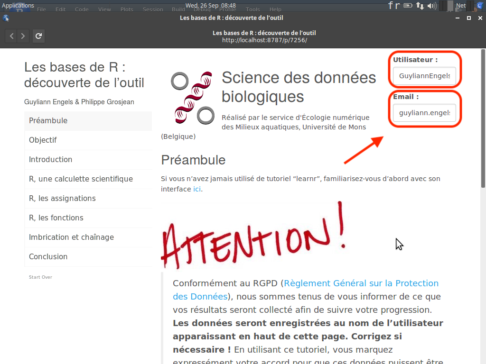
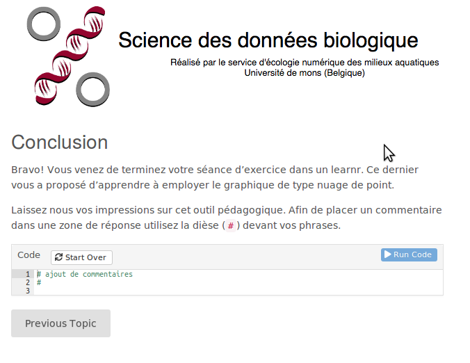
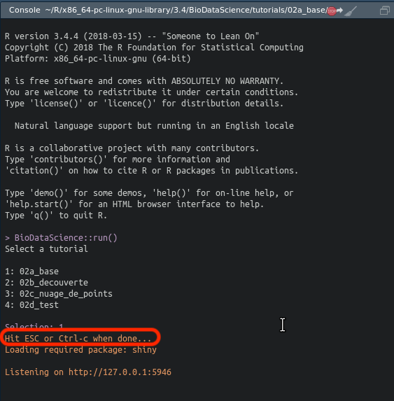

# Tutoriels "learnr" {#learnr}

En complément de ce syllabus, vous allez utiliser également des tutoriels interactifs construits avec [learnr](https://rstudio.github.io/learnr/index.html). Si ce n'est déjà fait, commencez par installer ces tutoriels dans votre SciViews Box (voir \@ref(install-tuto)).

Entrez l'instruction ci-dessous dans la fenêtre **Console** de RStudio suivie de la touche `Entrée` :

    BioDataScience::run()

La liste des tutoriels vous est proposée (notez que ces tutoriels comme les autres outils pédagogiques sont encore en cours de développement, mais plusieurs vous seront disponibles): 

    1: 02a_base
    2: 02b_decouverte
    3: 02c_nuage_de_points
    4: 02d_test
    ...

Entrez le numéro correspondant au tutoriel que vous voulez exécuter et un document interactif apparait. Par exemple, en entrant `1` suivi de la touche `Entrée`, vous êtes redirigé vers le tutoriel concernant les bases de R et intitulé `02a_base`.

La première chose à vérifier à l'ouverture du tutoriel interactif est le nom d'utilisateur (équivalent à votre **username** dans Github) et votre adresse email (adresse email associée à votre compte Github ou de votre compte d'étudiant). En effet, votre progression sera enregistrée, mais cela ne peut se faire que si vous renseignez ces données correctement avant de travailler dans le tutoriel "learnr".

Le learnr est un outil pédagogique mis au point afin de proposer des tutoriaux interactifs comprennant des illustrations, des questions à choix multiples, des exercices R, ... Les learnr qui vous seront proposés tout au long de votre formation seront composé de la manière suivante :

- Objectif
- Introduction
- Une série d'exercices
- Conclusion

Vous retrouvez d'ailleurs cette structure en haut à gauche de ce dernier. Chaque page du tutoriel est importante et nécessite votre attention. 

- Objectifs

Cette section détaillera l'ensemble des notions que vous allez apprendre à maitriser durant ce tutoriel. Dans le cadre de ce premier tutoriel, l'objectif est de découvrir les bases du language R. 

- Introduction

Cette section vous replacera dans le contexte du tutoriel interactif avec un rappel succinct des notions théoriques indispensables afin de répondre à la série d'exercices. **Cette section ne remplace pas les autres matériels pédagogiques qui vous sont proposés.** Vous devez donc travailler dans l'ordre proposé dans le présent manuel au sein de chaque module pour vous préparer correctement au learnr de test en fin de section. 

- Une serie d'exercices

Cette section peut être de longueur très variable en fonction de la difficulté et des notions à appréhender.

Des zones de codes R vous sont proposées dans les exercices. Elles vous permettent d'expérimenter directement des instructions dans R depuis le document learnr. Pour exécuter ces instructions, il faut cliquer sur `Run Code`. Vous pouvez le faire autant de fois que vous le voulez. Modifiez le code, cliquez `Run Code`, analysez le résultat, modifiez votre code, recliquez `Run Code`, etc... juqu'à ce que vous soyez satisfait du résultat. Finissez l'exercice et soumettez votre réponse en cliquant sur `Submit Answer`.

Des boutons `Hint`, lorsqu'ils sont présents, vous proposent des aides si vous êtes bloqués. Les boutons `Solution`... montrent ce qu'il fallait entrer. **N'allez pas voir directement la solution. Essayez d'abord par vous même !**

- Conclusion

Cette section termine ce tutoriel et propose de laisser des commentaires avec l'utilisation de dièse `#`. Fermez le tutoriel lorsqu'il est terminé.

En retournant dans RStudio, vous devez déconnecter votre process R qui est toujours occupé à servir la page learnr du tutoriel. Pour cela, placez le curseur dans la fenêtre `Console` et cliquez sur la touche `Esc`. A ce moment, vous récupérez la main dans R et pouvez à nouveau retravailler normalement dans RStudio.

