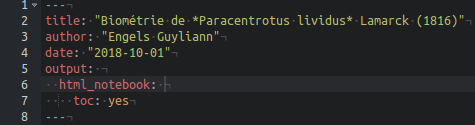
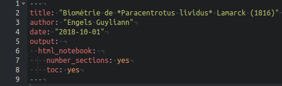

# Rédaction scientifique {#redaction-scientifique}

```{r setup, include=FALSE, echo=FALSE, message=FALSE, results='hide'}
SciViews::R
```

La rédaction scientifique respecte un certain caneva expliqué dans cette annexe. 

#### Pour en savoir plus... {-}

- [Recherche documentaire et aide à la création (ReDAC)](https://moodle.umons.ac.be/enrol/index.php?id=5). L'Université de Mons met à disposition de ses étudiants un cours en ligne afin de trouver un maximum de renseignements sur la rédaction de rapports scientifiques.


## Organisation 

 Un rapport scientifique respecte généralement le schéma suivant :

1. Table des matières (facultatif)
2. Introduction
3. But
4. Matériel et méthodes
5. Résultats
6. Discussion
7. Conclusion
8. Bibliographie
9. Annexe(s) (si nécessaire)

Pour des travaux de plus grandes ampleurs comme les travaux de fin d'études, le schéma ci-dessus est adapté, et éventuellement divisé en chapitres, en y ajoutant généralement une partie remerciement en début de manuscrit.


## Contenu 

Le rapport sert à restituer de façon synthétique les résultats d'une étude scientifique, et les interprétations. Le tout est remis dans le contexte de la bibliographie existante en la synthétisant dans l'introduction et en comparant les résultats avec d'autres études connexes dans la discussion. Il faut garder à l’esprit qu’un lecteur doit comprendre l’intégralité du rapport avec un minimum de connaissances _a priori_ sur l'étude réalisée, mais avec des connaissances générales dans la spécialité. Donc, un rapport sur un sujet biologique est adressé à un lecteur biologiste pour lequel il ne faut pas rappeler les concepts de base dans sa discipline. Par contre, il faut expliquer avec suffisamment de détails comment l'étude a été réalisée dans la section "matériel et méthodes".

En général, les phrases sont simples, directes, courtes et précises (veuillez à utiliser le vocabulaire adéquat et les termes justes). Les explications sont, autant que possible, linéaires. Evitez les renvois dans différentes autres parties du rapoort, si ce n'est pour rappeler un élément évoqué plus haut, ou pour se référer à une figure ou une table. A ce sujet, les figures (dont les images, photos, schémas et graphiques) sont numérotées (Figure 1, Figure 2, ...) et accompagnées d'une légende en dessous d'elles. La figure et sa légende doivent être compréhensibles telles quelles. Dans le texte, vous pourrez alors vous référer à la figure, par exemple: "Tel phénomène est observable (voir Fig. 3)", ou "La Fig. 4 montre ...". idem pour les tableaux qui sont également numérotés (Tableau 1, Tableau 2, ...) et légendés, mais _au dessus_ du tableau. Les règles de lisibilité du tableau + légende et de renvoi vers les tableaux sont identiques que pour les figures. Les équations peuvent aussi être numérotées et des renvois de type (eq. 5) peuvent être utilisées. Enfin, toute affirmation doit être soit démontrées dans le rapport, ou amendées d'une citation vers un autre document scientifique qui la démontre. La partie bibliographie regroupe la liste de tous les documents qui sont ainsi cités à la fin du rapport.

Veuillez à respecter les notations propres au système métrique international, les abbrévations usuelles dans la discipline, et le droit d'auteur et les licenses si vous voulez citer un passage ou reprendre une illustration provenant d'un autre auteur. Enfin, en vue de rendre le document parfaitement reproductible, vous pouvez indiquer dans les annexes où trouver la source (le document `.Rmd`) et les données analysées. Vous pouvez également terminer avec un chunk qui renseigne de l'état du système R utilisé, y compris l'ensemble des packages annexes employés. Ce chunk, présenté en annexe, contiendra l'instruction `utils::sessionInfo()`, ou mieux : `xfun::session_info()` (version courte) ou `devtools::session_info()` (version longue). Par exemple :

```{r, comment=NA}
xfun::session_info()
```


### Table des matières

La table des matières est d'une importance capitale pour un long document (mais facultative pour un plus court rapport) afin de présenter la structure de votre oeuvre aux lecteurs. Heureusement, il n'est pas nécessaire de l'écrire manuellement. La table des matières est générée automatiquement dans un rapport R Markdown. L'instruction à ajouter dans le préambule du document R Notebook afin d'obtenir une table des matières est `toc: yes` (ne l'encodez pas directement, mais sélectionnez l'option `Include table of contents` dans les options de formattage du document accessibles à partir du bouton engrenage à droite de `Preview` ou `Knit` -> `Output Options...`). Lorsque vous fermerez cette boite de dialogue de configuration, l'entrée _ad hoc_ sera ajoutée pour vous dans le prambule.



Vous pouvez aussi choisir de numéroter vos titres automatiquement. L'instruction à ajouter en plus de `toc: yes` dans le préambule du document R Notebook afin d'obtenir une table des matières avec des titres numéroté est `number_sections: yes`. Encore une fois, passez par la boite de dialogue de configuration, et cochez-y l'entrée `Number section headings`. 



Voyez l'animation ci-dessous pour accéder à la boite de dialogue de configuration du document R Markdown/R Notebook.


### Introduction

L'introduction d'un rapport (ou d'un mémoire) a pour principal objectif de replacer l'étude scientifique réalisée dans son contexte.  La règle la plus importante est qu'**un lecteur n’ayant jamais entendu parler de cette étude doit comprendre l’intégralité du rapport.** L'introduction doit donc permettre de : 

- Remettre l'expérience dans son contexte,
- Décrire l'organisme étudié
      + description de l'organisme, distribution géographique, biotope,...
      
Notez que l'ajout d'images ou d'une carte de distribution est un plus dans l'introduction.


### But

Le but permet de synthétiser la question posée dans cette étude en fonction du contexte de l'expérience expliqué dans l'introduction.


### Matériel & méthodes

Le matériel & méthodes permettent de décrire les aspects techniques de l'étude comme le matériel employé et les méthodes utilisées (protocole) afin d'acquérir les données. Cette section est également le lieu de descriptions des méthodes statistiques utilisées pour analyser ces données, des programmes informatiques utilisés, ...


### Résultats

Les résultats vont généralement contenir 2 parties : 

- Description des données : exploration des données récoltées (avec graphiques et/ou estimateurs statistiques)
- Application des outils statistiques pertinents pour répondre à la question posée 


### Discussion

Cette section comprend l'interprétation biologique des résultats et les remettre dans un contexte plus général, notamment en les comparant à des observations connexes réalisées pr d'autres auteurs scientifiques. Il est d'une importance capitale d'avoir un regard critique sur les résultats obtenus. Cette mise en contexte aide en ce sens.

Exemple : 

- Variation du pH de l'eau de mer de 8 à 6 

Lors de la mesure des paramètres physico-chimiques de l'eau de mer, une étude suit le pH avec différents instruments et propose le graphique suivant :

```{r, echo=FALSE}
oceano_ph <- as_dataframe(tribble(
  ~loca, ~method, ~ ph,
  "A0",  "ph_mètre", 7.94,
  "B0", "ph-mètre", 7.98,
  "A0", "crésol", 7.74,
  "B0", "crésol", 7.79,
  "A0", "bandelette", 7.2,
  "B0", "bandelette", 7.2,
  "A0", "sonde ph", 6.67
))

chart(data = oceano_ph, formula = ph~ method %fill=% loca) +
  geom_bar(stat = "identity" , position = "dodge" ) + 
  scale_fill_viridis_d() +
  labs( fill = "Localisation", x = "Méthode")
```

Vous observez que les eaux de deux aquariums différents sont mesurées (les aquariums nommés A0 et B0) et que cinq instruments différents sont employés. Ce graphique vous semble-t-il pertinent ? Aucune information qui y figure ne vous choque ?  Si ce n'est pas le cas, il faut encore exercer votre oeil de biologiste. La sonde pH sur le graphique propose une valeur de pH proche de 6.5 alors que les autres instruments indiquent des valeurs de pH comprises entre 7.2 et 8. 

**Nous sommes donc passés d'un pH légérement basique, classique en eau de mer, à un pH acide inhabituel. Les organismes présents dans les aquariums serait mort à cette valeur de pH.**


### Conclusion(s) & perspective(s)

Cette section va résumer les principaux résultats à retenir de notre étude et, éventuellement, proposer des perspectives afin de poursuivre la recherche dans cette thématique.


### Bibliographie (ou références)

La rédaction de travaux s'appuye toujours sur une recherche bibliographique au préalable. Cependant, il est capital d'insérer convenablement les sources du travail au sein de la section bibliographie afin d'éviter le **plagiat** volontaire ou involontaire. Il existe une multitude de programmes permettant la gestion d'une bibliographie comme [Mendeley](https://www.mendeley.com/), [Zotero](https://www.zotero.org/) ou encore [Endnote](https://endnote.com/). 

- Pour générer correctement ses références bibliographiques dans un document R Markdown/R Notebook, [consulter ceci](https://rmarkdown.rstudio.com/authoring_bibliographies_and_citations.html#citation_styles). Il s'agit d'un manuel en anglais de RStudio qui explique comment faire dans le détail.


## Nom des espèces

Le nom complet d'une espèce en biologie suit une convention particulière, propre à la nomenclature binomiale de Linné) que vous devez appliquer dans tous vos travaux. Partons de l'exemple de l'oursin violet. Il s'agit ici du **nom vernaculaire** en français. Mais ce nom n'est pas assez préci pour être utilisé seul dans un travail scientifique. En effet, d'une part, le nom vernaculaire d'une espèce change d'une langue à la'autre, mais peut aussi varier d'une région géographique à l'aoutre, ou prie, peut désiger plusieurs espèces différentes. Seul le **nom latin** fait référence ! Une espèce est classée de la manière suivante (Les niveaux de classification les plus importants sont mis en gras) :

- **Règne** : Animalia
- Sous-Embranchement : Echinozoa
- **Embranchement** : Echinodermata
- **Classe** : Echinoidea
- Super-ordre : Echinacea
- **Ordre** : Camarodonta
- Infra-ordre : Echinidae
- **Famille** : Parachinidae
- **Genre** : *Paracentrotus*
- **Espèce** : *lividus*

Afin de former le nom binomial de l'oursin violet, on utilise le genre et l'espèce de la classification proprosée ci-dessus : 

- *Paracentrotus lividus*

En toute riguer, il faut aussi associer le **nom du naturaliste** qui a nommé et décrit l'espèce et l'année de la publication de la description (on parle de diagnose en biologie), et ce, uniquement la première fois qu'on cite cette espèce dans notre rapport.

- *Paracentrotus lividus* Lamarck 1816

Lors de la première citation de l'espèce étudiée dans un rapport, il est indispensable de spécifier le nom latin complet de l'espèce (genre espèce) qui pourra être éventuellement abbrégé par la suite en indiquant la première lettre du genre. Dans l'exemple, on pourra écrire ensuite *P. lividus* (pour autant que cela ne prette pas à confusion, bien sûr).
