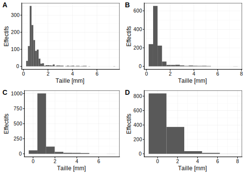
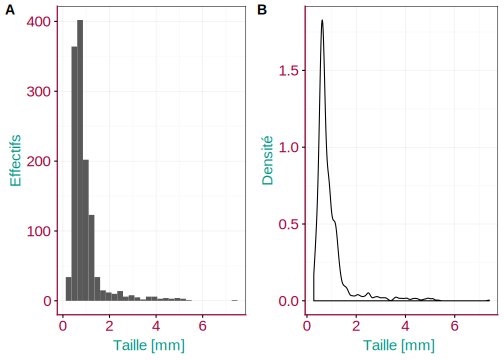
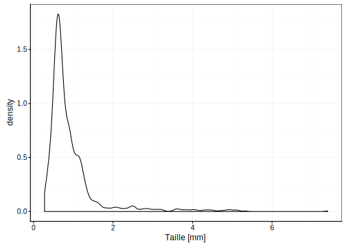
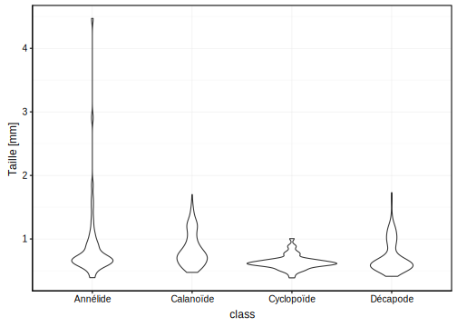
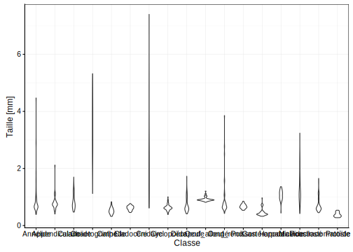
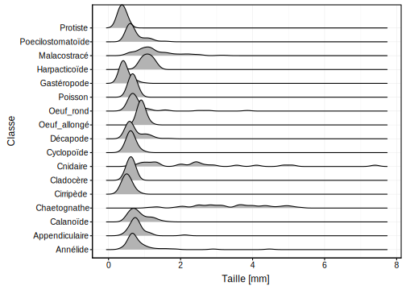

# Visualisation II {#visu2}


##### Objectifs {-}

- Savoir réaliser différentes variantes de graphiques visant à montrer *comment les données se distribuent* tel que les histogrammes, les graphes de densité ou encore les diagrammes en violon dans R avec la fonction `chart()`

- Intégrer ensuite des graphiques dans un rapport et y décrire ce que vous observez

- Gérer des conflits dans GitHub


##### Prérequis {-}

Pour réaliser les exercices dans ce module, vous devez être capables de travailler dans la SciViews Box et dans RStudio. Vous devez également maîtriser les bases de Git et GitHub. Tout ceci est enseigné dans le module \@ref(intro). Vous devez également être familiarisés avec les graphiques dans R et R Markdown, une matière qui fait l'objet du module \@ref(visu1).


#####  Préparatifs {-}

Une nouvelle tâche va vous être demandée ci-dessous en utilisant GitHub Classroom \@ref(classroom). Une fois votre assignation réalisée, faites un clone de votre dépôt et placez-le dans le dossier `shared/projects`. Pour cette tâche, vous démarrerez d'un projet RStudio \@ref(rs-projet) que vous obtiendrez via une tâche GitHub Classroom.

\BeginKnitrBlock{bdd}<div class="bdd">Un projet sur le zooplancton provenant de Madagascar est mis à votre disposition. Utilisez l'URL suivante qui va vous donner accès à votre tâche. **Cette tâche est un travail en binôme**

- <https://classroom.github.com/g/7Ji4Aj9G>
</div>\EndKnitrBlock{bdd}


Vous utiliserez à la fois votre projet sur la biométrie des oursins (du module précédent) et ce nouveau projet sur le zooplancton^[Le mot **zooplancton** ne se décline jamais au pluriel. On parle du *zooplancton* pour désigner une large communauté d'organismes zooplanctoniques, et non pas *des zooplanctons*.] pour découvrir les nouveaux outils graphiques décrits dans ce module. 


## Histogramme

Vous souhaitez visualiser l'étalement de vos données sur un axe (on parle de **distribution**^[La **distribution** des données en statistique se réfère à la fréquence avec laquelle les différentes valeurs d'une variable s'observent.] en statistique) pour l'une des variables étudiées. L'histogramme est l'un des outils pouvant vous apporter cette information. Ce graphique va représenter sous forme de barres un découpage en plusieurs **classes**^[Une variable numérique est **découpée en classes** en spécifiant différents intervalles, et ensuite en dénombrant le nombre de fois que les observations rentrent dans ces classes.] d'une variable numérique.

<div class="figure" style="text-align: center">

<p class="caption">(\#fig:unnamed-chunk-2)Exemple d'histogramme montrant la distribution de la taille d'un échantillon de zooplancton.</p>
</div>

Outre l'histogramme lui-même, représenté par des barres de hauteur équivalentes au nombre de fois que les observations ont été réalisées dans les différentes classes, les éléments suivants sont également indispensables à la compréhension du graphique (ici mis en évidence en couleur)

- Les axes avec les graduations (en rouge). Su l'axe des abscisses, les classes de tailles, et sur l'axe des ordonnées, le nombre d’occurrence
- les labels des axes et l'unité (pour l'axe des abscisses uniquement ici) (en bleu)

Les instructions dans R afin de produire un histogramme à l'aide de la fonction `chart()` sont :


```r
# Importation du jeu de données
(zooplankton <- read("zooplankton", package = "data.io", lang = "FR"))
```

```
# # A tibble: 1,262 x 20
#      ecd  area perimeter feret major minor  mean   mode     min   max
#    <dbl> <dbl>     <dbl> <dbl> <dbl> <dbl> <dbl>  <dbl>   <dbl> <dbl>
#  1 0.770 0.465      4.45 1.32  1.16  0.509 0.363 0.0360 0.00400 0.908
#  2 0.700 0.385      2.32 0.728 0.713 0.688 0.361 0.492  0.0240  0.676
#  3 0.815 0.521      4.15 1.33  1.11  0.598 0.308 0.0320 0.00800 0.696
#  4 0.785 0.484      4.44 1.78  1.56  0.394 0.332 0.0360 0.00400 0.728
#  5 0.361 0.103      1.71 0.739 0.694 0.188 0.153 0.0160 0.00800 0.452
#  6 0.832 0.544      5.27 1.66  1.36  0.511 0.371 0.0200 0.00400 0.844
#  7 1.23  1.20      15.7  3.92  1.37  1.11  0.217 0.0120 0.00400 0.784
#  8 0.620 0.302      3.98 1.19  1.04  0.370 0.316 0.0120 0.00400 0.756
#  9 1.19  1.12      15.3  3.85  1.34  1.06  0.176 0.0120 0.00400 0.728
# 10 1.04  0.856      7.60 1.89  1.66  0.656 0.404 0.0440 0.00400 0.880
# # ... with 1,252 more rows, and 10 more variables: std_dev <dbl>,
# #   range <dbl>, size <dbl>, aspect <dbl>, elongation <dbl>,
# #   compactness <dbl>, transparency <dbl>, circularity <dbl>,
# #   density <dbl>, class <fct>
```

```r
# Réalisation du graphique
chart(data = zooplankton, ~ size) +
  geom_histogram(bins = 50) +
  ylab("Effectifs")
```

<div class="figure" style="text-align: center">

<p class="caption">(\#fig:unnamed-chunk-3)Distribution des tailles au sein d'un échantillon de zooplancton</p>
</div>

```r
# bins permet de préciser le nombre de classes souhaitées
```

La fonction `chart()` requiert comme argument le jeu de donnée (`zooplankton`), ainsi que la formule à employer dans laquelle vous avez indiqué le nom de la variable que vous voulez sur l'axe des abscisses à droite de la formule, après le tilde `~`. Vous voyez que le jeu de données contient beaucoup de variables (les titres des colonnes du tableau en sortie). Parmi toutes ces variables, nous avons choisi ici de représenter `size`, Jusqu'ici, nous avons spécifié _ce que_ nous voulons représenter, mais pas encore _comment_ (sous quelle apparence), nous voulons matérialiser cela sur le graphique. Pour un histogramme, nous devons ajouter la fonction `geom_histogram()`. L'argument `bins` dans cette fonction permet de préciser le nombre de classes souhaitées. Le découpage en classe se fait automatiquement dans R à partir de la variable `size` d'origine.

Vous pouvez décrypter votre histogramme sur base des **modes**^[Les **modes** d'un histogramme correspondent à des classes plus abondantes localement, c'est-à-dire que les classes à gauche et à droite du mode comptent moins d’occurrences que lui.] et de la **symétrie**^[Un histogramme est dit **symétrique** lorsque son profil à gauche est identique ou très similaire à son profil à droite autour d'un mode.] de ces derniers. Un histogramme peut être unimodal (un seul mode), bimodal (deux modes) ou multimodal (plus de deux modes). En général, s'il y a plus d'un mode, nous pouvons suspecter que des sous-populations existent au sein de notre échantillon.

<div class="figure" style="text-align: center">

<p class="caption">(\#fig:unnamed-chunk-4)Histogrammes montrant les modes et symétries : A. histogramme unimodal et symétrique, B. histogramme bimodal et asymétrique, C. histogramme unimodal et asymétrique, D. histogramme multimodal et symétrique.</p>
</div>


### Nombre de classes

Vous devez être particulièrement vigilant lors de la réalisation d'un histogramme aux classes définies pour ce dernier. 


```r
# Réalisation du graphique précédent
a <- chart(data = zooplankton, ~ size) +
  geom_histogram(bins = 50) +
  ylab("Effectifs")

# Modification du nombre de classes
b <- chart(data = zooplankton, ~ size) +
  geom_histogram(bins = 20) +
  ylab("Effectifs")

c <- chart(data = zooplankton, ~ size) +
  geom_histogram(bins = 10) +
  ylab("Effectifs")

d <- chart(data = zooplankton, ~ size) +
  geom_histogram(bins = 5) +
  ylab("Effectifs")

# Assemblage des graphiques
combine_charts(list(a, b, c, d))
```

<div class="figure" style="text-align: center">

<p class="caption">(\#fig:histo-classes)Choix des classes. A. histogramme initial montrant la répartition des tailles au sein d'organismes planctoniques. B., C., D. Même histogramme que A, mais en modifiant le nombres de classes.</p>
</div>

Comme vous pouvez le voir à la Fig. \@ref(fig:histo-classes), le changement du nombre de classes peut modifier complètement la perception des données via l'histogramme. Le choix idéal est un compromis entre plus de classes (donc plus de détails), et un d"coupage raisonnable en fonction de la quantité de données disponibles. Si l'intervalle des classes est trop petit, l'histogramme sera illisible. Si l'intervalle des classes est trop grand, il sera impossible de visualiser correctement les différents modes. Dans la figure en exemple, les variantes A et B sont acceptables, mais les C et D manquent de détails.


##### Pièges et astuces {-}

La SciViews Box propose un **snippet RStudio** pour réaliser un histogramme. Il s'appelle `.cuhist` (pour **c**hart -> **u**nivariate -> **hist**ogram). Entrez ce code dans une zone d'édition R et appuyez ensuite sur la tabulation, et vous verrez le code remplacé par ceci :

```
chart(data = DF, ~VARNUM) +
    geom_histogram(binwidth = 30)
```

L'argument `binwidth =` permet de préciser la largeur des classes. C'est une autre façon de spécifier le découpage en classes, mais vous pouvez naturellement le remplacer par l'argument `bins =` si vous préférez. 

Vous avez à votre disposition un ensemble de snippets que vous pouvez retrouver dans l'aide-mémoire sur [**SciViews**](https://github.com/BioDataScience-Course/cheatsheets/blob/master/keynote/sciviews_cheatsheet.pdf). N'oubliez pas que vous avez également à votre disposition l'aide-mémoire sur la visualisation des données ([**Data Visualization Cheat Sheet**](https://www.rstudio.com/resources/cheatsheets/)), via la fonction `ggplot()`.


### Histogramme par facteur

Lors de l'analyse de jeux de données, vous serez amené à réaliser un histogramme par facteur (c'est-à-dire, en fonction de différents niveaux d'une variable qualitative qui divise le jeu de données en sous-groupes). Par exemple, dans un jeu de données sur des fleurs d'iris, la variable `species`^[Attention : le jeu de donnée `iris` est un grand classique dans R, mais lorsqu'il est chargé à l'aide de la fonction `read()` du package **data.io**, le nom de ses variables est modifié pour suivre la convention "snake-case" qui veut que seules des lettres minuscules soient utilisées et que les mots soient séparés par un trait souligné `_`. Ainsi, dans le jeu de données d'origine, les variables sont nommées `Petal_Length` ou `Species`. Ici, ces même variables se nomment `petal_length` et `species`.] représente l'espèce d'iris étudiée (trois espèces différentes : *I. setosa*, *I. versicolor* et *I. virginica*).


```r
# Importation du jeu de données
(iris <- read("iris", package = "datasets", lang = "fr"))
```

```
# # A tibble: 150 x 5
#    sepal_length sepal_width petal_length petal_width species
#           <dbl>       <dbl>        <dbl>       <dbl> <fct>  
#  1         5.10        3.50         1.40       0.200 setosa 
#  2         4.90        3.00         1.40       0.200 setosa 
#  3         4.70        3.20         1.30       0.200 setosa 
#  4         4.60        3.10         1.50       0.200 setosa 
#  5         5.00        3.60         1.40       0.200 setosa 
#  6         5.40        3.90         1.70       0.400 setosa 
#  7         4.60        3.40         1.40       0.300 setosa 
#  8         5.00        3.40         1.50       0.200 setosa 
#  9         4.40        2.90         1.40       0.200 setosa 
# 10         4.90        3.10         1.50       0.100 setosa 
# # ... with 140 more rows
```

```r
# Réalisation de l'histogramme par facteur
chart(data = iris, ~ sepal_length %fill=% species) +
  geom_histogram(bins = 25) +
  ylab("Effectifs") +
  scale_fill_viridis_d() # palette de couleur harmonieuse
```

<div class="figure" style="text-align: center">

<p class="caption">(\#fig:unnamed-chunk-5)Distribution des longueurs de sépales de trois espèces d'iris.</p>
</div>

Ici, nous avons tracé un histogramme unique, mais en prenant soin de colorier les barres en fonction de l'espèce. la formule fait toujours intervenir la variable numérique à découper en classes à la droite du tilde `~`, ici `sepal_length`, mais nous y avons ajouté une directive supplémentaire pour indiquer que le remplissage des barres (`%fill=%`) doit se faire en fonction du contenu de la variable `species`.

Nous avons ici un bon exemple d'histogramme multimodal lié à la présence de trois sous-groupes (les trois espèces différentes) au sein d'un jeu de données unique. Le rendu du graphique n'est pas optimal. Voici deux astuces pour l'améliorer. La premières consiste à représenter trois histogrammes séparés, mais rassemblés dans une même figure. Pour cela, nous utilisons des **facettes** (`facets`) au lieu de l'argument `%fill=%`. Dans `chart()`, les facettes peuvent être spécifiées an utilisant l'opérateur `|` dans la formule.


```r
chart(data = iris, ~ sepal_length | species) +
  geom_histogram(bins = 25) +
  ylab("Effectifs")
```

<div class="figure" style="text-align: center">

<p class="caption">(\#fig:unnamed-chunk-6)Distribution de la longueur des sépales de trois espèces d'iris (en employant les facettes pour séparer les espèces).</p>
</div>

L'histogramme est maintenant séparé en trois en fonction des niveaux de la variable facteur `species`. Cela rend la lecture plus aisée. Une seconde solution combine les facettes avec `|` et l'argument `%fill=%`^[Astuce proposée [ici](https://drsimonj.svbtle.com/plotting-background-data-for-groups-with-ggplot2).]. Il faut ensuite ajouter par derrière un histogramme grisé de l'ensemble des données.


```r
nbins <- 25
chart(data = iris, ~ sepal_length %fill=% species | species) +
  # histogramme d'arrière plan en gris ne tenant pas compte de la variable species
  geom_histogram(data = select(iris, -species), fill = "grey", bins = nbins) + 
  geom_histogram(show.legend = FALSE, bins = nbins) +
  ylab("Effectifs") +
  scale_fill_viridis_d()
```

<div class="figure" style="text-align: center">

<p class="caption">(\#fig:unnamed-chunk-7)Distribution des longueurs de sépales de trois espèces d'iris (avec facettes et histogrammes complets grisés en arrière plans).</p>
</div>

Vous découvrez sans doute que les graphiques réalisables avec R sont modulables à souhait en ajoutant une série d'instructions successives qui créent autant de couches superposées dans le graphique. Cette approche permet de réaliser quasiment une infinité de graphiques différents en combinant seulement quelques dizaines d'instructions. Pour s'y retrouver, les fonctions qui ajoutent des couches commencent toutes par `geom_`, et celles qui manipulent les couleurs par `scale_`, par exemple. Vous découvrirez encore d'autres fonctions graphiques plus loin.


## Graphique de densité

L'histogramme n'est pas le seul outil à votre disposition. Vous pouvez également employer le **graphique de densité** qui se présente un peu comme un histogramme lissé. Le passage d'un histogramme vers un graphe de densité se base sur une **estimation par noyaux gaussien**^[L'opération effectuée pour passer d'un histogramme à une courbe de densité consiste effectivement à lisser les pics plus ou moins fort dans l'histogramme de départ.]

<div class="figure" style="text-align: center">

<p class="caption">(\#fig:unnamed-chunk-8)A. Histogramme et B. graphique de densité montrant la distribution de la taille de zooplancton étudié par analyse d'image.</p>
</div>

Comme pour les autres graphiques, veuillez à soigner les indications qui permettent d'interpréter le graphique. Outre la courbe de densité, il faut :

- Les axes avec les graduations (en rouge)
- les labels des axes, et l'unité pour l'axe des abscisses (en bleu)

Les instructions en R pour produire un graphique de densité avec la fonction `chart()` sont :


```r
# Importation du jeu de données
(zooplankton <- read("zooplankton", package = "data.io", lang = "FR"))
```

```
# # A tibble: 1,262 x 20
#      ecd  area perimeter feret major minor  mean   mode     min   max
#    <dbl> <dbl>     <dbl> <dbl> <dbl> <dbl> <dbl>  <dbl>   <dbl> <dbl>
#  1 0.770 0.465      4.45 1.32  1.16  0.509 0.363 0.0360 0.00400 0.908
#  2 0.700 0.385      2.32 0.728 0.713 0.688 0.361 0.492  0.0240  0.676
#  3 0.815 0.521      4.15 1.33  1.11  0.598 0.308 0.0320 0.00800 0.696
#  4 0.785 0.484      4.44 1.78  1.56  0.394 0.332 0.0360 0.00400 0.728
#  5 0.361 0.103      1.71 0.739 0.694 0.188 0.153 0.0160 0.00800 0.452
#  6 0.832 0.544      5.27 1.66  1.36  0.511 0.371 0.0200 0.00400 0.844
#  7 1.23  1.20      15.7  3.92  1.37  1.11  0.217 0.0120 0.00400 0.784
#  8 0.620 0.302      3.98 1.19  1.04  0.370 0.316 0.0120 0.00400 0.756
#  9 1.19  1.12      15.3  3.85  1.34  1.06  0.176 0.0120 0.00400 0.728
# 10 1.04  0.856      7.60 1.89  1.66  0.656 0.404 0.0440 0.00400 0.880
# # ... with 1,252 more rows, and 10 more variables: std_dev <dbl>,
# #   range <dbl>, size <dbl>, aspect <dbl>, elongation <dbl>,
# #   compactness <dbl>, transparency <dbl>, circularity <dbl>,
# #   density <dbl>, class <fct>
```

```r
# Réalisation du graphique
chart(data = zooplankton, ~ size) +
  geom_density() +
  ylab("Densité")
```

<div class="figure" style="text-align: center">

<p class="caption">(\#fig:unnamed-chunk-9)Distribution des tailles au sein de l'échantillon de zooplancton.</p>
</div>

Ici, nous utilisons donc la fonction `geom_density()`.


## Diagramme en violon

Le graphique en violon est constitué de deux graphiques de densité en miroir. Le résultat fait penser un peu à un violon pour une distribution bimodale. Cette représentation est visuellement très convainquante lorsque la variable étudiée contient suffisamment d'observations pour permettre de déterminer précisément sa distribution (plusieurs dizaines ou centaines d'individus mesurés).

<div class="figure" style="text-align: center">

<p class="caption">(\#fig:violin-plot)Graphe en violon de la distribution de la taille en fonction des groupes taxonomiques dans un échantillon de zooplancton.</p>
</div>

Les instructions en R pour produire un diagramme en violon à l'aide de la fonction `chart()` sont :


```r
# Importation du jeu de données
zooplankton <- read("zooplankton", package = "data.io", lang = "FR")
# Réduction du jeu de données 
zooplankton_sub <- filter(zooplankton,
  class %in% c("Annélide", "Calanoïde", "Cyclopoïde", "Décapode"))
# Réalisation du graphique
chart(data = zooplankton_sub, size ~ class) +
  geom_violin()
```

<div class="figure" style="text-align: center">

<p class="caption">(\#fig:unnamed-chunk-10)Distribution des tailles pour 4 groupes taxonomiques de zooplancton.</p>
</div>

Ici, la formule fournie à `chart()` indique la variable numérique à représenter par une graphe de densité _dans le terme de gauche_, et la variable facteur qui découpe l'échantillon en classes _à droite_ : `YNUM (size) ~ XFACT (class)`. Pour réaliser un graphique de densité vous devez ensuite ajouter la fonction `geom_violin()`. Vous pouvez aussi utiliser `%fill=%` pour colorer vos différents graphes en fonction de la variable facteur également, comme dans la Fig. \@ref(fig:violin-plot).


##### Pièges et astuces {-}

Parfois, les labels sur l'axe des abscisses d'un diagramme en violon apparaissent trop rapprochés et se chevauchent, comme ci-dessous.


```r
chart(data = zooplankton, size ~ class) +
  geom_violin() 
```

<div class="figure" style="text-align: center">

<p class="caption">(\#fig:unnamed-chunk-11)Distribution de tailles des 17 classes d'organismes planctoniques (diagramme en violon).</p>
</div>

La fonction `coord_flip()` permute les axes. Ainsi les labels ne se chevauchent plus sur l'axe des ordonnées.


```r
chart(data = zooplankton, size ~ class) +
  geom_violin() +
  coord_flip()
```

<div class="figure" style="text-align: center">

<p class="caption">(\#fig:unnamed-chunk-12)Distribution de tailles des 17 classes d'organismes planctoniques (diagramme en violon avec l'ajout de la fonction `coord_flip()`).</p>
</div>

Le package [ggridges](https://cran.r-project.org/web/packages/ggridges/vignettes/introduction.html) propose une seconde solution basée sur le principe de graphique de densité avec la fonction `geom_density_ridges()` qui crée un graphique en lignes de crêtes. **Attention : remarquez que la notation est ici inverse du diagramme en violon, soit `XFACT (class) ~ YNUM (size)` !** 


```r
chart(data = zooplankton, class ~ size) +
  ggridges::geom_density_ridges()
```

<div class="figure" style="text-align: center">

<p class="caption">(\#fig:unnamed-chunk-13)Distribution des tailles des 17 classes d'organismes planctoniques (sous forme de graphique en lignes de crêtes).</p>
</div>


## Visualiser des distributions

En pratique, vous ne représenterez pas systématiquement tous ces types de graphiques pour toutes les variables. Il faudra choisir le graphique le plus adapté à la situation. La plupart du temps, cela se fait de manière *itérative* : vous essayez diverses variantes, vous les comparez, et vous gardez celle(s) qui visualisent le mieux les données dans le cas particulier de votre étude.

##### A vous de jouer {-}

Reprenez vos différents projets et étudiez la distribution de variables numériques de différentes manières. Commentez vos différents graphiques par des paragraphes rédigés en Markdown. Précisez ceux qui vous semblent les plus appropriés et justifiez vos choix. Terminez ce module en vérifiant que vous avez bien compris les notions apprises jusqu'ici.

\BeginKnitrBlock{bdd}<div class="bdd">
Ouvrez RStudio dans votre SciViews Box, puis exécutez l'instruction suivante dans la fenêtre console :

    BioDataScience::run("03a_test")
</div>\EndKnitrBlock{bdd}


##### Pour en savoir plus {-}

- Si vous avez encore du mal avec la compréhension de l'histogramme, voyez [cette vidéo](https://www.youtube.com/watch?v=lNfeCYGa07Y) qui vous montre comment le construire à la main.

- Dans la section "How to build an histogram" dans [cette page](https://tinlizzie.org/histograms/), vous verrez une animation qui visualise étape par étape la construction d'un histogramme (en anglais).

- Les [histogrammes à classes de largeurs variables](https://www.youtube.com/watch?v=IWyaMBV76EE).

