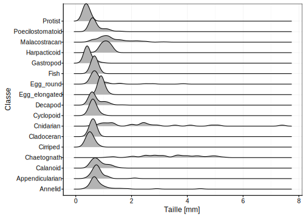

# Visualisation II {#visu2}


Vos objectifs pour ce module sont:

- Savoir réaliser différentes variantes de différents graphiques tel que les histogrammes, les graphes de densité dans R avec la fonction `chart()`

- Intégrer ensuite des graphiques dans un rapport et y décrire ce que que vous observez

Si ce n'est déjà fait, vous devez avoir réaliser le module précédent.

## Visualisation graphique à l'aide d'un histogramme

Lors d'une expérience vous souhaitez visualiser la façon dont vos données s'étale sur un axe (On parle de **distribution**^[TODO] en statistique) pour l'une des vairables étudiées. L'histogramme est l'un des outils pouvant vous apporter cette information. Ce graphique va découper en plusieurs **classes**^[TODO] la variable étudiée.


<div class="figure" style="text-align: center">

<p class="caption">(\#fig:unnamed-chunk-1)Histogramme montrant la distribution de la taille d'un échantillon de zooplancton analysé par analyse d'image.</p>
</div>
 Les éléments indispensables à la compréhension d'un histogramme sont (ici mis en évidence en couleur)

- Les axes avec les graduations (en rouge)
- les labels et unité des axes (en bleu)


Les instructions de base afin de produire un histogramme :


```r
# Importation du jeu de données
zp <- read( file = "zooplankton", package = "data.io", lang = "fr")
# Réalisation du graphique
chart(zp, formula = ~ size) +
  geom_histogram(bins = 50) 
```

<div class="figure" style="text-align: center">

<p class="caption">(\#fig:unnamed-chunk-2)Instructions pour obtenir un histogramme.</p>
</div>

```r
# bins permet de préciser le nombre de classes souhaitées
```


La fonction `chart()` requiert comme argument le jeu de donnée (dataframe, zp), ainsi que la formule à employer ~ VAR (size) . Pour réaliser un histogramme, vous devez ajouter la seconde fonction `geom_histogram()`.
 

Vous pouvez décripter votre histogramme sur base des **modes**^[todo] et de la **symétrie**^[TODO] de ces derniers. Les modes les plus fréquents sont unimodal, bimodal ou multimodal. 

<div class="figure" style="text-align: center">

<p class="caption">(\#fig:unnamed-chunk-3)Histogrammes montrant les modes et symétries : A. histogramme unimodal et symétrique, B. histogramme bimodal et asymétrique, C. histogramme unimodal et asymétrique, D. histogramme multimodal et symétrique.</p>
</div>


### Pièges et astuces

#### Nombres de classes d'un histogramme

Vous devez être particulièrement vigilant lors de la réalisation d'un histogramme aux classes de ce dernier. 


```r
# Réalisation du graphique précédent
a <- chart(zp, formula = ~ size) +
  geom_histogram(bins = 50) 
# modification du nombre de classes
b <- chart(zp, formula = ~ size) +
  geom_histogram(bins = 20)

c <- chart(zp, formula = ~ size) +
  geom_histogram(bins = 10)

d <- chart(zp, formula = ~ size) +
  geom_histogram(bins = 5) 

# Assemblage des graphiques
ggpubr::ggarrange(a,b,c,d,labels = "AUTO", font.label = list(size = 14, align = "hv"))
```

<div class="figure" style="text-align: center">

<p class="caption">(\#fig:unnamed-chunk-4)Piège de l'histogramme. A. histogramme initiale montrant la répartition des tailles au sein d'organismes planctoniques. B., C., D. Histogramme A en modifiant le nombres de classes </p>
</div>


#### Utilisation des snippets

RStudio permet d'ajouter des snippets^[Suite d'instruction préenregistré dasn Rstudio servant d'aide lors de l'analyse de données.] afin de faciliter l'apprentissage des suites d'instruction pour analyser des données sur R. Sciviews fournit une succession de snippets que vous pouvez retrouver dans l'aide mémoire^[TODO]

```
... # ouverture des sciviews snippets
```

#### Réalisation d'un histogramme par facteur

Lors de l'analyse de jeux de données , vous serez amené a réalisé un histogramme par facteur. Cette opération peut avoir un rendu graphique plutôt décevant dont voici deux astuces pour l'éviter. 


```r
# Importation du jeu de données
is <- read(file = "iris", package = "datasets", lang = "fr")
# Réalisation de l'histogramme par facteur
chart(is, ~ sepal_length %fill=% species) +
  geom_histogram() +
  scale_fill_viridis(discrete = TRUE) # palette de couleur harmonieuse
```

```
# `stat_bin()` using `bins = 30`. Pick better value with `binwidth`.
```

<div class="figure" style="text-align: center">

<p class="caption">(\#fig:unnamed-chunk-5)Histogramme de la longueur des sépales de 3 espèces d'iris.</p>
</div>

La premières astuces est d'employer préférentiellement les `facets` au lieu de l'argument `fill`.


```r
chart(is, ~ sepal_length | species) +
  geom_histogram()
```

```
# `stat_bin()` using `bins = 30`. Pick better value with `binwidth`.
```

<div class="figure" style="text-align: center">

<p class="caption">(\#fig:unnamed-chunk-6)Histogramme de la longueur des sépales de 3 espèces d'iris en employant les facets comme argument pour discriminer les espèces.</p>
</div>

[Simon Jackson](https://drsimonj.svbtle.com/plotting-background-data-for-groups-with-ggplot2) propose une seconde solution combinant les facets et l'argument fill. Il faut ensuite ajouter par derriere un histogramme ne tenant pas compte de la variable facteur comme proposé ci-dessous.


```r
chart(is, formula = ~ sepal_width %fill=% species | species) +
  geom_histogram(data = is[ , -c(5)] , fill = "grey") +
  geom_histogram(show.legend = FALSE) +
  scale_fill_viridis(discrete = TRUE)
```

```
# `stat_bin()` using `bins = 30`. Pick better value with `binwidth`.
# `stat_bin()` using `bins = 30`. Pick better value with `binwidth`.
```

<div class="figure" style="text-align: center">

<p class="caption">(\#fig:unnamed-chunk-7)Histogramme de la longeur des sépales de 3 espèces d'iris en employant la solution de Simon Jackson.</p>
</div>


## Visualisation graphique à l'aide d'un graphique de densité

L'histogramme n'est pas le seul outil à votre disposition. Vous pouvez également employer le graphique de densité qui se base sur l'histogramme. Il ne s'agit plus de représenter un dénombrement comme l'histogramme le fait mais une **probabilité**^[TODO] d'obtenir une valeur parmi un échantillon aléatoire. Le passage d'un histogramme vers un graphe de densité se base sur une **estimation par noyaux gaussien**^[TODO]

<div class="figure" style="text-align: center">

<p class="caption">(\#fig:unnamed-chunk-8)A. Histogramme  et B. graphique de densité montrant la distribution de la taille d'un échantillon de zooplancton analysé par analyse d'image.</p>
</div>

Les éléments indispensables à la compréhension d'un graphique de densité sont (ici mis en évidence en couleur) : 

- Les axes avec les graduations (en rouge)
- les labels et unité des axes (en bleu)

Les instructions de base afin de produire un histogramme sont :


```r
# Importation du jeu de données
zp <- read( file = "zooplankton", package = "data.io", lang = "fr")
# Réalisation du graphique
chart(zp, formula = ~ size) +
  geom_density()
```

<div class="figure" style="text-align: center">

<p class="caption">(\#fig:unnamed-chunk-9)Instructions pour obtenir un graphique de densité.</p>
</div>

La fonction `chart()` requiert comme argument le jeu de donnée ( dataframe, zp), ainsi que la formule à employer  ~ VAR (size). Pour réaliser un graphique de densité vous devez ajouter la seconde fonction `geom_density()`.


## Visualisation graphique à l'aide d'un diagramme en violon

Le graphique de densité peut être représenté via un autre graphique qui sera d'autant plus intéressant que la variable facteur étudiée peut être discriminée par un grand nombre de niveaux différents. Il s'agit également d'une estimation se basant sur un histogramme via la méthode l'estimation par noyau gaussien.

<div class="figure" style="text-align: center">

<p class="caption">(\#fig:unnamed-chunk-10)Ponts essentiels d'un diagramme en violon portant sur la distribution de la taille d'un échantillon de zooplancton en fonction de leurs classes analysé par analyse d'image.</p>
</div>

Les instructions de base afin de produire un diagramme en violon sont :


```r
# Importation du jeu de données
zp <- read( file = "zooplankton", package = "data.io", lang = "fr")
# Réduction du jeu de données 
zp1 <- filter(zp, class %in% c("Annelid", "Calanoid", "Cyclopoid", "Decapod"))
# Réalisation du graphique
chart(zp1, formula = size~ class) +
  geom_violin()
```

<div class="figure" style="text-align: center">

<p class="caption">(\#fig:unnamed-chunk-11)Instructions pour obtenir un diagramme en violon.</p>
</div>

La fonction `chart()` requiert comme argument le jeu de donnée (dataframe, zp), ainsi que la formule à employer  YVAR (size) ~ XVAR (class). Pour réaliser un graphique de densité vous devez ajouter la seconde fonction `geom_density()`.


### Pièges et astuces

Lors de l'analyse de jeux de données , vous serez amené a réalisé un diagramme en violon pour une variable comprennant un grand nombre de niveaux. Cette opération peut avoir un rendu graphique plutôt décevant dont voici deux astuces pour l'éviter.


```r
chart(zp, formula = size~ class) +
  geom_violin() 
```

<div class="figure" style="text-align: center">

<p class="caption">(\#fig:unnamed-chunk-12)Diagramme en violon montrant la densité de tailles des 17 classes d'organismes planctonique.</p>
</div>

L'ensemble des niveaux de la variable class se chevauche. La fonction `coord_flip()` peut améliorer le rendu du graphique en le faisant basculer de 90°.


```r
chart(zp, formula = size~ class) +
  geom_violin() +
  coord_flip()
```

<div class="figure" style="text-align: center">

<p class="caption">(\#fig:unnamed-chunk-13)Diagramme en violon montrant la densité de tailles des 17 classes d'organismes planctonique avec l'ajout de la fonction coord_flip.</p>
</div>

Le package [ggridges](https://cran.r-project.org/web/packages/ggridges/vignettes/introduction.html) propose une seconde solution basée sur le principe de graphique de densité avec la fonction geom_density_ridges()`. 


```r
# Importation du packages
library(ggridges)
# réalisation du graphiques
chart(zp, class ~ size) +
  geom_density_ridges()
```

<div class="figure" style="text-align: center">

<p class="caption">(\#fig:unnamed-chunk-14)Diagramme en violon montrant la densité de tailles des 17 classes d'organismes planctonique avec la fonction geom_density_ridges.</p>
</div>

## A vous de jouer !

\BeginKnitrBlock{bdd}<div class="bdd">Ouvrez RStudio dans votre SciViews Box, puis exécutez l'instruction suivante dans la fenêtre console :

    BioDataScience::run("...")
</div>\EndKnitrBlock{bdd}

Un squelette de projet RStudio vous a été fournit via une tâche Github Classroom, y compris une organisation des fichiers et des jeux de données types. Votre objectif est de comprendre les données proposées en utilisant des visualisations graphiques appropriées et en documentant le fruit de votre étude dans un rapport R Notebook. Utilisez l'histogramme et le graphique de densité que vous venez d'étudier bien sûr, mais vous êtes aussi encouragés à expérimenter d'autres visualisations graphiques.

