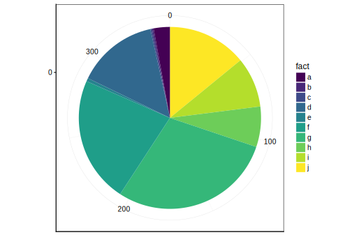
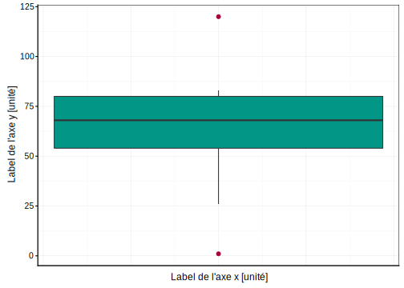
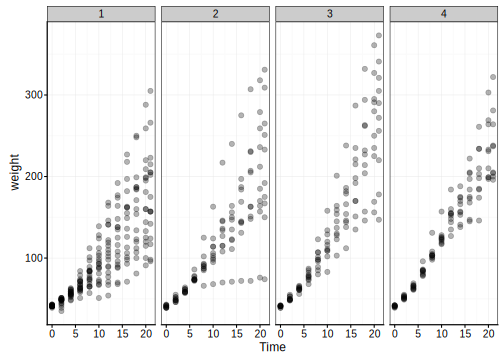
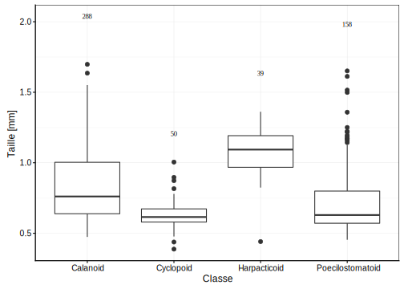
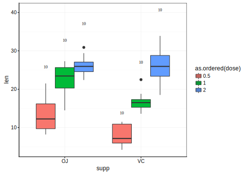
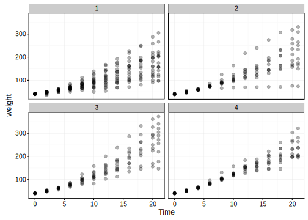
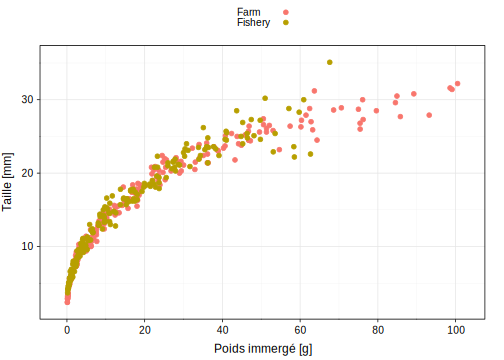

# Visualisation III {#visu3}


#### Objectifs {-}

- Savoir réaliser différents graphiques comme le graphique en barres, le graphique en camembert ou encore la boîte de dispersion, dans R avec la fonction `chart()`

- Arranger différents graphiques dans une figure unique. 

- Découvrir différents systèmes graphiques (graphiques de base, lattice, ggplot2) et comparaison avec `chart()`


#### Prérequis {-}

Si ce n'est déjà fait, vous devez avoir réaliser les module 2 & 3.


## Graphique en barres

### Dénombrement d'observations par facteur

Vous souhaitez représenter une dénombrement des différents niveaux d'une variable facteur. On peut l'exprimer dans R sous la forme :

$$\sim variable \ facteur$$
que l'on peut lire :

$$\ en \ fonction \ de \ la \ variable \ facteur$$
<div class="figure" style="text-align: center">

<p class="caption">(\#fig:unnamed-chunk-1)Points essentiels d'un graphique en barre montrant le dénombrement des niveaux d'une variable facteur.</p>
</div>

Les éléments indispensables à la compréhension d'un graphique en barres sont (ici mis en évidence en couleur) : 

- les axes avec les graduations (en rouge)
- le label en x  (en bleu)
- les niveaux de la variable facteur

Les instructions de base afin de produire un graphique en barres sont :


```r
# Importation du jeu de données
(zooplankton <- read( file = "zooplankton", package = "data.io", lang = "fr"))
```

```
# # A tibble: 1,262 x 20
#      ecd  area perimeter feret major minor  mean  mode   min   max std_dev
#    <dbl> <dbl>     <dbl> <dbl> <dbl> <dbl> <dbl> <dbl> <dbl> <dbl>   <dbl>
#  1 0.770 0.465      4.45 1.32  1.16  0.509 0.363 0.036 0.004 0.908   0.231
#  2 0.700 0.385      2.32 0.728 0.713 0.688 0.361 0.492 0.024 0.676   0.183
#  3 0.815 0.521      4.15 1.33  1.11  0.598 0.308 0.032 0.008 0.696   0.204
#  4 0.785 0.484      4.44 1.78  1.56  0.394 0.332 0.036 0.004 0.728   0.218
#  5 0.361 0.103      1.71 0.739 0.694 0.188 0.153 0.016 0.008 0.452   0.110
#  6 0.832 0.544      5.27 1.66  1.36  0.511 0.371 0.02  0.004 0.844   0.268
#  7 1.23  1.20      15.7  3.92  1.37  1.11  0.217 0.012 0.004 0.784   0.214
#  8 0.620 0.302      3.98 1.19  1.04  0.370 0.316 0.012 0.004 0.756   0.246
#  9 1.19  1.12      15.3  3.85  1.34  1.06  0.176 0.012 0.004 0.728   0.172
# 10 1.04  0.856      7.60 1.89  1.66  0.656 0.404 0.044 0.004 0.88    0.264
# # ... with 1,252 more rows, and 9 more variables: range <dbl>, size <dbl>,
# #   aspect <dbl>, elongation <dbl>, compactness <dbl>, transparency <dbl>,
# #   circularity <dbl>, density <dbl>, class <fct>
```

```r
# Réduction du jeu de données 
(copepoda <- filter(zooplankton, class %in% c("Calanoid", "Cyclopoid",  "Harpacticoid",  "Poecilostomatoid")))
```

```
# # A tibble: 535 x 20
#      ecd  area perimeter feret major minor  mean  mode   min   max std_dev
#    <dbl> <dbl>     <dbl> <dbl> <dbl> <dbl> <dbl> <dbl> <dbl> <dbl>   <dbl>
#  1 0.770 0.465      4.45 1.32  1.16  0.509 0.363 0.036 0.004 0.908   0.231
#  2 0.815 0.521      4.15 1.33  1.11  0.598 0.308 0.032 0.008 0.696   0.204
#  3 0.785 0.484      4.44 1.78  1.56  0.394 0.332 0.036 0.004 0.728   0.218
#  4 0.361 0.103      1.71 0.739 0.694 0.188 0.153 0.016 0.008 0.452   0.110
#  5 0.832 0.544      5.27 1.66  1.36  0.511 0.371 0.02  0.004 0.844   0.268
#  6 1.23  1.20      15.7  3.92  1.37  1.11  0.217 0.012 0.004 0.784   0.214
#  7 0.620 0.302      3.98 1.19  1.04  0.370 0.316 0.012 0.004 0.756   0.246
#  8 1.19  1.12      15.3  3.85  1.34  1.06  0.176 0.012 0.004 0.728   0.172
#  9 1.04  0.856      7.60 1.89  1.66  0.656 0.404 0.044 0.004 0.88    0.264
# 10 0.725 0.412      7.14 1.90  0.802 0.655 0.209 0.008 0.004 0.732   0.202
# # ... with 525 more rows, and 9 more variables: range <dbl>, size <dbl>,
# #   aspect <dbl>, elongation <dbl>, compactness <dbl>, transparency <dbl>,
# #   circularity <dbl>, density <dbl>, class <fct>
```

```r
# Réalisation du graphique
chart(copepoda, formula = ~ class) +
  geom_bar()
```

<div class="figure" style="text-align: center">

<p class="caption">(\#fig:unnamed-chunk-2)Instructions pour obtenir un graphique en barres.</p>
</div>

La fonction `chart()` requiert comme argument le jeu de données (`dataframe`, `copepoda`), ainsi que la formule à employer ` ~ XVAR (class)`. Pour réaliser un graphique en barres, vous devez utiliser ensuite la fonction `geom_bar()`.

#### Dénombrement par plusieurs facteurs


```r
#importation des données biometry
(biometry <- read("biometry", package = "BioDataScience", lang= "fr"))
```

```
# # A tibble: 395 x 7
#    gender day_birth  weight height wrist year_measure   age
#    <fct>  <date>      <dbl>  <dbl> <dbl>        <dbl> <dbl>
#  1 M      1995-03-11     69    182  15           2013    18
#  2 M      1998-04-03     74    190  16           2013    15
#  3 M      1967-04-04     83    185  17.5         2013    46
#  4 M      1994-02-10     60    175  15           2013    19
#  5 W      1990-12-02     48    167  14           2013    23
#  6 W      1994-07-15     52    179  14           2013    19
#  7 W      1971-03-03     72    167  15.5         2013    42
#  8 W      1997-06-24     74    180  16           2013    16
#  9 M      1972-10-26    110    189  19           2013    41
# 10 M      1945-03-15     82    160  18           2013    68
# # ... with 385 more rows
```

```r
# conversion de la variable year_measure de numérique à facteur
biometry$year_measure <- as.factor(biometry$year_measure)
attr(biometry$year_measure, "label") <- "Année de la mesure"
```

Différentes représentations sont possibles pour observer des dénombrements tenant compte de plusieurs variables facteurs. Par défaut, l'argument `position` a pour valeur `stack`.


```r
a <- chart(biometry, formula = ~ gender) +
  geom_bar()

b <- chart(biometry, formula = ~ gender %fill=% year_measure) +
  geom_bar()

ggarrange(a,b, common.legend = TRUE)
```

<div class="figure" style="text-align: center">

<p class="caption">(\#fig:unnamed-chunk-4)Dénombrement du individus homme et femme dans l'étude sur l'obésité en Hainaut en tenant compte des années de mesures.</p>
</div>

Il existe d'autres solutions en utilisant la valeur `dodge` ou `fill` pour l'argument `position`.


```r
a <- chart(biometry, formula = ~ gender %fill=% year_measure) +
  geom_bar(position = "stack")
b <- chart(biometry, formula = ~ gender %fill=% year_measure) +
  geom_bar(position = "dodge")
c <- chart(biometry, formula = ~ gender %fill=% year_measure) +
  geom_bar(position = "fill")
ggarrange(a, b, c, common.legend = TRUE, labels = "AUTO")
```

<div class="figure" style="text-align: center">

<p class="caption">(\#fig:unnamed-chunk-5)Dénombrement du individus homme et femme dans l'étude sur l'obésité en Hainaut en tenant compte des années de mesures.</p>
</div>

Soyez vigilant à la différence entre l'argument **stack** et l'argument **fill** qui malgré un rendu semblable ont l'axe des ordonnées qui diffère.

#### Pièges et Astuces

##### Réordonner la variable facteur par fréquence

Vous pouvez avoir le souhait d'ordonner votre variable facteur afin d'améliorer le rendu visuel de votre graphique. Vous pouvez employer la fonction `fct_infreq()`. 


```r
chart(copepoda, formula = ~ fct_infreq(class)) +
  geom_bar()
```

<div class="figure" style="text-align: center">

<p class="caption">(\#fig:unnamed-chunk-6)Dénombrement des classes de copépodes du jeu de données zooplankton.</p>
</div>

##### Rotation du graphique en barre

Lorsque les niveaux dans la variable étudiée sont trop nombreux, la légende en abscisse risque de se chevaucher.


```r
chart(zooplankton, formula = ~ class) +
  geom_bar()
```

<div class="figure" style="text-align: center">

<p class="caption">(\#fig:unnamed-chunk-7)Dénombrement des classes du jeu de données zooplankton.</p>
</div>

Avec la fonction `coord_flip()` ajoutée à votre graphique, vous pouvez effectuer une rotation des axes. De plus, l'oeil humain perçoit plus distinctement les différences de tailles horizontales que verticales. 


```r
chart(zooplankton, formula = ~ class) +
  geom_bar() +
  coord_flip()
```

<div class="figure" style="text-align: center">

<p class="caption">(\#fig:unnamed-chunk-8)Dénombrement des classes du jeu de données zooplankton.</p>
</div>


#### Pour en savoir plus 

- http://www.sthda.com/french/wiki/ggplot2-barplots-guide-de-demarrage-rapide-logiciel-r-et-visualisation-de-donnees

- http://ggplot2.tidyverse.org/reference/geom_bar.html

- http://ggplot.yhathq.com/docs/geom_bar.html


### Valeur moyenne à l'aide d'un graphe en barres

Le graphique en barres peut être employé afin de résumer des données numériques via la moyenne. Il ne s'agit plus de dénombrer les occurrences d'une variable facteur mais de résumer des données numériques en fonction d'une variable facteur. On peut exprimer cette relation dans R sous la forme de $$y \sim x$$ que l'on peut lire : $$y \ en \ fonction \ de \ x$$ ou encore $$Variable \ numérique \ en \ fonction \ de \ Variable \ facteur$$ 

Considérez l'échantillon suivant :

```
1, 71, 55, 68, 78, 60, 83, 120, 82 ,53, 26
```

Calculez la moyenne sur base de la formule de la moyenne $$\overline{y} = \sum_{i = 1}^n \frac{y_i}{n}$$


```r
# Création du vecteur
x <- c(1, 71, 55, 68, 78, 60, 83, 120, 82, 53, 26)

# Calcul  de la moyenne
mean(x)
```

```
# [1] 63.36364
```


<div class="figure" style="text-align: center">

<p class="caption">(\#fig:unnamed-chunk-10)Points essentiels d'un graphique en barre résumant les données numériques d'une variable facteur.</p>
</div>

Les éléments indispensables à la compréhension d'un graphe en barres sont (ici mis en évidence en couleur) : 

- les axes avec les graduations (en rouge)
- les labels et unités des axes (en bleu) 


Les instructions de base afin de produire ce graphe en barres sont :


```r
# Réalisation du graphique
chart(copepoda, formula = size ~ class) +
  stat_summary(geom = "col", fun.y = "mean")
```

<div class="figure" style="text-align: center">

<p class="caption">(\#fig:unnamed-chunk-11)Instructions pour obtenir un graphique en barres indiquant les moyennes par groupe.</p>
</div>

#### Pièges et astuces

##### Moyenne

Le graphe en barre est un graphique très répandu dans le domaine scientifique malgré le grand nombre d'arguments contre lui que vous pouvez lire dans la section `Pour en savoir plus`. L'un des arguments le plus important est la faible information qu'il apporte.


```r
a <- chart(copepoda, formula = size ~ class) +
  stat_summary(geom = "col", fun.y = "mean") +
  theme(axis.text.x = element_text(angle=45, vjust = 1, hjust = 1))

b <- chart(copepoda, formula = size ~ class) +
  stat_summary(geom = "point", fun.y = "mean") +
  theme(axis.text.x = element_text(angle= 45, vjust = 1, hjust = 1))

ggarrange(a,b, labels = "AUTO")
```

<div class="figure" style="text-align: center">

<p class="caption">(\#fig:unnamed-chunk-12)Comparaison entre le graphique en barres et le nuage de points montrant tous les deux la taille moyenne en fonction des classes de copépodes.</p>
</div>

Comme vous pouvez le voir ci-dessus, un graphique de type nuage de point peut représenter la valeur moyenne avec tout autant d'intérêt que le graphique en barres. 

#### Pour en savoir plus 

- https://www.ncbi.nlm.nih.gov/pmc/articles/PMC3148365/ 

- https://www.r-bloggers.com/dynamite-plots-in-r/

- https://pablomarin-garcia.blogspot.com/2010/02/why-dynamite-plots-are-bad.html

- http://biostat.mc.vanderbilt.edu/wiki/pub/Main/TatsukiRcode/Poster3.pdf 

- http://emdbolker.wikidot.com/blog%3Adynamite

## Graphique en camembert

Le graphique en camembert va vous permettre de visualiser un dénombrement d'observations par facteur, tout comme le graphique en barres. 


```r
chart(copepoda, formula = ~ factor(0) %fill=% class) +
  geom_bar(width = 1) + 
  coord_polar("y", start = 0) +
  theme_void() +
  scale_fill_viridis_d()
```

<div class="figure" style="text-align: center">

<p class="caption">(\#fig:unnamed-chunk-13)Points essentiels d'un graphique en camembert montrant le dénombrement des niveaux d'une variable facteur.</p>
</div>

Les éléments indispensables à la compréhension d'un graphe en camembert sont : 

- les niveaux de la variable facteur 


Les instructions de base afin de produire ce graphe en camembert sont :


```r
chart(copepoda, formula = ~ factor(0) %fill=% class) +
  geom_bar(width = 1) + 
  coord_polar("y", start = 0)+
  labs( x = "", y = "") + 
  theme_void() +
  scale_fill_viridis_d()
```

<div class="figure" style="text-align: center">

<p class="caption">(\#fig:unnamed-chunk-14)Instructions pour obtenir un graphique en cammenbet.</p>
</div>

### Pièges et astuces

Le graphique en camembert est un graphique également fortement répandu. Cependant, l'oeil humain perçoit avec plus de précision les différences de formes que les différences d'angles. Un grand nombre de niveaux dans une variable facteur va avoir pour effet de remplir. De ce fait, il est donc déconseillé d'employer le graphique en camembert  

Partons d'un exemple fictif, combien d'observations pour la lettre h comptez-vous ? 


```r
error <- data_frame(index = 1:348, fact = c(rep(x = "a", times = 10), rep(x = "b", times = 1), rep(x = "c", times = 1), rep(x = "d", times = 50), rep(x = "e", times = 2), rep(x = "f", times = 78), rep(x = "g", times = 101), rep(x = "h", times = 25) , rep(x = "i", times = 31), rep(x = "j", times = 49)))
```


```r
chart(error, formula = ~ factor(0) %fill=% fact) +
  geom_bar(width = 1) + 
  coord_polar("y", start = 0) +
  labs( x = "", y = "") +
  scale_fill_viridis_d()
```

<div class="figure" style="text-align: center">

<p class="caption">(\#fig:unnamed-chunk-16)Piège d'un graphique en camembert montrant le dénombrement des niveaux d'une variable facteur.</p>
</div>

Sur base de ce graphique en barres, combien d'observations pour la lettre h comptez-vous ?


```r
chart(error, formula = ~ factor(fact) %fill=% fact) +
  geom_bar(width = 1) +
  scale_fill_viridis_d()
```

<div class="figure" style="text-align: center">

<p class="caption">(\#fig:unnamed-chunk-17)Dénombrement des niveaux d'une variable facteur.</p>
</div>

### Pour en savoir plus 


- http://www.sthda.com/french/wiki/ggplot2-graphique-en-camembert-guide-de-demarrage-rapide-logiciel-r-et-visualisation-de-donnees

- https://dataparkblog.wordpress.com/2017/09/24/diagramme-en-camembert-avec-r-et-ggplot/

- https://www.displayr.com/why-pie-charts-are-better-than-bar-charts/

- http://www.perceptualedge.com/articles/08-21-07.pdf

## Boite de dispersion

Vous souhaitez représenter graphiquement cette fois un résumé d'une variable numérique tout en gardant un maximum d'information. La boite de dispersion est l'un des outils pouvant vous apporter la solution. Cette dernière va représenter graphiquement 5 descripteurs appelés les 5 nombres.

Prenez les chiffres suivants :

```
1, 71, 55, 68, 78, 60, 83, 120, 82 ,53, 26
```
ordonnez les de manière croissante


```r
# création du vecteur
x <- c(1, 71, 55, 68, 78, 60, 83, 120, 82, 53, 26)
# ordonner le vecteur
sort(x)
```

```
#  [1]   1  26  53  55  60  68  71  78  82  83 120
```

Le premier descripteur des 5 nombres est la médiane qui se situe à la moitié des observations.


```r
median(x)
```

```
# [1] 68
```

Le premier quartile sera la valeur au milieu des 50% des données inférieures à la médiane et le troisième quartile est la valeur centrale sur les 50% des données supérieures à la médiane. La valeur manimale étant la valeur la plus petite et la valeur maximale étant la valeur la plus élevée.


```r
fivenum(x)
```

```
# [1]   1  54  68  80 120
```

Vous pouvez réprésenter ce vecteur via une boite de dispersion

<div class="figure" style="text-align: center">

<p class="caption">(\#fig:unnamed-chunk-21)Nuage de points montrant la première étape de la construction d'une boite de dispersion.</p>
</div>

La boite de dispersion représente donc les 5 nombres. Vous observez cependant que certaine valeur ne se situe pas dans la boite de dispersion, il s'agit de valeurs extrêmes. Elles sont considérées comme extrêmes car elles sont éloignées de plus 1.5 fois l'espace inter-quartile (Q3- Q1). La boite de dispersion s'arrête donc aux dernières valeurs présente dans cet espace inter-quartile (IQR).

<div class="figure" style="text-align: center">

<p class="caption">(\#fig:unnamed-chunk-22)A) Nuage de points montrant la construction d'une boite de dispersion avec les 5 nombres représentés par des lignes noires. B) Boite de dispersion obtenue par rapport à la partie A.</p>
</div>


La boite de dispersion ainsi que sa description sont proposée sur le graphique ci-dessous.

<div class="figure" style="text-align: center">

<p class="caption">(\#fig:unnamed-chunk-24)Points essentiels d'une boite de dispersion et sa description.</p>
</div>

Les instructions de base afin de produire une boite de dispersion sont :


```r
# Réalisation du graphique 
chart(copepoda, formula = size ~ class) +
  geom_boxplot()
```

<div class="figure" style="text-align: center">

<p class="caption">(\#fig:unnamed-chunk-25)Instructions pour obtenir une boite de dispersion.</p>
</div>


La fonction `chart()` requiert comme argument le jeu de données (dataframe, copepoda), ainsi que la formule à employer YNUM (size) ~ XFACTOR (class). Pour réaliser une boite de dispersion vous devez ajouter la seconde fonction `geom_boxplot()`.

### Pièges et Astuces

#### Nombre d'observations par boite de disperion

Lors de la réalisation de boites de dispersion, vous devez être vigilant au nombre d'observation qui se cache sous chaque boite de dispersion. En effet, une boite de dispersion ne comportant que 5 valeurs ou moins n'a que peu d'intérêt d'être avec cet outils graphique. 

<div class="figure" style="text-align: center">

<p class="caption">(\#fig:unnamed-chunk-26)Piège des boites de dispersion.</p>
</div>

La boite de dispersion "a" ne contient que 4 observations ce qui peut être totalement masqué par l'utilisation de boites de dispersion.

Une des solutions permettant de connaitre graphiquement la nombre d'observations par boite est de l'ajouter au-dessus de chaque boite avec la fonction `give_n()`.


```r
give_n <- function(x){
  return(c(y = max(x)*1.20, label = length(x))) 
}

chart(copepoda, formula = size ~ class) +
  geom_boxplot() + 
  stat_summary(fun.data = give_n, geom = "text", hjust = 0.5)
```

<div class="figure" style="text-align: center">

<p class="caption">(\#fig:unnamed-chunk-27) Boite de dispersion portant sur la croissance de dents de cochon d'Inde en fonction de la supplémentation administrée.</p>
</div>


```r
#Importation du jeu de données ToothGrowth
(toothgrowth <- read("ToothGrowth", package = "datasets", lang  = "fr"))
```

```
# # A tibble: 60 x 3
#      len supp   dose
#    <dbl> <fct> <dbl>
#  1   4.2 VC      0.5
#  2  11.5 VC      0.5
#  3   7.3 VC      0.5
#  4   5.8 VC      0.5
#  5   6.4 VC      0.5
#  6  10   VC      0.5
#  7  11.2 VC      0.5
#  8  11.2 VC      0.5
#  9   5.2 VC      0.5
# 10   7   VC      0.5
# # ... with 50 more rows
```

```r
# réalisation graphique
chart(toothgrowth, formula = len ~ supp %fill=% as.ordered(dose)) +
  geom_boxplot() +
  stat_summary(fun.data = give_n, geom = "text", hjust = 0.5, 
               position = position_dodge(0.75))
```

<div class="figure" style="text-align: center">

<p class="caption">(\#fig:unnamed-chunk-28) Boite de dispersion portant sur la croissance de dents de cochon d'Inde en fonction de la supplémentation et la dose administrée.</p>
</div>

### Pour en savoir plus ! 

- http://www.sthda.com/french/wiki/ggplot2-box-plot-guide-de-demarrage-rapide-logiciel-r-et-visualisation-de-donnees

- https://plot.ly/ggplot2/box-plots/

- http://www.r-graph-gallery.com/265-grouped-boxplot-with-ggplot2/

- https://chemicalstatistician.wordpress.com/2013/08/12/exploratory-data-analysis-the-5-number-summary-two-different-methods-in-r-2/


## Multi-graphiques

Lorsque vous souhaitez représenter plusieurs graphiques sur une seule fenêtre graphique plusieurs fonctions sont à votre disposition. Il faut tout d'abord distinguer deux types de multi-graphiques. Soit il s'agit d'un seul graphique que vous souhaitez subdiviser par rapport à une ou des variables facteurs. Soit il s'agit de graphiques indépendants que vous souhaitez représenter sur la même fenêtre graphique. Dans le premier cas, la fonction `facet_grid()` du package `ggplot2` peut être employé. Dans le second cas, la fonction `plot_grid()` du package `cowplot` est l'une des alternatives possibles.

### Facets

L'une des règles les plus importantes que vous devez impérativement garder à l'esprit lors de la réalisation de vos graphiques est *la simplicité*. Plus votre graphique va contenir d'information au plus il sera compliqué à décoder par un collaborateur. 


```r
# Importation des données
(ChickWeight <- read(file = "ChickWeight", package = "datasets", lang = "fr"))
```

```
# # A tibble: 578 x 4
#    weight  Time Chick Diet 
#     <dbl> <dbl> <ord> <fct>
#  1     42     0 1     1    
#  2     51     2 1     1    
#  3     59     4 1     1    
#  4     64     6 1     1    
#  5     76     8 1     1    
#  6     93    10 1     1    
#  7    106    12 1     1    
#  8    125    14 1     1    
#  9    149    16 1     1    
# 10    171    18 1     1    
# # ... with 568 more rows
```

```r
# Réalisation du graphique
chart(ChickWeight, formula = weight ~ Time) +
  geom_point(alpha = 0.3)
```

<div class="figure" style="text-align: center">

<p class="caption">(\#fig:unnamed-chunk-29)Nuage de point montrant la variation de la masse de poulets au cours du temps.</p>
</div>

Le graphique ci-dessus peut par exemple être simplifié avec les facets. L'information que l'on souhaite partager est la même mais les choix graphiques rendent sa lecture plus aisée. De plus, la fenêtre graphique a la même taille par défaut que pour un seul graphique. De ce fait, réaliser de multiples graphiques peut rendre sa lecture impossible par une taille trop faible.


```r
chart(ChickWeight, formula = weight ~ Time | Diet ) +
  geom_point(alpha = 0.3)
```

<div class="figure" style="text-align: center">

<p class="caption">(\#fig:unnamed-chunk-30)Nuage de point montrant la variation de la masse de poulets au cours du temps en fonction de la supplémention (1-4).</p>
</div>

Vous observez que les échelles en abscisse et en ordonnée sont similaires. Cela permet une meilleure comparaison.

### `ggarrange()`

La fonction `ggarrange()` permet de combiner plusieurs graphiques.


```r
# Importation des données
ub <- read("urchin_bio", package = "data.io")
# Réalisation des graphiques
a <- chart(urchin, formula = weight ~ height %col=% origin) +
  geom_point()

b <- chart(urchin, formula = weight ~ solid_parts %col=% origin) +
  geom_point()
# Combinaison des graphiques
ggarrange(a, b, common.legend = TRUE)
```

<div class="figure" style="text-align: center">

<p class="caption">(\#fig:unnamed-chunk-31)A) Nuage de point montrant la variation de la masse d'oursins en fonction de la taille  et de leur origine. B) Nuage de point montrant la variation de la masse d'oursins en fonction de la masse des parties solides et de leur origine.</p>
</div>

Il existe d'autres fonctions permettant de combiner plusieurs graphiquescomme [`plot_grid()`](https://cran.r-project.org/web/packages/cowplot/vignettes/plot_grid.html) du package`cowplot`.

#### Pour en savoir plus ! 

- http://www.sthda.com/french/wiki/ggplot2-facet-diviser-un-graphique-en-plusieurs-panneaux-logiciel-r-et-visualisation-de-donnees

- http://www.cookbook-r.com/Graphs/Multiple_graphs_on_one_page_(ggplot2)/

- http://lightonphiri.org/blog/ggplot2-multiple-plots-in-one-graph-using-gridextra

- https://cran.r-project.org/web/packages/cowplot/vignettes/plot_grid.html

- http://www.sthda.com/english/rpkgs/ggpubr/reference/ggarrange.html 


## Différents systèmes graphiques

Depuis le début, l'ensemble des graphiques que nous vous avons proposé utilise la fonction `chart()` du package `chart`. Cependant, il ne s'agit pas du seul outil permettant de réaliser des graphiques dans R. 


```r
# Importation des données
(urchin <- read("urchin_bio", package = "data.io"))
```

```
# # A tibble: 421 x 19
#    origin diameter1 diameter2 height buoyant_weight weight solid_parts
#    <fct>      <dbl>     <dbl>  <dbl>          <dbl>  <dbl>       <dbl>
#  1 Fishe…       9.9      10.2    5               NA  0.522       0.478
#  2 Fishe…      10.5      10.6    5.7             NA  0.642       0.589
#  3 Fishe…      10.8      10.8    5.2             NA  0.734       0.677
#  4 Fishe…       9.6       9.3    4.6             NA  0.370       0.344
#  5 Fishe…      10.4      10.7    4.8             NA  0.610       0.559
#  6 Fishe…      10.5      11.1    5               NA  0.610       0.551
#  7 Fishe…      11        11      5.2             NA  0.672       0.605
#  8 Fishe…      11.1      11.2    5.7             NA  0.703       0.628
#  9 Fishe…       9.4       9.2    4.6             NA  0.413       0.375
# 10 Fishe…      10.1       9.5    4.7             NA  0.449       0.398
# # ... with 411 more rows, and 12 more variables: integuments <dbl>,
# #   dry_integuments <dbl>, digestive_tract <dbl>,
# #   dry_digestive_tract <dbl>, gonads <dbl>, dry_gonads <dbl>,
# #   skeleton <dbl>, lantern <dbl>, test <dbl>, spines <dbl>,
# #   maturity <int>, sex <fct>
```

```r
# Réalisation du graphique
chart(urchin,formula = height ~ weight %col=% origin) + 
  geom_point() 
```

<div class="figure" style="text-align: center">

<p class="caption">(\#fig:unnamed-chunk-32)Nuage de point montrant la variation de la taille en fonction du poids d'oursins et de leur origine avec le système graphique chart().</p>
</div>

Voici d'autres alternatives que sont 

- R de base


```r
plot(urchin$weight, urchin$height, col = urchin$origin, ylab = "Taille [mm]", xlab = "Poids immergé [g]")
legend(x = 80, y = 10, legend = c("Farm", "Fishery"), col = c("Black", "Red"), pch = 1)
```

<div class="figure" style="text-align: center">

<p class="caption">(\#fig:unnamed-chunk-33)Nuage de point montrant la variation de la taille en fonction du poids d'oursins et de leur origine avec le système graphique  r de base.</p>
</div>

- lattice


```r
theme_sciviews_lattice()
xyplot( height ~ weight, data = urchin, groups = origin, 
        ylab = "Taille [mm]", xlab = "Poids immergé [g]", auto.key = TRUE)
```

<div class="figure" style="text-align: center">

<p class="caption">(\#fig:unnamed-chunk-34)Nuage de point montrant la variation de la taille en fonction du poids d'oursins et de leur origine avec le système graphique lattice.</p>
</div>

- ggplot2


```r
ggplot(data = urchin) +
  geom_point(mapping = aes(x = weight, y = height, color = origin)) +
  labs( x = "Poids immergé [g]", y = "Taille [mm]")
```

<div class="figure" style="text-align: center">

<p class="caption">(\#fig:unnamed-chunk-35)Nuage de point montrant la variation de la taille en fonction du poids d'oursins et de leur origine avec le système graphique ggplot2.</p>
</div>

Vous observez rapidement certaines similitudes entre `chart`, `ggplot2` et `lattice`. En effet, la package `chart` a pour but premier de combiner les meilleures outils présents dans chacun des modes graphiques présentés ci-dessus. 

### Pour en savoir plus

- http://r4ds.had.co.nz/data-visualisation.html 

- https://flowingdata.com/2016/03/22/comparing-ggplot2-and-r-base-graphics/

- https://learnr.wordpress.com/2009/08/26/ggplot2-version-of-figures-in-lattice-multivariate-data-visualization-with-r-final-part/

- https://www.statmethods.net/advgraphs/trellis.html

- https://www.r-bloggers.com/conditioning-and-grouping-with-lattice-graphics/

- http://bl.ocks.org/patilv/raw/7360425/

- http://www.sthda.com/english/wiki/scatter-plots-r-base-graphs


## A vous de jouer !

Proposez 5 graphiques inédits (qui n'ont pas été vu dans le module 2, 3 et 4) dans vos différents projets 

Employez par exemple les liens suivants pour vous inspirer

- <https://www.r-graph-gallery.com>

- <http://r-statistics.co/Top50-Ggplot2-Visualizations-MasterList-R-Code.html>


Terminez ce module en vérifiant que vous avez acquis l'ensemble des notions de ce module.

\BeginKnitrBlock{bdd}<div class="bdd">
Ouvrez RStudio dans votre SciViews Box, puis exécutez l'instruction suivante dans la fenêtre console :

    BioDataScience::run("....")
</div>\EndKnitrBlock{bdd}


