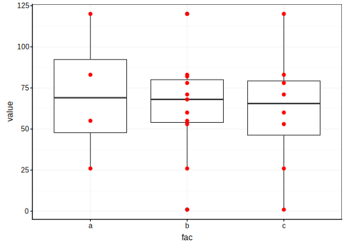
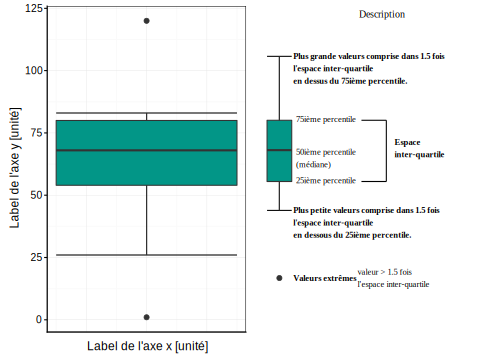
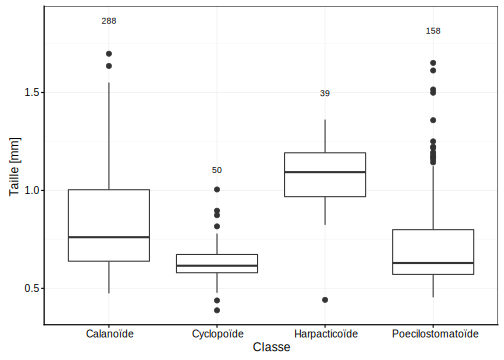
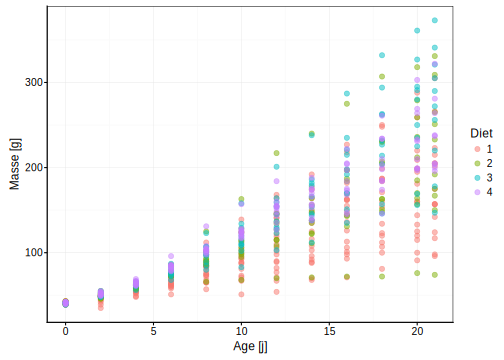
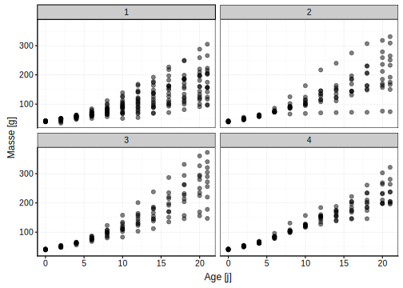
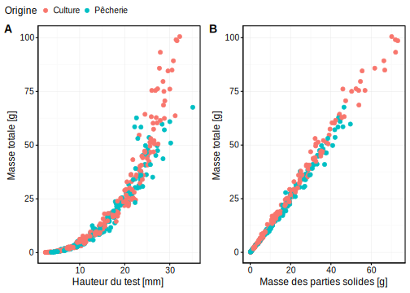
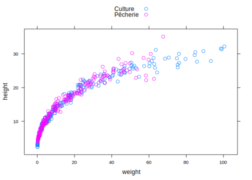
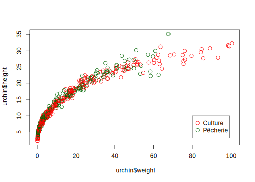
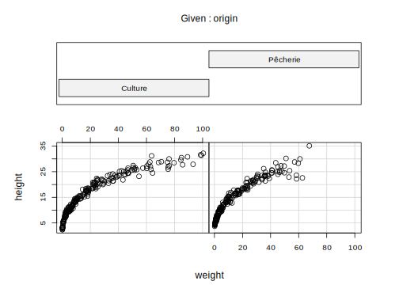

# Visualisation III {#visu3}


##### Objectifs {-}

- Savoir réaliser différents graphiques pour représenter des variables facteurs comme le graphique en barres, ou le graphique en camembert dans R avec la fonction `chart()`

- Comprendre et utiliser la boîte de dispersion pour _synthétiser_ la distribution de données numériques 

- Arranger différents graphiques dans une figure unique

- Découvrir différents systèmes graphiques (graphiques de base, lattice, ggplot2) et les comparer entre eux


##### Prérequis {-}

Assurez-vous de bien maîtriser les bases relatives à la représentation graphiques vues dans le module \@ref(visu1) et que vous êtes à l'aise dans l'utilisation de vos outils logiciels (SciViews Box, RStudio, R Markdown).


## Graphique en barres

Le graphique en barres (on dit aussi graphique en bâtons) compare les effectifs pour différents niveaux (ou modalités) d'une variable qualitative ou facteur. La différence avec l'histogramme est donc subtile et tient au fait que, pour l'histogramme, nous partons d'une variable quantitative qui est découpée en classes.


### Effectifs par facteur

La question du nombre et/ou de l'intervalle des classes ne se pose pas dans le cas du graphique en barres. Par défaut, les barres seront séparées les unes des autres par un petit espace vide pour bien indiquer visuellement qu'il n'y a pas continuité entre les classes (dans l'histogramme, les barres sont accolées les unes aux autres pour matérialiser justement cette continuité).

La formule que vous utiliserez, ici encore, ne fait appel qu'à une seule variable et s'écrira donc :

$$\sim variable \ facteur$$

<div class="figure" style="text-align: center">

<p class="caption">(\#fig:unnamed-chunk-1)Exemple d'un graphique en barres montrant le dénombrement des niveaux d'une variable facteur, avec les éléments importants du graphique mis en évidence en couleurs.</p>
</div>

Outre les barres elles-mêmes, prêtez toujours attention aux élements suivants du graphique (ici mis en évidence en couleurs) :

- les axes avec les graduations (en rouge)
- les niveaux de la variable facteur (en rouge également)
- le label des axes (en bleu)

Les instructions dans R pour produire un graphique en barres à l'aide de la fonction `chart()` sont :


```r
# Importation du jeu de données
(zooplankton <- read("zooplankton", package = "data.io", lang = "FR"))
```

```
# # A tibble: 1,262 x 20
#      ecd  area perimeter feret major minor  mean  mode   min   max std_dev
#    <dbl> <dbl>     <dbl> <dbl> <dbl> <dbl> <dbl> <dbl> <dbl> <dbl>   <dbl>
#  1 0.770 0.465      4.45 1.32  1.16  0.509 0.363 0.036 0.004 0.908   0.231
#  2 0.700 0.385      2.32 0.728 0.713 0.688 0.361 0.492 0.024 0.676   0.183
#  3 0.815 0.521      4.15 1.33  1.11  0.598 0.308 0.032 0.008 0.696   0.204
#  4 0.785 0.484      4.44 1.78  1.56  0.394 0.332 0.036 0.004 0.728   0.218
#  5 0.361 0.103      1.71 0.739 0.694 0.188 0.153 0.016 0.008 0.452   0.110
#  6 0.832 0.544      5.27 1.66  1.36  0.511 0.371 0.02  0.004 0.844   0.268
#  7 1.23  1.20      15.7  3.92  1.37  1.11  0.217 0.012 0.004 0.784   0.214
#  8 0.620 0.302      3.98 1.19  1.04  0.370 0.316 0.012 0.004 0.756   0.246
#  9 1.19  1.12      15.3  3.85  1.34  1.06  0.176 0.012 0.004 0.728   0.172
# 10 1.04  0.856      7.60 1.89  1.66  0.656 0.404 0.044 0.004 0.88    0.264
# # ... with 1,252 more rows, and 9 more variables: range <dbl>, size <dbl>,
# #   aspect <dbl>, elongation <dbl>, compactness <dbl>, transparency <dbl>,
# #   circularity <dbl>, density <dbl>, class <fct>
```

```r
# Réduction du jeu de données 
(copepoda <- filter(zooplankton,
  class %in% c("Calanoïde", "Cyclopoïde",  "Harpacticoïde",  "Poecilostomatoïde")))
```

```
# # A tibble: 535 x 20
#      ecd  area perimeter feret major minor  mean  mode   min   max std_dev
#    <dbl> <dbl>     <dbl> <dbl> <dbl> <dbl> <dbl> <dbl> <dbl> <dbl>   <dbl>
#  1 0.770 0.465      4.45 1.32  1.16  0.509 0.363 0.036 0.004 0.908   0.231
#  2 0.815 0.521      4.15 1.33  1.11  0.598 0.308 0.032 0.008 0.696   0.204
#  3 0.785 0.484      4.44 1.78  1.56  0.394 0.332 0.036 0.004 0.728   0.218
#  4 0.361 0.103      1.71 0.739 0.694 0.188 0.153 0.016 0.008 0.452   0.110
#  5 0.832 0.544      5.27 1.66  1.36  0.511 0.371 0.02  0.004 0.844   0.268
#  6 1.23  1.20      15.7  3.92  1.37  1.11  0.217 0.012 0.004 0.784   0.214
#  7 0.620 0.302      3.98 1.19  1.04  0.370 0.316 0.012 0.004 0.756   0.246
#  8 1.19  1.12      15.3  3.85  1.34  1.06  0.176 0.012 0.004 0.728   0.172
#  9 1.04  0.856      7.60 1.89  1.66  0.656 0.404 0.044 0.004 0.88    0.264
# 10 0.725 0.412      7.14 1.90  0.802 0.655 0.209 0.008 0.004 0.732   0.202
# # ... with 525 more rows, and 9 more variables: range <dbl>, size <dbl>,
# #   aspect <dbl>, elongation <dbl>, compactness <dbl>, transparency <dbl>,
# #   circularity <dbl>, density <dbl>, class <fct>
```

```r
# Réalisation du graphique
chart(data = copepoda, ~ class) +
  geom_bar() +
  ylab("Effectifs")
```

<div class="figure" style="text-align: center">

<p class="caption">(\#fig:unnamed-chunk-2)Abondances de quatres types de copépodes dans un échantillon de zooplancton.</p>
</div>

La fonction `geom_bar()` se charge d'ajouter les barres verticales dans le graphique. La hauteur de ces barres correspond au nombre d'observations rencontrées dans le jeu de données pour chaque niveau (ou classe, ou groupe) de la variable facteur représentée.


### Effectifs par 2 facteurs


```r
# Importation des données biometry
(biometry <- read("biometry", package = "BioDataScience", lang = "FR"))
```

```
# # A tibble: 395 x 7
#    gender day_birth  weight height wrist year_measure   age
#    <fct>  <date>      <dbl>  <dbl> <dbl>        <dbl> <dbl>
#  1 H      1995-03-11     69    182  15           2013    18
#  2 H      1998-04-03     74    190  16           2013    15
#  3 H      1967-04-04     83    185  17.5         2013    46
#  4 H      1994-02-10     60    175  15           2013    19
#  5 F      1990-12-02     48    167  14           2013    23
#  6 F      1994-07-15     52    179  14           2013    19
#  7 F      1971-03-03     72    167  15.5         2013    42
#  8 F      1997-06-24     74    180  16           2013    16
#  9 H      1972-10-26    110    189  19           2013    41
# 10 H      1945-03-15     82    160  18           2013    68
# # ... with 385 more rows
```

```r
# Conversion de la variable year_measure de numérique à facteur
biometry$year_measure <- as.factor(biometry$year_measure)
label(biometry$year_measure) <- "Année de la mesure"
```

Différentes représentations sont possibles pour observer des dénombrements tenant compte de plusieurs variables facteurs. Par défaut, l'argument `position =` a pour valeur par défaut `stack` (donc, lorsque cet argument n'est pas précisé dans `geom_bar()`).


```r
a <- chart(data = biometry, ~ gender) +
  geom_bar() +
  ylab("Effectifs")

b <- chart(data = biometry, ~ gender %fill=% year_measure) +
  geom_bar() +
  ylab("Effectifs") +
  scale_fill_viridis_d()

combine_charts(list(a, b), common.legend = TRUE)
```

<div class="figure" style="text-align: center">

<p class="caption">(\#fig:unnamed-chunk-4)Dénombrement des hommes (H) et des femmes (F) dans l'étude sur l'obésité en Hainaut en tenant compte des années de mesure pour (B).</p>
</div>

Il existe d'autres options en utilisant la valeur `dodge` ou `fill` pour l'argument `position =`.


```r
a <- chart(data = biometry, ~ gender %fill=% year_measure) +
  geom_bar(position = "stack") +
  ylab("Effectifs") +
  scale_fill_viridis_d()

b <- chart(data = biometry, ~ gender %fill=% year_measure) +
  geom_bar(position = "dodge") +
  ylab("Effectifs") +
  scale_fill_viridis_d()

c <- chart(data = biometry, ~ gender %fill=% year_measure) +
  geom_bar(position = "fill") +
  ylab("Fractions") +
  scale_fill_viridis_d()

combine_charts(list(a, b, c), common.legend = TRUE)
```

<div class="figure" style="text-align: center">

<p class="caption">(\#fig:unnamed-chunk-5)Dénombrement des hommes (H) et des femmes (F) dans l'étude sur l'obésité en Hainaut en tenant compte des années de mesure (différentes présentations).</p>
</div>

Soyez vigilant à la différence entre l'argument `position = stack` et `position = fill` qui malgré un rendu semblable ont l'axe des ordonnées qui diffère (dans le cas de `fill`, il s'agit de la **fraction** par rapport au total qui est représentée, et non pas des **effectifs** absolus dénombrés).


##### Pièges et Astuces {-}

###### Réordonner la variable facteur par fréquence {-}

Vous pouvez avoir le souhait d'ordonner votre variable facteur afin d'améliorer le rendu visuel de votre graphique. Pour cela, vous pouvez employer la fonction `fct_infreq()`. 


```r
chart(data = copepoda, ~ fct_infreq(class)) +
  geom_bar() +
  labs(x = "Classe", y = "Effectifs")
```

<div class="figure" style="text-align: center">

<p class="caption">(\#fig:unnamed-chunk-6)Dénombrement des classes de copépodes du jeu de données zooplankton.</p>
</div>

###### Rotation des axes du graphique en barre {-}

Lorsque les niveaux dans la variable étudiée sont trop nombreux, les légendes en abscisse risquent de se chevaucher, comme dans la Fig. \@ref(fig:barchart1)


```r
chart(data = zooplankton, ~ class) +
  geom_bar() +
  ylab("Effectifs")
```

<div class="figure" style="text-align: center">

<p class="caption">(\#fig:barchart1)Dénombrement des classes du jeu de données zooplankton.</p>
</div>

Avec la fonction `coord_flip()` ajoutée à votre graphique, vous pouvez effectuer une rotation des axes pour obtenir un **graphique en barres horizontales**. De plus, l'oeil humain perçoit plus distinctement les différences de longueurs horizontales que verticales. Donc, de ce point de vue, le graphe en barres horizontal est considéré comme meilleur que le graphe en barres verticales.


```r
chart(data = zooplankton, ~ class) +
  geom_bar() +
  ylab("Effectifs") +
  coord_flip()
```

<div class="figure" style="text-align: center">

<p class="caption">(\#fig:unnamed-chunk-7)Dénombrement des classes du jeu de données zooplankton (version avec barres horizontales).</p>
</div>


##### Pour en savoir plus {-}

- [Graphes en barres à l'aide de ggplot2](http://www.sthda.com/french/wiki/ggplot2-barplots-guide-de-demarrage-rapide-logiciel-r-et-visualisation-de-donnees). Un tutoriel en français utilisant la fonction `ggplot()`. L'annotation des barres est également présentée.

- [Page d'aide de la fonction `geom_bar()`](http://ggplot2.tidyverse.org/reference/geom_bar.html) en anglais.

- [Autres exemples de graphes en barres](http://ggplot.yhathq.com/docs/geom_bar.html) à l'aide de ``ggplot()`.


### Valeurs moyennes

Le graphique en barres peut être aussi employé pour résumer des données numériques via la moyenne. Il ne s'agit plus de dénombrer les effectifs d'une variable facteur mais de résumer des données numériques en fonction d'une variable facteur. On peut exprimer cette relation dans R sous la forme de

$$y \sim x$$

que l'on peut lire :

$$y \ en \ fonction \ de \ x$$

Avec _y_ une variable numérique et _x_ une variable facteur. Considérez l'échantillon suivant :

```
1, 71, 55, 68, 78, 60, 83, 120, 82 ,53, 26
```

Calculez la moyenne sur base de la formule de la moyenne

$$\overline{y} = \sum_{i = 1}^n \frac{y_i}{n}$$


```r
# Création du vecteur
x <- c(1, 71, 55, 68, 78, 60, 83, 120, 82, 53, 26)
# Calcul  de la moyenne
mean(x)
```

```
# [1] 63.36364
```

Les instructions pour produire ce graphe en barres à l'aide de `chart()` sont :


```r
chart(data = copepoda, size ~ class) +
  stat_summary(geom = "col", fun.y = "mean")
```

<div class="figure" style="text-align: center">

<p class="caption">(\#fig:unnamed-chunk-9)Exemple de graphique en barres représentant les moyennes de tailles par groupe zooplanctonique.</p>
</div>

Ici, nous faisons appel à une autre famille de fonctions : celles qui effectuent des calculs sur les données avant de les représenter graphiquement.

\BeginKnitrBlock{warning}<div class="warning">Le graphe en barres pour représenter les moyennes est très répandu dans le domaine scientifique malgré le grand nombre d'arguments en sa défaveur et que vous pouvez lire dans la section **pour en savoir plus** ci-dessous. L'un des arguments le plus important est la faible information qu'il véhicule puisque l'ensemble des données n'est plus représentée que par une valeur (la moyenne) pour chaque niveau de la variable facteur. Pour un petit nombre d'observations, il vaut mieux toutes les représenter à l'aide d'un nuage de points. Si le nombre d'observation devient très grand (dizianes ou plus), le graphique en boites de dispersion est plus indiqué (voir plus loin dans ce module).</div>\EndKnitrBlock{warning}


##### Pour en savoir plus {-} 

- [Beware of dynamite](http://biostat.mc.vanderbilt.edu/wiki/pub/Main/TatsukiRcode/Poster3.pdf). Démonstration de l'impact d'un graphe en barres pour représenter la moyenne (et l'écart type) = graphique en "dynamite".

- [Dynamite plots : unmitigated evil?](http://emdbolker.wikidot.com/blog%3Adynamite) Une autre comparaison du graphe en dynamite avec des représentations alternatives qui montre que le premier peut avoir quand même quelques avantages dans des situations particulières.


## Graphique en camembert

Le graphique en camembert (ou en parts de tarte, ou encore appelé diagramme circulaire, *pie chart* en anglais) va vous permettre de visualiser un dénombrement d'observations par facteur, tout comme le graphique en barres. 


```r
chart(data = copepoda, ~ factor(0) %fill=% class) +
  geom_bar(width = 1) + 
  coord_polar("y", start = 0) +
  theme_void() +
  scale_fill_viridis_d()
```

<div class="figure" style="text-align: center">

<p class="caption">(\#fig:unnamed-chunk-11)Exemple de graphique en camembert montrant les effectifs des niveaux d'une variable facteur.</p>
</div>

Ce graphique est plus difficile à réaliser à l'aide de `chart()` ou `ggplot()`. En fait, il faut ruser ici, et l'auteur du package **ggplot2** n'avait tout simplement pas l'intention d'ajouter ce type de graphique dans la panoplie proposée. En effet, il faut savoir que l'oeil humain est nettement moins bon pour repérer des angles que pour comparer des longueurs. **Donc, le diagramme en barres est souvent meilleur pour comparer des effectifs par classes.** Mais d'une part, le graphique en camembert est (malheureusement) un graphique très répandu et il faut savoir l'interpréter, et d'autre part, il peut s'avérer quand même utile dans certaines situations. Notez l'utilisation de la fonction `theme_void()` qui crée un graphique sans axes.


##### Pièges et astuces {-}

Partons d'un exemple fictif pour vous convaincre qu'un graphique en barres est souvent plus lisible qu'un graphique en camembert. Combien d'observations comptez-vous pour la lettre **H** ? 


<div class="figure" style="text-align: center">

<p class="caption">(\#fig:unnamed-chunk-13)Arrivez-vous à lire facilement des valeurs sur un graphique en camenbert (une échelle y est ajoutée de manière exceptionnelle pour vous y aider).</p>
</div>

Maintenant, effectuez le même exercice sur base d'un graphique en barres, combien d'observations pour la lettre **H** ?

<div class="figure" style="text-align: center">

<p class="caption">(\#fig:unnamed-chunk-14)Dénombrement des niveaux d'une variable facteur sur un graphique en barres.</p>
</div>

Dans ce dernier cas, c'est bien plus facile : il y a effectivement 24 observations relatives à la lettre **H**.


##### Pour en savoir plus {-} 

- [Graphique en camembert à l'aide de la fonction `ggplot()`](http://www.sthda.com/french/wiki/ggplot2-graphique-en-camembert-guide-de-demarrage-rapide-logiciel-r-et-visualisation-de-donnees). Explications en français des différentes étapes pour passer d'un graphique en barres à un graphique en camembert avec **ggplot2**.

- [Autre explication](https://dataparkblog.wordpress.com/2017/09/24/diagramme-en-camembert-avec-r-et-ggplot/) en français, également accompagnée d'informations sur les bonnes pratiques en matière de graphique en camembert.

- [Save the pies for dessert](http://www.perceptualedge.com/articles/08-21-07.pdf) est une démonstration détaillée des méfaits du graphique en camembert (le graphique en camembert, un graphique puant ? Pourrait-on peut-être titrer en français).

- [Les côtés positifs du graphe en camembert](https://www.displayr.com/why-pie-charts-are-better-than-bar-charts/) sont mis en évidence dans ce document (en anglais).


## Boite de dispersion

Vous souhaitez représenter graphiquement cette fois *un résumé* d'une variable numérique mesurée sur un nombre (relativement) important d'individus, soit depuis une dizaine jusqu'à plusieurs millions. Vous souhaitez également conserver de l'information sur la distribution des données, et voulez éventuellement comparer plusieurs distributions entre elles : soit différentes variables, soit différents niveaux d'une variable facteur. Nous avons déjà vu au module \@ref(visu2) les diagrammes en violon et en lignes de crêtes pour cet usage. Nous allons étudier ici les **boites de dispersion** (encore appelée boite à moustaches) comme option alternative intéressante. La boite de dispersion va représenter graphiquement cinq descripteurs appelés les **cinq nombres**.

Considérez l'échantillon suivant :

```
1, 71, 55, 68, 78, 60, 83, 120, 82 ,53, 26
```
Ordonnez-le de la plus petite à la plus grande valeur :


```r
# Créer du vecteur
x <- c(1, 71, 55, 68, 78, 60, 83, 120, 82, 53, 26)
# Ordonner le vecteur par ordre croissant
sort(x)
```

```
#  [1]   1  26  53  55  60  68  71  78  82  83 120
```

Le premier descripteur des cinq nombres est la **médiane** qui est la valeur se situant à la moitié des observations, donc, avec autant d'observations plus petites et d'observations plus grande qu'elle. La médiane sépare l'échantillon en deux.


```r
median(x)
```

```
# [1] 68
```

Les quartiles séparent l'échantillon en quatre. Le **premier quartile** (Q1) sera la valeur pour laquelle 25% des observations seront plus petites. Elle se situe donc entre la valeur minimale et la médiane. Cette médiane est égale au second quartile (50% des observations plus petites). Le **troisième quartile** (Q3) est la valeur pour laquelle 75% des observations de l'échantillon sont plus petites^[Notez que, lorsque la coupure tombe entre deux observations, une valeur intermédiaire est utilisée. Ici par exemple, le premier quartile est entre 53 et 55, donc, il vaut 54. Le troisième quartile se situe entre 78 et 82. Il vaut donc 80.]. Enfin, la valeur **minimale** et la valeur **maximale** observées dans l'échantillon complètent ces cinq nombres qui décrivent de manière synthétique la *position* et l'*étendue* des observations.

\BeginKnitrBlock{note}<div class="note">Les **cinq nombres** sont : la **valeur minimale**, le **premier quartile**, la **médiane** (ou deuxième quartile), le **troisième quartile** et la **valeur maximale**.</div>\EndKnitrBlock{note}

Voici comment on les calcules facilement dans R :


```r
fivenum(x)
```

```
# [1]   1  54  68  80 120
```

La boite de dispersion est une représentation graphique codifiée de ces cinq nombres. La représentation de `x` sous forme de nuage de points n'est ni très esthétique, ni très lisible, surtout si nous avons affaire à des milliers ou des millions d'observations qui se chevauchent sur le graphique^[Il est possible de modifier la transparence des points et/ou de les déplacer légèrement vers la gauche ou vers la droite de manière aléatoire pour résoudre le problème de chevauchement des points sur un graphique en nuage de points univarié.].

<div class="figure" style="text-align: center">

<p class="caption">(\#fig:unnamed-chunk-19)Nuage de points univarié.</p>
</div>

La boite de dispersion va remplacer cette représentation peu lisible par un objet géométrique qui représente les cinq nombres.

<div class="figure" style="text-align: center">

<p class="caption">(\#fig:boxplot-construct)A) Nuage de points annoté avec les cinq nombres représentés par des traits horizontaux. B) Boite de dispersion obtenue pour les même données que A.</p>
</div>

Vous observez à la Fig. \@ref(fig:boxplot-construct) que certaines valeurs minimales et maximales ne sont pas reliées à la boite de dispersion, il s'agit de **valeurs extrêmes**.

\BeginKnitrBlock{note}<div class="note">**Règle pour déterminer s'il y a des valeurs extrêmes avec une boite de dispersion :** une valeur est considérée comme extrême si son écart par rapport à la boite est supérieur à une fois et demi la hauteur de la boite (encore appelée **espace inter-quartile** correspondant à Q3 - Q1). Les tiges (ou "moustaches") qui prolongent la boite de dispersion s'arrêtent donc aux dernières valeurs les plus petites et plus grandes, mais qui rentrent encore dans une fois et demi l'IQR. Les valeurs extrêmes sont ensuite représentées individuellement par un point au dessus et en dessous.</div>\EndKnitrBlock{note}


La boite de dispersion finale ainsi que sa description sont représentées à la Fig. \@ref(fig:boxplot-desc) ci-dessous.

<div class="figure" style="text-align: center">

<p class="caption">(\#fig:boxplot-desc)A) Boite de dispersion pour `x` et B) description des différents éléments constitutifs.</p>
</div>

Les instructions dans R pour produire un graphique en boites de dispersion parallèles (comparaison de la distribution d'une variable numérique pour différents niveaux d'une autre variable facteur) sont :


```r
chart(data = copepoda, size ~ class) +
  geom_boxplot()
```

<div class="figure" style="text-align: center">

<p class="caption">(\#fig:unnamed-chunk-22)Distribution des tailles par groupes taxonomiques pour le zooplancton.</p>
</div>

La formule à employer est `YNUM (size) ~ XFACTOR (class)`. Ensuite, pour réaliser une boite de dispersion vous devez ajouter la fonction `geom_boxplot()`.


### Taille de l'échantillon

Lors de la réalisation de boites de dispersion, vous devez être vigilant au nombre d'observations qui se cachent sous chacune d'elles. En effet, réaliser une boite de dispersion à partir d'échantillons ne comportant que cinq valeurs ou moins n'a *aucun* sens ! 

<div class="figure" style="text-align: center">

<p class="caption">(\#fig:unnamed-chunk-23)Piège des boites de dispersion : trop peu d'observations disponibles pour `a`.</p>
</div>

La boite de dispersion **`A`** est calculée à partir de seulement quatre observations. C'est trop peu. Comme les points représentant les observations ne sont habituellement pas superposés à la boite, cela peut passer inaperçu et tromper le lecteur ! Une bonne pratique consiste à ajouter *n*, le nombre d'observations au-dessus de chaque boite. Cela peut se faire facilement avec les fonctions `give_n()` et `stat_summary()` ci-dessous.


```r
give_n <- function(x)
  c(y = max(x) * 1.1, label = length(x)) 

chart(data = copepoda, size ~ class) +
  geom_boxplot() + 
  stat_summary(fun.data = give_n, geom = "text", hjust = 0.5)
```

<div class="figure" style="text-align: center">

<p class="caption">(\#fig:unnamed-chunk-24)Taille de copépodes pour différents groupes taxonomiques (le nombre d'observations est indiqué au dessus de chaque boite).</p>
</div>


### En fonction de 2 facteurs

La Fig. \@ref(fig:boxplot-tooth) présente un graphique en boites de dispersion parallèles qui combine l'usage de *deux* variables facteurs différentes.


```r
# Importation du jeu de données ToothGrowth
(tooth_growth <- read("ToothGrowth", package = "datasets"))
```

```
# # A tibble: 60 x 3
#      len supp   dose
#    <dbl> <fct> <dbl>
#  1   4.2 VC      0.5
#  2  11.5 VC      0.5
#  3   7.3 VC      0.5
#  4   5.8 VC      0.5
#  5   6.4 VC      0.5
#  6  10   VC      0.5
#  7  11.2 VC      0.5
#  8  11.2 VC      0.5
#  9   5.2 VC      0.5
# 10   7   VC      0.5
# # ... with 50 more rows
```

```r
# Remaniement et labelisation du jeu de données
tooth_growth$dose <- as.ordered(tooth_growth$dose)
tooth_growth <- labelise(tooth_growth, self = FALSE,
  label = list(
    len = "Longueur des dents",
    supp = "Supplémentation",
    dose = "Dose"
  ),
  units = list(
    len = "mm",
    supp = NA,
    dose = "mg/J"
  )
)
# Réalisation graphique
chart(data = tooth_growth, len ~ supp %fill=% dose) +
  geom_boxplot() +
  stat_summary(fun.data = give_n, geom = "text", hjust = 0.5,
    position = position_dodge(0.75))
```

<div class="figure" style="text-align: center">

<p class="caption">(\#fig:boxplot-tooth) Croissance de dents de cochons d'Inde en fonction de la supplémentation (OJ = jus d'orange, VC = vitamine C) et de la dose administrée (n indiqué au dessus de chaque boite).</p>
</div>


##### Pour en savoir plus {-} 

- [Un tutoriel boites de dispersion à l'aide de `ggplot()`](http://www.sthda.com/french/wiki/ggplot2-box-plot-guide-de-demarrage-rapide-logiciel-r-et-visualisation-de-donnees) présentant encore bien d'autres variantes possibles.

- [Box plots in `ggplot2`](https://plot.ly/ggplot2/box-plots/). Autre explication en anglais avec sortie utilisant **plotly**.

- [Grouped box plots](http://www.r-graph-gallery.com/265-grouped-boxplot-with-ggplot2/).

- [Explication plus détaillée sur les cinq nombres](https://chemicalstatistician.wordpress.com/2013/08/12/exploratory-data-analysis-the-5-number-summary-two-different-methods-in-r-2/), en anglais.


## Figures composées

Il arrive fréquemment de vouloir combiner plusieurs graphiques dans une même figure.
Plusieurs fonctions sont à votre disposition pour cela. Il faut tout d'abord distinguer deux types de figures multi-graphiques :

1. Soit il s'agit d'un seul graphique que vous souhaitez subdiviser par rapport à une ou des variables facteurs.
2. Soit il s'agit de graphiques indépendants que vous souhaitez assembler dans une même figure parce que les données ont un lien entre elles, ou parce que ces graphiques sont complémentaires pour comprendre les données.

Dans le premier cas, les fonctions `facet_XXX()` comme `facet_grid()` peuvent être employées. Dans le second cas, la fonction `combine_charts()` est l'une des alternatives possibles.


### Facettes

L'une des règles les plus importantes que vous devez impérativement garder à l'esprit lors de la réalisation de vos graphiques est *la simplicité*. Plus votre graphique va contenir d'information au plus il sera compliqué à décoder par vos lecteurs. 


```r
# Importation de données relative à la croissance de poulets
(chick_weight <- read("ChickWeight", package = "datasets"))
```

```
# # A tibble: 578 x 4
#    weight  Time Chick Diet 
#     <dbl> <dbl> <ord> <fct>
#  1     42     0 1     1    
#  2     51     2 1     1    
#  3     59     4 1     1    
#  4     64     6 1     1    
#  5     76     8 1     1    
#  6     93    10 1     1    
#  7    106    12 1     1    
#  8    125    14 1     1    
#  9    149    16 1     1    
# 10    171    18 1     1    
# # ... with 568 more rows
```

```r
# Réalisation du graphique (points semi-transparents)
chart(data = chick_weight, weight ~ Time %col=% Diet) +
  geom_point(alpha = 0.5) +
  labs(x = "Age [j]", y = "Masse [g]")
```

<div class="figure" style="text-align: center">

<p class="caption">(\#fig:chick1)Croissance de poulets en utilisant quatre aliments différents.</p>
</div>

Le graphique à la Fig. \@ref(fig:chick1) est mal adapté pour montrer les différences entre les quatre aliments : tous les points sont entremélés. Il peut typiquement être simplifié en utilisant des facettes pour représenter les résultats relatifs aux différents régimes alimentaires sur des graphiques séparés. L'information est la même mais la lecture est beaucoup plus aisée.


```r
chart(data = chick_weight, weight ~ Time | Diet) +
  geom_point(alpha = 0.5) +
  labs(x = "Age [j]", y = "Masse [g]")
```

<div class="figure" style="text-align: center">

<p class="caption">(\#fig:unnamed-chunk-25)Croissance de poulets en utilisant quatre aliments différents (1-4).</p>
</div>

Vous observez que les échelles en abscisse et en ordonnée sont similaires sur tous les graphiques. Cela permet une meilleure comparaison. Notez toutefois que, plus le nombre de facettes augmente, plus chaque graphique individuel devient petit. Faites attention à ne pas finir avec des graphiques individuels tellement petits qu'ils en deviennent illisibles !


### Graphiques assemblés

La fonction `combine_charts()` permet de combiner plusieurs graphiques dans une figure unique. Nous l'avons déjà utilisée à plusieurs reprises. Cette fonction attend une liste de graphiques de type `chart()` à assembler.


```r
# Importation des données
urchin <- read("urchin_bio", package = "data.io", lang = "FR")
# Réalisation des graphiques
a <- chart(data = urchin, weight ~ height %col=% origin) +
  geom_point()

b <- chart(data = urchin, weight ~ solid_parts %col=% origin) +
  geom_point()

# Combinaison des graphiques dans une même figure
combine_charts(list(a, b), common.legend = TRUE)
```

<div class="figure" style="text-align: center">

<p class="caption">(\#fig:unnamed-chunk-26)A) Masse d'oursins en fonction de leur taille  et de leur origine. B) Masse totale en fonction de la masse des parties solides de ces mêmes oursins.</p>
</div>

Il existe d'autres fonctions permettant de combiner plusieurs graphiques comme [`plot_grid()`](https://cran.r-project.org/web/packages/cowplot/vignettes/plot_grid.html) du package **cowplot**, mais avec `combine_charts()` vous pourrez déjà faire beaucoup. De plus, un libellé sous forme d'une lettre majuscule est automatiquement associé à chaque sous-région de la figure composée. Cela permet d'y faire plus facilement référence dans le texte et/ou dans la légende.


##### Pour en savoir plus {-} 

- [Partitionnement des graphiques en facettes](http://www.sthda.com/french/wiki/ggplot2-facet-diviser-un-graphique-en-plusieurs-panneaux-logiciel-r-et-visualisation-de-donnees). Differentes options sont présentées ici.

- [Figures composées à l'aide de `grid.arrange()`](http://lightonphiri.org/blog/ggplot2-multiple-plots-in-one-graph-using-gridextra). Une autre option, mais moins flexible et moins riche que `combine_charts()`. 

- [Figures composées à l'aide de `plot_grid()`](https://cran.r-project.org/web/packages/cowplot/vignettes/plot_grid.html) avec les différentes options, aussi disponibles avec `combine_charts()`.

- [Troisième possibilité pour des figures composées à l'aide de `ggarrange()`](http://www.sthda.com/english/rpkgs/ggpubr/reference/ggarrange.html). `combine_charts()` fait la même chose, mais avec des valeurs par défaut légèrement différentes (`labels = "auto"` par défault pour ce dernier, mais `labels = NULL` pour `ggarrange()). 


## Différents moteurs graphiques

<center>

.](https://imgs.xkcd.com/comics/standards.png)

</center>


Depuis le début, l'ensemble des graphiques que nous vous avons proposés utilise la fonction `chart()` du package **chart**. Cependant, il ne s'agit pas de la seule fonction permettant de réaliser des graphiques dans R, loin de là. En fait, **chart** est tout récent et a été développé pour homogénéiser autant que possible les graphiques issus de trois moteurs graphiques différents : **ggplot2**, **lattice** et les graphiques **base**. La fonction `chart()` a d'autres avantages également :

- Un thème par défaut qui est le plus proche possible d'un rendu typique d'une publication scientifique.
- La possibilité d'utiliser l'interface formule avec **ggplot2**.
- La cohérence des objets graphiques obtenus qui peuvent tous êtres combinés en une figure composée, même si ils sont produits avec des moteurs graphiques différents.
- Un libellé automatique des axes et autres éléments du graphique en fonction des attributs `label` et `units` des variables (pour l'instant, seulement les graphiques de type **ggplot2**).


```r
# Importation des données
(urchin <- read("urchin_bio", package = "data.io", lang = "FR"))
```

```
# # A tibble: 421 x 19
#    origin diameter1 diameter2 height buoyant_weight weight solid_parts
#    <fct>      <dbl>     <dbl>  <dbl>          <dbl>  <dbl>       <dbl>
#  1 Pêche…       9.9      10.2    5               NA  0.522       0.478
#  2 Pêche…      10.5      10.6    5.7             NA  0.642       0.589
#  3 Pêche…      10.8      10.8    5.2             NA  0.734       0.677
#  4 Pêche…       9.6       9.3    4.6             NA  0.370       0.344
#  5 Pêche…      10.4      10.7    4.8             NA  0.610       0.559
#  6 Pêche…      10.5      11.1    5               NA  0.610       0.551
#  7 Pêche…      11        11      5.2             NA  0.672       0.605
#  8 Pêche…      11.1      11.2    5.7             NA  0.703       0.628
#  9 Pêche…       9.4       9.2    4.6             NA  0.413       0.375
# 10 Pêche…      10.1       9.5    4.7             NA  0.449       0.398
# # ... with 411 more rows, and 12 more variables: integuments <dbl>,
# #   dry_integuments <dbl>, digestive_tract <dbl>,
# #   dry_digestive_tract <dbl>, gonads <dbl>, dry_gonads <dbl>,
# #   skeleton <dbl>, lantern <dbl>, test <dbl>, spines <dbl>,
# #   maturity <int>, sex <fct>
```

```r
# Réalisation du graphique
chart(data = urchin, height ~ weight %col=% origin) + 
  geom_point() 
```

<div class="figure" style="text-align: center">

<p class="caption">(\#fig:chart-example)Graphique typique obtenu avec `chart()` : rendu par défaut publiable tel quel, et libellé automatique des axes avec les unités.</p>
</div>


### ggplot2

Le moteur graphique **[ggplot2](https://ggplot2.tidyverse.org)** est écrit pas Hadley Wickham, un personnage emblématique de la "révolution [tidyverse](https://www.tidyverse.org)" qui propose une surcouche moderne au dessus de R. **ggplot2** implémente une "grammaire graphique" particulièrement puissante et flexible, proposée et popularisée par le statisticien Leland Wilkinson. Par défaut, `chart()` crée en réalité un graphique **ggplot2** adapté. Voici la version **ggplot2** standard du même graphique représenté à la Fig. \@ref(fig:chart-example) :


```r
ggplot(data = urchin, mapping = aes(x = weight, y = height, col = origin)) + 
  geom_point() 
```

<div class="figure" style="text-align: center">

<p class="caption">(\#fig:ggplot2-example)Graphique typique obtenu avec `ggplot()` (moteur graphique **ggplot2**).</p>
</div>

En comparant les Figs. \@ref(fig:chart-example) et \@ref(fig:ggplot2-example) (en faisant abstraction des instructions R utilisées pour l'instant), plusieurs points sautent immédiatement aux yeux:

- Le thème par défaut de **ggplot2** est très reconnaissable avec un quadrillage blanc sur fond gris clair. On aime ou on n'aime pas, mais il est clair que (1) ce n'est pas une présentation "standard" d'un graphique scientifique, et (2) le thème tord un peu le cou à une règle importante pour réaliser un graphique de qualité : **minimiser la quantité d'"encre" nécessaire pour représenter un graphique**, autrement dit, plus le graphique est simple et sobre, mieux c'est. Le thème par défaut de `chart()` respecte mieux tout ceci^[Notez que plusieurs thèmes existent dans **ggplot2**. Il est facile d'en changer et des les customiser... mais c'est toujours appréciable d'avoir un rendu impeccable dès le premier essai.].

- La taille des caractères est légèrement plus grande dans la Fig. \@ref(fig:chart-example) réalisée avec `chart()`. Le manque de lisibilité des parties textuelles dans un graphique est un défaut fréquent, dépendant de la résolution et de la taille de reproduction du graphique dans le document final. Le choix de `chart()` recule un peu ce risque.

- `chart()` est capable d'aller lire les métadonnées (libellés en français et unités des variables) et les utilisent automatiquement pour proposer des libellés corrects et complets des axes par défaut. `ggplot()` ne peut pas le faire, et il faut utiliser la fonction `labs()` pour l'indiquer manuellement.

\BeginKnitrBlock{info}<div class="info">De manière générale, par rapport à `ggplot()`, `chart()` a été conçu pour produire le graphique le plus proche d'un rendu final impeccable avec tous les paramètres par défaut.</div>\EndKnitrBlock{info}

Quelques règles simples vous permettent de passer des **instructions** `ggplot()` à `chart()` et _vice versa_^[Etant donné l'abondante littérature écrite sur **ggplot2**, il est utile de pouvoir convertir des exemples **ggplot2** en graphiques `chart()`, si vous êtes convaincu par cette nouvelle interface.] :

1. On peut toujours remplacer `ggplot()` par `chart()` dans les instructions R (à condition que le package **chart** soit chargé bien sûr, par exemple via `SciViews::R`). Dans ce cas, le thème par défaut diffère, et le libellé automatique des axes (non disponible avec `ggplot()`) est activé.

2. Avec `chart()` on peut utiliser `aes()` pour spécifier les "esthétiques" (éléments à visualiser sur le graphique) comme pour `ggplot()`, mais on peut _aussi_ utiliser une interface formule plus compacte. Cette interface formule rapproche la version `chart()` des graphiques **ggplot2** d'un autre moteur de graphique dans R : **lattice**.

3. Outre les esthétiques classiques `x` et `y`, l'interface formule de `chart()` permet d'en inclure d'autres directement dans la formule à l'aide d'opérateurs spécifiques `%<esth>%=`. Par exemple, `aes(x = weight, y = height, col = origin)` dans la Fig. \@ref(fig:ggplot2-example) se traduit en la formule plus concise `height ~ weight %col=% origin` avec `chart()` (notez la position _inversée_ de `x` et `y ` dans la formule puisqu'on a `y ~ x`). **Tous** les esthétiques de **ggplot2** sont supportés de cette manière.

4. Partout où `aes()` est utilisé pour les instructions **ggplot2**, on peut utiliser à la place `f_aes()` et y spécifier plutôt une formule de type `chart()`.

5. Avec `ggplot()` les facettes doivent être spécifiées à l'aide de `facet_XXX()`. A condition d'utiliser `chart()`, il est possible d'inclure les spécifications des facettes les plus utilisées directement dans la formule en utilisant l'opérateur `|`. Cette façon de procéder est, encore une fois, identique à ce qui se fait dans **lattice** (voir plus loin).

Le point (5) mérite une petite démonstration pour comparaison :


```r
a <- chart(data = urchin, height ~ weight | origin) + 
  geom_point() 

b <- ggplot(data = urchin, mapping = aes(x = weight, y = height)) + 
  geom_point() +
  facet_grid( ~ origin)

combine_charts(list(a, b))
```

<div class="figure" style="text-align: center">

<p class="caption">(\#fig:chart-ggplot2-facets)Graphique à facettes. A. version `chart()`, B. version `ggplot()`.</p>
</div>


### lattice

Autant **ggplot2** est complètement modulable en ajoutant littéralement à l'aide de l'opérateur `+` des couches successives sur le graphique, autant **lattice** vise à réaliser les graphiques **en une seule instruction**. **lattice** utilise également abondamment l'interface formule pour spécifier les variables à utiliser dans le graphique. La version **lattice** du graphique d'exemple est présentée à la Fig. \@ref(fig:lattice-example).


```r
xyplot(height ~ weight, data = urchin, groups = origin, auto.key = TRUE)
```

<div class="figure" style="text-align: center">

<p class="caption">(\#fig:lattice-example)Graphique exemple réalisé avec **lattice**.</p>
</div>

Et voici la version `chart()` utilisant le moteur **lattice**. Notez la façon d'appeler la fonction `xyplot()` de **lattice** via `chart$xyplot()` :


```r
theme_sciviews_lattice(n = 2)
a <- chart$xyplot(height ~ weight, data = urchin, groups = origin,
  auto.key = list(space = "right", title = "Origine", cex.title = 1, columns = 1),
  ylab = "Hauteur du test [mm]", xlab = "Masse totale [g]",
  par.settings = list(superpose.symbol = list(col = scales::hue_pal()(2))))

b <- chart(data = urchin, height ~ weight %col=% origin) + 
  geom_point() 

combine_charts(list(a, b))
```

<div class="figure" style="text-align: center">

<p class="caption">(\#fig:chart-lattice-example)Graphique exemple réalisé avec `chart()` A. avec le moteur **lattice**, B. avec le moteur **ggplot2**.</p>
</div>

La quantité d'instructions nécessaires pour rendre la version **lattice** proche de la version **ggplot2** devrait disparaitre dans les prochaines versions de `chart()`. Un autre objectif est aussi de gommer le plus possible les différences entre les rendus des différents moteurs de graphiques R, et en particuliers entre **ggplot2** et **lattice**. Comparez la Fig. \@ref(fig:chart-lattice-example)A avec la Fig. \@ref(fig:lattice-example) pour apprécier le gain déjà obtenu en matière d'homogénéisation.

\BeginKnitrBlock{info}<div class="info">Par rapport à **ggplot2**, les graphiques **lattice** sont moins flexibles du fait qu'ils doivent être spécifiés en une seule instruction. Cependant, ils sont beaucoup plus rapides à générer (appréciable quand il y a beaucoup de points à tracer) ! **lattice** offre également quelques types de graphiques non supportés par **ggplot2** comme les graphiques en 3D à facettes, par exemple.</div>\EndKnitrBlock{info}

Voici un graphique à facettes réalisé avec `chart()` et le moteur **lattice**. Notez que la formule utilisée est *identique* à cette employée pour la version **ggplot2** avec `chart()`.


```r
chart$xyplot(data = urchin, height ~ weight | origin,
  scales = list(alternating = 1),
  xlab = "Masse totale [g]", ylab = "Hauteur du test [mm]")
```

<div class="figure" style="text-align: center">

<p class="caption">(\#fig:lattice-facets)Graphique à facettes, avec `chart()` version **lattice**.</p>
</div>

Mise à part les instructions additionnelles encore nécessaires dans cette version de `chart()`, l'appel et le rendu sont très similaires par rapport à la version **ggplot2** du même graphique avec `chart()` :


```r
chart(data = urchin, height ~ weight | origin) + 
  geom_point()
```

<div class="figure" style="text-align: center">

<p class="caption">(\#fig:ggplot2-facets2)Graphique à facettes, avec `chart()` version **ggplot2**.</p>
</div>


### Graphiques de base

Comme son nom le suggère, le moteur graphique de base est celui qui est implémenté de manière natif dans R. Il est donc utilisé un peu partout. Il est vieillissant et est plus difficile à manipuler que **ggplot2** certainement, et même que **lattice**. Néanmoins, il est très flexible et rapide, ... mais son rendu par défaut n'est plus vraiment au goût du jour. Voici notre graphique d'exemple rendu avec le moteur graphique R de base :


```r
plot(urchin$weight, urchin$height,
  col = c("red", "darkgreen")[urchin$origin], pch = 1)
legend(x = 80, y = 10, legend = c("Culture", "Pêcherie"),
  col = c("red", "darkgreen"), pch = 1)
```

<div class="figure" style="text-align: center">

<p class="caption">(\#fig:unnamed-chunk-29)Graphique exemple réalisé avec le moteur graphique R de base.</p>
</div>

Vous rencontrerez très fréquemment la fonction `plot()`. C'est une fonction dite **générique** dont le comportement change en fonction de l'objet fourni en premier argument. Ainsi, elle réalise le graphique le plus pertinent à chaque fois en fonction du contexte. Notez tout de suite les instructions un peu confuses nécessaires pour spécifier la couleur souhaitée en fonction de l'origine des oursins. Le moteur graphique de base ne gère **pas** automatiquement des aspects plus complexes du graphique, telle que le positionnement d'une légende. Donc, à moins d'avoir prévu la place suffisante _avant_ de tracer le graphique, nous ne pouvons que l'inclure à l'intérieur du cadre du graphique dans un second temps à l'aide de la fonction `legend()`. Comme cette dernière ne comprend rien à ce qui a été réalisé jusqu'ici, il faut lui respécifier les couleurs, formes et tailles de points utilisés ! C'est un des aspects pénibles du moteur graphique R de base.

Voici maintenant une version `chart()` de ce graphique de base :


```r
chart$base({
  par(mar = c(5.1, 4.1, 4.1, 6.1))
  plot(urchin$weight, urchin$height,
    col = scales::hue_pal()(2)[urchin$origin], pch = 19, cex = 0.8,
    xlab = "Masse totale [g]", ylab = "Hauteur du test [mm]")
  legend(x = 105, y = 20, legend = c("Culture", "Pêcherie"), title = "Origine",
    col = scales::hue_pal()(2), pch = 19, bty = "n", cex = 0.8, y.intersp = 2)
})
```

<div class="figure" style="text-align: center">

<p class="caption">(\#fig:unnamed-chunk-31)Graphique exemple réalisé avec le moteur graphique de base et la fonction `chart()`.</p>
</div>

\BeginKnitrBlock{note}<div class="note">Notez que le graphique est généré deux fois : une première fois dans un format propre aux graphiques R de base, et ensuite, il est traduit en une forme compatible avec les autres graphiques **ggplot2** et **lattice** (et au passage, il gagne la grille en traits grisés). Dans le chunck, nous devons spécifier `fig.keep = 2` pour éviter d'imprimer la première version dans le rapport lorsqu'on utilise `chart$base()`.</div>\EndKnitrBlock{note}

Pour l'instant, le seul avantage de `chart()` avec les graphiques de base est qu'il les convertit en une forme combinable avec les autres graphiques dans une figure composite (sinon, ce n'est pas possible). A part cela, il faut fournir à `chart$base()` tout le code nécessaire pour tracer et customiser le graphique. Comme on peut le voir sur cet exemple, cela demande une quantité considérable de code. C'est aussi un autre aspect pénible de ce moteur graphique : il est très flexible, mais l'interface n'est pas optimale. Pour finir, les graphiques de base ont plus de mal avec les facettes, mais il peuvent quand même générer les versions les plus simples, par exemple à l'aide de la fonction `coplot()` qui accepte une formule très similaire à ce qui s'utilise avec **lattice** :


```r
coplot(data = urchin, height ~ weight | origin)
```

<div class="figure" style="text-align: center">

<p class="caption">(\#fig:unnamed-chunk-33)Graphique à facettes avec le moteur graphique de base.</p>
</div>

A l'issue de cette comparaison, vous pourrez décider du moteur graphique que vous préfèrerez utiliser. Dans le cadre de ce cours, nous n'utiliserons en tous cas que quasi-exclusivement des graphiques **ggplot2** créés à l'aide la fonction `chart()`.


##### A vous de jouer {-}

Proposez cinq graphiques inédits (qui n'ont pas été vu jusqu'ici) dans vos différents projets. Employez par exemple les liens suivants pour vous inspirer :

- <https://www.r-graph-gallery.com>

- <http://r-statistics.co/Top50-Ggplot2-Visualizations-MasterList-R-Code.html>


Terminez ce module en vérifiant que vous avez acquis l'ensemble des notions abordées.

\BeginKnitrBlock{bdd}<div class="bdd">
Ouvrez RStudio dans votre SciViews Box, puis exécutez l'instruction suivante dans la fenêtre console :

    BioDataScience::run("04a_test")
</div>\EndKnitrBlock{bdd}


##### Pour en savoir plus {-}

- Chapitre [Data visualisation](http://r4ds.had.co.nz/data-visualisation.html) de R for Data Science qui utilise `ggplot()`. 

- Site rassemblant des [extensions pour ggplot2](http://www.ggplot2-exts.org/gallery/)

- [Introduction rapide à lattice](https://www.statmethods.net/advgraphs/trellis.html)

- [Variantes de graphiques avec lattice](https://www.r-bloggers.com/conditioning-and-grouping-with-lattice-graphics/)

- [Comparaison de lattice et ggplot2](https://learnr.wordpress.com/2009/08/26/ggplot2-version-of-figures-in-lattice-multivariate-data-visualization-with-r-final-part/). Cette page fait aussi référence à un ensemble de graphiques différents générés en **lattice** et en **ggplot2** pour comparaison (en anglais).

- [Divers exemples de graphiques réalisés avec le moteur de base](http://bl.ocks.org/patilv/raw/7360425/)

- [Autres exemples de graphiques R de base](http://www.sthda.com/english/wiki/scatter-plots-r-base-graphs)

- [ggplot2 comparé aux graphiques R de base](https://flowingdata.com/2016/03/22/comparing-ggplot2-and-r-base-graphics/). Un point de vue différent d'un utilisateur habitué aux graphiques R de base (en anglais).
