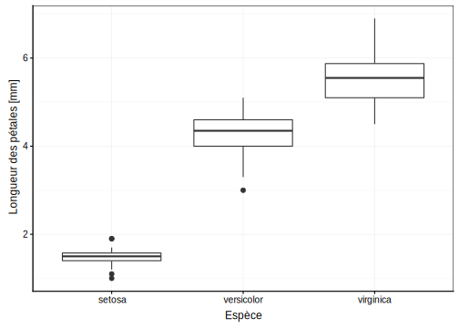
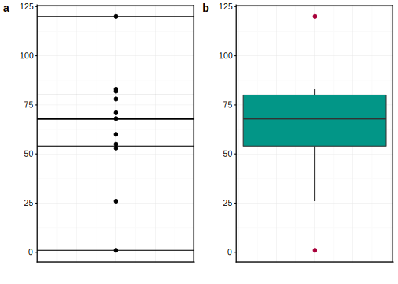

# Visualisation III {#visu3}


```r
SciViews::R
```

```
## ── Attaching packages ──────────────────────────────────────────────────────────── SciViews::R 1.0.1 ──
```

```
## ✔ SciViews  1.0.1       ✔ purrr     0.2.5  
## ✔ chart     1.1.0       ✔ readr     1.1.1  
## ✔ flow      1.0.0       ✔ tidyr     0.8.1  
## ✔ data      1.0.0       ✔ tibble    1.4.2  
## ✔ svMisc    1.1.0       ✔ ggplot2   3.0.0  
## ✔ forcats   0.3.0       ✔ tidyverse 1.2.1  
## ✔ stringr   1.3.1       ✔ lattice   0.20.35
## ✔ dplyr     0.7.6       ✔ MASS      7.3.50
```

```
## ── Conflicts ───────────────────────────────────────────────────────────────── tidyverse_conflicts() ──
## ✖ dplyr::filter() masks stats::filter()
## ✖ dplyr::lag()    masks stats::lag()
## ✖ dplyr::select() masks MASS::select()
```

```r
library(knitr)
library(flow)
library(chart)
library(data)

knitr::opts_chunk$set(echo=FALSE, results= 'hide', message=FALSE)
ToothGrowth <- read(file = "ToothGrowth", package = "datasets", lang = "fr")
data("PlantGrowth")
PlantGrowth <- read(file = "PlantGrowth", package = "datasets", lang = "fr")
iris <- read(file = "iris", package = "datasets", lang = "fr")
ChickWeight <- read(file = "ChickWeight", package = "datasets", lang = "fr")
urchin <- read(file = "urchin_bio", package = "data", lang = "fr")
diamonds <- data::read(file = "diamonds", package = "ggplot2", lang = "fr")
```


Vos objectif durant ce module sont :

- Savoir réaliser différents graphiques comme  le graphique en barre, le graphique en camembert ou encore la boite de dispersion, dans R avec la fonction `chart()`

- Savoir réaliser différentes variantes de plusieurs graphiques sur une fenêtre graphique. 

- Découvrir différents systèmes graphiques (graphiques de base, Lattice, ggplot2) et comparaison avec `chart()`

> TODO: changer le jeu de données par des données biologiques si possible


## Prérequis


Si ce n'est déjà fait, vous devez avoir réaliser le module 1 & 2.

> TODO : proposer une liste de matériel pédagogique supplémentaire pour aider à approfondir les prérequis, si nécessaire 

## Visualisation graphique à l'aide d'un graphique en barre

### Représentation d'un dénombration d'observations par facteur

Vous souhaitez représenter une dénombrement des différentes niveaux d'une variables facteurs. On peux exprimer dans R sous la forme

$$\sim variable \ facteur$$
que l'on peut lire 

$$\ en \ fonction \ de \ la \ variable \ facteur$$
<div class="figure">

<p class="caption">(\#fig:unnamed-chunk-1)Points essentiels d'un graphique en barre montrant le dénombrement des niveaux d'une variable facteur.</p>
</div>

Les instructions de base afin de produire un graphique en barre :

```
chart(DF, formula = ~factor(VAR)) +
  geom_bar()
```

La fonction `chart()` requiert comme argument le jeu de donnée (dataframe, DF), ainsi que la formule à employer ~factor(VAR). Pour réaliser un graphique en barre, vous devez ajouter la seconde fonction `geom_bar()`.

Les éléments indispensables à la compréhension d'un graphique en barre sont (ici mis en évidence en couleur) : 

- les axes avec les graduations (en rouge)
- le label en x  (en bleu)
- les niveaux de la variable facteur


#### Représentation d'un dénombrement d'observations par plusieurs facteurs

Différentes représentation sont possible pour observer des dénombrements tenant compte de plusieurs variables facteurs. Par défaut, l'argument  `position` a pour valeur `stack`.

<div class="figure">

<p class="caption">(\#fig:unnamed-chunk-2)Dénombrement de l'occurence en fonction de la variable facteur cut et de la variable clarity.</p>
</div>

Il existe d'autres solutions en utilisant la valeur `dodge` ou `fill` pour l'argument `position`.

<div class="figure">

<p class="caption">(\#fig:unnamed-chunk-3)A) Graphique en barre du dénombrement de l'occurence en fonction de la variable facteur cut et de la variable clarity avec  dodge comme valeur de l'argument position . B)  Graphique en barre du dénombrement de l'occurence en fonction de la variable facteur cut et de la variable clarity avec  fill comme valeur de l'argument position</p>
</div>

#### Pièges et Astuces

L'oeil humain perçoit plus distinctement les différences de tailles horizontales que verticales. Avec la fonction `coord_flip()` ajouté à votre graphique, vous pouvez ajouter une rotation des axes.

<div class="figure">

<p class="caption">(\#fig:unnamed-chunk-4) Graphique en barre du dénombrement de l'occurence en fonction de la variable facteur cut</p>
</div>
 
#### Pour en savoir plus 

- http://www.sthda.com/french/wiki/ggplot2-barplots-guide-de-demarrage-rapide-logiciel-r-et-visualisation-de-donnees

- http://ggplot2.tidyverse.org/reference/geom_bar.html

- http://ggplot.yhathq.com/docs/geom_bar.html


### Représentation d'une valeur moyenne à l'aide d'un graphe en barre. 

Le graphique en barre peut etre employé afin de résumer des données numériques via la moyenne. Il ne s'agit plus de dénombrer un nombre d'occurence d'une variable facteur mais de résumer des données numériques en fonction d'une variable facteur. On peut exprimer cette relation dans R sous la forme de $$y \sim x$$ que l'on peut lire : $$y \ en \ fonction \ de \ x$$ ou encore $$Variable \ numérique \ en \ fonction \ de \ Variable \ facteur$$ 

Prenez les chiffres suivants :

```
1, 71, 55, 68, 78, 60, 83, 120, 82 ,53, 26
```
Calculez la moyenne sur base de la formule de la moyenne $$\overline{y} = \sum_{i = 1}^n \frac{y_i}{n}$$


```r
# création du vecteur
x <- c(1, 71, 55, 68, 78, 60, 83, 120, 82, 53, 26)
# Calcul  de la moyenne
mean(x)
```

En partant d'un jeu de données, comme celui ci dessous


Vous pouvez observez que ce jeu de données comprend trois variables avec une première variable portant sur le longueur des dents de cochons d'Inde, une seconde variable portant sur la supplémentation administrée ( VC, vitamine Cou OJ, jus d'orange) à ces derniers et enfin une troisième variable portant sur la dose administrée (0.5, 1, 2).

Afin de réaliser ce graphe en barre, il est indispensable de remanier les données pour obtenir une valeurs moyenne de la croissance des dents en fonction de la variable facteur portant sur la dose.


```r
# Transformation de la variable numérique portant sur la dose en variable facteur portant sur la dose à 3 niveaux
ToothGrowth$dose <- as.factor(ToothGrowth$dose)
# formation d'un tableau résumé des données 
ToothGrowth %>.%
  group_by(., dose) %>.%
  summarise(., mean = mean(len) ) -> tg
```

En partant du jeu de données `ToothGrowth`, on groupe les données par rapport à la variable facteur `dose` avec la fonction `group_by()` puis de réaliser un résumé des données et de créer un nouveau jeu de données appelé `tg` avec la fonction `summarise()`. La nouvelle variable calculée est la moyenne de la longueur des dents avec la fonction `mean()`. 

<div class="figure">

<p class="caption">(\#fig:unnamed-chunk-8)Points essentiels d'un graphique en barre résumant les données numériques d'une variable facteur.</p>
</div>

Les instructions de base afin de produire ce graphe en barre sont :

```
chart(DF, formula = YNUM ~ factor(VAR)) +
  geom_col()
```


Les éléments indispensables à la compréhension d'un graphe en barre sont (ici mis en évidence en couleur) : 

- les axes avec les graduations (en rouge)
- les labels et unités des axes (en bleu) 


#### Pièges et astuces


Le graphe en barre est un graphique très répandu dans le domaine scientifique malgré le grand nombre d'arguments contre lui que vous pouvez lire dans la section `Pour en savoir plus`. L'un des arguments le plus important est la faible information qu'il apporte.

#### Pour en savoir plus 

- https://www.ncbi.nlm.nih.gov/pmc/articles/PMC3148365/ 

- https://www.r-bloggers.com/dynamite-plots-in-r/

- https://pablomarin-garcia.blogspot.com/2010/02/why-dynamite-plots-are-bad.html

- http://biostat.mc.vanderbilt.edu/wiki/pub/Main/TatsukiRcode/Poster3.pdf 

- http://emdbolker.wikidot.com/blog%3Adynamite

## Visualisation graphique à l'aide d'un graphique en camembert

Le graphique en camembert va vous permettre de visualiser un dénombrement d'observations par facteur, tout comme le graphique en barre. 

<div class="figure">

<p class="caption">(\#fig:unnamed-chunk-9)Points essentiels d'un graphique en camembert montrant le dénombrement des niveaux d'une variable facteur.</p>
</div>

Les instructions de base afin de produire ce graphe en camembert sont :

```
chart(DF, formula = ~ factor(1) %fill=% factor(VAR)) +
  geom_bar() +
  coord_polar("y")
```


Les éléments indispensables à la compréhension d'un graphe en camembert sont : 

- les niveaux de la variable facteur 

### Pièges et astuces

Le graphique en camembert est un graphique également fortement répandu. Cependant, l'oeil humain perçoit avec plus de précision les différences de formes que les différences d'angles. Un grand nombre de niveaux dans une variable facteur va avoir pour effet de remplir. De ce fait, il est donc déconseillé d'employer le graphique en camembert  

Partons d'un exemple fictif, combien d'observations pour la lettre h comptez vous ? 


<div class="figure">

<p class="caption">(\#fig:unnamed-chunk-10)Piège d'un graphique en camembert montrant le dénombrement des niveaux d'une variable facteur.</p>
</div>

Sur base de ce graphique en barre, combien d'observations pour la lettre h comptez vous ?

<div class="figure">

<p class="caption">(\#fig:unnamed-chunk-11)Piège d'un graphique en barre montrant le dénombrement des niveaux d'une variable facteur.</p>
</div>

### Pour en savoir plus 


- http://www.sthda.com/french/wiki/ggplot2-graphique-en-camembert-guide-de-demarrage-rapide-logiciel-r-et-visualisation-de-donnees

- https://dataparkblog.wordpress.com/2017/09/24/diagramme-en-camembert-avec-r-et-ggplot/

- https://www.displayr.com/why-pie-charts-are-better-than-bar-charts/

- http://www.perceptualedge.com/articles/08-21-07.pdf

## Visualisation graphique à l'aide de la boite de dispersion

Vous souhaitez représenter graphiquement cette fois un résumé d'une variable numérique tout en gardant un maximum d'information. La boite de dispersion est l'un des outils pouvant vous apporter la solution. Cette dernière va représenter graphiquement 5 descripteurs appelés les 5 nombres.

Prenez les chiffres suivants :

```
1, 71, 55, 68, 78, 60, 83, 120, 82 ,53, 26
```
ordonnez les de manière croissante


```r
# création du vecteur
x <- c(1, 71, 55, 68, 78, 60, 83, 120, 82, 53, 26)
# ordonner le vecteur
sort(x)
```

Le premier descripteur des 5 nombres est la médiane qui se situe à la moitié des observations.


```r
median(x)
```

Le premier quartile sera la valeur au milieu des 50% des données inférieurs à la médiane et le troisième quartile est la valeur centrale sur les 50% des données supérieurs à la médiane. La valeur manimale étant la valeur la plus petite et la valeurs maximale étant la valeur la plus élevée.


```r
fivenum(x)
```

Vous pouvez réprésenter ce vecteur via une boite de dispersion

<div class="figure">

<p class="caption">(\#fig:unnamed-chunk-15)Nuage de points montrant la première étape de la construction d'une boite de dispersion.</p>
</div>

La boite de dispersion représente donc les 5 nombres. Vous observez cependant que certaine valeur ne se situe pas dans la boite de dispersion, il s'agit de valeurs extrêmes. Elles sont considérées comme extrêmes car elles sont éloignées de plus 1.5 fois l'espace inter-quartile (Q3- Q1). La boite de dispersion s'arrete donc aux dernières valeurs présente dans  cet espace inter-quartile (IQR).

<div class="figure">

<p class="caption">(\#fig:unnamed-chunk-16)A) Nuage de points montrant la construction d'une boite de dispersion avec les 5 nombres représentés par des lignes noires. B) Boite de dispersion obtenue par rapport à la partie A.</p>
</div>

Les 5 nombres représentent de ce fait :

- Valeur minimale,
- Valeur du premier quartile,
- Valeur de la médiane (également appelée second quartile),
- Valeur du troisième quartile,
- Valeur maximale

<div class="figure">

<p class="caption">(\#fig:unnamed-chunk-17)Points essentiels d'une boite de dispersion</p>
</div>


Les instructions de base afin de produire ce graphe en camembert sont :

```
chart(DF, formula = ~ factor(1) %fill=% factor(VAR)) +
  geom_bar() +
  coord_polar("y")
```


Les éléments indispensables à la compréhension d'un graphe en camembert sont : 

- les niveaux de la variable facteur 

#### Représentation de boites de dispersion par une variable facteurs à plusieurs niveaux

<div class="figure">

<p class="caption">(\#fig:unnamed-chunk-18)Boite de dispersion de la longueur de pétales de trois espèces d'iris.</p>
</div>


### Pièges et Astuces

Lors de la réalisation de boites de dispersion, vous devez être vigilant au nombre d'observation qui se cache sous chaque boite de dispersion. En effet, une boite de dispersion ne comportant que 5 valeurs ou moins n'a que peut d'intérêt d'être avec cet outils graphique. 

<div class="figure">

<p class="caption">(\#fig:unnamed-chunk-19)Piège des boites de dispersion.</p>
</div>

La boite de dispersion "a" ne contient que 4 observations ce qui peut être totalement masqué par l'utilisation de boite de dispersion.

### Pour en savoir plus ! 

- http://www.sthda.com/french/wiki/ggplot2-box-plot-guide-de-demarrage-rapide-logiciel-r-et-visualisation-de-donnees

- https://plot.ly/ggplot2/box-plots/

- http://www.r-graph-gallery.com/265-grouped-boxplot-with-ggplot2/

- https://chemicalstatistician.wordpress.com/2013/08/12/exploratory-data-analysis-the-5-number-summary-two-different-methods-in-r-2/


## Visualisation de multi-graphiques

Lorsque vous souhaitez représenter plusieurs graphiques sur une seule fenêtre graphique plusieurs fonctions sont à votre disposition. Il faut tout d'abord distinguer deux types de multi-graphiques. Soit il s'agit d'un seul graphique que vous souhaitez subdiviser par rapport à une ou deux  variables facteurs. Soit il s'agit de graphiques indépendants que vous souhaitez représenter sur le même fenêtre graphique. Dans le premier cas, la fonction `facet_grid()` du package `ggplot2` peut être employé. Dans le second cas, la fonction `plot_grid()` du package `cowplot` est l'une des alternatives possibles.

### `facet_grid()`

L'une des règles les plus importantes que vous devez impérativement garder à l'eprit lors de la réalisation de vos graphiques est *la simplicité*. Plus votre graphique va contenir d'information au plus il sera compliqué à être décodé par un collaborateur. 

<div class="figure">

<p class="caption">(\#fig:unnamed-chunk-20)Nuage de point montrant la variation de la masse de poulets au cours du temps.</p>
</div>

Le graphique ci-dessus peut par exemple être simplifié avec la fonction `facet_grid()`. L'information que l'on souhaite partager est la même mais les choix graphiques rendent sa lecture plus aisée. De plus, la fentre graphique a la même taille par défault que pour un seul graphique. De ce fait, réaliser de multiples graphiques peut rendre sa lecture impossible par une taille trop faible.

<div class="figure">

<p class="caption">(\#fig:unnamed-chunk-21)Nuage de point montrant la variation de la masse de poulets au cours du temps en fonction de la supplémention (1-4).</p>
</div>

Vous observez que les échelles en abscisse et en ordonnée sont similaires. Cela permet une meilleure comparaison.

### `ggarrange()`

<div class="figure">

<p class="caption">(\#fig:unnamed-chunk-22)A) Nuage de point montrant la variation de la masse d'oursins en fonction de la taille  et de leur origine. B) Nuage de point montrant la variation de la masse d'oursins en fonction de la masse des parties solides et de leur origine.</p>
</div>

### A vous de jouer !

Chargez le package `BioDataScience` + accès direct au learnR (à faire, package en cours de développement sur [github](https://github.com/BioDataScience-Course/BioDataScience))


#### Pour en savoir plus ! 

- http://www.sthda.com/french/wiki/ggplot2-facet-diviser-un-graphique-en-plusieurs-panneaux-logiciel-r-et-visualisation-de-donnees

- http://www.cookbook-r.com/Graphs/Multiple_graphs_on_one_page_(ggplot2)/

- http://lightonphiri.org/blog/ggplot2-multiple-plots-in-one-graph-using-gridextra

- https://cran.r-project.org/web/packages/cowplot/vignettes/plot_grid.html

- http://www.sthda.com/english/rpkgs/ggpubr/reference/ggarrange.html 


## Aperçu des différents systèmes graphiques

Depuis le début, l'ensemble des graphiques que nous vous avons proposé utilise la fonction `chart()` du package `chart`. Cependant, il ne s'agit pas du seul outil outils permettant de réaliser des graphiques dans R. 


<div class="figure">

<p class="caption">(\#fig:unnamed-chunk-23)Nuage de point montrant la variation de la taille en fonction du poids d'oursins et de leur origine avec le système graphique chart().</p>
</div>

Voici d'autres alternatives que sont 

- R de base

<div class="figure">

<p class="caption">(\#fig:unnamed-chunk-24)Nuage de point montrant la variation de la taille en fonction du poids d'oursins et de leur origine avec le système graphique  r de base.</p>
</div>

- lattice

<div class="figure">

<p class="caption">(\#fig:unnamed-chunk-25)Nuage de point montrant la variation de la taille en fonction du poids d'oursins et de leur origine avec le système graphique lattice.</p>
</div>

- ggplot2

<div class="figure">

<p class="caption">(\#fig:unnamed-chunk-26)Nuage de point montrant la variation de la taille en fonction du poids d'oursins et de leur origine avec le système graphique ggplot2.</p>
</div>

Vous observez rapidement certaines similitudes entre `chart`, `ggplot2` et `lattice`. En effet, la package `chart` a pour but premier de combiner les meilleures outils présent dans chacun des modes graphiques présentés ci-dessus. 

- http://r4ds.had.co.nz/data-visualisation.html 

- https://flowingdata.com/2016/03/22/comparing-ggplot2-and-r-base-graphics/

- https://learnr.wordpress.com/2009/08/26/ggplot2-version-of-figures-in-lattice-multivariate-data-visualization-with-r-final-part/

- https://www.statmethods.net/advgraphs/trellis.html

- https://www.r-bloggers.com/conditioning-and-grouping-with-lattice-graphics/

- http://bl.ocks.org/patilv/raw/7360425/

- http://www.sthda.com/english/wiki/scatter-plots-r-base-graphs


## A vous de jouer !

Chargez le package `BioDataScience` + accès direct au learnR (à faire, package en cours de développement sur [github](https://github.com/BioDataScience-Course/BioDataScience))
