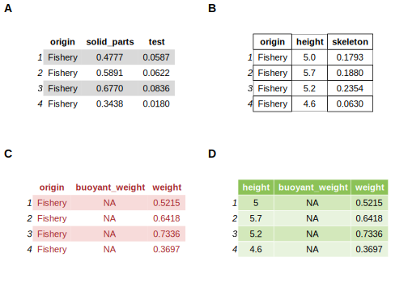
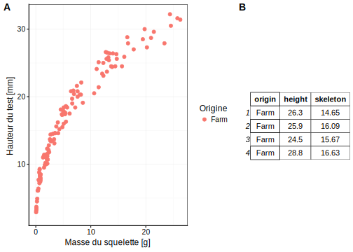
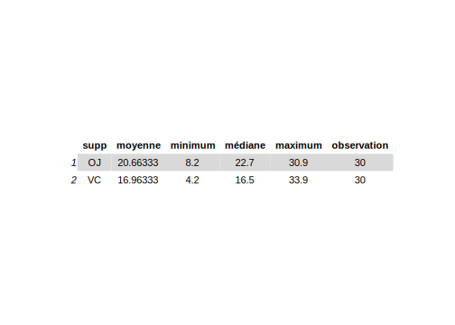

# Importation/transformation des données {#import}


#### Objectifs {-}

- Savoir importer des données via la fonction `read()`, ainsi qu'appréhender ses arguments.

- Appréhender les types de variables et l'importance d'encoder convenablement les variables.

- Savoir remanier des données afin d'extraire l'information importante d'un jeu de données.

#### Prérequis {-}

Si ce n'est déjà fait, vous devez avoir réaliser le module 1 ainsi que les modules liés à la visualisation des données.

## Importation des données

Afin de réaliser l'analyse de vos résultats vous devez commencer par importer correctement vos données. Il existe une multitude de fonction pour réaliser l'importation de divers formats de fichiers. La fonction `read()` du package `data.io` est l'une d'entre-elles. 

Durant les précédents modules, vous avez employé cette fonction pour importer vos jeux de données. Reprennons un exemple pour détailler cette fonction.


```r
(biometry <- read("biometry", package = "BioDataScience", lang = "fr"))
```

```
# # A tibble: 395 x 7
#    gender day_birth  weight height wrist year_measure   age
#    <fct>  <date>      <dbl>  <dbl> <dbl>        <dbl> <dbl>
#  1 M      1995-03-11     69    182  15           2013    18
#  2 M      1998-04-03     74    190  16           2013    15
#  3 M      1967-04-04     83    185  17.5         2013    46
#  4 M      1994-02-10     60    175  15           2013    19
#  5 W      1990-12-02     48    167  14           2013    23
#  6 W      1994-07-15     52    179  14           2013    19
#  7 W      1971-03-03     72    167  15.5         2013    42
#  8 W      1997-06-24     74    180  16           2013    16
#  9 M      1972-10-26    110    189  19           2013    41
# 10 M      1945-03-15     82    160  18           2013    68
# # ... with 385 more rows
```

La fonction `read()` du package `data.io` assigne à **biometry** le jeu de données **biometry** présent dans le package **BioDataScience**. Il est également spécifié que la langue souhaitée est le français avec l'argument **lang = "fr"**. 

Lorsque vous vous retrouvez confrontés à devoir importer de nouvelles données dans R, vous devez vous poser les deux questions suivantes :

- Où ces données sont stockées ? 

Les données peuvent provenir de multiples endroits. Vous avez pu vous observer dans les modules précédents que les données peuvaientt être dans un package (par exemple le jeu de données **biometry** dans le package **BioDataScience**). Vous avez également pu observer que les données pouvait se retrouver sur votre disque, dans un dossier de votre ordinateur (par exemple, le jeu de données biometry_2014.xlsx lors de la comparaison des workflow entre Excell-Word et R-Rmarkdown). Les données peuvent également provenir d'un lien url (par exemple lors d'encodage de données collaboratives sur Google Sheets) ou d'une base de données.

La fonction read() permet d'importer des données sur votre disque, depuis un URL ou encore depuis un package. Elle unifie donc 3 méthodes bien distinctes.

- Quels est le format de vos données ? 

Les données peuvent être sauvegardées avec différents formats comme csv, xlsx ou encore txt. Une multitude de formats existe avec des avantages et inconvénients que nous ne developperons pas dans cette section.

La fonction **read()** supporte néanmoins 32 formats de fichier différents en utilisant en interne des fonctions provenant de différents packages dans R. Elle permet donc d'unifier ces différents outils d'importations des données :


```r
getOption("read_write")
```

```
# # A tibble: 32 x 5
#    type  read_fun      read_header    write_fun      comment              
#    <chr> <chr>         <chr>          <chr>          <chr>                
#  1 csv   readr::read_… data.io::hrea… readr::write_… comma separated valu…
#  2 csv2  readr::read_… data.io::hrea… <NA>           semicolon separated …
#  3 xlcsv readr::read_… data.io::hrea… readr::write_… write a CSV file mor…
#  4 tsv   readr::read_… data.io::hrea… readr::write_… tab separated values 
#  5 fwf   readr::read_… data.io::hrea… <NA>           fixed width file     
#  6 log   readr::read_… <NA>           <NA>           standard log file    
#  7 rds   readr::read_… <NA>           readr::write_… R data file (no comp…
#  8 txt   readr::read_… <NA>           readr::write_… text file (as length…
#  9 raw   readr::read_… <NA>           <NA>           binary file (read as…
# 10 ssv   readr::read_… data.io::hrea… <NA>           space separated valu…
# # ... with 22 more rows
```


### Données sur le disque 

La fonction read() vous permet d'importer de nombreux formats de fichiers comme expliqué précédement toute la difficulté va donc être dans la localisation de votre fichier sur votre ordinateur. Vous allez devoir spécifier le chemin d'accès de vos données.

Le chemin d'accès à votre fichier peut s'écrire de manière absolue ou bien de manière relative. **Vous devez tant que possible employer des chemins relatifs.** Les projets dans RStudio définissent un environnement de travail comme vu dans le module 1. Ces projets sont amenés à être employé par différents collaborateurs. Il est donc indispensable que votre projet soit **portable**.

Un projet RStudio pourra être qualifié de **portable** s'il est possible de déplacer le répertoire de base du projet et tout ce qu'il contient (ou le renommer) sans que les analyses effectuées dans R n'en soient affectées. Ceci est utile pour copier, par exemple, le projet d'un PC à un autre, ou si vous décidez de restructurer vos fichiers sur le disque dur.

La démonstration va être effectuée sur base du projet sdd1_biometry qui vous avez traité lors de la comparaison des workflows.

Votre projet s'organise comme ceci et se trouve dans le dossier project du dossier shared :

```
/home
  /sv
    /shared
      /projects
        /sdd1_biometry                 # Le répertoire de base du projet
          sdd1_biometry.Rproj          # Fichier de configuration du projet créé par RStudio
          /data                      # Le dossier avec les données de départ
            biometry_2014.xlsx       # Un jeu de données au format xlsx sur la biométrie humaine
          /analysis                  # Un dossier pour les rapports d'analyse
            biometry.nb.html  # Vue HTML du rapport générée automatiquement
            biometry.Rmd      # Un premier rapport au format R Notebook 
```

Afin de définir la position de votre fichiers `biometry_2014.xlsx`, vous devez simplement lister l'ensemble de dossier. Il s'agit du chemin absolu , de la position de votre fichier sur votre ordinateur. Ce format n'est pas du tout portable

```
/home/sv/shared/projects/sdd1_biometry/data/biometry_2014.xlsx 
```

Ce chemin est plus portable que le précédent et le tild représente le dossier utilisateur. 

```
~/shared/projects/sdd1_biometry/data/biometry_2014.xlsx
```
Comme rapellez ci-dessus, les projets dans RStudio définissent un environnement de travail. Vous devez déterminer le chemin relatif en fonction du répertoire actif dans un projet R studio, c'est le projet lui même qui est le répertoire actif. 

```
data/biometry_2014.xlsx
```

Afin de passer d'un chemin absolu à un chemin relatif vous devez :

- connaitre le répertoire actif 
- utiliser le `/` pour rentrer dans un dossier 
- utiliser le `../` pour sortir d'un dossier

Pour obtenir une explication complète et détaillée sur l'utilisation des chemins relatifs dans l'organisation d'un projet Rstudio, lisez le tutoriel : **"Tutoriel SDD-UMONS : La gestion des fichiers dans un projet et les chemins relatifs"**

#### Pièges et astuces

L'utilisation des chemins relatifs est indispensable comme expliqués ci-dessus. Lors de vos travaux organisé en plusieurs projets cohérents vous serez amené à travailler principalement dans des fichiers de type **Rscript** ou des fichiers **R notebook** ou encore **R markdown**.

**Notez ceci**

- Le **Rscript** utilise comme référence afin de définir la position d'un jeu de données (ou tous autres fichiers) dans un projet, la position de projet R studio. 

```
data/biometry_2014.xlsx
```

- Le **R notebook** ou R markdown utilise comme référence afin de définir le chemin d'accès d'un jeu de données (ou tous autres fichiers) dans un projet, sa propre position.

```
../data/biometry_2014.xlsx
```

L'utilisation des chemins d'accès relatifs respecte les mêmes principes pour l'insertion d'une image par exemple.

### Données provenant d'un url

Il existe différents programmes qui permettent d'éditer des tableaux de données en ligne et de les transmettre simplement. [Google Sheet](https://www.google.com/intl/fr_BE/sheets/about/) est l'un de ces programmes. 


Partez de l'url suivant :

- <https://docs.google.com/spreadsheets/d/1iEuGrMk4IcCkq7gMNzy04DkSaPeWH35Psb0E56KEQMw/edit?usp=sharing>

Il s'agit d'un tableau de données portant sur la croissance de différentes espèces de coraux. Ce tableau de données peut être transmis sous la forme d'un tableau csv que la fonction **read()** peut importer. 

remarque : le lien founit ne permet pas de modifier les données fournie, ce paramètre peut très simplement être modifié.


```r
coral <- read("https://docs.google.com/spreadsheets/d/e/2PACX-1vSxqegwJVjO0PxIs7mObr0syeYwNdpvd25AWUoWkwocQexYUqQUK0hC57NwsypQQUDnsJLiR-hxzSFA/pub?gid=0&single=true&output=csv", type = "csv")
```

```
# Parsed with column specification:
# cols(
#   localisation = col_character(),
#   species = col_character(),
#   id = col_integer(),
#   growth_day = col_double()
# )
```

```r
# Visualisation des premières ligne du tableau de données
head(coral)
```

```
# # A tibble: 6 x 4
#   localisation species      id growth_day
#   <chr>        <chr>     <int>      <dbl>
# 1 A0           s.hystrix     1       1.44
# 2 A0           s.hystrix     2       1.82
# 3 A0           s.hystrix     3       1.66
# 4 A0           s.hystrix     4       1.16
# 5 A0           s.hystrix     5       1.72
# 6 A0           s.hystrix     6       1.65
```

### Données provenant d'un package

Les packages que l'on peut assimiler à des boites à outils dans R que vous employer à chaque utilisation sur le programme comme **data.io**, **chart** ou encore **flow**, sont pour certains composés de jeux de données. La fonction `read()` permet également de les importer.

Précédement, une seule fonction était employé pour importer ces données. Il s'agissait de la fonction `data()`.


```r
# Chargement de package
library(data.io)
# Appel du jeu de données
data(urchin_bio)
# Visualisation des premières ligne du jeu de données
head(urchin_bio)
```

```
#    origin diameter1 diameter2 height buoyant_weight weight solid_parts
# 1 Fishery       9.9      10.2    5.0             NA 0.5215      0.4777
# 2 Fishery      10.5      10.6    5.7             NA 0.6418      0.5891
# 3 Fishery      10.8      10.8    5.2             NA 0.7336      0.6770
# 4 Fishery       9.6       9.3    4.6             NA 0.3697      0.3438
# 5 Fishery      10.4      10.7    4.8             NA 0.6097      0.5587
# 6 Fishery      10.5      11.1    5.0             NA 0.6096      0.5509
#   integuments dry_integuments digestive_tract dry_digestive_tract gonads
# 1      0.3658              NA          0.0525              0.0079      0
# 2      0.4447              NA          0.0482              0.0090      0
# 3      0.5326              NA          0.0758              0.0134      0
# 4      0.2661              NA          0.0442              0.0064      0
# 5      0.4058              NA          0.0743              0.0117      0
# 6      0.4269              NA          0.0492              0.0097      0
#   dry_gonads skeleton lantern   test spines maturity  sex
# 1          0   0.1793  0.0211 0.0587 0.0995        0 <NA>
# 2          0   0.1880  0.0205 0.0622 0.1053        0 <NA>
# 3          0   0.2354  0.0254 0.0836 0.1263        0 <NA>
# 4          0   0.0630  0.0167 0.0180 0.0283        0 <NA>
# 5          0       NA      NA     NA     NA        0 <NA>
# 6          0       NA      NA     NA     NA        0 <NA>
```

La fonction read() est capable d'importer ces données en une seule instruction. 


```r
# Importation de données provenant d'un package
urchin <- read("urchin_bio", package = "data.io")
# Visualisation des premières ligne du jeu de données
head(urchin)
```

```
# # A tibble: 6 x 19
#   origin diameter1 diameter2 height buoyant_weight weight solid_parts
#   <fct>      <dbl>     <dbl>  <dbl>          <dbl>  <dbl>       <dbl>
# 1 Fishe…       9.9      10.2    5               NA  0.522       0.478
# 2 Fishe…      10.5      10.6    5.7             NA  0.642       0.589
# 3 Fishe…      10.8      10.8    5.2             NA  0.734       0.677
# 4 Fishe…       9.6       9.3    4.6             NA  0.370       0.344
# 5 Fishe…      10.4      10.7    4.8             NA  0.610       0.559
# 6 Fishe…      10.5      11.1    5               NA  0.610       0.551
# # ... with 12 more variables: integuments <dbl>, dry_integuments <dbl>,
# #   digestive_tract <dbl>, dry_digestive_tract <dbl>, gonads <dbl>,
# #   dry_gonads <dbl>, skeleton <dbl>, lantern <dbl>, test <dbl>,
# #   spines <dbl>, maturity <int>, sex <fct>
```

La fonction `read()` requiert comme premier argument le nom du jeu de données (e.g. `"iris"` ou `"urchin_bio"`), suivi de l'argument `package=` (e.g. `"datasets"`, ou `"data.io"`), suivi de l'argument `lang=` (e.g. `"fr"`) qui définit la langue d'intérêt.  

L'instruction ci-dessous permet d'obtenir une liste de l'ensemble des jeux de données présent dans un package.


```r
read(package = "data.io")
```


### Pièges et astuces

#### Langue du jeu de données

La fonction **read()** a l'avantage de pouvoir employer un fichier annexe pour ajouter simplement les labels et les unités en différentes langues. Certains jeux de données comme le jeu de données de **urchin_bio** du package **data.io** possèdent ces fichiers annexes.

Lorsque l'on importe le jeu de données avec la fonction data(), les fichiers annexes ne sont pas employé.


```r
# Chargement des données
data("urchin_bio")
# Visualisation des données
chart(urchin_bio, height ~ weight %col=% origin) +
  geom_point()
```


Ces fichiers annexes sont par contre employé par la fonction **read()** pour ajouter les labels et unités au tableau de données. Certaines fonctions comme **chart()** sont capables d'employer ces labels et unités. 


```r
# Importation du tableau de données avec l'argument lang qui varie.
urchin <- read("urchin_bio", package = "data.io")
urchin_en <- read("urchin_bio", package = "data.io", lang = "en")
urchin_fr <- read("urchin_bio", package = "data.io", lang = "fr")
urchin_FR <- read("urchin_bio", package = "data.io", lang = "FR")
```

L'arguement lang permet de spécifier la langue souhaitée. Les différences dans les labels sont observables sur le graphique ci-dessous.


```r
# Réalisation graphique
a <- chart(urchin, height ~ weight %col=% origin) +
  geom_point()
b <- chart(urchin_en, height ~ weight %col=% origin) +
  geom_point()
c <- chart(urchin_fr, height ~ weight %col=% origin) +
  geom_point()
d <- chart(urchin_FR, height ~ weight %col=% origin) +
  geom_point()
# Combinaison des graphiques
combine_charts(chartlist = list(a, b, c, d))
```


 
- A & B: l'argument lang par défaut est **lang = "en"**. Il ajoute les lables et unités en  anglais avec les unités dans le système international.
- C : l'argument **lang = "fr"** ajoute les labels et unités en français. Il laisse cependant les niveaux des variables facteurs en anglais (Farm et Fishery).
- D : l'argument **lang= "FR"** ajoute les lables et unités en français. Dr plus, il traduit également les niveaux des variables facteurs.

Il vous est conseillé d'employé l'argument **lang="fr"** lors de vos différents travaux. La langues international en science est l'anglais et vous serez très certainement amené dans votre carrière scientifique de produire des documents en français et en anglais. L'utilisation de **lang= "FR"** rend le code uniquement utilisable dans ces conditions. Observez les exemples proposés ci-dessous.


```r
urchin_en %>.%
  filter(., origin == "Farm") %>.%
  head(.)
```

```
# # A tibble: 6 x 19
#   origin diameter1 diameter2 height buoyant_weight weight solid_parts
#   <fct>      <dbl>     <dbl>  <dbl>          <dbl>  <dbl>       <dbl>
# 1 Farm        53.1      54.5   26.3           9.57   60.2        41.7
# 2 Farm        52.7      52.7   25.9          10.8    63.2        46.6
# 3 Farm        54        54.2   24.5          10.7    64.4        44.3
# 4 Farm        51.1      51.3   28.8          11.2    62.4        45.0
# 5 Farm        52.1      53.6   31.2          11.1    63.7        44.0
# 6 Farm        52.3      51.4   28.6          12.4    68.6        53.9
# # ... with 12 more variables: integuments <dbl>, dry_integuments <dbl>,
# #   digestive_tract <dbl>, dry_digestive_tract <dbl>, gonads <dbl>,
# #   dry_gonads <dbl>, skeleton <dbl>, lantern <dbl>, test <dbl>,
# #   spines <dbl>, maturity <int>, sex <fct>
```


```r
urchin_fr %>.%
  filter(., origin == "Farm") %>.%
  head(.)
```

```
# # A tibble: 6 x 19
#   origin diameter1 diameter2 height buoyant_weight weight solid_parts
#   <fct>      <dbl>     <dbl>  <dbl>          <dbl>  <dbl>       <dbl>
# 1 Farm        53.1      54.5   26.3           9.57   60.2        41.7
# 2 Farm        52.7      52.7   25.9          10.8    63.2        46.6
# 3 Farm        54        54.2   24.5          10.7    64.4        44.3
# 4 Farm        51.1      51.3   28.8          11.2    62.4        45.0
# 5 Farm        52.1      53.6   31.2          11.1    63.7        44.0
# 6 Farm        52.3      51.4   28.6          12.4    68.6        53.9
# # ... with 12 more variables: integuments <dbl>, dry_integuments <dbl>,
# #   digestive_tract <dbl>, dry_digestive_tract <dbl>, gonads <dbl>,
# #   dry_gonads <dbl>, skeleton <dbl>, lantern <dbl>, test <dbl>,
# #   spines <dbl>, maturity <int>, sex <fct>
```


```r
urchin_FR %>.%
  filter(., origin == "Pêcherie") %>.%
  head(.)
```

```
# # A tibble: 6 x 19
#   origin diameter1 diameter2 height buoyant_weight weight solid_parts
#   <fct>      <dbl>     <dbl>  <dbl>          <dbl>  <dbl>       <dbl>
# 1 Pêche…       9.9      10.2    5               NA  0.522       0.478
# 2 Pêche…      10.5      10.6    5.7             NA  0.642       0.589
# 3 Pêche…      10.8      10.8    5.2             NA  0.734       0.677
# 4 Pêche…       9.6       9.3    4.6             NA  0.370       0.344
# 5 Pêche…      10.4      10.7    4.8             NA  0.610       0.559
# 6 Pêche…      10.5      11.1    5               NA  0.610       0.551
# # ... with 12 more variables: integuments <dbl>, dry_integuments <dbl>,
# #   digestive_tract <dbl>, dry_digestive_tract <dbl>, gonads <dbl>,
# #   dry_gonads <dbl>, skeleton <dbl>, lantern <dbl>, test <dbl>,
# #   spines <dbl>, maturity <int>, sex <fct>
```

## Type de variables

Lors de la réalisation de graphiques dans les modules précédents vous avez compris que toutes les variables ne se valait pas dans R. 


```r
(biometry <- read("biometry", package = "BioDataScience", lang = "fr"))
```

```
# # A tibble: 395 x 7
#    gender day_birth  weight height wrist year_measure   age
#    <fct>  <date>      <dbl>  <dbl> <dbl>        <dbl> <dbl>
#  1 M      1995-03-11     69    182  15           2013    18
#  2 M      1998-04-03     74    190  16           2013    15
#  3 M      1967-04-04     83    185  17.5         2013    46
#  4 M      1994-02-10     60    175  15           2013    19
#  5 W      1990-12-02     48    167  14           2013    23
#  6 W      1994-07-15     52    179  14           2013    19
#  7 W      1971-03-03     72    167  15.5         2013    42
#  8 W      1997-06-24     74    180  16           2013    16
#  9 M      1972-10-26    110    189  19           2013    41
# 10 M      1945-03-15     82    160  18           2013    68
# # ... with 385 more rows
```

Ce graphique combiné ci-dessous montre de boites de dispersion. 


```r
a <- chart(biometry, height ~ gender %fill=% gender) +
  geom_boxplot() 

b <- chart(biometry, height ~ weight %fill=% gender) +
  geom_boxplot()

combine_charts(chartlist = list(a,b), common.legend = TRUE)
```

```
# Warning: position_dodge requires non-overlapping x intervals
```


Les jeux de données sont une suite de variables mises côte à côte. Vous avez à votre disposition plusieurs type de variables pour personnaliser le jeu de données : 

- nombre :
    + numérique (continu) : `numeric`
    + entiers (discret) : `integer`
    + valeur arrondie : `double`
    + nombre complexe : `complex`

Il s'agit des valeurs numériques qui vont composer une variable du jeux de données. Si une variable numérique ne l'est pas vous pouvez la tranformer avec l'instruction suivante :

- caractères : `character`

Il s'agit de chaine de charactères qui vont composer une variable du jeux de données. Les chaines de caractères vont avoir 2 but. Soit il s'agit d'une information ayant pour objectif d'être employé comme variable facteur ou bien il s'agit d'une information complémentaire sur les observations qui ne sera pas employer dans l'analyse des données. Cependant, vous pouvez être amené à transformer une variable en caractère avec l'instruction suivante :

- facteur : `factor`

Il s'agit d'une variable permettant de discriminer des observations avec un ensemble de niveau dans un jeu de données comme la variable portant sur l'origine du tableau de donnés urchin.

- Date : `date`

Le date dans un jeu de données sont proposé sous le format date.

La fonction `skim()` du package `skimr` permet de visualiser le type de la variable et bien plus encore. Il fournit une visualisation différentes en fonction du type de la variable. Il propose par exemple un histogramme pour les variables numériques comme le montre le tableau ci-dessous


```r
skimr::skim(biometry)
```

```
# Skim summary statistics
#  n obs: 395 
#  n variables: 7 
# 
# ── Variable type:Date ──────────────────────────────────────────────────────────────────────────────────────────
#   variable missing complete   n        min        max     median n_unique
#  day_birth       0      395 395 1927-08-29 2000-08-11 1988-10-05      210
# 
# ── Variable type:factor ────────────────────────────────────────────────────────────────────────────────────────
#  variable missing complete   n n_unique            top_counts ordered
#    gender       0      395 395        2 M: 198, W: 197, NA: 0   FALSE
# 
# ── Variable type:numeric ───────────────────────────────────────────────────────────────────────────────────────
#      variable missing complete   n    mean    sd     p0    p25    p50  p75
#           age       0      395 395   35.34 17.32   15     19     27     50
#        height       0      395 395  170.71  9.07  146    164    171    177
#        weight       0      395 395   71.2  15.45   41.5   59     69.3   80
#         wrist       2      393 395   16.65  1.67   10     15.5   16.5   18
#  year_measure       0      395 395 2015.32  1.61 2013   2014   2016   2017
#  p100     hist
#    89 ▇▂▁▅▂▁▁▁
#   193 ▁▂▆▆▇▅▃▁
#   131 ▂▇▇▆▂▁▁▁
#    23 ▁▁▂▇▇▂▁▁
#  2017 ▅▅▁▁▁▅▁▇
```
Avec une seule instruction, on obtient une quantité d'information sur notr jeu de données comme le nombre d'observation, le nombre de variables et un traitement spécifique pour chaque type de variable. 

Cet instruction permet de visualiser et d'appréhender le jeu de données mais ne doit pas figurer tel quel dans un rapport d'analyse. 

#### Pièges et astuces


```r
tooth <- read("ToothGrowth", package = "datasets", lang = "fr")
```

Le jeu de données comprend 60 observations sur la croissance de dents de cochons d'inde. Ces derniers reçoivent 2 types de suppléments soit du jus d'orange (OC) ou de la vitamine C (VC). Ils recoivent trois doses 0.5, 1, 2 mg/jour. VOus pouvez observer les données avec la fonction **skim()**.


```r
skimr::skim(tooth)
```

```
# Skim summary statistics
#  n obs: 60 
#  n variables: 3 
# 
# ── Variable type:factor ────────────────────────────────────────────────────────────────────────────────────────
#  variable missing complete  n n_unique            top_counts ordered
#      supp       0       60 60        2 OJ: 30, VC: 30, NA: 0   FALSE
# 
# ── Variable type:numeric ───────────────────────────────────────────────────────────────────────────────────────
#  variable missing complete  n  mean   sd  p0   p25   p50   p75 p100
#      dose       0       60 60  1.17 0.63 0.5  0.5   1     2     2  
#       len       0       60 60 18.81 7.65 4.2 13.07 19.25 25.27 33.9
#      hist
#  ▇▁▇▁▁▁▁▇
#  ▃▅▃▅▃▇▂▂
```

La variable dose est encodée sous la forme de variable numérique alors que cette dernière doit être sous la forme de facteur. **Vous devez recoder cette variable.**


```r
tooth$dose <- as.factor(tooth$dose)
# Visualisation des données
skimr::skim(tooth)
```

```
# Skim summary statistics
#  n obs: 60 
#  n variables: 3 
# 
# ── Variable type:factor ────────────────────────────────────────────────────────────────────────────────────────
#  variable missing complete  n n_unique
#      dose       0       60 60        3
#      supp       0       60 60        2
#                                        top_counts ordered
#                      0.5: 20, 1: 20, 2: 20, NA: 0   FALSE
#  OJ: 30, VC: 30, NA: 0                              FALSE
# 
# ── Variable type:numeric ───────────────────────────────────────────────────────────────────────────────────────
#  variable missing complete  n  mean   sd  p0   p25   p50   p75 p100
#       len       0       60 60 18.81 7.65 4.2 13.07 19.25 25.27 33.9
#      hist
#  ▃▅▃▅▃▇▂▂
```

Vous pouvez cependant aller encore plus loin car la variable est une variable facteur et plus précisement une variable facteur ordonée. Il y a une progression dans les doses administrées.  Prenez la variable dose du jeu de données `tooth`. Etant donné qu'il s'agit de doses croissantes administrées à des cochons d'Inde, cette variable doit donc être une variable ordonnée.


```r
tooth$dose <- as.ordered(tooth$dose)
# Visualisation des données
skimr::skim(tooth)
```

```
# Skim summary statistics
#  n obs: 60 
#  n variables: 3 
# 
# ── Variable type:factor ────────────────────────────────────────────────────────────────────────────────────────
#  variable missing complete  n n_unique
#      dose       0       60 60        3
#      supp       0       60 60        2
#                                        top_counts ordered
#                      0.5: 20, 1: 20, 2: 20, NA: 0    TRUE
#  OJ: 30, VC: 30, NA: 0                              FALSE
# 
# ── Variable type:numeric ───────────────────────────────────────────────────────────────────────────────────────
#  variable missing complete  n  mean   sd  p0   p25   p50   p75 p100
#       len       0       60 60 18.81 7.65 4.2 13.07 19.25 25.27 33.9
#      hist
#  ▃▅▃▅▃▇▂▂
```

La fonction **as.factor()** et la fonction **as.ordered** dérive de la fonction **factor()**.

La variable facteur ordonnée est reconnue par une ensemble de fonction dans R. Elle ne sera de ce fait pas traitée de la même manière qu'une variable facteur non ordonnée. 

## Remaniement des données

Lors du module IV, vous avez réalisé votre premier remaniement de données afin de réaliser un graphique en barre résumant une variable numérique en fonction d'une variable facteur. 

Le principale remaniement des données peut être réalisé en 4 grands piliers :

- sélectionner des colonnes au sein d'un jeu de données `select()`

- filtrer des lignes dans un jeu de données `filter()`

- calculer de nouvelles variables dans un jeu de donées `mutate()`

- Résumer de colonnes d'un jeu de données initiale `summarise()`

Ces grands piliers ont été défini dans le [chapitre 5 de  R for Datascience](http://r4ds.had.co.nz/transform.html)

### `select()`

Lors de l'utilisation vos jeux de données, vous serez amené à réduire vos jeux de données en sous tableau.


```r
tg <- read("ToothGrowth", package = "datasets", lang = "fr")
```


```r
urchin <- read("urchin_bio", package = "data.io", lang = "fr")
```

Vous vous intéressez dans votre analyse uniquement à certaines variables. La fonction `select()` et les fonctions d'aide à la selection (`?select_helpers`) vous apportent la solution à vos besoins.


```r
urchin1 <- select(urchin, origin, solid_parts, test)
urchin2 <- select(urchin, c(1,4,14))
urchin3 <-  select(urchin, origin, contains("weight"))
urchin4 <- select(urchin, ends_with("ht"))
```

Les tableaux de données réduits sont proposé ci-dessous avec la fonction combine_charts(). La mise en forme des tableaux de données est réalisée avec la fontion **ggtexttable()** du package **ggpubr**.


```r
u1 <- ggtexttable(head(urchin1, n = 4), theme = ttheme("lBlack"))
u2 <- ggtexttable(head(urchin2, n = 4), theme = ttheme("classic"))
u3 <- ggtexttable(head(urchin3, n = 4), theme = ttheme("lRed"))
u4 <- ggtexttable(head(urchin4, n = 4), theme = ttheme("mGreen"))
# Combinaison 
combine_charts(chartlist = list(u1, u2, u3, u4))
```

<div class="figure" style="text-align: center">

<p class="caption">(\#fig:unnamed-chunk-23)a) Résumé de la sélection effectué ub1, b) Résumé de la sélection effectué ub2, c) Résumé de la sélection effectué ub3, d) Résumé de la sélection effectué ub4</p>
</div>

### `filter()`

Lors de l'analyse de vos jeux de données, vous serez amené à filtrer les lignes de vos tableaux de données. La fonction `filter()` est l'un des outils pouvant vous apporter la solution. Repartez du jeu de données portant sur la croissance des oursins simplifié à 3 variables (**urchin2**).


```r
skimr::skim(urchin2)
```

```
# Skim summary statistics
#  n obs: 421 
#  n variables: 3 
# 
# ── Variable type:factor ────────────────────────────────────────────────────────────────────────────────────────
#  variable missing complete   n n_unique                top_counts ordered
#    origin       0      421 421        2 Far: 218, Fis: 203, NA: 0   FALSE
# 
# ── Variable type:numeric ───────────────────────────────────────────────────────────────────────────────────────
#  variable missing complete   n  mean   sd    p0  p25   p50   p75  p100
#    height       0      421 421 15.48 7.47 2.4   9.3  15    21.6  35.1 
#  skeleton     163      258 421  7.05 6.38 0.056 1.54  5.17 11.79 26.27
#      hist
#  ▅▇▇▆▆▆▂▁
#  ▇▃▂▂▂▁▁▁
```

Le tableau de données peut être combiné avec le graphique qui utilise les variable 

```r
a <- chart(urchin2, formula = height ~ skeleton %col=% origin) +
  geom_point(na.rm = TRUE)
# Combinaison graphique et tableau
combine_charts(chartlist = list(a,u2), widths = c(2, 1))
```

<div class="figure" style="text-align: center">

<p class="caption">(\#fig:unnamed-chunk-25)a) Nuage de points montrant la variation de la hauteur du test des oursins en fonction du poids du squelette. b) Tableau de données résumé de la croissance des oursins.</p>
</div>

Vous pouvez utiliser une variable facteur pour sélectionner uniquement un niveau. 

- égal à : ==

- tout sauf : !=


```r
urchin_sub1 <- filter(urchin2, origin != "Fishery") # tous les origines sauf ceux provenant de Fishery 
```


```r
# Tableau 
u2 <- ggtexttable(head(urchin_sub1, n = 4), theme = ttheme("classic"))
# Graphique
a <- chart(urchin_sub1, formula = height ~ skeleton %col=% origin ) +
  geom_point(na.rm = TRUE)
# Combinaison graphique et tableau
combine_charts(chartlist = list(a,u2),widths = c(2, 1))
```

<div class="figure" style="text-align: center">

<p class="caption">(\#fig:unnamed-chunk-27)a) Nuage de points montrant la variation de la hauteur du test des oursins en fonction du poids du squelette. b) Tableau de données résumé de la croissance des oursins suite à l'application d'un filtre sur l'orgine des oursins.</p>
</div>

Vous pouvez utiliser une variable numérique pour filtrer les données. 

- supérieur à : >

- inférieur à : <

- supérieur ou égal à : >=

- inférieur ou égal à : <=


```r
urchin_sub2 <- filter(urchin2, height > 20) # hauteur supérieur à 20 
```


```r
# Tableau
u2 <- ggtexttable(head(urchin_sub2, n = 4), theme = ttheme("classic"))
# Graphique
a <- chart(urchin_sub2, formula = height ~ skeleton %col=% origin) +
  geom_point(na.rm = TRUE)
# Combinaison graphique et tableau
combine_charts(chartlist = list(a,u2), widths = c(2, 1))
```

<div class="figure" style="text-align: center">

<p class="caption">(\#fig:unnamed-chunk-29)a) Nuage de points montrant la variation de la hauteur du test des oursins en fonction du poids du squelette. b) Tableau de données résumé de la croissance des oursins suite à l'application d'un filtre sur les tailles des individus.</p>
</div>

Vous pouvez combiner différents filtres :  

- & : et 

- | : ou


```r
urchin_sub3 <- filter(urchin2, height > 20 & origin == "Farm") # hauteur supérieur à 20  et origine contenant uniquement les oursins venant du niveau `Farm`
```


```r
# Tableau
u3 <- ggtexttable(head(urchin_sub3, n = 4), theme = ttheme("classic"))
# Graphique 
a <- chart(urchin_sub3, formula = height ~ skeleton %col=% origin) +
  geom_point(na.rm = TRUE)
# Combinaison du graphique et du tableau
combine_charts(list(a, u3), widths = c(2, 1))
```

<div class="figure" style="text-align: center">

<p class="caption">(\#fig:unnamed-chunk-31)a) Nuage de points montrant la variation de la hauteur du test des oursins en fonction du poids du squelette. b) Tableau de données résumé de la croissance des oursins suite à l'application d'un filtre sur l'orgine des oursins et sur les tailles des individus.</p>
</div>


Avec des variables facteurs composé des nombreux niveaux comme on peut le retrouver dans le jeu de données **zooplankton** du package **BioDataScience**, vous pouvez être amené à en sélectionner plusieurs niveaux au sein de cette variable.


```r
(zooplankton <- read("zooplankton", package = "data.io", lang  = "fr"))
```

```
# # A tibble: 1,262 x 20
#      ecd  area perimeter feret major minor  mean  mode   min   max std_dev
#    <dbl> <dbl>     <dbl> <dbl> <dbl> <dbl> <dbl> <dbl> <dbl> <dbl>   <dbl>
#  1 0.770 0.465      4.45 1.32  1.16  0.509 0.363 0.036 0.004 0.908   0.231
#  2 0.700 0.385      2.32 0.728 0.713 0.688 0.361 0.492 0.024 0.676   0.183
#  3 0.815 0.521      4.15 1.33  1.11  0.598 0.308 0.032 0.008 0.696   0.204
#  4 0.785 0.484      4.44 1.78  1.56  0.394 0.332 0.036 0.004 0.728   0.218
#  5 0.361 0.103      1.71 0.739 0.694 0.188 0.153 0.016 0.008 0.452   0.110
#  6 0.832 0.544      5.27 1.66  1.36  0.511 0.371 0.02  0.004 0.844   0.268
#  7 1.23  1.20      15.7  3.92  1.37  1.11  0.217 0.012 0.004 0.784   0.214
#  8 0.620 0.302      3.98 1.19  1.04  0.370 0.316 0.012 0.004 0.756   0.246
#  9 1.19  1.12      15.3  3.85  1.34  1.06  0.176 0.012 0.004 0.728   0.172
# 10 1.04  0.856      7.60 1.89  1.66  0.656 0.404 0.044 0.004 0.88    0.264
# # ... with 1,252 more rows, and 9 more variables: range <dbl>, size <dbl>,
# #   aspect <dbl>, elongation <dbl>, compactness <dbl>, transparency <dbl>,
# #   circularity <dbl>, density <dbl>, class <fct>
```

- %in%


```r
copepoda <- filter(zooplankton,
  class %in% c("Calanoid", "Cyclopoid",  "Harpacticoid", "Poecilostomatoid"))
```


### `mutate()`

Lors de l'analyse de vos jeux de données, vous serez amené à calculer de nouvelles variables. La fonction `mutate()` est l'un des outils pouvant vous apporter la solution. 

Repartez du jeu de données portant sur la croisance des oursins.

Vous pouvez tout d'abord employer les 
- les opérateurs arithmétiques
      + addition : `+`
      + soustraction : `-`
      + multiplication :  `*`
      + division : `/`
      + exposant : `^` ou `**`
      + modulo (reste lors d'une division) : `%%`
      + division entière :  `%/%` 


```r
urchin <- mutate(urchin, 
             weight_tot =  lantern + spines + test, 
             ratio = weight_tot/skeleton,
             skeleton2 = skeleton^2)
```

- les fonctions mathématiques
    + log
    + sqrt
    + sin, cos, tan
    


```r
urchin <- mutate(urchin, skeleton_log =  log(skeleton), 
             skeleton_sqrt = sqrt(skeleton),
             skeleton_sin = sin(skeleton))
```

La fonction `mutate()` permet de calculer de nouvelles variables. Cependant, la fonction `transmute()` permet de retirer les anciennes variables employées dans le calcule de la nouvelle. 

### `summarise()`

Lors de l'analyse de vos jeux de données, vous serez amené à résumer vos données. 


```r
tooth_tab <- summarise(tooth, "moyenne" = mean(len), 
               "minimum" = min(len), 
               "médiane" = median(len), 
               "maximum" = max(len))
ggtexttable(tooth_tab, theme = ttheme("lBlack"))
```


Cette fonction n'a de véritable intêrét que couplée avec la fonction `group_by() qui va permettre de grouper un jeu de données en fonction d'une ou plusieurs variable de type facteur.


```r
tooth <- group_by(tooth, supp)

tooth_tab <- summarise(tooth, "moyenne" = mean(len), 
               "minimum" = min(len), 
               "médiane" = median(len), 
               "maximum" = max(len))
ggtexttable(tooth_tab, theme = ttheme("lBlack"))
```


#### Pièges et astuces

Tout comme lors de réalisation d'une boite de dispersion, vous devez être particulièrement vigilant ou nombre d'observation par sous groupe. Ajoutez à chaque tableau résumé des données, le nombre d'observation par sous-groupe.


```r
tooth_tab <- summarise(tooth, "moyenne" = mean(len), 
               "minimum" = min(len), 
               "médiane" = median(len), 
               "maximum" = max(len),
               "observation" = n())
ggtexttable(tooth_tab, theme = ttheme("lBlack"))
```


## Chainage 

Le chainage (ou le pipe en anglais) permet de combiner une suite de fonction à appliquer sur un jeu de données par exemple comme lorsque vous souhaitez réaliser plusieurs étapes de remaniement des données.

Différents pipes existent et nous avons décidé de vous présenter le pipe du package **flow**. Le jeu de données sur la biométrie humaine est employé pour cette démonstration qui va comparer le remaniement d'un tableau de données avec et sans l'utilisation du chainage. 


```r
biometry <- read("biometry", package = "BioDataScience", lang = "fr")
biometry1 <- read("biometry", package = "BioDataScience", lang = "fr")
```

L'opérateur qui permet de chainer les fonctions est **%>.%**

Sur le jeu biometry, vous vous interessez aux IMC (bmi en anglais) des individus de moins de 25 ans. Vous souhaitez représenter la moyenne, la médiane et le nombre d'observations des hommes et des femmes de cette population dans un tableau. 

Pour obtenir ces données vous devez : 

- calculer le imc
- filter le tableau pour n'obtenir que le individus de moins de 25 ans
- résumer les données afin d'obtenir la moyenne et la médiane par genre.
- afficher un tableau de données avec ces résultats


```r
# Sans chainage 
biometry <- mutate(biometry, bmi = weight/((height/100))^2)
biometry_sub <- filter(biometry, age <=25)
biometry_sub <- group_by(biometry_sub, gender)
biometry_tab <- summarise(biometry_sub, mean = mean(bmi), 
                          median = median(bmi), number = n())
tab1 <- ggtexttable(biometry_tab, theme = ttheme("lBlack"), rows = NULL, 
            cols = c("Genre", "Moyenne", "Médiane", "Observations"))

# avec le chainage 

biometry1 %>.%
  mutate(., bmi = weight/((height/100))^2) %>.%
  filter(., age <= 25) %>.%
  group_by(., gender) %>.%
  summarise(.,  mean = mean(bmi), median = median(bmi), number = n()) %>.%
  ggtexttable(., theme = ttheme("lBlack"), rows = NULL, 
            cols = c("Genre", "Moyenne", "Médiane", "Observations")) -> tab2

# combinaison des deux tableaux pour obtenir une comparaison
combine_charts(chartlist = list(tab1, tab2))
```



Le pipe permet d'éviter certaine répétion afin de réaliser en cascade la suite des opérations. Il permet également de faciliter la lecture du code. Vous devez être vigilant à la structure du pipe qui comprend le pipe `%>.%`et le point au début des fonctions `.`. Le pipe fait le lien entre les différentes fonctions et le point renvoit au jeu de données passant de fonction en fonction. 

#### Pour en savoir plus 

- [Customisation de tableau](http://www.sthda.com/english/rpkgs/ggpubr/reference/ggtexttable.html)

## A vous de jouer !

Un squelette de projet RStudio vous a été fournit dans un dépôt Github Classroom, y compris organisation des fichiers et jeux de données types. Votre objectif est de : 

- Importer les données provenant du `ToothGrowth`

- Comprendre les données proposées, en utilisant des visualisations graphiques appropriées 

- Reproduire de plus le graphique ci-dessous 

- Documenter  le fruit de votre étude dans un rapport R Notebook.
