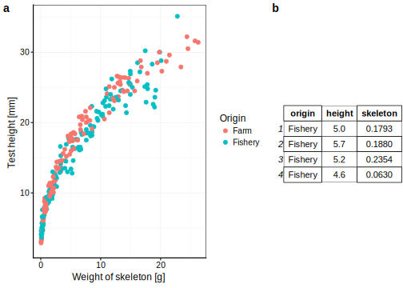
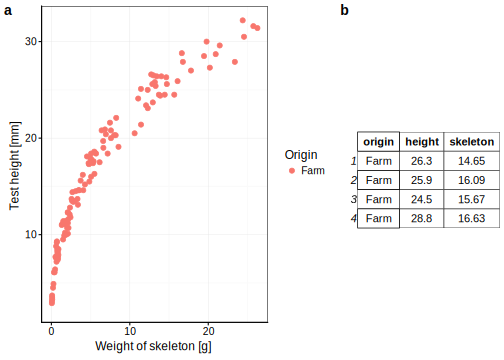
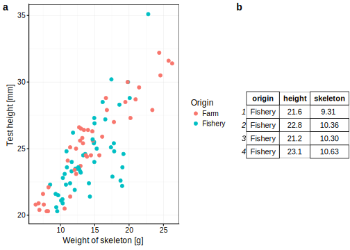
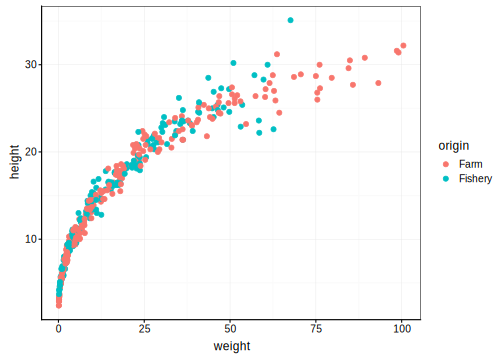

# Importation/transformation des données {#import}

Importation, tranformation, "cook", `dplyr`, `tidyr`. Type de variables et façon de les représenter dans R. Expression de condition. Chemins relatifs. Challenges: faire tel type de graphe étant donné tel jeu de données (avec étape de transformation nécessaire).


```r
knitr::opts_chunk$set(echo=FALSE, results= 'hide', message=FALSE)
library(knitr)
library(chart)
```

```
## Le chargement a nécessité le package : lattice
```

```
## Le chargement a nécessité le package : ggplot2
```

```r
library(ggpubr)
```

```
## Le chargement a nécessité le package : magrittr
```

```r
SciViews::R
```

```
## ── Attaching packages ───────────────────────────────────────────────────────── SciViews::R 1.0.1 ──
```

```
## ✔ SciViews  1.0.1      ✔ purrr     0.2.4 
## ✔ flow      1.0.0      ✔ readr     1.1.1 
## ✔ data      1.0.0      ✔ tidyr     0.8.0 
## ✔ svMisc    1.0.2      ✔ tibble    1.4.2 
## ✔ forcats   0.3.0      ✔ tidyverse 1.2.1 
## ✔ stringr   1.3.0      ✔ MASS      7.3.49
## ✔ dplyr     0.7.4
```

```
## ── Conflicts ────────────────────────────────────────────────────────────── tidyverse_conflicts() ──
## ✖ tidyr::extract()   masks magrittr::extract()
## ✖ dplyr::filter()    masks stats::filter()
## ✖ dplyr::lag()       masks stats::lag()
## ✖ dplyr::select()    masks MASS::select()
## ✖ purrr::set_names() masks magrittr::set_names()
```

```r
nf <- data::read("flights", package = "nycflights13")
iris <- data::read("iris", package = "datasets")
ub <-data::read("urchin_bio", package = "data")
```

Un exemple de jeu de données est présenté à la Table \@ref(tab:exemple-tab).


Vos objectifs pour ce module sont :

- Savoir importer des données via la fonction read(), ainsi qu'appréhender ses arguments.

- Appréhender les type de variables et l'importance d'encoder convenablement les variables.

- Savoir remanier des données afin d'extraire l'information importante d'un jeu de données.

## Prérequis

Si ce n'est déjà fait, vous devez avoir réaliser le module 1 ainsi que les modules liés à la visualisation des données.


## Importation des données

>TODO chapitre du module portant sur l'utilisation de la fonction read

## Type de variables


## Transformation des données

Lors du module IV, vous avez réalisé votre premier remaniement de données afin de réaliser un graphique en barre résumant une variable numérique en fonction d'une variable facteur. 

Le principale remaniement des données peut être réalisé en 5 grands piliers :

- sélectionner des colonnes au sein d'un jeu de données `select()`

- filtrer des lignes dans un jeu de données `filter()`

- réordonner les lignes dans un jeu de données `arrange()`

- calculer de nouvelles variables dans un jeu de donées `mutate()`

- Résumer de colonnes d'un jeu de données initiale `summarise()`

### `select()`

Lors de l'uilisation vos jeux de données, vous serez amené à réduire vos jeu de données en sous tableau.

Partez du jeu de données portant sur la croissance des oursins, ce dernier contient pas moins de 19 variables étudiées sur 421 individus. 


Vous vous intéressez dans votre analyse uniquement à certaines variables. La fonction `select()` et les fonctions d'aide à la selection (`?select_helpers`) peut vous apporter la solution à votre demande.


```r
ub1 <- select(ub, origin, solid_parts, test)
  
ub2 <- select(ub, c(1,4,14))

ub3 <-  select(ub, origin, contains("weight"))

ub4 <- select(ub, ends_with("ht"))
```


<div class="figure">

<p class="caption">(\#fig:unnamed-chunk-3)a) Résumé de la sélection effectué ub1, b) Résumé de la sélection effectué ub2, c) Résumé de la sélection effectué ub3, d) Résumé de la sélection effectué ub4</p>
</div>


### `filter()`

Lors de l'analyse de vos jeux de données, vous serez amené à filtrer les lignes de vos tableaux de données. La fonction `filter()` est l'un des outils pouvant vous apporter la solution. 

Repartez du jeu de données portant sur la croissance des oursins simplifié à 3 variables (l'origine, la hauteur et la masse du squelette).

<div class="figure">

<p class="caption">(\#fig:unnamed-chunk-4)a) Nuage de points montrant la variation de la hauteur du test des oursins en fonction du poids du squelette. b) Tableau de données résumé de la croissance des oursins.</p>
</div>

Vous pouvez utiliser une variable facteur pour sélectionner uniquement un niveau. 

- égal à : ==

- tout sauf : !=


```r
u <- filter(ub2, origin != "Fishery") # tous les origines sauf ceux provenant de Fishery 
```


<div class="figure">

<p class="caption">(\#fig:unnamed-chunk-6)a) Nuage de points montrant la variation de la hauteur du test des oursins en fonction du poids du squelette. b) Tableau de données résumé de la croissance des oursins suite à l'application d'un filtre sur l'orgine des oursins.</p>
</div>

Vous pouvez utiliser une variable numérique pour filtrer les données. 

- supérieur à : >

- inférieur à : <

- supérieur ou égal à : >=

- inférieur ou égal à : <=


<div class="figure">

<p class="caption">(\#fig:unnamed-chunk-8)a) Nuage de points montrant la variation de la hauteur du test des oursins en fonction du poids du squelette. b) Tableau de données résumé de la croissance des oursins suite à l'application d'un filtre sur les tailles des individus.</p>
</div>

Vous pouvez combiner différents filtres :  

- & : et 

- | : ou


<div class="figure">

<p class="caption">(\#fig:unnamed-chunk-10)a) Nuage de points montrant la variation de la hauteur du test des oursins en fonction du poids du squelette. b) Tableau de données résumé de la croissance des oursins suite à l'application d'un filtre sur l'orgine des oursins et sur les tailles des individus.</p>
</div>


#### Pièges et astuces

Avec des variables facteurs composé des nombreux niveaux, on peut être amené à en sélectionné plusieurs

```
is <- filter(iris, Species == "virginica"| "setosa") ## erreur

is <- filter(iris, Species %in% c("setosa", "virginica"))
```


### `mutate()`

Lors de l'analyse de vos jeux de données, vous serez amené à calculer de nouvelles variables. La fonction `mutate()` est l'un des outils pouvant vous apporter la solution. 

Repartez du jeu de données portant sur la croisance des oursins.

Vous pouvez tout d'abord employer les 
- les opérateurs arithmétiques
      + addition : `+`
      + soustraction : `-`
      + multiplication :  `*`
      + division : `/`
      + exposant : `^` ou `**`
      + modulo (reste lors d'une division) : `%%`
      + division entière :  `%/%` 


```
e.g. : x / sum(x)
```


-log 

```
e.g. : log(x)
```

- 


#### Pièges et astuces

La fonction `mutate()` permet de calculer de nouvelles variables. Cependant, la fonction `transmute()` permet de retirer les anciennes variables employées dans le calcule de la nouvelle. 

