# Importation/transformation des données {#import}


Vos objectifs pour ce module sont :

- Savoir importer des données via la fonction `read()`, ainsi qu'appréhender ses arguments.

- Appréhender les types de variables et l'importance d'encoder convenablement les variables.

- Savoir remanier des données afin d'extraire l'information importante d'un jeu de données.


Si ce n'est déjà fait, vous devez avoir réaliser le module 1 ainsi que les modules liés à la visualisation des données.


## Importation des données

Afin de réaliser l'analyse de vos résultats vous devez commencer par importer correctement vos données. Pour ce faire, la fonction pouvant vous apporter la solution est la fonction `read()` du package `data.io`

Vos données peuvent provenir de plusieurs endroits :

- un package 
- un jeu de données encodé manuellement 

### Données provenant d'un package

En effet, les packages que l'on peut assimiler à des boites à outils dans R sont pour certain composé de jeu de données. La fonction `read() permet de les importer.


```r
# Importation de données provenant d'un package
is <- read("iris", package = "datasets", lang = "fr")

ub <- read("urchin_bio", package = "data.io", lang = "fr")
```

La fonction `read()` requiert comme premier argument le nom du jeu de données (e.g. `"iris"` ou `"urchin_bio"`), suivi de l'argument `package=` (e.g. `"datasets"`, ou `"data.io"`), suivi de l'argument `lang=` (e.g. `"fr"`) qui définit la langue d'intérêt.  

L'instruction ci-dessous permet d'obtenir une liste de l'ensemble des jeux de données présent dans un package.


```r
#read(package = "data.io")
```


### Données encodées manuellement

En effet, vous serez amené à encoder manuellement vos jeux de données dans un fichier au format `"xlsx"`, `"csv"` ou encore `"txt"`. La fonction `read()` permet de les importer. Vous devrez dans ce cas spécifier le chemin d'accès à votre fichier.

Le chemin d'accès à votre fichier peut s'écrire de diffférentes manières absolue ou bien de manière relative. Vous devez tant que possible employer des chemins relatifs. Les projets dans RStudio définissent un environnement de travail comme vu dans le module 1. Afin que ce projet soit portable, il est indisensable d'employer des chemins relatifs. 

Votre projet s'organise comme ceci :

```
/home
  /sv
    /Shared
      /Projects
        /Projet test                 # Le répertoire de base du projet
          Projet test.Rproj          # Fichier de configuration du projet créé par RStudio
          /data                      # Le dossier avec les données de départ
            Oursins.csv              # Un jeu de données au format CSV
          /R                         # Un dossier pour les scripts d'analyse R
            première analyse.R       # Un scirpt de découverte des données
          /reports                   # Un dossier pour les rapports d'analyse
            Rapport de test.nb.html  # Vue HTML du rapport générée automatiquement
            Rapport de test.Rmd      # Un premier rapport au format R Notebook
```

Afin de définir la position de votre fichiers `Oursins.csv`, vous aller simplement lister l'ensemble de dossier. Il s'agit du chemin absolu , de la position de votre fichier sur votre ordinateur. Ce format n'est pas du tout portable

```
/home/sv/Shared/Projects/Projet test/data/Oursins.csv 
```

Ce chemin est plus portable que le précédent et le tild représente le dossier utilisateur. 

```
~/Shared/Projects/Projet test/data/Oursins.csv
```

Vous détemrinez le chemin relatif en fonction du répertoire actif dans un projet R studio, c'est le projet lui même qui est le répertoire actif. 

```
data/Oursins.csv
```
Afin de passer d'un chemin absolu à un chemin relatif vous devez :

- connaitre le répertoire actif 
- utiliser le `/` pour rentrer dans un dossier 
- utiliser le `../` pour sortir d'un dossier

Pour obtenir une explication complète et détaillée sur l'utilisation des chemins relatifs dans l'organisation d'un projet Rstudio, lisez le tutoriel : **"Tutoriel SDD-UMONS : La gestion des fichiers dans un projet et les chemins relatifs"**


```r
# cg <- read("/Users/engels/Documents/projet/data/jeu_fictif.csv") # chemin absolu
# ou encore
# cg <- read(data/jeu_fictif.csv) # Chemin relatif
```

#### Pièges et astuces

L'utilisation des chemins relatifs est indispensable comme expliqués ci-dessus. Lors de vos travaux organisé en plusieurs projets cohérents vous serez amené à travailler principalement dans des fichiers de type `Rscript` ou des fichiers `R notebook`. Le `Rscript` utilise comme point de départ la position de projet R studio. Par contre, le `R notebook` utilise sa propre position comme point de départ.


### Pièges et astuces

La fonction read() est également capable d'importer les fichier comprimer ".zip" , ".tar" ou encore ".tar.gz". 


```r
iris <- read(data_example("iris.csv.zip"))
```

```
# Parsed with column specification:
# cols(
#   Sepal.Length = col_double(),
#   Sepal.Width = col_double(),
#   Petal.Length = col_double(),
#   Petal.Width = col_double(),
#   Species = col_character()
# )
```

La fonction read() est également capable d'importer des fichiers en lignes. 


```r
#ble <- read("http://tinyurl.com/Biostat-Ble", type = "csv") # requiert une connexion internet 
```


## Type de variables


```r
tg <- read("ToothGrowth", package = "datasets")
```

Prenez l'exemple de jeu de donnée portant sur la croissance des dents de cochon d'Inde (`ToothGrowth, du package `datasets`). Il est composé de 60 observations et de trois variables portant sur la longueur des dents (mm), le supplément administré (OJ jus d'orange ou VC vitamine C) et la dose administrée ( 0.5, 1 et 2 en mm/j). 

Les jeux de données sont une suite de variables mises côte à côte. Vous avez à votre disposition plusieurs type de variables : 

- nombre :
    + numérique : `numeric`
    + entiers : `integer`
    + valeurs arrondies : `double`
    + nombre complexe : `complex`

Il s'agit des valeurs numériques qui vont composer vos jeux de données. Si une variable numérique ne l'est pas vous pouvez la tranformer avec l'instruction suivante :


```r
tg$len <- as.numeric(tg$len)
```


- caractères : `character`

Il s'agit de chaine de charactères qui vont composer vos jeux de données. Les chaines de caractères vont avoir 2 but. Soit il s'agit d'une information ayant pour objectif d'être employé comme variable facteur ou bien il s'agit d'une information complémentaire sur les observations qui ne sera pas employer dans l'analyse des données. Cependant, vous pouvez être amené à transformer une variable en caractère avec l'instruction suivante :


```r
tg$supp <- as.character(tg$supp)
```

- facteur : `factor`

Il s'agit d'une variable permettant de discriminer des observations avec un ensemble de niveau dans un jeu de données comme la variable portant sur le supplément administré ou en portant sur la dose administrée. Si une variable facteur ne l'est pas vous pouvez la tranformer avec l'instruction suivante :


```r
tg$supp <- as.factor(tg$supp)
```

Il est possible de ne pas simplement changer une variable en variable facteur. Il est possible de de préciser les niveaux `levels`, de l'ordonner avec l'argument `ordered = TRUE`. Prenez la variable dose du jeu de données `ToothGrowth`. Etant donné qu'il s'agit de doses croissantes administrées à des cochons d'Inde, cette variable doit donc être une variable ordonnée.


```r
tg$dose <- factor(tg$dose, levels = c(0.5, 1, 2), ordered = TRUE)
```

La variable facteur ordonnée est reconnue par une ensemble de fonction dans R. Elle ne sera de ce fait pas traitée de la même manière qu'une variable facteur simple. 

La fonction `skim()` du package `skimr` permet de visualiser le type de la variable et bien plus encore. Il fournit une visualisation différentes en fonction du type de la variable. Il propose par exemple un histogramme pour les variables numériques comme le montre le tableau ci-dessous


```r
skimr::skim(tg)
```

```
# Skim summary statistics
#  n obs: 60 
#  n variables: 3 
# 
# ── Variable type:factor ─────────────────────────────────────────────────────────────────────────────────────────
#  variable missing complete  n n_unique
#      dose       0       60 60        3
#      supp       0       60 60        2
#                                        top_counts ordered
#                      0.5: 20, 1: 20, 2: 20, NA: 0    TRUE
#  OJ: 30, VC: 30, NA: 0                              FALSE
# 
# ── Variable type:numeric ────────────────────────────────────────────────────────────────────────────────────────
#  variable missing complete  n  mean   sd  p0   p25   p50   p75 p100
#       len       0       60 60 18.81 7.65 4.2 13.07 19.25 25.27 33.9
#      hist
#  ▃▅▃▅▃▇▂▂
```
Avec une seule instruction, on obtient une quantité d'information sur notr jeu de données comme le nombre d'observation, le nombre de variables et un traitement spécifique pour chaque type de variable. 

Cet instruction permet de visualiser et d'appréhender le jeu de données mais ne doit pas figurer tel quel dans un rapport d'analyse. 


### Pièges et astuces

Les variables d'un jeu de données doivent être correctement importées afin d'éviter toutes mauvaises interprétations comme le montre les deux graphiques ci-dessous. 

Dans les graphiques a), vous pouvez observer que la dose a été employé comme une variable numérique et dans le graphique b) la dose est employée comme variable facteur. Vous observez que le bon encodage de la variable dose permet d'obtenir le graphique pertinent et cohérent avec la signification des données.


```r
tg <- read("ToothGrowth", package = "datasets")

a <- chart(tg, len ~ dose) +
  geom_boxplot() +
  labs( x = "Dose administrée [mg/j]" , y = " longueur des dents [mm]")

b <- chart(tg, len ~ as.factor(dose)) +
  geom_boxplot() +
  labs( x = "Dose administrée [mg/j]" , y = " longueur des dents [mm]")

ggarrange(a,b, labels = "auto")
```

```
# Warning: Continuous x aesthetic -- did you forget aes(group=...)?
```

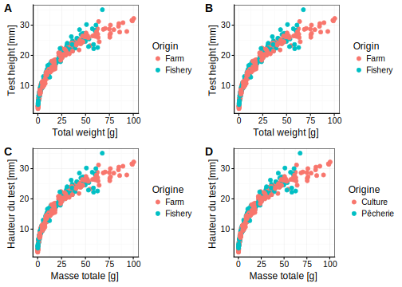


## Transformation des données

Lors du module IV, vous avez réalisé votre premier remaniement de données afin de réaliser un graphique en barre résumant une variable numérique en fonction d'une variable facteur. 

Le principale remaniement des données peut être réalisé en 4 grands piliers :

- sélectionner des colonnes au sein d'un jeu de données `select()`

- filtrer des lignes dans un jeu de données `filter()`

- calculer de nouvelles variables dans un jeu de donées `mutate()`

- Résumer de colonnes d'un jeu de données initiale `summarise()`

### `select()`

Lors de l'utilisation vos jeux de données, vous serez amené à réduire vos jeux de données en sous tableau.

Partez du jeu de données portant sur la croissance des oursins, ce dernier contient pas moins de 19 variables étudiées sur 421 individus. 


```r
ub <- read("urchin_bio", package = "data.io", lang = "fr")
```

Vous vous intéressez dans votre analyse uniquement à certaines variables. La fonction `select()` et les fonctions d'aide à la selection (`?select_helpers`) peut vous apporter la solution à votre demande.


```r
ub1 <- select(ub, origin, solid_parts, test)
  
ub2 <- select(ub, c(1,4,14))

ub3 <-  select(ub, origin, contains("weight"))

ub4 <- select(ub, ends_with("ht"))
```


```r
u1 <- ggtexttable(head(ub1, n = 4), theme = ttheme("lBlack"))
u2 <- ggtexttable(head(ub2, n = 4), theme = ttheme("classic"))
u3 <- ggtexttable(head(ub3, n = 4), theme = ttheme("lRed"))
u4 <- ggtexttable(head(ub4, n = 4), theme = ttheme("mGreen"))


ggpubr::ggarrange(u1, u2, u3, u4, labels = "auto")
```

<div class="figure">

<p class="caption">(\#fig:unnamed-chunk-15)a) Résumé de la sélection effectué ub1, b) Résumé de la sélection effectué ub2, c) Résumé de la sélection effectué ub3, d) Résumé de la sélection effectué ub4</p>
</div>


### `filter()`

Lors de l'analyse de vos jeux de données, vous serez amené à filtrer les lignes de vos tableaux de données. La fonction `filter()` est l'un des outils pouvant vous apporter la solution. 

Repartez du jeu de données portant sur la croissance des oursins simplifié à 3 variables (l'origine, la hauteur et la masse du squelette).


```r
a <- chart(ub2, formula = height ~ skeleton %col=% origin) +
  geom_point(na.rm = TRUE)
ggarrange(a,u2, labels = "auto", widths = c(2, 1))
```

<div class="figure">

<p class="caption">(\#fig:unnamed-chunk-16)a) Nuage de points montrant la variation de la hauteur du test des oursins en fonction du poids du squelette. b) Tableau de données résumé de la croissance des oursins.</p>
</div>

Vous pouvez utiliser une variable facteur pour sélectionner uniquement un niveau. 

- égal à : ==

- tout sauf : !=


```r
u <- filter(ub2, origin != "Fishery") # tous les origines sauf ceux provenant de Fishery 
```


```r
u2 <- ggtexttable(head(u, n = 4), theme = ttheme("classic"))
a <- chart(u, formula = height ~ skeleton %col=% origin ) +
  geom_point(na.rm = TRUE)
ggarrange(a,u2,labels = "auto", widths = c(2, 1))
```

<div class="figure">
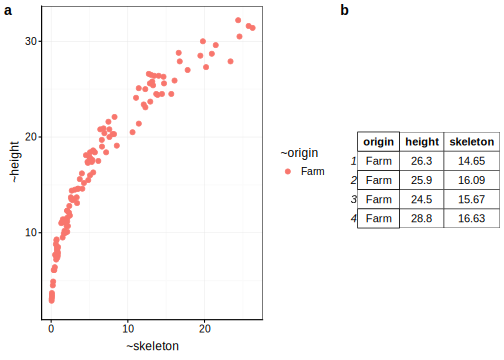
<p class="caption">(\#fig:unnamed-chunk-18)a) Nuage de points montrant la variation de la hauteur du test des oursins en fonction du poids du squelette. b) Tableau de données résumé de la croissance des oursins suite à l'application d'un filtre sur l'orgine des oursins.</p>
</div>

Vous pouvez utiliser une variable numérique pour filtrer les données. 

- supérieur à : >

- inférieur à : <

- supérieur ou égal à : >=

- inférieur ou égal à : <=


```r
u <- filter(ub2, height > 20) # hauteur supérieur à 20 
```


```r
u2 <- ggtexttable(head(u, n = 4), theme = ttheme("classic"))
a <- chart(u, formula = height ~ skeleton %col=% origin) +
  geom_point(na.rm = TRUE)
ggarrange(a,u2,labels = "auto", widths = c(2, 1))
```

<div class="figure">
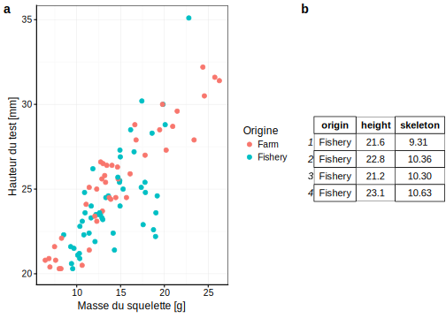
<p class="caption">(\#fig:unnamed-chunk-20)a) Nuage de points montrant la variation de la hauteur du test des oursins en fonction du poids du squelette. b) Tableau de données résumé de la croissance des oursins suite à l'application d'un filtre sur les tailles des individus.</p>
</div>

Vous pouvez combiner différents filtres :  

- & : et 

- | : ou


```r
u <- filter(ub2, height > 20 & origin == "Farm") # hauteur supérieur à 20  et origine contenant uniquement les oursins venant du niveau `Farm`
```


```r
u2 <- ggtexttable(head(u, n = 4), theme = ttheme("classic"))
a <- chart(u, formula = height ~ skeleton %col=% origin) +
  geom_point(na.rm = TRUE)
ggarrange(a, u2,labels = "auto", widths = c(2, 1))
```

<div class="figure">

<p class="caption">(\#fig:unnamed-chunk-22)a) Nuage de points montrant la variation de la hauteur du test des oursins en fonction du poids du squelette. b) Tableau de données résumé de la croissance des oursins suite à l'application d'un filtre sur l'orgine des oursins et sur les tailles des individus.</p>
</div>


#### Pièges et astuces

Avec des variables facteurs composé des nombreux niveaux, on peut être amené à en sélectionné plusieurs

```
is <- filter(iris, Species == "virginica"| "setosa") ## erreur

is <- filter(iris, Species %in% c("setosa", "virginica"))
```


### `mutate()`

Lors de l'analyse de vos jeux de données, vous serez amené à calculer de nouvelles variables. La fonction `mutate()` est l'un des outils pouvant vous apporter la solution. 

Repartez du jeu de données portant sur la croisance des oursins.

Vous pouvez tout d'abord employer les 
- les opérateurs arithmétiques
      + addition : `+`
      + soustraction : `-`
      + multiplication :  `*`
      + division : `/`
      + exposant : `^` ou `**`
      + modulo (reste lors d'une division) : `%%`
      + division entière :  `%/%` 


```r
ub <- mutate(ub, v1 =  lantern + spines + test, 
             v2 = v1/skeleton,
             v3 = skeleton^2)
```

- les fonctions mathématiques
    + log
    + sqrt
    + sin, cos, tan
    


```r
ub <- mutate(ub, v1_log =  log(skeleton), 
             v2_sqrt = sqrt(skeleton),
             v3_sin = sin(skeleton))
```


#### Pièges et astuces

La fonction `mutate()` permet de calculer de nouvelles variables. Cependant, la fonction `transmute()` permet de retirer les anciennes variables employées dans le calcule de la nouvelle. 

### `summarise()`

Lors de l'analyse de vos jeux de données, vous serez amené à résumer vos données. 


```r
a <- summarise(tg, "moyenne" = mean(len), 
               "minimum" = min(len), 
               "médiane" = median(len), 
               "maximum" = max(len))
ggtexttable(a, theme = ttheme("lBlack"))
```

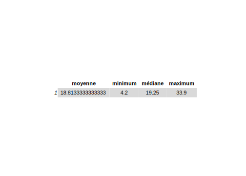


Cette fonction n'a de véritable intêrét que couplée avec la fonction `group_by() qui va permettre de grouper un jeu de données en fonction d'une ou plusieurs variable de type facteur.


```r
tg <- group_by(tg, supp)

a <- summarise(tg, "moyenne" = mean(len), 
               "minimum" = min(len), 
               "médiane" = median(len), 
               "maximum" = max(len))
ggtexttable(a, theme = ttheme("lBlack"))
```

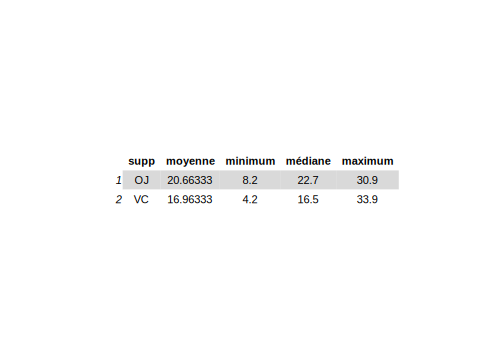


```r
tg <- group_by(tg, supp, dose)

a <- summarise(tg, "moyenne" = mean(len), 
               "minimum" = min(len), 
               "médiane" = median(len), 
               "maximum" = max(len))
ggtexttable(a, theme = ttheme("lBlack"))
```

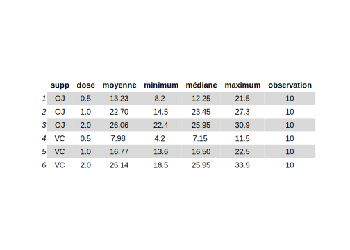


#### Pièges et astuces

Tout comme lors de réalisation d'une boite de dispersion, vous devez être particulièrement vigilant ou nombre d'observation par sous groupe. Ajoutez à chaque tableau résumé des données, le nombre d'observation par sous-groupe.


```r
a <- summarise(tg, "moyenne" = mean(len), 
               "minimum" = min(len), 
               "médiane" = median(len), 
               "maximum" = max(len),
               "observation" = n())
ggtexttable(a, theme = ttheme("lBlack"))
```


### Pièges et astuces


```r
ub <- read("urchin_bio", package = "data.io", lang = "fr")
```

Lors de l'analyse de vos jeux de données, vous serez amené à réaliser plusieurs de ces étapes de remaniement des données. La solution est d'employer le **pipe**^[TODO] `%>.% qui permet de réaliser une suite d'intructions. 

Vous pouvez calculer de nouvelles variables puis filtrer les lignes et enfin sélectionner des colonnes.

Etape par étape, vous allez utiliser la fonction `mutate()`, puis `filter()` et enfin `select()


```r
ub <- mutate(ub, v1 =  lantern + spines + test, 
             v2 = v1/skeleton,
             v3 = skeleton^2,
             v1_log =  log(skeleton), 
             v2_sqrt = sqrt(skeleton),
             v3_sin = sin(skeleton))

ub <- filter(ub, height > 20 & origin == "Farm")

ub <- select(ub, origin, solid_parts, test, v2_sqrt)
```


```r
ggtexttable(head(ub, n = 6), theme = ttheme("lBlack"))
```

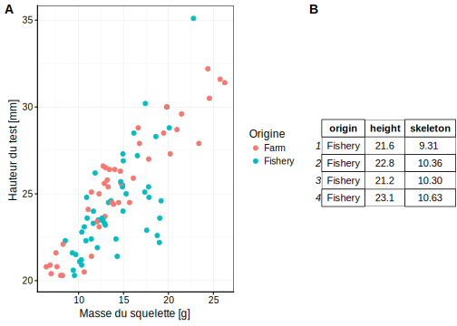


```r
ub1 <- read("urchin_bio", package = "data.io", lang = "fr")
```

Le pipe permet d'éviter certaine répétion afin de réaliser en cascade la suite des opérations. Vous devez être vigilant à la structure du pipe qui comprend le pipe `%>.%`et le point au début des fonctions `.`. Le pipe fait le lien entre les différentes fonctions et le point renvoit au jeu de données passant de fonction en fonction. 


```r
ub1 %>.%
  mutate(., v1 =  lantern + spines + test, 
         v2 = v1/skeleton,
         v3 = skeleton^2, 
         v1_log =  log(skeleton), 
         v2_sqrt = sqrt(skeleton),
         v3_sin = sin(skeleton)) %>.%
  filter(., height > 20 & origin == "Farm") %>.%
  select(., origin, solid_parts, test, v2_sqrt) -> ub1 

# fonction pour afficher 
ggtexttable(head(ub1, n = 6), theme = ttheme("lBlack"))
```

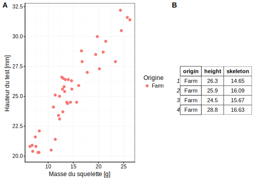


Le pipe est un outil très intéressant lors du résumé de données par une ou plusieurs variables facteurs.


```r
tg <- group_by(tg, supp, dose)
a <- summarise(tg, "moyenne" = mean(len), 
               "minimum" = min(len), 
               "médiane" = median(len), 
               "maximum" = max(len))
ggtexttable(a, theme = ttheme("lBlack"))
```

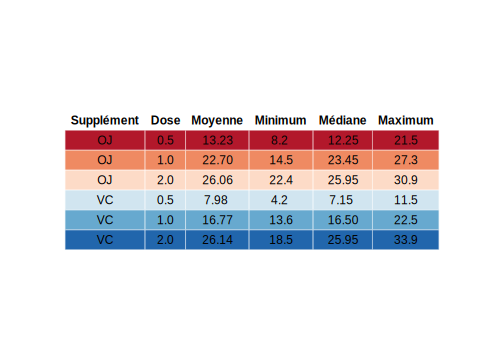


```r
tg %>.%
  group_by(., supp, dose) %>.%
  summarise(., "moyenne" = mean(len), 
               "minimum" = min(len), 
               "médiane" = median(len), 
               "maximum" = max(len)) %>.%
  ggtexttable(., theme = ttheme(
             colnames.style = colnames_style(fill = "white"),
             tbody.style = tbody_style(fill = get_palette("RdBu", 6))
           ), rows = NULL, 
           cols = c("Supplément", "Dose", "Moyenne", "Minimum", "Médiane", "Maximum"))
```

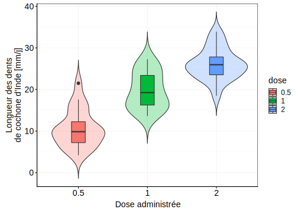

#### Pour en savoir plus 

- [Customisation de tableau](http://www.sthda.com/english/rpkgs/ggpubr/reference/ggtexttable.html)

## A vous de jouer !


Un squelette de projet RStudio vous a été fournit dans un dépôt Github Classroom, y compris organisation des fichiers et jeux de données types. Votre objectif est de : 

- Importer les données provenant du `ToothGrowth`

- Comprendre les données proposées, en utilisant des visualisations graphiques appropriées 

- Reproduire de plus le graphique ci-dessous 


```r
tg <- read("ToothGrowth", package = "datasets")

tg$dose <- as.factor(tg$dose)

chart(tg, formula = len ~ dose %fill=% dose) +
  geom_violin(alpha = 0.3, position = "dodge", trim = FALSE) +
  geom_boxplot(position = "dodge", width = 0.2) +
  labs( y = "Longueur des dents \n de cochone d'Inde [mm/j]", x = "Dose administrée") +
  theme(
        text = element_text(size = 14),
        axis.text = element_text(size = 14))
```

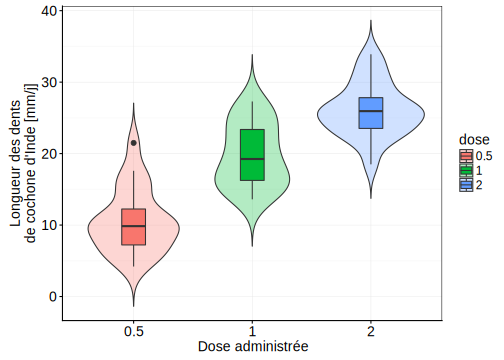


- Documenter  le fruit de votre étude dans un rapport R Notebook.
