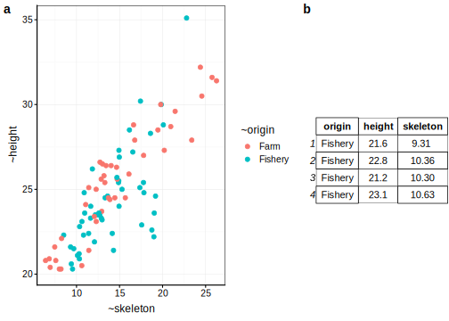
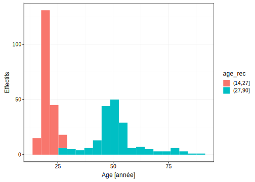

# Importation/transformation des données {#import}

Importation, tranformation, "cook", `dplyr`, `tidyr`. Type de variables et façon de les représenter dans R. Expression de condition. Chemins relatifs. Challenges: faire tel type de graphe étant donné tel jeu de données (avec étape de transformation nécessaire).


```r
knitr::opts_chunk$set(echo=FALSE, results= 'hide', message=FALSE)
SciViews::R
```

```
## ── Attaching packages ──────────────────────────────────────────────────────────────────────────────── SciViews::R 1.0.0 ──
```

```
## ✔ SciViews  1.0.0      ✔ readr     1.1.1 
## ✔ svMisc    1.1.0      ✔ tidyr     0.8.1 
## ✔ forcats   0.3.0      ✔ tibble    1.4.2 
## ✔ stringr   1.3.1      ✔ ggplot2   2.2.1 
## ✔ dplyr     0.7.5      ✔ tidyverse 1.2.1 
## ✔ purrr     0.2.5      ✔ MASS      7.3.50
```

```
## ── Conflicts ───────────────────────────────────────────────────────────────────────────────────── tidyverse_conflicts() ──
## ✖ dplyr::filter() masks stats::filter()
## ✖ dplyr::lag()    masks stats::lag()
## ✖ dplyr::select() masks MASS::select()
```

```r
library(knitr)
library(chart)
```

```
## Le chargement a nécessité le package : lattice
```

```r
library(ggpubr)
```

```
## Le chargement a nécessité le package : magrittr
```

```
## 
## Attachement du package : 'magrittr'
```

```
## The following object is masked from 'package:purrr':
## 
##     set_names
```

```
## The following object is masked from 'package:tidyr':
## 
##     extract
```

```r
library(flow)
library(data)

nf <- data::read("flights", package = "nycflights13", lang = "fr")
iris <- data::read("iris", package = "datasets", lang = "fr")

#ub <- data::read("urchin_bio", package = "data", lang = "fr")

urchin <- data::read("urchin_bio", package = "data")
```

Un exemple de jeu de données est présenté à la Table \@ref(tab:exemple-tab).


Vos objectifs pour ce module sont :

- Savoir importer des données via la fonction read(), ainsi qu'appréhender ses arguments.

- Appréhender les type de variables et l'importance d'encoder convenablement les variables.

- Savoir remanier des données afin d'extraire l'information importante d'un jeu de données.

## Prérequis

Si ce n'est déjà fait, vous devez avoir réaliser le module 1 ainsi que les modules liés à la visualisation des données.


## Importation des données

Afin de réaliser l'analyse de vos résultat vous devez commencer par importer correctement vos données. Pour ce faire, la fonction pouvant vous apporter la solution est la fonction `read()` du package `data`

Vos données peuvent provenir de plusieurs endroit :

- un package 

En effet, les packages que l'on peut assimiler à des boites à outils dans R sont pour certain composé de jeu de données. La fonction `read() permet de les importer.


```r
is <- data::read("iris", package = "datasets", lang = "fr")

ub <- data::read("urchin_bio", package = "data", lang = "fr")
```

La fonction `read()` requiert comme premier argument le nom du jeu de données (e.g. "iris" ou "urchin_bio"), suivi de l'argument `package` (e.g. "datasets", ou "data"), suivi de l'argument `lang` (e.g. "fr") qui définit la langue d'intérêt.  

- un jeu de données encodé manuellement 

En effet, vous serez amené à encoder manuellement vos jeux de données dans un fichier au format "xlsx", "csv" ou encore "txt". La fonction `read()` permet de les importer.


```r
# cg <- read(../data/jeu_fictif.csv)
```

- une base des données
> TODO ? 


### Pièges et astuces

La fonction read() est également capable d'importer les fichier comprimer ".zip" , ".tar" ou encore ".tar.gz". 


La fonction read() est également capable d'importer  des fichiers en lignes. 


>TODO Utiliser la fonction employer la doc de la fonction

## Type de variables


Prenez l'exemple de jeu de donnée portant sur la croissance des dents de cochon d'Inde (`ToothGrowth, du package `datasets`). Il est composé de 60 observations et de trois variables portant sur la longueur des dents (mm), le supplément administré (OJ jus d'orange ou VC vitamine C) et la dose administrée ( 0.5, 1 et 2 en mm/j). 

Les jeux de données sont une suite de variables mises côte à côte. Vous avez à votre disposition plusieurs type de variables : 

- nombre :
    + numérique : `numeric`
    + entiers : `integer`
    + valeurs arrondies : `double`
    + nombre complexe : `complex`

Il s'agit des valeurs numériques qui vont composer vos jeux de données. Si une variable numérique ne l'est pas vous pouvez la tranformer avec l'instruction suivante :


```r
tg$len <- as.numeric(tg$len)
```


- caractères : `character`

Il s'agit de chaine de charactères qui vont composer vos jeux de données. Les chaines de caractères vont avoir 2 bu. Soit ils s'agit d'une information ayant pour objectif d'être employé comme variable facteur. Soit il s'agit d'une information complémentaire sur les observations qui ne sera pas employer dans l'analyse des données. Cependant, vous pouvez être amené à transformer une variable en caractère avec l'instruction suivante :


```r
tg$supp <- as.character(tg$supp)
```

- facteur : `factor`

Il s'agit d'une variable permettant de discriminer des observations avec un ensemble de niveau dans un jeu de données comme la variable portant sur le supplément administré ou en portant sur la dose administrée. Si une variable facteur ne l'est pas vous pouvez la tranformer avec l'instruction suivante :


```r
tg$supp <- as.factor(tg$supp)
```

Il est possible de ne pas simplement changer une variable en variable facteur. Il est possible de de préciser les niveaux `levels`, de l'ordonner avec l'argument `ordered = TRUE`. Prenez la variable dose du jeu de données `ToothGrowth`. Etant donné qu'il s'agit de doses croissantes administrées à des cochons d'Inde, cette variable doit donc être une variable ordonnée.


```r
tg$dose <- factor(tg$dose, levels = c(0.5, 1, 2), ordered = TRUE)
```

La fonction `levels()` permet de prendre connaissance des niveaux d'une variable facteur.


- logique : `logical` 


> TODO

La fonction `str()` permet d'obtenir un maximum d'information sur un jeu de données.


```r
str(tg)
```


### Pièges et astuces

Les variables d'un jeu de données doivent être correctement intégré afin d'éviter toutes mauvaises interprétations comme le montre les deux graphiques ci-dessous. 

Dans les graphiques a) ci-dessous, vous pouvez observer que la dose a été employé comme une variable numérique et dans le graphique b) la dose est employée comme variable facteur. Vous observez que le bon encodage de la variable dose permet d'obtenir le graphique pertinent et cohérent avec la signification des données.


```
## Warning: Continuous x aesthetic -- did you forget aes(group=...)?
```


## Transformation des données

Lors du module IV, vous avez réalisé votre premier remaniement de données afin de réaliser un graphique en barre résumant une variable numérique en fonction d'une variable facteur. 

Le principale remaniement des données peut être réalisé en 4 grands piliers :

- sélectionner des colonnes au sein d'un jeu de données `select()`

- filtrer des lignes dans un jeu de données `filter()`

- calculer de nouvelles variables dans un jeu de donées `mutate()`

- Résumer de colonnes d'un jeu de données initiale `summarise()`

### `select()`

Lors de l'ut ilisation vos jeux de données, vous serez amené à réduire vos jeu de données en sous tableau.

Partez du jeu de données portant sur la croissance des oursins, ce dernier contient pas moins de 19 variables étudiées sur 421 individus. 


Vous vous intéressez dans votre analyse uniquement à certaines variables. La fonction `select()` et les fonctions d'aide à la selection (`?select_helpers`) peut vous apporter la solution à votre demande.


```r
ub1 <- select(ub, origin, solid_parts, test)
  
ub2 <- select(ub, c(1,4,14))

ub3 <-  select(ub, origin, contains("weight"))

ub4 <- select(ub, ends_with("ht"))
```


<div class="figure">

<p class="caption">(\#fig:unnamed-chunk-14)a) Résumé de la sélection effectué ub1, b) Résumé de la sélection effectué ub2, c) Résumé de la sélection effectué ub3, d) Résumé de la sélection effectué ub4</p>
</div>


### `filter()`

Lors de l'analyse de vos jeux de données, vous serez amené à filtrer les lignes de vos tableaux de données. La fonction `filter()` est l'un des outils pouvant vous apporter la solution. 

Repartez du jeu de données portant sur la croissance des oursins simplifié à 3 variables (l'origine, la hauteur et la masse du squelette).

<div class="figure">

<p class="caption">(\#fig:unnamed-chunk-15)a) Nuage de points montrant la variation de la hauteur du test des oursins en fonction du poids du squelette. b) Tableau de données résumé de la croissance des oursins.</p>
</div>

Vous pouvez utiliser une variable facteur pour sélectionner uniquement un niveau. 

- égal à : ==

- tout sauf : !=


```r
u <- filter(ub2, origin != "Fishery") # tous les origines sauf ceux provenant de Fishery 
```


<div class="figure">

<p class="caption">(\#fig:unnamed-chunk-17)a) Nuage de points montrant la variation de la hauteur du test des oursins en fonction du poids du squelette. b) Tableau de données résumé de la croissance des oursins suite à l'application d'un filtre sur l'orgine des oursins.</p>
</div>

Vous pouvez utiliser une variable numérique pour filtrer les données. 

- supérieur à : >

- inférieur à : <

- supérieur ou égal à : >=

- inférieur ou égal à : <=


<div class="figure">

<p class="caption">(\#fig:unnamed-chunk-19)a) Nuage de points montrant la variation de la hauteur du test des oursins en fonction du poids du squelette. b) Tableau de données résumé de la croissance des oursins suite à l'application d'un filtre sur les tailles des individus.</p>
</div>

Vous pouvez combiner différents filtres :  

- & : et 

- | : ou


<div class="figure">

<p class="caption">(\#fig:unnamed-chunk-21)a) Nuage de points montrant la variation de la hauteur du test des oursins en fonction du poids du squelette. b) Tableau de données résumé de la croissance des oursins suite à l'application d'un filtre sur l'orgine des oursins et sur les tailles des individus.</p>
</div>


#### Pièges et astuces

Avec des variables facteurs composé des nombreux niveaux, on peut être amené à en sélectionné plusieurs

```
is <- filter(iris, Species == "virginica"| "setosa") ## erreur

is <- filter(iris, Species %in% c("setosa", "virginica"))
```


### `mutate()`

Lors de l'analyse de vos jeux de données, vous serez amené à calculer de nouvelles variables. La fonction `mutate()` est l'un des outils pouvant vous apporter la solution. 

Repartez du jeu de données portant sur la croisance des oursins.

Vous pouvez tout d'abord employer les 
- les opérateurs arithmétiques
      + addition : `+`
      + soustraction : `-`
      + multiplication :  `*`
      + division : `/`
      + exposant : `^` ou `**`
      + modulo (reste lors d'une division) : `%%`
      + division entière :  `%/%` 


```r
ub <- mutate(ub, v1 =  lantern + spines + test, 
             v2 = v1/skeleton,
             v3 = skeleton^2)
```

- les fonctions mathématiques
    + log
    + sqrt
    + sin, cos, tan
    


```r
ub <- mutate(ub, v1_log =  log(skeleton), 
             v2_sqrt = sqrt(skeleton),
             v3_sin = sin(skeleton))
```


#### Pièges et astuces

La fonction `mutate()` permet de calculer de nouvelles variables. Cependant, la fonction `transmute()` permet de retirer les anciennes variables employées dans le calcule de la nouvelle. 

### `summarise()`

Lors de l'analyse de vos jeux de données, vous serez amené à résumer vos données. 


Cette fonction n'a de véritable intêrét que couplée avec la fonction `group_by() qui va permettre de grouper un jeu de données en fonction d'une ou plusieurs variable de type facteur.


#### Pièges et astuces

Tout comme lors de réalisation d'une boite de dispersion, vous devez être particulièrement vigilant ou nombre d'observation par sous groupe. Ajoutez à chaque tableau résumé des données, le nombre d'observation par sous-groupe.


### Pièges et astuces


Lors de l'analyse de vos jeux de données, vous serez amené à réaliser plusieurs de ces étapes de remaniement des données. La solution est d'employer le **pipe**^[TODO] `%>.% qui permet de réaliser une suite d'intructions. 


```r
ub <- mutate(ub, v1 =  lantern + spines + test, 
             v2 = v1/skeleton,
             v3 = skeleton^2)

ub <- mutate(ub, v1_log =  log(skeleton), 
             v2_sqrt = sqrt(skeleton),
             v3_sin = sin(skeleton))

ub <- filter(ub, height > 20 & origin == "Farm")

ub <- select(ub, origin, solid_parts, test, v2_sqrt)
```




```r
ub1 %>.%
  mutate(., v1 =  lantern + spines + test, 
         v2 = v1/skeleton,
         v3 = skeleton^2, 
         v1_log =  log(skeleton), 
         v2_sqrt = sqrt(skeleton),
         v3_sin = sin(skeleton)) %>.%
  filter(., height > 20 & origin == "Farm") %>.%
  select(., origin, solid_parts, test, v2_sqrt) -> ub1
```


