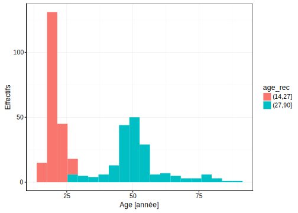
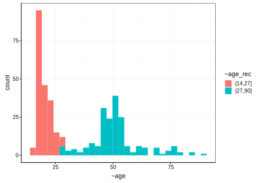

# Données qualitatives {#qualit}


#### Objectifs {-}

- Appréhender le découpage en classe d'une variable numérique, afin de réaliser une variable facteur 

- Appréhender la réalisation des tableaux de contingences.

- Acquérir des données et les encoder de manière reproductible 

#### Prérequis {-}

Si ce n'est déjà fait, vous devez avoir réaliser les modules précédents.

## Découpage en classe

Lors de la visualisation de vos données numérique avec un histogramme par exemple, vous serez amené à définir des groupes au sein de vos individus étudiés. Vous avez vu durant le module 3 sur les histogrammes que ce dernier pouvait être unimodal, bimodal ou encore multimodal. Le jeu de données portant sur la biométrie humaine est typiquement le cas d'une distribution bimodale.


```r
biometry <- read("biometry", package = "BioDataScience", lang = "fr")

chart(biometry, formula = ~ age) +
  geom_histogram()
```

```
# `stat_bin()` using `bins = 30`. Pick better value with `binwidth`.
```


Les addins vont vous permettre dde réaliser facilement cette tâche (**Addins -> QUESTIONR -> Numeric range dividing**).


Cette nouvelle variable facteur basée sur le découpage en classe va être utile pour faire ressortir de l'information supplémentaire.


```r
## instructions obtenu avec l'addins
biometry$age_rec <- cut(biometry$age, include.lowest=FALSE,  right=TRUE,
                        breaks=c(14, 27, 90))
## Visualisation de la variable facteur obtenue
chart(biometry, formula = ~ age %fill=%age_rec) +
  geom_histogram()
```

```
# `stat_bin()` using `bins = 30`. Pick better value with `binwidth`.
```



Il est facilement possible d'inclure des labels au niveau de la variable age_rec calculé ci-dessus.


```r
## instructions obtenu avec l'addins
biometry$age_rec <- cut(biometry$age, include.lowest=FALSE,  right=TRUE,
                        breaks=c(14, 27, 90))
## Visualisation de la variable facteur obtenue
chart(biometry, formula = ~ age %fill=%age_rec) +
  geom_histogram()
```

```
# `stat_bin()` using `bins = 30`. Pick better value with `binwidth`.
```



## Tableaux de données

Les tableaux de données sont principalement représentés sous deux formes :

- les tableaux cas par variables

Chaque individus est représenté en ligne et chaque variable en colonnes par convention


```r
head(biometry)
```

```
# # A tibble: 6 x 8
#   gender day_birth  weight height wrist year_measure   age age_rec
#   <fct>  <date>      <dbl>  <dbl> <dbl>        <dbl> <dbl> <fct>  
# 1 M      1995-03-11     69    182  15           2013    18 (14,27]
# 2 M      1998-04-03     74    190  16           2013    15 (14,27]
# 3 M      1967-04-04     83    185  17.5         2013    46 (27,90]
# 4 M      1994-02-10     60    175  15           2013    19 (14,27]
# 5 W      1990-12-02     48    167  14           2013    23 (14,27]
# 6 W      1994-07-15     52    179  14           2013    19 (14,27]
```


- les tableaux de contingences

C'est le dénombrement de l'occurence de chaque niveau d'une ou de deux variables **qualitatives**. 


```r
(bio_tab <- table(biometry$gender, biometry$age_rec))
```

```
#    
#     (14,27] (27,90]
#   M     106      92
#   W      97     100
```

remarques : Le tableau de contingence peut toujours être calculé à partir d'un tableau cas par variable. 

Les données dans un tableau de données doivent **impérativement** être associées à un ensemble de métadonnées. 

### Métadonnées 

Les métadonnées (metadata) apportent aux variables mesurées lors d'une expérience des informations complémentaires nécessaires pour une analyse et une interprétation corrrecte des données. Elles permettent donc de replacer dans son contexte les données.

$$Donn\acute{e}es \ de \ qualit\acute{e}s \ = \ tableau \ de \ donn\acute{e}es + \ m\acute{e}tadonn\acute{e}es$$

Les données de qualités peuvent être définies comme des données utilisables par un collaborateur externe. C'est à dire qu'une personne externe à l'expérience peut interpréter le tableau de données à l'aide des métadonnées. 

Exemple de métadonnées:

- Unités de mesure (exemple : 3,5 mL, 21,2 °C)
- Précision de la mesure (21,2 +/- 0,2 dans le cas d’un thermomètre gradué tous les 0,2 °C)
- Méthode de mesure utilisée (thermomètre à mercure, ou électronique, ou ...)
- Type d’instrument employé (marque et modèle du thermomètre par exemple)
- Date de la mesure
- Nom du projet lié à la prise de mesure
- Nom de l’opérateur en charge de la mesure
- ...

Vous avez pu vous apperçevoir que la fonction read() permet d'ajouter certaine métadonnées comme les unités aux variables d'un jeu de données. Cependant, il n’est pas toujours possible de rajouter les métadonnées dans un tableau sous forme électronique, mais il faut toujours les consigner dans un **cahier de laboratoire**, et ensuite de les **retranscrire dans le rapport** lié directemetn à l'expérience.

### Tableau cas par variables

Les tableaux de données que vous avez traité jusqu'à présent étaient des tableaux cas par variables. Chaque ligne représentait un individu sur qui plusieurs variables (en colonne) étaient étudiées.


```r
head(biometry)
```

```
# # A tibble: 6 x 8
#   gender day_birth  weight height wrist year_measure   age age_rec
#   <fct>  <date>      <dbl>  <dbl> <dbl>        <dbl> <dbl> <fct>  
# 1 M      1995-03-11     69    182  15           2013    18 (14,27]
# 2 M      1998-04-03     74    190  16           2013    15 (14,27]
# 3 M      1967-04-04     83    185  17.5         2013    46 (27,90]
# 4 M      1994-02-10     60    175  15           2013    19 (14,27]
# 5 W      1990-12-02     48    167  14           2013    23 (14,27]
# 6 W      1994-07-15     52    179  14           2013    19 (14,27]
```

La création d'un tableau des données peut être fait sur des éditeurs de tableaux comme Excel ou bien directement dans le programme  avec la fonction tibble() ou tribble()


```r
# tableau avec la fonction tibble
(DF <- as_dataframe(tibble(x = c(1, 2), y = c(3, 4))))
```

```
# # A tibble: 2 x 2
#       x     y
#   <dbl> <dbl>
# 1     1     3
# 2     2     4
```

```r
# tableau avec la fonction tribble
(DF1 <- as_dataframe(tribble(
  ~x, ~y,
   1,  3,
   2,  4
)))
```

```
# # A tibble: 2 x 2
#       x     y
#   <dbl> <dbl>
# 1     1     3
# 2     2     4
```

Ces fonctions sont disponible dans les snippets suivants : 

- .dmtibble
- .dmtribble

### Tableau de contingence

Le tableau de contingence peut être obtenu à partir d'un tableau cas par variables comme montré ci-dessous 


```r
bio_tab <- table(biometry$gender, biometry$age_rec)
# tableau 
library(ggpubr)
tab1 <- ggtexttable(x = head(biometry), rows = NULL)
tab2 <- ggtexttable( bio_tab)
# combinaison des tableaux
combine_charts(chartlist = list(tab1, tab2), nrow = 2)
```


Il également possible d'encoder directement un tableau sur base de fréquences. 


```r
timolol <- data.frame(
  traitement = c("timolol", "timolol", "placebo", "placebo"),
  patient    = c("sain",    "malade",  "sain",    "malade"),
  freq = c(44, 116, 19, 128)
)
# Creation du tableau de contingence 
timolol.Table <- xtabs(freq ~ patient + traitement, data = timolol)
timolol.Table
```

```
#         traitement
# patient  placebo timolol
#   malade     128     116
#   sain        19      44
```

Enfin, vous pouvez produire directement un tableau de contingence. 


```r
anthirrhinum <- as.table(c("fleur rouge" = 54, "fleur rose" = 122, "fleur blanche" = 58))
anthirrhinum
```

```
#   fleur rouge    fleur rose fleur blanche 
#            54           122            58
```

## Acquisition de données scientifiques

Dans le module 5, vous avez pris connaissance des types de variable et dans ce module vous avez pris connaissance des notions liés aux tableaux de données et aux métadonnées. Cependant, la première étape avant d'acquérir des données est de planifier l'expérience. 

- Définir une thématique de recheche
- Réaliser une recherche bibliographique sur la thématique
- Définir le profil de l'expérience avec l'objectif de cette dernière
    + Sélectionner les variables à mesurées 
        + Définir les unité des mesures
        + Définir la précision des mesures 
        + Définir les instruments nécessaires 
    + Sélectionner les analyses souhaitées à réaliser
- Définir le système d'encodage
    + Définir le systèmes d'encodage des données
    + Définir le systèmes de codifications des individus 
- Acquérir & encoder les données
- Traiter les données
      + Importer des données
      + remanier des données
      + Visualiser & décrire des données 
      + Analyser les données (traitement statistique, modélisation,...).
- Produire des supports de présentation de l'information répondant à la question de départ

### Précision et exactitudes

Les erreurs de mesures sont inévitable lors de la réalisation d'expérience. Cependant, il est possible de les minimiser en choisissant un instrument plus précis (precise) et plus exact (accurate).


### Codification des données

Lors de la réalisation  d'une expérience, vous allez monitorer un certain nombre d'individus que vous allez encoder comme des lignes dans votre tableau de données composé de plusieurs colonnes (variables). Il vous faut cependant donner un code **unique** à chaque individus. 

Le code unique permet : 

- de retrouver de manière unique l'individus en lien avec les mesures
- TODO

#### Respect de la vie privée

Lors d'expérience sur des personnes, le respect de la vie privée est une notion à prendre en compte. Il n'est pas concevable que dans une base de données lié à la biométrie humaine, le nom et le prénom des individus mesurés soit présent dans la tableau de données.


```r
(biometry_marvel <- as_dataframe(tribble(
  ~id, ~sex ,~weight, ~height,
   "Banner Bruce",  "M", 95, 1.91,
   "Stark Tonny",  "M", 80, 1.79,
   "Fury Nicholas", "M", 82, 1.93,
   "Romanoff Natasha", "F", 53, 1.70
)))
```

```
# # A tibble: 4 x 4
#   id               sex   weight height
#   <chr>            <chr>  <dbl>  <dbl>
# 1 Banner Bruce     M         95   1.91
# 2 Stark Tonny      M         80   1.79
# 3 Fury Nicholas    M         82   1.93
# 4 Romanoff Natasha F         53   1.7
```

Vous devez fournir une code permettant de garder l'anonymat des sondés à l'ensemble des personnes qui vont utiliser ces données. Cependant, le code doit permettre au chercheur ayant pris ces mesures de retrouver les mesures en cas d'erreurs (d'encodage par exemple).

Prenons par exemple le scientifique 24 qui a obtenu ce numéro secret et que seul lui connait. Il attribue lui même un code secret à chaque personne étudiée. 


```r
(biometry_marvel1 <- as_dataframe(tribble(
  ~id, ~sex ,~weight, ~height,
   "24_1",  "M", 95, 1.91,
   "24_2",  "M", 80, 1.79,
   "24_3", "M", 82, 1.93,
   "24_4", "F", 53, 1.70
)))
```

```
# # A tibble: 4 x 4
#   id    sex   weight height
#   <chr> <chr>  <dbl>  <dbl>
# 1 24_1  M         95   1.91
# 2 24_2  M         80   1.79
# 3 24_3  M         82   1.93
# 4 24_4  F         53   1.7
```

Il garde néanmoins les correspondances dans son carnet de laboratoire.


```r
(biometrie_correspondace <- data_frame(name = biometry_marvel$id, id = biometry_marvel1$id))
```

```
# # A tibble: 4 x 2
#   name             id   
#   <chr>            <chr>
# 1 Banner Bruce     24_1 
# 2 Stark Tonny      24_2 
# 3 Fury Nicholas    24_3 
# 4 Romanoff Natasha 24_4
```

## A vous de jouer !

Votre objectif est d'acquérir des données scientifiques sur la thématique de l'obésité. Réalisez la réfléxion complète sur l'acquisition de ces données pour répondre à une thématique précise

Cette analyse est à réaliser dans le projet **sdd1_biometry**

Un Google Sheets est mis en place pour encoder vos données de manière collaborative. 

- Ajouter lien pour éditer le google sheets TODO

**Attention, respectez les conventions** citée ci-dessous.


