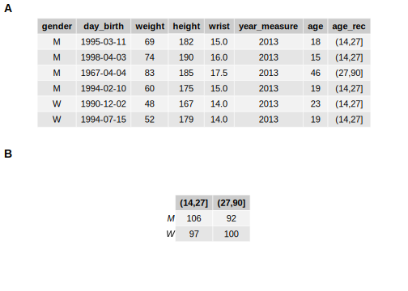
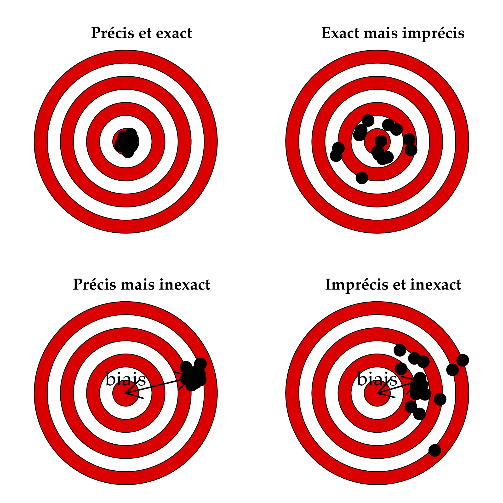
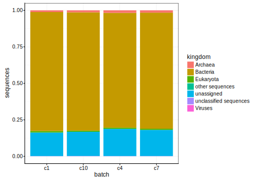

# Traitement des données II {#qualit}


##### Objectifs {-}

- Comprendre les principaux tableaux de données utilisés en science des données

- Savoir réaliser des tableaux de contingences

- Acquérir des données et les encoder correctement et de manière à ce que les analyses soient reproductibles

- Etre capable de remanier des tableaux de données et de fusionner plusieurs tableaux


##### Prérequis {-}

Ce module est la continuation du module \@ref(import) dont le contenu doit être bien compris et maîtrisé avant de poursuivre ici.


## Tableaux de données

Les tableaux de données sont principalement représentés sous deux formes : les tableaux **cas par variables** et les tableaux de **contingence**.


### Tableaux cas par variables

Chaque individus est représenté en ligne et chaque variable en colonne par convention. En anglais, on parlera de [tidy data](https://www.jstatsoft.org/article/view/v059i10).

Nous nous efforcerons de toujours créer un tableau de ce type pour les données brutes. La question à se poser est la suivante : est-ce que j'ai un seul et même individu représenté sur *chaque* ligne du tableau\ ? Si la réponse est non, le tableau de données n'est **pas** correctement encodé.

TODO : exemple et solution

Les tableaux de données que vous avez traités jusqu'à présent étaient tous des tableaux **cas par variables**. Chaque ligne représentait un _individu_ sur qui une ou plusieurs _variables_ (en colonnes) étaient mesurées.


```r
biometry <- read("biometry", package = "BioDataScience", lang = "fr")
head(biometry)
```

```
# # A tibble: 6 x 7
#   gender day_birth  weight height wrist year_measure   age
#   <fct>  <date>      <dbl>  <dbl> <dbl>        <dbl> <dbl>
# 1 M      1995-03-11     69    182  15           2013    18
# 2 M      1998-04-03     74    190  16           2013    15
# 3 M      1967-04-04     83    185  17.5         2013    46
# 4 M      1994-02-10     60    175  15           2013    19
# 5 W      1990-12-02     48    167  14           2013    23
# 6 W      1994-07-15     52    179  14           2013    19
```

L'encodage d'un petit tableau cas par variables directement dans R est facile. Cela peut se faire de plusieurs façons différentes. En voici deux utilisant les fonctions `tibble()` (spécification colonne par colonne, utilisez le snippet `.dmtibble` pour vous aider) et `tribble()` (spécification ligne par ligne, utilisez le snippet `.dmtribble`) :


```r
# Spécification colonne par colonne avec tibble()
(df <- as_dataframe(tibble(
  x = c(1, 2),
  y = c(3, 4)
)))
```

```
# # A tibble: 2 x 2
#       x     y
#   <dbl> <dbl>
# 1     1     3
# 2     2     4
```


```r
# Spécification ligne par ligne avec tribble()
(df1 <- as_dataframe(tribble(
  ~x, ~y,
   1,  3,
   2,  4
)))
```

```
# # A tibble: 2 x 2
#       x     y
#   <dbl> <dbl>
# 1     1     3
# 2     2     4
```

La seconde approche est plus naturelle, mais la première permet d'utiliser diverses fonctions de R pour faciliter l'encodage, par exemple :

- Séquence d'entiers successifs :


```r
1:10
```

```
#  [1]  1  2  3  4  5  6  7  8  9 10
```

- Répétition d'un vecteur 5 fois :


```r
rep(c("a", "b", "c"), 5)
```

```
#  [1] "a" "b" "c" "a" "b" "c" "a" "b" "c" "a" "b" "c" "a" "b" "c"
```

- Répétition de chaque item d'un vecteur 5 fois :


```r
rep(c("a", "b", "c"), each = 5)
```

```
#  [1] "a" "a" "a" "a" "a" "b" "b" "b" "b" "b" "c" "c" "c" "c" "c"
```

Pour de plus gros tableaux, il vaut mieux utiliser un tableur tel que Excel ou LibreOffice Calc pour l'encodage. Les tableurs en ligne comme Google Sheets ou Excel Online conviennent très bien également et facilitent un travail collaboratif ainsi que la mise à disposition sut le Net, comme nous avons vu au module \@ref(import).


### Tableaux de contingence

C'est le dénombrement de l’occurrence de chaque niveau d'une (tableau à une entrée) ou de deux variables **qualitatives** (tableau à double entrée). La fonction `table()` crée ces deux types de tableaux de contingence à partir de données encodées en tableau cas par variables :


```r
biometry$age_rec <- cut(biometry$age, include.lowest = FALSE, right = TRUE,
  breaks = c(14, 27, 90))
(bio_tab <- table(biometry$gender, biometry$age_rec))
```

```
#    
#     (14,27] (27,90]
#   M     106      92
#   W      97     100
```

Le tableau de contingence peut toujours être calculé à partir d'un tableau cas par variable, mais il peut également être encodé directement si nécessaire. Voici un petit tableau de contingence à simple entrée encodé directement comme tel (vecteur nommé transformé en objet `table` à l'aide de la fonction `as.table()`) :


```r
anthirrhinum <- as.table(c(
  "fleur rouge"   = 54,
  "fleur rose"    = 122,
  "fleur blanche" = 58)
)
anthirrhinum
```

```
#   fleur rouge    fleur rose fleur blanche 
#            54           122            58
```

Une troisième possibilité est d'utiliser un tableau indiquant les **fréquences d'occurence** dans une colonne (`freq` ci-dessus). Ce n'est **pas** un tableau cas par variable, mais une forme bien plus concise et pratique pour pré-encoder les données qui devront être ensuite transformées en tableau de contingence à l'aide de la fonction `xtabs()`. Voici un exemple pour un tableau de contingence à double entrée. Notez que le tableau cas par variable correspondant devrait contenir 44 + 116 + 19 + 128 = 307 lignes et serait plus fastidieux à construire et à manipuler (même en utilisant la fonction `rep()`).


```r
timolol <- tibble(
  traitement = c("timolol", "timolol", "placebo", "placebo"),
  patient    = c("sain",    "malade",  "sain",    "malade"),
  freq       = c(44,        116,       19,        128)
)
# Creation du tableau de contingence 
timolol_table <- xtabs(data = timolol, freq ~ patient + traitement)
timolol_table
```

```
#         traitement
# patient  placebo timolol
#   malade     128     116
#   sain        19      44
```

La sortie par défaut d'un tableau de contingence n'est pas très esthétique, mais plusieurs options existent pour le formater d'une façon agréable. En voici deux exemples :


```r
pander::pander(timolol_table,
  caption = "Exemple de table de contingence à double entrée.")
```


--------------------------------
   &nbsp;     placebo   timolol 
------------ --------- ---------
 **malade**     128       116   

  **sain**      19        44    
--------------------------------

Table: Exemple de table de contingence à double entrée.


```r
knitr::kable(timolol_table,
  caption = "Exemple de table de contingence à double entrée.")
```


Table: (\#tab:unnamed-chunk-11)Exemple de table de contingence à double entrée.

          placebo   timolol
-------  --------  --------
malade        128       116
sain           19        44

Il est même possible de représenter *graphiquement* un tableau de contingence pour l'inclure dans une figure composée, éventuellement en le mélangeant avec des graphiques^[Utilisez cette option avec parcimonie : il vaut toujours mieux représenter un tableau comme ... un tableau plutôt que comme une figure !].


```r
tab1 <- ggpubr::ggtexttable(head(biometry), rows = NULL)
tab2 <- ggpubr::ggtexttable(table(biometry$gender, biometry$age_rec))

combine_charts(list(tab1, tab2), nrow = 2)
```



Différentes fonctions dans R existent également pour convertir un tableau de contingence en tableau cas par variables (ou en tous cas, en un tableau similaire). Par exemple, `as_dataframe()` renvoie un tableau indiquant les fréquences d’occurrences :


```r
(timolol2 <- as_dataframe(timolol_table, n = "freq"))
```

```
# # A tibble: 4 x 3
#   patient traitement  freq
#   <chr>   <chr>      <dbl>
# 1 malade  placebo      128
# 2 sain    placebo       19
# 3 malade  timolol      116
# 4 sain    timolol       44
```

Si vous insistez, vous pouvez aussi obtenir un tableau cas par variables (mais celui-ci est très long et peu pratique à manipuler) à l'aide de la fonction `uncount()`^[Notez également que passer d'un tableau cas par variables à un tableau des fréquences d’occurrences se fait à l'aide de `count()`.] :


```r
uncount(timolol2, freq)
```

```
# # A tibble: 307 x 2
#    patient traitement
#    <chr>   <chr>     
#  1 malade  placebo   
#  2 malade  placebo   
#  3 malade  placebo   
#  4 malade  placebo   
#  5 malade  placebo   
#  6 malade  placebo   
#  7 malade  placebo   
#  8 malade  placebo   
#  9 malade  placebo   
# 10 malade  placebo   
# # ... with 297 more rows
```


### Métadonnées

Les données dans un tableau de données doivent **impérativement** être associées à un ensemble de métadonnées. Les métadonnées ("metadata" en anglais) apportent des informations complémentaires nécessaires pour une interprétation correcte des données. Elles permettent donc de replacer les données dans leur contexte et de spécifier des caractéristiques liées aux mesures réalisées comme les unités de mesure par exemple.

$$Donn\acute{e}es \ de \ qualit\acute{e} \ = \ tableau \ de \ donn\acute{e}es + \ m\acute{e}tadonn\acute{e}es$$

Les données correctement qualifiées et documentée sont les seules qui peuvent être utilisées par un collaborateur externe. C'est à dire qu'une personne externe à l'expérience ne peut interpréter le tableau de données que si les métadonnées sont complètes et explicites. 

Exemple de métadonnées :

- Unités de mesure (exemple : 3,5 mL, 21,2 °C)
- Précision de la mesure (21,2 +/- 0,2 dans le cas d’un thermomètre gradué tous les 0,2 °C)
- Méthode de mesure utilisée (thermomètre à mercure, ou électronique, ou ...)
- Type d’instrument employé (marque et modèle du thermomètre par exemple)
- Date de la mesure
- Nom du projet lié à la prise de mesure
- Nom de l’opérateur en charge de la mesure
- ...

Vous avez pu vous apercevoir que la fonction `read()` permet d'ajouter certaines métadonnées comme les unités aux variables d'un jeu de données. Cependant, il n’est pas toujours possible de rajouter les métadonnées dans un tableau sous forme électronique, mais il faut toujours les consigner dans un **cahier de laboratoire**, et ensuite les **retranscrire dans le rapport**. La fonction `labelise()` vous permet de rajouter le **label** et les **unités** de mesure pour vos différentes variables directement dans le tableau. Par exemple, voici l'encodage direct d'un petit jeu de données qui mesure la distance du saut (`jump`) en cm de grenouilles taureaux en fonction de leur masse (`weight`) en g pour 5 individus différents (`ind`). Vous pouvez annoter ce data frame de la façon suivante :


```r
frog <- tribble(
  ~ind, ~jump, ~weight,
   1,    71,    204,
   2,    70,    240,
   3,   100,    296,
   4,   120,    303,
   5,   103,    422
)
# Ajout des labels et des unités
frog <- labelise(frog, self = FALSE,
  label = list(
    ind    = "Individu",
    jump   = "Distance du saut",
    weight = "Masse"),
  units = list(
    jump   = "cm",
    weight = "g")
  )
# Affichage synthétique des données et métadonnées associées
str(frog)
```

```
# Classes 'tbl_df', 'tbl' and 'data.frame':	5 obs. of  3 variables:
#  $ ind   : atomic  1 2 3 4 5
#   ..- attr(*, "label")= chr "Individu"
#  $ jump  : atomic  71 70 100 120 103
#   ..- attr(*, "label")= chr "Distance du saut"
#   ..- attr(*, "units")= chr "cm"
#  $ weight: atomic  204 240 296 303 422
#   ..- attr(*, "label")= chr "Masse"
#   ..- attr(*, "units")= chr "g"
```

```r
# Affichage des labels
label(frog)
```

```
#                ind               jump             weight 
#         "Individu" "Distance du saut"            "Masse"
```

Les métadonnées sont enregistrées dans des **attributs** en R (`attr`). De même, `comment()` permet d'associer ou de récupérer un attribut commentaire :


```r
# Ajout d'un commentaire concernant le jeu de données lui-même
comment(frog) <- "Saut de grenouilles taureaux"
# Ajout d'un commentaire sur une variable
comment(frog$jump) <- "Premier saut mesuré après stimulation de l'animal"
# Affichage synthétique
str(frog)
```

```
# Classes 'tbl_df', 'tbl' and 'data.frame':	5 obs. of  3 variables:
#  $ ind   : atomic  1 2 3 4 5
#   ..- attr(*, "label")= chr "Individu"
#  $ jump  : atomic  71 70 100 120 103
#   ..- attr(*, "label")= chr "Distance du saut"
#   ..- attr(*, "units")= chr "cm"
#   ..- attr(*, "comment")= chr "Premier saut mesuré après stimulation de l'animal"
#  $ weight: atomic  204 240 296 303 422
#   ..- attr(*, "label")= chr "Masse"
#   ..- attr(*, "units")= chr "g"
#  - attr(*, "comment")= chr "Saut de grenouilles taureaux"
```

```r
# Récupération des commentaires
comment(frog)
```

```
# [1] "Saut de grenouilles taureaux"
```

```r
comment(frog$jump)
```

```
# [1] "Premier saut mesuré après stimulation de l'animal"
```

```r
comment(frog$weight) # Rien!
```

```
# NULL
```


### Dictionnaire des données

Le dictionnaire des données est un [élément important de la constitution d'une base de données](https://ineumann.developpez.com/tutoriels/merise/initiation-merise/#LII-B). Il s'agit d'un tableau annexe qui reprend le **nom** de chaque variable, son **label** (nom plus long et explicite), son **type** (numérique, facteur, facteur ordonné, date, ...), la taille (de moindre importance pour nous), et un **commentaire** éventuel. Dans notre contexte, il est également utile de renseigner les **unités** de mesure, et la façon dont les **données manquantes** sont encodées. Cela donne donc un tableau du genre :

| Variable | Label   | Unités   | Type     | Val. manquantes  | Commentaire      |
|:---------|:--------|:--------:|:--------:|:----------------:|:-----------------|
| date     | Date    |  -       | Date     |   NA             | Date de mesure   |
| age      | Âge     | années   | numeric  |   -1             |                  |
| diameter | Diamètre du test  | mm   | numeric  |  NA        | Moyenne de deux diamètres perpendiculaires |
|origin    | Origine | -        | factor   |   unknown        | "Fishery" = oursins sauvages, "Farm" = oursins d'élevage  |

Ce tableau peut-être encodé sous forme textuelle et placé dans le même dossier que le jeu de données lui-même. Il peut aussi être encodé comme feuille supplémentaire dans une fichier Excel.

<div class="note">
<p>Le dictionnaire des données est un outil important pour comprendre ce que contient le tableau de données, et donc, son interprétation. <em>Ne le négligez pas !</em></p>
</div>


## Population et échantillonnage

TODO: partie encore à écrire


```r
DT::datatable(iris)
```

<!--html_preserve--><div id="htmlwidget-c4b1466dc70fcf8d9eff" style="width:100%;height:auto;" class="datatables html-widget"></div>
<script type="application/json" data-for="htmlwidget-c4b1466dc70fcf8d9eff">{"x":{"filter":"none","data":[["1","2","3","4","5","6","7","8","9","10","11","12","13","14","15","16","17","18","19","20","21","22","23","24","25","26","27","28","29","30","31","32","33","34","35","36","37","38","39","40","41","42","43","44","45","46","47","48","49","50","51","52","53","54","55","56","57","58","59","60","61","62","63","64","65","66","67","68","69","70","71","72","73","74","75","76","77","78","79","80","81","82","83","84","85","86","87","88","89","90","91","92","93","94","95","96","97","98","99","100","101","102","103","104","105","106","107","108","109","110","111","112","113","114","115","116","117","118","119","120","121","122","123","124","125","126","127","128","129","130","131","132","133","134","135","136","137","138","139","140","141","142","143","144","145","146","147","148","149","150"],[5.1,4.9,4.7,4.6,5,5.4,4.6,5,4.4,4.9,5.4,4.8,4.8,4.3,5.8,5.7,5.4,5.1,5.7,5.1,5.4,5.1,4.6,5.1,4.8,5,5,5.2,5.2,4.7,4.8,5.4,5.2,5.5,4.9,5,5.5,4.9,4.4,5.1,5,4.5,4.4,5,5.1,4.8,5.1,4.6,5.3,5,7,6.4,6.9,5.5,6.5,5.7,6.3,4.9,6.6,5.2,5,5.9,6,6.1,5.6,6.7,5.6,5.8,6.2,5.6,5.9,6.1,6.3,6.1,6.4,6.6,6.8,6.7,6,5.7,5.5,5.5,5.8,6,5.4,6,6.7,6.3,5.6,5.5,5.5,6.1,5.8,5,5.6,5.7,5.7,6.2,5.1,5.7,6.3,5.8,7.1,6.3,6.5,7.6,4.9,7.3,6.7,7.2,6.5,6.4,6.8,5.7,5.8,6.4,6.5,7.7,7.7,6,6.9,5.6,7.7,6.3,6.7,7.2,6.2,6.1,6.4,7.2,7.4,7.9,6.4,6.3,6.1,7.7,6.3,6.4,6,6.9,6.7,6.9,5.8,6.8,6.7,6.7,6.3,6.5,6.2,5.9],[3.5,3,3.2,3.1,3.6,3.9,3.4,3.4,2.9,3.1,3.7,3.4,3,3,4,4.4,3.9,3.5,3.8,3.8,3.4,3.7,3.6,3.3,3.4,3,3.4,3.5,3.4,3.2,3.1,3.4,4.1,4.2,3.1,3.2,3.5,3.6,3,3.4,3.5,2.3,3.2,3.5,3.8,3,3.8,3.2,3.7,3.3,3.2,3.2,3.1,2.3,2.8,2.8,3.3,2.4,2.9,2.7,2,3,2.2,2.9,2.9,3.1,3,2.7,2.2,2.5,3.2,2.8,2.5,2.8,2.9,3,2.8,3,2.9,2.6,2.4,2.4,2.7,2.7,3,3.4,3.1,2.3,3,2.5,2.6,3,2.6,2.3,2.7,3,2.9,2.9,2.5,2.8,3.3,2.7,3,2.9,3,3,2.5,2.9,2.5,3.6,3.2,2.7,3,2.5,2.8,3.2,3,3.8,2.6,2.2,3.2,2.8,2.8,2.7,3.3,3.2,2.8,3,2.8,3,2.8,3.8,2.8,2.8,2.6,3,3.4,3.1,3,3.1,3.1,3.1,2.7,3.2,3.3,3,2.5,3,3.4,3],[1.4,1.4,1.3,1.5,1.4,1.7,1.4,1.5,1.4,1.5,1.5,1.6,1.4,1.1,1.2,1.5,1.3,1.4,1.7,1.5,1.7,1.5,1,1.7,1.9,1.6,1.6,1.5,1.4,1.6,1.6,1.5,1.5,1.4,1.5,1.2,1.3,1.4,1.3,1.5,1.3,1.3,1.3,1.6,1.9,1.4,1.6,1.4,1.5,1.4,4.7,4.5,4.9,4,4.6,4.5,4.7,3.3,4.6,3.9,3.5,4.2,4,4.7,3.6,4.4,4.5,4.1,4.5,3.9,4.8,4,4.9,4.7,4.3,4.4,4.8,5,4.5,3.5,3.8,3.7,3.9,5.1,4.5,4.5,4.7,4.4,4.1,4,4.4,4.6,4,3.3,4.2,4.2,4.2,4.3,3,4.1,6,5.1,5.9,5.6,5.8,6.6,4.5,6.3,5.8,6.1,5.1,5.3,5.5,5,5.1,5.3,5.5,6.7,6.9,5,5.7,4.9,6.7,4.9,5.7,6,4.8,4.9,5.6,5.8,6.1,6.4,5.6,5.1,5.6,6.1,5.6,5.5,4.8,5.4,5.6,5.1,5.1,5.9,5.7,5.2,5,5.2,5.4,5.1],[0.2,0.2,0.2,0.2,0.2,0.4,0.3,0.2,0.2,0.1,0.2,0.2,0.1,0.1,0.2,0.4,0.4,0.3,0.3,0.3,0.2,0.4,0.2,0.5,0.2,0.2,0.4,0.2,0.2,0.2,0.2,0.4,0.1,0.2,0.2,0.2,0.2,0.1,0.2,0.2,0.3,0.3,0.2,0.6,0.4,0.3,0.2,0.2,0.2,0.2,1.4,1.5,1.5,1.3,1.5,1.3,1.6,1,1.3,1.4,1,1.5,1,1.4,1.3,1.4,1.5,1,1.5,1.1,1.8,1.3,1.5,1.2,1.3,1.4,1.4,1.7,1.5,1,1.1,1,1.2,1.6,1.5,1.6,1.5,1.3,1.3,1.3,1.2,1.4,1.2,1,1.3,1.2,1.3,1.3,1.1,1.3,2.5,1.9,2.1,1.8,2.2,2.1,1.7,1.8,1.8,2.5,2,1.9,2.1,2,2.4,2.3,1.8,2.2,2.3,1.5,2.3,2,2,1.8,2.1,1.8,1.8,1.8,2.1,1.6,1.9,2,2.2,1.5,1.4,2.3,2.4,1.8,1.8,2.1,2.4,2.3,1.9,2.3,2.5,2.3,1.9,2,2.3,1.8],["setosa","setosa","setosa","setosa","setosa","setosa","setosa","setosa","setosa","setosa","setosa","setosa","setosa","setosa","setosa","setosa","setosa","setosa","setosa","setosa","setosa","setosa","setosa","setosa","setosa","setosa","setosa","setosa","setosa","setosa","setosa","setosa","setosa","setosa","setosa","setosa","setosa","setosa","setosa","setosa","setosa","setosa","setosa","setosa","setosa","setosa","setosa","setosa","setosa","setosa","versicolor","versicolor","versicolor","versicolor","versicolor","versicolor","versicolor","versicolor","versicolor","versicolor","versicolor","versicolor","versicolor","versicolor","versicolor","versicolor","versicolor","versicolor","versicolor","versicolor","versicolor","versicolor","versicolor","versicolor","versicolor","versicolor","versicolor","versicolor","versicolor","versicolor","versicolor","versicolor","versicolor","versicolor","versicolor","versicolor","versicolor","versicolor","versicolor","versicolor","versicolor","versicolor","versicolor","versicolor","versicolor","versicolor","versicolor","versicolor","versicolor","versicolor","virginica","virginica","virginica","virginica","virginica","virginica","virginica","virginica","virginica","virginica","virginica","virginica","virginica","virginica","virginica","virginica","virginica","virginica","virginica","virginica","virginica","virginica","virginica","virginica","virginica","virginica","virginica","virginica","virginica","virginica","virginica","virginica","virginica","virginica","virginica","virginica","virginica","virginica","virginica","virginica","virginica","virginica","virginica","virginica","virginica","virginica","virginica","virginica","virginica","virginica"]],"container":"<table class=\"display\">\n  <thead>\n    <tr>\n      <th> <\/th>\n      <th>Sepal.Length<\/th>\n      <th>Sepal.Width<\/th>\n      <th>Petal.Length<\/th>\n      <th>Petal.Width<\/th>\n      <th>Species<\/th>\n    <\/tr>\n  <\/thead>\n<\/table>","options":{"columnDefs":[{"className":"dt-right","targets":[1,2,3,4]},{"orderable":false,"targets":0}],"order":[],"autoWidth":false,"orderClasses":false}},"evals":[],"jsHooks":[]}</script><!--/html_preserve-->


## Acquisition de données

Dans le module \@ref(import), vous avez pris connaissance des types de variable et venez d'apprendre comment encoder différents types de tableaux de données et de leurs associer les indispensables métadonnées. Cependant, la première étape avant d'acquérir des données est de planifier correctement son expérience. La Science des Données est intimement liée à la démarche scientifique et intervient dans toutes les étapes depuis la caractérisation de la question et le planning de l'expérience jusqu'à la diffusion des résultats. Plus en détails, cela correspond à :

- Définir une question (objectif)
- Réaliser une recherche bibliographique sur la thématique
- Définir le protocole de l'expérience à partir de l'objectif
    + Définir la population étudiée et l'échantillonnage
    + Définir les variables à mesurer 
        + Définir les unité des mesures
        + Définir la précision des mesures 
        + Définir les instruments de mesure nécessaires 
- Définir les conventions d'encodage
    + Codifier l'identification des individus
    + Définir les niveaux des variables facteurs et leurs labels
- Acquérir et encoder les données
- Traiter les données
    + Importer des données
    + Remanier des données
    + Visualiser et décrire des données 
    + Analyser les données (traitements statistiques, modélisation,...).
- Produire des supports de présentation pour répondant à la question de départ et diffuser l'information dans la communauté scientifique

Nous traitons ici des premières étapes qui visent à acquérir les données.


### Précision et exactitude

Les erreurs de mesures sont inévitables lors de l'acquisition de nos données. Cependant, il est possible de les minimiser en choisissant un instrument plus précis ("precise" en anglais) et plus exact ("accurate" en anglais). La figure ci-dessous illustre de manière visuelle la différence qu'il y a entre précision et exactitude.




### Codification des données

Afin d'éviter que divers collaborateurs encodent différemment la même information, vous allez devoir préciser très clairement comment encoder les différentes variables de votre jeu de données. Par exemple pour une variable `genre`, est-ce que vous indiquez `homme` ou `femme`, ou `h` / `f`, ou encore `H` / `F` ?

De même, vous allez devoir attribuer un code **unique** à chaque individu mesuré. Enfin, vous devez vous assurer que toutes les mesures sont réalisées de la même manière et avec des instruments qui, s'ils sont différents, seront cependant **intercalibrés**. Comment faire ? Réfléchissez à cette question sur base d'une mesure de la masse des individus à l'aide de pèse-personnes différents ! 


#### Respect de la vie privée

Lors d'expérience sur des personnes, le respect de la vie privée **doit** être pris en compte^[En Europe, les données numériques concernant les personnes sont soumises à des règles strictes édictées dans le [Règlement Général pour la Protection des Données](https://ec.europa.eu/info/law/law-topic/data-protection/reform/rules-business-and-organisations/principles-gdpr_fr) ou **RGPD** en abrégé, en vigueur depuis le 25 mai 2018. Vous devez vous assurer de respecter ce règlement lors de la collecte et de l'utilisation de données relatives à des personnes. Pour les autres type de données, le droit d'auteur ou des copyrights peuvent aussi limiter votre champ d'action. Renseignez-vous !]. Le nom et le prénom, ou toute autre information permettant de retrouver les individus étudiés (adresse mail, numéro de sécurité sociale, etc.) ne *peut pas* apparaître dans la base de données consolidée. En outre, il vous faudra un accord explicite des personnes que vous voulez mesurer, et il faudra leur expliquer *ce que* vous faites, et *comment* les données seront ensuite utilisées. Une question se pose : comment pouvoir revenir vers les enregistrements liés à un individu en particulier (en cas d'erreur d'encodage, par exemple) si les informations relatives directement à ces individus ne sont pas consignées dans le tableau final ? Réfléchissez à la façon dont vous vous y prendriez avant de lire la suite...

Voici un petit tableau qui correspond à ce que vous ne pourrez **pas** faire (nom et prénom explicitement mentionnés dans le tableau) :


```r
(biometry_marvel <- as_dataframe(tribble(
  ~id,                 ~sex ,~weight, ~height,
   "Banner Bruce",     "M",  95,      1.91,
   "Stark Tonny",      "M",  80,      1.79,
   "Fury Nicholas",    "M",  82,      1.93,
   "Romanoff Natasha", "F",  53,      1.70
)))
```

```
# # A tibble: 4 x 4
#   id               sex   weight height
#   <chr>            <chr>  <dbl>  <dbl>
# 1 Banner Bruce     M         95   1.91
# 2 Stark Tonny      M         80   1.79
# 3 Fury Nicholas    M         82   1.93
# 4 Romanoff Natasha F         53   1.7
```

Vous devez fournir une code permettant de garder l'anonymat des sondés à l'ensemble des personnes étudiées vis à vis des analystes qui vont utiliser ces données. Cependant, le code doit permettre au chercheur ayant pris ces mesures de les retrouver dans son cahier de laboratoire, si besoin. Une façon de procéder consiste à attribuer un numéro au hasard par tirage dans une urne à chacune des personnes chargées des mesures. Ensuite, chaque expérimentateur attribue lui-même un second numéro aux différentes personnes qu'il mesure. Prenons par exemple le scientifique n°24 (seul lui sait qu'il porte ce numéro). Il attribue un code de 1 à n à chaque personne étudiée. En combinant le code secret de l'expérimentateur et le code individu, cela donne un identifiant unique de la forme `24_1`, `24_2`, etc. Il pourra alors encoder sa partie comme suit : 


```r
(biometry_marvel1 <- as_dataframe(tribble(
  ~id,     ~sex , ~weight, ~height,
   "24_1",  "M",  95,      1.91,
   "24_2",  "M",  80,      1.79,
   "24_3",  "M",  82,      1.93,
   "24_4",  "F",  53,      1.70
)))
```

```
# # A tibble: 4 x 4
#   id    sex   weight height
#   <chr> <chr>  <dbl>  <dbl>
# 1 24_1  M         95   1.91
# 2 24_2  M         80   1.79
# 3 24_3  M         82   1.93
# 4 24_4  F         53   1.7
```

Il garde néanmoins les correspondances dans son carnet de laboratoire, au cas où il faudrait faire des vérifications ou revenir à la donnée originale.


```r
(biometrie_correspondance <- data_frame(
  name = biometry_marvel$id,
  id   = biometry_marvel1$id
))
```

```
# # A tibble: 4 x 2
#   name             id   
#   <chr>            <chr>
# 1 Banner Bruce     24_1 
# 2 Stark Tonny      24_2 
# 3 Fury Nicholas    24_3 
# 4 Romanoff Natasha 24_4
```

A partir des données du tableau général consolidé, personne à part lui ne peut revenir sur ces données d'origine et mettre un nom sur les individus mesurés. Et lui-même n'a pas la possibilité de déterminer *qui* se cache derrière les autres identifiants tels `3_1`, `12_4`, `21_2`, etc.


##### A vous de jouer {-}

Votre objectif est d'acquérir des données pour étudier la prévalence de l'obésité dans la population. En classe, vous allez réfléchir par équipes aux données qu'il vous faudra mesurer : *quoi ?* *pourquoi ?* *comment ?* Les résultats de votre réflexion seront ensuite consolidées pour arriver à un *consensus*  général. Ensuite, le fruit de cette réflexion ainsi que l'analyse que vous réaliserez seront à ajouter dans le projet **sdd1_biometry**. Une feuille Google Sheets sera mise à disposition pour encoder vos données de manière collaborative sur base des spécifications que vous aurez formulées.


\BeginKnitrBlock{bdd}<div class="bdd">La tableau de données que vous devez completer est disponible via le lien suivant\ :

- <https://docs.google.com/spreadsheets/d/1UfpZvx1_nd7d10vIMAfGVZ1vWyIuzeiKxPL0jfkNSQM/edit?usp=sharing>

Le dictionnaire des données est disponible via le lien suivant\ :

- <https://docs.google.com/document/d/1lgYD39W7vmVYyS5ea0wEl9ArE1dhuDRkIIBzZ4K6d_o/edit?usp=sharing>

Le tableau de données est téléchargeable via le lien suivant\ :
  
- <https://docs.google.com/spreadsheets/d/e/2PACX-1vQoVtSWbENWzxbALxD0qyNDqxV4uSYqzLCtJgcNGE7ciT6nkWOjA9b6dMBHaSUY8Nw5f-mSpUEeN-3S/pub?output=csv>
  </div>\EndKnitrBlock{bdd}

**Attention, veuillez à respectez les conventions** que vous aurez édifiées ensemble lors de l'encodage... et n'oubliez pas de préciser également les métadonnées !

## Recombinaison de tableaux

### Formats long et large

.](images/sdd1_06/tidyr-spread-gather.gif)

Le **format long** d'un tableau de données correspond à un encodage en un minimum de colonnes, les données étant réparties sur un plus grand nombre de lignes en comparaison du **format large** qui regroupe les données dans plusieurs colonnes successives. Voici un exemple fictif d'un jeu de données au fomat long :


```
# # A tibble: 6 x 3
#   sex   traitment value
#   <chr> <chr>     <dbl>
# 1 m     control     1.2
# 2 f     control     3.4
# 3 m     test1       4.8
# 4 f     test1       3.1
# 5 m     test2       0.9
# 6 f     test2       1.2
```

Voici maintenant le même jeu de données présenté dans le format large :


```
# # A tibble: 2 x 4
#   sex   control test1 test2
#   <chr>   <dbl> <dbl> <dbl>
# 1 m         1.2   4.8   0.9
# 2 f         3.4   3.1   1.2
```

Dans le format large, les différents niveaux de la variable facteur `treatment` deviennent autant de colonnes (donc de variables) séparées, et la variable d'origine n'existe plus de manière explicite. Ces deux tableaux contiennent la même information. Bien évidemment, un seul de ces formats est un _tableau cas par variables correct_. Le format long sera le bon si tous les mesures sont réalisées sur des individus différents. Le format large sera correct, par contre, si les différentes mesures ont été faites à chaque fois sur les _mêmes_ individus (dans le cas présent, _un seul_ mâle et _une seule_ femelle auraient alors été mesurés dans les trois situations).

<div class="note">
<p>C'est la règle qui veut qu'<strong>une ligne corresponde à un et un seul individu</strong> dans un tableau cas par variables qui permet de décider si le format long ou le format large est celui qui est correctement encodé.</p>
</div>

Encoder correctement un tableau de données n'est pas une chose simple. Il peut y avoir plusieurs manières de le représenter. De plus, beaucoup de scientifiques ignorent ou oublient l'importance de bien encoder un tableau sous forme cas par variables. Lorsque vous souhaitez effectuer une représentation graphique, un format peut convenir mieux qu'un autre également, en fonction de ce que vous souhaitez visualiser sur le graphique. Il est donc important de connaitre les fonctions permettant de recombiner simplement un tableau de données d'une forme vers l'autre : `gather()` et `spread()`. 

<div class="info">
<p>L'aide-mémoire <a href="https://github.com/rstudio/cheatsheets/blob/master/data-import.pdf">Data Import</a> est un outil pratique pour vous aider à retrouver les fonctions. Les explications relatives à cette partie s'y trouvent dans la section <strong>Reshape Data</strong>.</p>
<p>L'utilisation des fonction <code>gather()</code> et <code>spread()</code> provenant du package <strong>tidyr</strong> est également décrite en détails dans <a href="https://r4ds.had.co.nz/tidy-data.html#spreading-and-gathering">R for Data Science</a>.</p>
</div>

Prenons l'exemple d'un jeu de données provenant de l'article scientifique suivant : [Paleomicrobiology to investigate copper resistance in bacteria : isolation and description of Cupriavidus necator B9 in the soil of a medieval foundry](http://di.umons.ac.be/details.aspx?pub=0a0de102-c145-403f-9e1c-8ad4fdc1fc39). L'article est basé sur l'analyse métagénomique de type "shotgun" pour quatre communautés microbiennes (notées `c1`, `c4`, `c7`et `c10`, respectivement)^[Les analyses métagénomiques coûtent très cher. Il est souvent impossible de faire des réplicats. Un seul échantillon d'ADN a donc été séquencé ici pour chaque communauté.]. Il en résulte une longue liste de séquences que l'on peut attribuer à des règnes.


```r
shotgun_wide <- tibble(
  kingdom = c("Archaea", "Bacteria", "Eukaryota", "Viruses",
              "other sequences", "unassigned", "unclassified sequences"),
  c1      = c( 98379, 6665903, 81593, 1245, 757, 1320419, 15508),
  c4      = c( 217985, 9739134, 101834, 4867, 1406, 2311326, 21572),
  c7      = c( 143314, 7103244, 71111, 5181, 907, 1600886, 14423),
  c10     = c(272541, 15966053, 150918, 15303, 2688, 3268646, 35024))

rmarkdown::paged_table(shotgun_wide)
```

<div data-pagedtable="false">
  <script data-pagedtable-source type="application/json">
{"columns":[{"label":["kingdom"],"name":[1],"type":["chr"],"align":["left"]},{"label":["c1"],"name":[2],"type":["dbl"],"align":["right"]},{"label":["c4"],"name":[3],"type":["dbl"],"align":["right"]},{"label":["c7"],"name":[4],"type":["dbl"],"align":["right"]},{"label":["c10"],"name":[5],"type":["dbl"],"align":["right"]}],"data":[{"1":"Archaea","2":"98379","3":"217985","4":"143314","5":"272541"},{"1":"Bacteria","2":"6665903","3":"9739134","4":"7103244","5":"15966053"},{"1":"Eukaryota","2":"81593","3":"101834","4":"71111","5":"150918"},{"1":"Viruses","2":"1245","3":"4867","4":"5181","5":"15303"},{"1":"other sequences","2":"757","3":"1406","4":"907","5":"2688"},{"1":"unassigned","2":"1320419","3":"2311326","4":"1600886","5":"3268646"},{"1":"unclassified sequences","2":"15508","3":"21572","4":"14423","5":"35024"}],"options":{"columns":{"min":{},"max":[10]},"rows":{"min":[10],"max":[10]},"pages":{}}}
  </script>
</div>

Ce tableau est clair et lisible... seulement, est-il correctement encodé en cas par variables d'après vous\ ? Quelle que soit la réponse à cette question, il est toujours possible de passer de ce format large à un format long dans R de la façon suivante :


```r
 shotgun_long <- gather(shotgun_wide,
   c1, c4, c7, c10, key = "batch", value = "sequences")

rmarkdown::paged_table(shotgun_long)
```

<div data-pagedtable="false">
  <script data-pagedtable-source type="application/json">
{"columns":[{"label":["kingdom"],"name":[1],"type":["chr"],"align":["left"]},{"label":["batch"],"name":[2],"type":["chr"],"align":["left"]},{"label":["sequences"],"name":[3],"type":["dbl"],"align":["right"]}],"data":[{"1":"Archaea","2":"c1","3":"98379"},{"1":"Bacteria","2":"c1","3":"6665903"},{"1":"Eukaryota","2":"c1","3":"81593"},{"1":"Viruses","2":"c1","3":"1245"},{"1":"other sequences","2":"c1","3":"757"},{"1":"unassigned","2":"c1","3":"1320419"},{"1":"unclassified sequences","2":"c1","3":"15508"},{"1":"Archaea","2":"c4","3":"217985"},{"1":"Bacteria","2":"c4","3":"9739134"},{"1":"Eukaryota","2":"c4","3":"101834"},{"1":"Viruses","2":"c4","3":"4867"},{"1":"other sequences","2":"c4","3":"1406"},{"1":"unassigned","2":"c4","3":"2311326"},{"1":"unclassified sequences","2":"c4","3":"21572"},{"1":"Archaea","2":"c7","3":"143314"},{"1":"Bacteria","2":"c7","3":"7103244"},{"1":"Eukaryota","2":"c7","3":"71111"},{"1":"Viruses","2":"c7","3":"5181"},{"1":"other sequences","2":"c7","3":"907"},{"1":"unassigned","2":"c7","3":"1600886"},{"1":"unclassified sequences","2":"c7","3":"14423"},{"1":"Archaea","2":"c10","3":"272541"},{"1":"Bacteria","2":"c10","3":"15966053"},{"1":"Eukaryota","2":"c10","3":"150918"},{"1":"Viruses","2":"c10","3":"15303"},{"1":"other sequences","2":"c10","3":"2688"},{"1":"unassigned","2":"c10","3":"3268646"},{"1":"unclassified sequences","2":"c10","3":"35024"}],"options":{"columns":{"min":{},"max":[10]},"rows":{"min":[10],"max":[10]},"pages":{}}}
  </script>
</div>

Voici la logique derrière `gather()`, présentée sous forme d'une animation :

.](images/sdd1_06/gather.gif)

Vous conviendrez que le tableau nommé `shotgun_long` est moins compact et moins aisé à lire comparé à `shotgun_wide`. C'est une raison qui fait que beaucoup de scientifiques sont tentés d'utiliser le format large alors qu'ici il ne correspond **pas** à un tableau cas par variables correct, puisqu'il est impossible que les *mêmes* individus soient présents dans les différents lots (il s'agit de communautés microbiennes *indépendantes* les unes des autres). De plus, seul le format `shotgun_long` permet de produire des graphiques pertinents^[Notez malgré tout que, à condition de bien en comprendre les implications, le format complémentaire peut se justifier dans une publication pour y présenter un tableau le plus lisible possible, ce qui est le cas ici. Mais pour les analyses, c'est le format qui correspond à un tableau cas par variables qui **doit** être utilisé.].


```r
chart(data = shotgun_long, sequences ~ batch %fill=% kingdom) +
  geom_col(position = "fill")
```



Essayez de réaliser ce type de graphique en partant de `shotgun_wide`... Bonne chance !

<div class="note">
<p>Très souvent, lorsqu'il est impossible de réaliser un graphique avec <code>chart()</code> ou <code>ggplot()</code> parce que les données se présentent mal, c'est parce que le jeu de données est encodé de manière incorrecte ! Si les données sont, par contre, correctement encodées, demandez-vous alors si le graphique que vous voulez faire est pertinent.</p>
</div>

Pour passer du format long au format large (traitement inverse à `gather()`), il faut utiliser la fonction `spread()`. Ainsi pour retrouver le tableau d'origine (ou quelque chose de très semblable) à partir de `shotgun_long` nous utiliserons : 


```r
shotgun_wide2 <- spread(shotgun_long, key = batch, value = sequences) 

rmarkdown::paged_table(shotgun_wide2)
```

<div data-pagedtable="false">
  <script data-pagedtable-source type="application/json">
{"columns":[{"label":["kingdom"],"name":[1],"type":["chr"],"align":["left"]},{"label":["c1"],"name":[2],"type":["dbl"],"align":["right"]},{"label":["c10"],"name":[3],"type":["dbl"],"align":["right"]},{"label":["c4"],"name":[4],"type":["dbl"],"align":["right"]},{"label":["c7"],"name":[5],"type":["dbl"],"align":["right"]}],"data":[{"1":"Archaea","2":"98379","3":"272541","4":"217985","5":"143314"},{"1":"Bacteria","2":"6665903","3":"15966053","4":"9739134","5":"7103244"},{"1":"Eukaryota","2":"81593","3":"150918","4":"101834","5":"71111"},{"1":"other sequences","2":"757","3":"2688","4":"1406","5":"907"},{"1":"unassigned","2":"1320419","3":"3268646","4":"2311326","5":"1600886"},{"1":"unclassified sequences","2":"15508","3":"35024","4":"21572","5":"14423"},{"1":"Viruses","2":"1245","3":"15303","4":"4867","5":"5181"}],"options":{"columns":{"min":{},"max":[10]},"rows":{"min":[10],"max":[10]},"pages":{}}}
  </script>
</div>

La logique de `spread()` est illustrée via l'animation suivante :

.](images/sdd1_06/spread.gif)

\BeginKnitrBlock{bdd}<div class="bdd">Une tâche en binome vous est assignée via l'URL suivante\ :

- <https://classroom.github.com/g/shtUkGbz>

Créez un rapport et effectuez les différents exercices en suivant les instructions qui sont dans le fichier `README.md` de ce dépôt GitHub Classroom.</div>\EndKnitrBlock{bdd}


### Recombinaison de variables

Parfois, ce sont les variables qui sont encodées de manière inappropriée par rapport aux analyses que vous souhaitez faire. Les fonctions `separate()` et `unite()` permettent de séparer une colonne en plusieurs, ou inversément.

<div class="info">
<p>L'aide-mémoire <a href="https://github.com/rstudio/cheatsheets/blob/master/data-import.pdf">Data Import</a> vous rappelle ces fonctions dans sa section <strong>Split Cells</strong>. Elles sont également décrites en détails dans <a href="https://r4ds.had.co.nz/tidy-data.html#separating-and-uniting">R for Data Science</a>.</p>
</div>

Partons, par exemple, du jeu de données sur la biométrie des crabes du package **MASS** :


```r
crabs <- read("crabs", package = "MASS", lang = "fr")
rmarkdown::paged_table(crabs)
```

<div data-pagedtable="false">
  <script data-pagedtable-source type="application/json">
{"columns":[{"label":["species"],"name":[1],"type":["fctr"],"align":["left"]},{"label":["sex"],"name":[2],"type":["fctr"],"align":["left"]},{"label":["index"],"name":[3],"type":["int"],"align":["right"]},{"label":["front"],"name":[4],"type":["dbl"],"align":["right"]},{"label":["rear"],"name":[5],"type":["dbl"],"align":["right"]},{"label":["length"],"name":[6],"type":["dbl"],"align":["right"]},{"label":["width"],"name":[7],"type":["dbl"],"align":["right"]},{"label":["depth"],"name":[8],"type":["dbl"],"align":["right"]}],"data":[{"1":"B","2":"M","3":"1","4":"8.1","5":"6.7","6":"16.1","7":"19.0","8":"7.0"},{"1":"B","2":"M","3":"2","4":"8.8","5":"7.7","6":"18.1","7":"20.8","8":"7.4"},{"1":"B","2":"M","3":"3","4":"9.2","5":"7.8","6":"19.0","7":"22.4","8":"7.7"},{"1":"B","2":"M","3":"4","4":"9.6","5":"7.9","6":"20.1","7":"23.1","8":"8.2"},{"1":"B","2":"M","3":"5","4":"9.8","5":"8.0","6":"20.3","7":"23.0","8":"8.2"},{"1":"B","2":"M","3":"6","4":"10.8","5":"9.0","6":"23.0","7":"26.5","8":"9.8"},{"1":"B","2":"M","3":"7","4":"11.1","5":"9.9","6":"23.8","7":"27.1","8":"9.8"},{"1":"B","2":"M","3":"8","4":"11.6","5":"9.1","6":"24.5","7":"28.4","8":"10.4"},{"1":"B","2":"M","3":"9","4":"11.8","5":"9.6","6":"24.2","7":"27.8","8":"9.7"},{"1":"B","2":"M","3":"10","4":"11.8","5":"10.5","6":"25.2","7":"29.3","8":"10.3"},{"1":"B","2":"M","3":"11","4":"12.2","5":"10.8","6":"27.3","7":"31.6","8":"10.9"},{"1":"B","2":"M","3":"12","4":"12.3","5":"11.0","6":"26.8","7":"31.5","8":"11.4"},{"1":"B","2":"M","3":"13","4":"12.6","5":"10.0","6":"27.7","7":"31.7","8":"11.4"},{"1":"B","2":"M","3":"14","4":"12.8","5":"10.2","6":"27.2","7":"31.8","8":"10.9"},{"1":"B","2":"M","3":"15","4":"12.8","5":"10.9","6":"27.4","7":"31.5","8":"11.0"},{"1":"B","2":"M","3":"16","4":"12.9","5":"11.0","6":"26.8","7":"30.9","8":"11.4"},{"1":"B","2":"M","3":"17","4":"13.1","5":"10.6","6":"28.2","7":"32.3","8":"11.0"},{"1":"B","2":"M","3":"18","4":"13.1","5":"10.9","6":"28.3","7":"32.4","8":"11.2"},{"1":"B","2":"M","3":"19","4":"13.3","5":"11.1","6":"27.8","7":"32.3","8":"11.3"},{"1":"B","2":"M","3":"20","4":"13.9","5":"11.1","6":"29.2","7":"33.3","8":"12.1"},{"1":"B","2":"M","3":"21","4":"14.3","5":"11.6","6":"31.3","7":"35.5","8":"12.7"},{"1":"B","2":"M","3":"22","4":"14.6","5":"11.3","6":"31.9","7":"36.4","8":"13.7"},{"1":"B","2":"M","3":"23","4":"15.0","5":"10.9","6":"31.4","7":"36.4","8":"13.2"},{"1":"B","2":"M","3":"24","4":"15.0","5":"11.5","6":"32.4","7":"37.0","8":"13.4"},{"1":"B","2":"M","3":"25","4":"15.0","5":"11.9","6":"32.5","7":"37.2","8":"13.6"},{"1":"B","2":"M","3":"26","4":"15.2","5":"12.1","6":"32.3","7":"36.7","8":"13.6"},{"1":"B","2":"M","3":"27","4":"15.4","5":"11.8","6":"33.0","7":"37.5","8":"13.6"},{"1":"B","2":"M","3":"28","4":"15.7","5":"12.6","6":"35.8","7":"40.3","8":"14.5"},{"1":"B","2":"M","3":"29","4":"15.9","5":"12.7","6":"34.0","7":"38.9","8":"14.2"},{"1":"B","2":"M","3":"30","4":"16.1","5":"11.6","6":"33.8","7":"39.0","8":"14.4"},{"1":"B","2":"M","3":"31","4":"16.1","5":"12.8","6":"34.9","7":"40.7","8":"15.7"},{"1":"B","2":"M","3":"32","4":"16.2","5":"13.3","6":"36.0","7":"41.7","8":"15.4"},{"1":"B","2":"M","3":"33","4":"16.3","5":"12.7","6":"35.6","7":"40.9","8":"14.9"},{"1":"B","2":"M","3":"34","4":"16.4","5":"13.0","6":"35.7","7":"41.8","8":"15.2"},{"1":"B","2":"M","3":"35","4":"16.6","5":"13.5","6":"38.1","7":"43.4","8":"14.9"},{"1":"B","2":"M","3":"36","4":"16.8","5":"12.8","6":"36.2","7":"41.8","8":"14.9"},{"1":"B","2":"M","3":"37","4":"16.9","5":"13.2","6":"37.3","7":"42.7","8":"15.6"},{"1":"B","2":"M","3":"38","4":"17.1","5":"12.6","6":"36.4","7":"42.0","8":"15.1"},{"1":"B","2":"M","3":"39","4":"17.1","5":"12.7","6":"36.7","7":"41.9","8":"15.6"},{"1":"B","2":"M","3":"40","4":"17.2","5":"13.5","6":"37.6","7":"43.9","8":"16.1"},{"1":"B","2":"M","3":"41","4":"17.7","5":"13.6","6":"38.7","7":"44.5","8":"16.0"},{"1":"B","2":"M","3":"42","4":"17.9","5":"14.1","6":"39.7","7":"44.6","8":"16.8"},{"1":"B","2":"M","3":"43","4":"18.0","5":"13.7","6":"39.2","7":"44.4","8":"16.2"},{"1":"B","2":"M","3":"44","4":"18.8","5":"15.8","6":"42.1","7":"49.0","8":"17.8"},{"1":"B","2":"M","3":"45","4":"19.3","5":"13.5","6":"41.6","7":"47.4","8":"17.8"},{"1":"B","2":"M","3":"46","4":"19.3","5":"13.8","6":"40.9","7":"46.5","8":"16.8"},{"1":"B","2":"M","3":"47","4":"19.7","5":"15.3","6":"41.9","7":"48.5","8":"17.8"},{"1":"B","2":"M","3":"48","4":"19.8","5":"14.2","6":"43.2","7":"49.7","8":"18.6"},{"1":"B","2":"M","3":"49","4":"19.8","5":"14.3","6":"42.4","7":"48.9","8":"18.3"},{"1":"B","2":"M","3":"50","4":"21.3","5":"15.7","6":"47.1","7":"54.6","8":"20.0"},{"1":"B","2":"F","3":"1","4":"7.2","5":"6.5","6":"14.7","7":"17.1","8":"6.1"},{"1":"B","2":"F","3":"2","4":"9.0","5":"8.5","6":"19.3","7":"22.7","8":"7.7"},{"1":"B","2":"F","3":"3","4":"9.1","5":"8.1","6":"18.5","7":"21.6","8":"7.7"},{"1":"B","2":"F","3":"4","4":"9.1","5":"8.2","6":"19.2","7":"22.2","8":"7.7"},{"1":"B","2":"F","3":"5","4":"9.5","5":"8.2","6":"19.6","7":"22.4","8":"7.8"},{"1":"B","2":"F","3":"6","4":"9.8","5":"8.9","6":"20.4","7":"23.9","8":"8.8"},{"1":"B","2":"F","3":"7","4":"10.1","5":"9.3","6":"20.9","7":"24.4","8":"8.4"},{"1":"B","2":"F","3":"8","4":"10.3","5":"9.5","6":"21.3","7":"24.7","8":"8.9"},{"1":"B","2":"F","3":"9","4":"10.4","5":"9.7","6":"21.7","7":"25.4","8":"8.3"},{"1":"B","2":"F","3":"10","4":"10.8","5":"9.5","6":"22.5","7":"26.3","8":"9.1"},{"1":"B","2":"F","3":"11","4":"11.0","5":"9.8","6":"22.5","7":"25.7","8":"8.2"},{"1":"B","2":"F","3":"12","4":"11.2","5":"10.0","6":"22.8","7":"26.9","8":"9.4"},{"1":"B","2":"F","3":"13","4":"11.5","5":"11.0","6":"24.7","7":"29.2","8":"10.1"},{"1":"B","2":"F","3":"14","4":"11.6","5":"11.0","6":"24.6","7":"28.5","8":"10.4"},{"1":"B","2":"F","3":"15","4":"11.6","5":"11.4","6":"23.7","7":"27.7","8":"10.0"},{"1":"B","2":"F","3":"16","4":"11.7","5":"10.6","6":"24.9","7":"28.5","8":"10.4"},{"1":"B","2":"F","3":"17","4":"11.9","5":"11.4","6":"26.0","7":"30.1","8":"10.9"},{"1":"B","2":"F","3":"18","4":"12.0","5":"10.7","6":"24.6","7":"28.9","8":"10.5"},{"1":"B","2":"F","3":"19","4":"12.0","5":"11.1","6":"25.4","7":"29.2","8":"11.0"},{"1":"B","2":"F","3":"20","4":"12.6","5":"12.2","6":"26.1","7":"31.6","8":"11.2"},{"1":"B","2":"F","3":"21","4":"12.8","5":"11.7","6":"27.1","7":"31.2","8":"11.9"},{"1":"B","2":"F","3":"22","4":"12.8","5":"12.2","6":"26.7","7":"31.1","8":"11.1"},{"1":"B","2":"F","3":"23","4":"12.8","5":"12.2","6":"27.9","7":"31.9","8":"11.5"},{"1":"B","2":"F","3":"24","4":"13.0","5":"11.4","6":"27.3","7":"31.8","8":"11.3"},{"1":"B","2":"F","3":"25","4":"13.1","5":"11.5","6":"27.6","7":"32.6","8":"11.1"},{"1":"B","2":"F","3":"26","4":"13.2","5":"12.2","6":"27.9","7":"32.1","8":"11.5"},{"1":"B","2":"F","3":"27","4":"13.4","5":"11.8","6":"28.4","7":"32.7","8":"11.7"},{"1":"B","2":"F","3":"28","4":"13.7","5":"12.5","6":"28.6","7":"33.8","8":"11.9"},{"1":"B","2":"F","3":"29","4":"13.9","5":"13.0","6":"30.0","7":"34.9","8":"13.1"},{"1":"B","2":"F","3":"30","4":"14.7","5":"12.5","6":"30.1","7":"34.7","8":"12.5"},{"1":"B","2":"F","3":"31","4":"14.9","5":"13.2","6":"30.1","7":"35.6","8":"12.0"},{"1":"B","2":"F","3":"32","4":"15.0","5":"13.8","6":"31.7","7":"36.9","8":"14.0"},{"1":"B","2":"F","3":"33","4":"15.0","5":"14.2","6":"32.8","7":"37.4","8":"14.0"},{"1":"B","2":"F","3":"34","4":"15.1","5":"13.3","6":"31.8","7":"36.3","8":"13.5"},{"1":"B","2":"F","3":"35","4":"15.1","5":"13.5","6":"31.9","7":"37.0","8":"13.8"},{"1":"B","2":"F","3":"36","4":"15.1","5":"13.8","6":"31.7","7":"36.6","8":"13.0"},{"1":"B","2":"F","3":"37","4":"15.2","5":"14.3","6":"33.9","7":"38.5","8":"14.7"},{"1":"B","2":"F","3":"38","4":"15.3","5":"14.2","6":"32.6","7":"38.3","8":"13.8"},{"1":"B","2":"F","3":"39","4":"15.4","5":"13.3","6":"32.4","7":"37.6","8":"13.8"},{"1":"B","2":"F","3":"40","4":"15.5","5":"13.8","6":"33.4","7":"38.7","8":"14.7"},{"1":"B","2":"F","3":"41","4":"15.6","5":"13.9","6":"32.8","7":"37.9","8":"13.4"},{"1":"B","2":"F","3":"42","4":"15.6","5":"14.7","6":"33.9","7":"39.5","8":"14.3"},{"1":"B","2":"F","3":"43","4":"15.7","5":"13.9","6":"33.6","7":"38.5","8":"14.1"},{"1":"B","2":"F","3":"44","4":"15.8","5":"15.0","6":"34.5","7":"40.3","8":"15.3"},{"1":"B","2":"F","3":"45","4":"16.2","5":"15.2","6":"34.5","7":"40.1","8":"13.9"},{"1":"B","2":"F","3":"46","4":"16.4","5":"14.0","6":"34.2","7":"39.8","8":"15.2"},{"1":"B","2":"F","3":"47","4":"16.7","5":"16.1","6":"36.6","7":"41.9","8":"15.4"},{"1":"B","2":"F","3":"48","4":"17.4","5":"16.9","6":"38.2","7":"44.1","8":"16.6"},{"1":"B","2":"F","3":"49","4":"17.5","5":"16.7","6":"38.6","7":"44.5","8":"17.0"},{"1":"B","2":"F","3":"50","4":"19.2","5":"16.5","6":"40.9","7":"47.9","8":"18.1"},{"1":"O","2":"M","3":"1","4":"9.1","5":"6.9","6":"16.7","7":"18.6","8":"7.4"},{"1":"O","2":"M","3":"2","4":"10.2","5":"8.2","6":"20.2","7":"22.2","8":"9.0"},{"1":"O","2":"M","3":"3","4":"10.7","5":"8.6","6":"20.7","7":"22.7","8":"9.2"},{"1":"O","2":"M","3":"4","4":"11.4","5":"9.0","6":"22.7","7":"24.8","8":"10.1"},{"1":"O","2":"M","3":"5","4":"12.5","5":"9.4","6":"23.2","7":"26.0","8":"10.8"},{"1":"O","2":"M","3":"6","4":"12.5","5":"9.4","6":"24.2","7":"27.0","8":"11.2"},{"1":"O","2":"M","3":"7","4":"12.7","5":"10.4","6":"26.0","7":"28.8","8":"12.1"},{"1":"O","2":"M","3":"8","4":"13.2","5":"11.0","6":"27.1","7":"30.4","8":"12.2"},{"1":"O","2":"M","3":"9","4":"13.4","5":"10.1","6":"26.6","7":"29.6","8":"12.0"},{"1":"O","2":"M","3":"10","4":"13.7","5":"11.0","6":"27.5","7":"30.5","8":"12.2"},{"1":"O","2":"M","3":"11","4":"14.0","5":"11.5","6":"29.2","7":"32.2","8":"13.1"},{"1":"O","2":"M","3":"12","4":"14.1","5":"10.4","6":"28.9","7":"31.8","8":"13.5"},{"1":"O","2":"M","3":"13","4":"14.1","5":"10.5","6":"29.1","7":"31.6","8":"13.1"},{"1":"O","2":"M","3":"14","4":"14.1","5":"10.7","6":"28.7","7":"31.9","8":"13.3"},{"1":"O","2":"M","3":"15","4":"14.2","5":"10.6","6":"28.7","7":"31.7","8":"12.9"},{"1":"O","2":"M","3":"16","4":"14.2","5":"10.7","6":"27.8","7":"30.9","8":"12.7"},{"1":"O","2":"M","3":"17","4":"14.2","5":"11.3","6":"29.2","7":"32.2","8":"13.5"},{"1":"O","2":"M","3":"18","4":"14.6","5":"11.3","6":"29.9","7":"33.5","8":"12.8"},{"1":"O","2":"M","3":"19","4":"14.7","5":"11.1","6":"29.0","7":"32.1","8":"13.1"},{"1":"O","2":"M","3":"20","4":"15.1","5":"11.4","6":"30.2","7":"33.3","8":"14.0"},{"1":"O","2":"M","3":"21","4":"15.1","5":"11.5","6":"30.9","7":"34.0","8":"13.9"},{"1":"O","2":"M","3":"22","4":"15.4","5":"11.1","6":"30.2","7":"33.6","8":"13.5"},{"1":"O","2":"M","3":"23","4":"15.7","5":"12.2","6":"31.7","7":"34.2","8":"14.2"},{"1":"O","2":"M","3":"24","4":"16.2","5":"11.8","6":"32.3","7":"35.3","8":"14.7"},{"1":"O","2":"M","3":"25","4":"16.3","5":"11.6","6":"31.6","7":"34.2","8":"14.5"},{"1":"O","2":"M","3":"26","4":"17.1","5":"12.6","6":"35.0","7":"38.9","8":"15.7"},{"1":"O","2":"M","3":"27","4":"17.4","5":"12.8","6":"36.1","7":"39.5","8":"16.2"},{"1":"O","2":"M","3":"28","4":"17.5","5":"12.0","6":"34.4","7":"37.3","8":"15.3"},{"1":"O","2":"M","3":"29","4":"17.5","5":"12.7","6":"34.6","7":"38.4","8":"16.1"},{"1":"O","2":"M","3":"30","4":"17.8","5":"12.5","6":"36.0","7":"39.8","8":"16.7"},{"1":"O","2":"M","3":"31","4":"17.9","5":"12.9","6":"36.9","7":"40.9","8":"16.5"},{"1":"O","2":"M","3":"32","4":"18.0","5":"13.4","6":"36.7","7":"41.3","8":"17.1"},{"1":"O","2":"M","3":"33","4":"18.2","5":"13.7","6":"38.8","7":"42.7","8":"17.2"},{"1":"O","2":"M","3":"34","4":"18.4","5":"13.4","6":"37.9","7":"42.2","8":"17.7"},{"1":"O","2":"M","3":"35","4":"18.6","5":"13.4","6":"37.8","7":"41.9","8":"17.3"},{"1":"O","2":"M","3":"36","4":"18.6","5":"13.5","6":"36.9","7":"40.2","8":"17.0"},{"1":"O","2":"M","3":"37","4":"18.8","5":"13.4","6":"37.2","7":"41.1","8":"17.5"},{"1":"O","2":"M","3":"38","4":"18.8","5":"13.8","6":"39.2","7":"43.3","8":"17.9"},{"1":"O","2":"M","3":"39","4":"19.4","5":"14.1","6":"39.1","7":"43.2","8":"17.8"},{"1":"O","2":"M","3":"40","4":"19.4","5":"14.4","6":"39.8","7":"44.3","8":"17.9"},{"1":"O","2":"M","3":"41","4":"20.1","5":"13.7","6":"40.6","7":"44.5","8":"18.0"},{"1":"O","2":"M","3":"42","4":"20.6","5":"14.4","6":"42.8","7":"46.5","8":"19.6"},{"1":"O","2":"M","3":"43","4":"21.0","5":"15.0","6":"42.9","7":"47.2","8":"19.4"},{"1":"O","2":"M","3":"44","4":"21.5","5":"15.5","6":"45.5","7":"49.7","8":"20.9"},{"1":"O","2":"M","3":"45","4":"21.6","5":"15.4","6":"45.7","7":"49.7","8":"20.6"},{"1":"O","2":"M","3":"46","4":"21.6","5":"14.8","6":"43.4","7":"48.2","8":"20.1"},{"1":"O","2":"M","3":"47","4":"21.9","5":"15.7","6":"45.4","7":"51.0","8":"21.1"},{"1":"O","2":"M","3":"48","4":"22.1","5":"15.8","6":"44.6","7":"49.6","8":"20.5"},{"1":"O","2":"M","3":"49","4":"23.0","5":"16.8","6":"47.2","7":"52.1","8":"21.5"},{"1":"O","2":"M","3":"50","4":"23.1","5":"15.7","6":"47.6","7":"52.8","8":"21.6"},{"1":"O","2":"F","3":"1","4":"10.7","5":"9.7","6":"21.4","7":"24.0","8":"9.8"},{"1":"O","2":"F","3":"2","4":"11.4","5":"9.2","6":"21.7","7":"24.1","8":"9.7"},{"1":"O","2":"F","3":"3","4":"12.5","5":"10.0","6":"24.1","7":"27.0","8":"10.9"},{"1":"O","2":"F","3":"4","4":"12.6","5":"11.5","6":"25.0","7":"28.1","8":"11.5"},{"1":"O","2":"F","3":"5","4":"12.9","5":"11.2","6":"25.8","7":"29.1","8":"11.9"},{"1":"O","2":"F","3":"6","4":"14.0","5":"11.9","6":"27.0","7":"31.4","8":"12.6"},{"1":"O","2":"F","3":"7","4":"14.0","5":"12.8","6":"28.8","7":"32.4","8":"12.7"},{"1":"O","2":"F","3":"8","4":"14.3","5":"12.2","6":"28.1","7":"31.8","8":"12.5"},{"1":"O","2":"F","3":"9","4":"14.7","5":"13.2","6":"29.6","7":"33.4","8":"12.9"},{"1":"O","2":"F","3":"10","4":"14.9","5":"13.0","6":"30.0","7":"33.7","8":"13.3"},{"1":"O","2":"F","3":"11","4":"15.0","5":"12.3","6":"30.1","7":"33.3","8":"14.0"},{"1":"O","2":"F","3":"12","4":"15.6","5":"13.5","6":"31.2","7":"35.1","8":"14.1"},{"1":"O","2":"F","3":"13","4":"15.6","5":"14.0","6":"31.6","7":"35.3","8":"13.8"},{"1":"O","2":"F","3":"14","4":"15.6","5":"14.1","6":"31.0","7":"34.5","8":"13.8"},{"1":"O","2":"F","3":"15","4":"15.7","5":"13.6","6":"31.0","7":"34.8","8":"13.8"},{"1":"O","2":"F","3":"16","4":"16.1","5":"13.6","6":"31.6","7":"36.0","8":"14.0"},{"1":"O","2":"F","3":"17","4":"16.1","5":"13.7","6":"31.4","7":"36.1","8":"13.9"},{"1":"O","2":"F","3":"18","4":"16.2","5":"14.0","6":"31.6","7":"35.6","8":"13.7"},{"1":"O","2":"F","3":"19","4":"16.7","5":"14.3","6":"32.3","7":"37.0","8":"14.7"},{"1":"O","2":"F","3":"20","4":"17.1","5":"14.5","6":"33.1","7":"37.2","8":"14.6"},{"1":"O","2":"F","3":"21","4":"17.5","5":"14.3","6":"34.5","7":"39.6","8":"15.6"},{"1":"O","2":"F","3":"22","4":"17.5","5":"14.4","6":"34.5","7":"39.0","8":"16.0"},{"1":"O","2":"F","3":"23","4":"17.5","5":"14.7","6":"33.3","7":"37.6","8":"14.6"},{"1":"O","2":"F","3":"24","4":"17.6","5":"14.0","6":"34.0","7":"38.6","8":"15.5"},{"1":"O","2":"F","3":"25","4":"18.0","5":"14.9","6":"34.7","7":"39.5","8":"15.7"},{"1":"O","2":"F","3":"26","4":"18.0","5":"16.3","6":"37.9","7":"43.0","8":"17.2"},{"1":"O","2":"F","3":"27","4":"18.3","5":"15.7","6":"35.1","7":"40.5","8":"16.1"},{"1":"O","2":"F","3":"28","4":"18.4","5":"15.5","6":"35.6","7":"40.0","8":"15.9"},{"1":"O","2":"F","3":"29","4":"18.4","5":"15.7","6":"36.5","7":"41.6","8":"16.4"},{"1":"O","2":"F","3":"30","4":"18.5","5":"14.6","6":"37.0","7":"42.0","8":"16.6"},{"1":"O","2":"F","3":"31","4":"18.6","5":"14.5","6":"34.7","7":"39.4","8":"15.0"},{"1":"O","2":"F","3":"32","4":"18.8","5":"15.2","6":"35.8","7":"40.5","8":"16.6"},{"1":"O","2":"F","3":"33","4":"18.9","5":"16.7","6":"36.3","7":"41.7","8":"15.3"},{"1":"O","2":"F","3":"34","4":"19.1","5":"16.0","6":"37.8","7":"42.3","8":"16.8"},{"1":"O","2":"F","3":"35","4":"19.1","5":"16.3","6":"37.9","7":"42.6","8":"17.2"},{"1":"O","2":"F","3":"36","4":"19.7","5":"16.7","6":"39.9","7":"43.6","8":"18.2"},{"1":"O","2":"F","3":"37","4":"19.9","5":"16.6","6":"39.4","7":"43.9","8":"17.9"},{"1":"O","2":"F","3":"38","4":"19.9","5":"17.9","6":"40.1","7":"46.4","8":"17.9"},{"1":"O","2":"F","3":"39","4":"20.0","5":"16.7","6":"40.4","7":"45.1","8":"17.7"},{"1":"O","2":"F","3":"40","4":"20.1","5":"17.2","6":"39.8","7":"44.1","8":"18.6"},{"1":"O","2":"F","3":"41","4":"20.3","5":"16.0","6":"39.4","7":"44.1","8":"18.0"},{"1":"O","2":"F","3":"42","4":"20.5","5":"17.5","6":"40.0","7":"45.5","8":"19.2"},{"1":"O","2":"F","3":"43","4":"20.6","5":"17.5","6":"41.5","7":"46.2","8":"19.2"},{"1":"O","2":"F","3":"44","4":"20.9","5":"16.5","6":"39.9","7":"44.7","8":"17.5"},{"1":"O","2":"F","3":"45","4":"21.3","5":"18.4","6":"43.8","7":"48.4","8":"20.0"},{"1":"O","2":"F","3":"46","4":"21.4","5":"18.0","6":"41.2","7":"46.2","8":"18.7"},{"1":"O","2":"F","3":"47","4":"21.7","5":"17.1","6":"41.7","7":"47.2","8":"19.6"},{"1":"O","2":"F","3":"48","4":"21.9","5":"17.2","6":"42.6","7":"47.4","8":"19.5"},{"1":"O","2":"F","3":"49","4":"22.5","5":"17.2","6":"43.0","7":"48.7","8":"19.8"},{"1":"O","2":"F","3":"50","4":"23.1","5":"20.2","6":"46.2","7":"52.5","8":"21.1"}],"options":{"columns":{"min":{},"max":[10]},"rows":{"min":[10],"max":[10]},"pages":{}}}
  </script>
</div>

La fonction `unite()` permet de combiner facilement les colonnes `sex` et `species` comme montré dans l'exemple ci-dessous. N'hésitez pas à faire appel à la page d'aide de la fonction via `?unite` pour vous guider.


```r
crabs <- unite(crabs, col = "sp_sex", sex, species, sep = "_")
rmarkdown::paged_table(crabs)
```

<div data-pagedtable="false">
  <script data-pagedtable-source type="application/json">
{"columns":[{"label":["sp_sex"],"name":[1],"type":["chr"],"align":["left"]},{"label":["index"],"name":[2],"type":["int"],"align":["right"]},{"label":["front"],"name":[3],"type":["dbl"],"align":["right"]},{"label":["rear"],"name":[4],"type":["dbl"],"align":["right"]},{"label":["length"],"name":[5],"type":["dbl"],"align":["right"]},{"label":["width"],"name":[6],"type":["dbl"],"align":["right"]},{"label":["depth"],"name":[7],"type":["dbl"],"align":["right"]}],"data":[{"1":"M_B","2":"1","3":"8.1","4":"6.7","5":"16.1","6":"19.0","7":"7.0"},{"1":"M_B","2":"2","3":"8.8","4":"7.7","5":"18.1","6":"20.8","7":"7.4"},{"1":"M_B","2":"3","3":"9.2","4":"7.8","5":"19.0","6":"22.4","7":"7.7"},{"1":"M_B","2":"4","3":"9.6","4":"7.9","5":"20.1","6":"23.1","7":"8.2"},{"1":"M_B","2":"5","3":"9.8","4":"8.0","5":"20.3","6":"23.0","7":"8.2"},{"1":"M_B","2":"6","3":"10.8","4":"9.0","5":"23.0","6":"26.5","7":"9.8"},{"1":"M_B","2":"7","3":"11.1","4":"9.9","5":"23.8","6":"27.1","7":"9.8"},{"1":"M_B","2":"8","3":"11.6","4":"9.1","5":"24.5","6":"28.4","7":"10.4"},{"1":"M_B","2":"9","3":"11.8","4":"9.6","5":"24.2","6":"27.8","7":"9.7"},{"1":"M_B","2":"10","3":"11.8","4":"10.5","5":"25.2","6":"29.3","7":"10.3"},{"1":"M_B","2":"11","3":"12.2","4":"10.8","5":"27.3","6":"31.6","7":"10.9"},{"1":"M_B","2":"12","3":"12.3","4":"11.0","5":"26.8","6":"31.5","7":"11.4"},{"1":"M_B","2":"13","3":"12.6","4":"10.0","5":"27.7","6":"31.7","7":"11.4"},{"1":"M_B","2":"14","3":"12.8","4":"10.2","5":"27.2","6":"31.8","7":"10.9"},{"1":"M_B","2":"15","3":"12.8","4":"10.9","5":"27.4","6":"31.5","7":"11.0"},{"1":"M_B","2":"16","3":"12.9","4":"11.0","5":"26.8","6":"30.9","7":"11.4"},{"1":"M_B","2":"17","3":"13.1","4":"10.6","5":"28.2","6":"32.3","7":"11.0"},{"1":"M_B","2":"18","3":"13.1","4":"10.9","5":"28.3","6":"32.4","7":"11.2"},{"1":"M_B","2":"19","3":"13.3","4":"11.1","5":"27.8","6":"32.3","7":"11.3"},{"1":"M_B","2":"20","3":"13.9","4":"11.1","5":"29.2","6":"33.3","7":"12.1"},{"1":"M_B","2":"21","3":"14.3","4":"11.6","5":"31.3","6":"35.5","7":"12.7"},{"1":"M_B","2":"22","3":"14.6","4":"11.3","5":"31.9","6":"36.4","7":"13.7"},{"1":"M_B","2":"23","3":"15.0","4":"10.9","5":"31.4","6":"36.4","7":"13.2"},{"1":"M_B","2":"24","3":"15.0","4":"11.5","5":"32.4","6":"37.0","7":"13.4"},{"1":"M_B","2":"25","3":"15.0","4":"11.9","5":"32.5","6":"37.2","7":"13.6"},{"1":"M_B","2":"26","3":"15.2","4":"12.1","5":"32.3","6":"36.7","7":"13.6"},{"1":"M_B","2":"27","3":"15.4","4":"11.8","5":"33.0","6":"37.5","7":"13.6"},{"1":"M_B","2":"28","3":"15.7","4":"12.6","5":"35.8","6":"40.3","7":"14.5"},{"1":"M_B","2":"29","3":"15.9","4":"12.7","5":"34.0","6":"38.9","7":"14.2"},{"1":"M_B","2":"30","3":"16.1","4":"11.6","5":"33.8","6":"39.0","7":"14.4"},{"1":"M_B","2":"31","3":"16.1","4":"12.8","5":"34.9","6":"40.7","7":"15.7"},{"1":"M_B","2":"32","3":"16.2","4":"13.3","5":"36.0","6":"41.7","7":"15.4"},{"1":"M_B","2":"33","3":"16.3","4":"12.7","5":"35.6","6":"40.9","7":"14.9"},{"1":"M_B","2":"34","3":"16.4","4":"13.0","5":"35.7","6":"41.8","7":"15.2"},{"1":"M_B","2":"35","3":"16.6","4":"13.5","5":"38.1","6":"43.4","7":"14.9"},{"1":"M_B","2":"36","3":"16.8","4":"12.8","5":"36.2","6":"41.8","7":"14.9"},{"1":"M_B","2":"37","3":"16.9","4":"13.2","5":"37.3","6":"42.7","7":"15.6"},{"1":"M_B","2":"38","3":"17.1","4":"12.6","5":"36.4","6":"42.0","7":"15.1"},{"1":"M_B","2":"39","3":"17.1","4":"12.7","5":"36.7","6":"41.9","7":"15.6"},{"1":"M_B","2":"40","3":"17.2","4":"13.5","5":"37.6","6":"43.9","7":"16.1"},{"1":"M_B","2":"41","3":"17.7","4":"13.6","5":"38.7","6":"44.5","7":"16.0"},{"1":"M_B","2":"42","3":"17.9","4":"14.1","5":"39.7","6":"44.6","7":"16.8"},{"1":"M_B","2":"43","3":"18.0","4":"13.7","5":"39.2","6":"44.4","7":"16.2"},{"1":"M_B","2":"44","3":"18.8","4":"15.8","5":"42.1","6":"49.0","7":"17.8"},{"1":"M_B","2":"45","3":"19.3","4":"13.5","5":"41.6","6":"47.4","7":"17.8"},{"1":"M_B","2":"46","3":"19.3","4":"13.8","5":"40.9","6":"46.5","7":"16.8"},{"1":"M_B","2":"47","3":"19.7","4":"15.3","5":"41.9","6":"48.5","7":"17.8"},{"1":"M_B","2":"48","3":"19.8","4":"14.2","5":"43.2","6":"49.7","7":"18.6"},{"1":"M_B","2":"49","3":"19.8","4":"14.3","5":"42.4","6":"48.9","7":"18.3"},{"1":"M_B","2":"50","3":"21.3","4":"15.7","5":"47.1","6":"54.6","7":"20.0"},{"1":"F_B","2":"1","3":"7.2","4":"6.5","5":"14.7","6":"17.1","7":"6.1"},{"1":"F_B","2":"2","3":"9.0","4":"8.5","5":"19.3","6":"22.7","7":"7.7"},{"1":"F_B","2":"3","3":"9.1","4":"8.1","5":"18.5","6":"21.6","7":"7.7"},{"1":"F_B","2":"4","3":"9.1","4":"8.2","5":"19.2","6":"22.2","7":"7.7"},{"1":"F_B","2":"5","3":"9.5","4":"8.2","5":"19.6","6":"22.4","7":"7.8"},{"1":"F_B","2":"6","3":"9.8","4":"8.9","5":"20.4","6":"23.9","7":"8.8"},{"1":"F_B","2":"7","3":"10.1","4":"9.3","5":"20.9","6":"24.4","7":"8.4"},{"1":"F_B","2":"8","3":"10.3","4":"9.5","5":"21.3","6":"24.7","7":"8.9"},{"1":"F_B","2":"9","3":"10.4","4":"9.7","5":"21.7","6":"25.4","7":"8.3"},{"1":"F_B","2":"10","3":"10.8","4":"9.5","5":"22.5","6":"26.3","7":"9.1"},{"1":"F_B","2":"11","3":"11.0","4":"9.8","5":"22.5","6":"25.7","7":"8.2"},{"1":"F_B","2":"12","3":"11.2","4":"10.0","5":"22.8","6":"26.9","7":"9.4"},{"1":"F_B","2":"13","3":"11.5","4":"11.0","5":"24.7","6":"29.2","7":"10.1"},{"1":"F_B","2":"14","3":"11.6","4":"11.0","5":"24.6","6":"28.5","7":"10.4"},{"1":"F_B","2":"15","3":"11.6","4":"11.4","5":"23.7","6":"27.7","7":"10.0"},{"1":"F_B","2":"16","3":"11.7","4":"10.6","5":"24.9","6":"28.5","7":"10.4"},{"1":"F_B","2":"17","3":"11.9","4":"11.4","5":"26.0","6":"30.1","7":"10.9"},{"1":"F_B","2":"18","3":"12.0","4":"10.7","5":"24.6","6":"28.9","7":"10.5"},{"1":"F_B","2":"19","3":"12.0","4":"11.1","5":"25.4","6":"29.2","7":"11.0"},{"1":"F_B","2":"20","3":"12.6","4":"12.2","5":"26.1","6":"31.6","7":"11.2"},{"1":"F_B","2":"21","3":"12.8","4":"11.7","5":"27.1","6":"31.2","7":"11.9"},{"1":"F_B","2":"22","3":"12.8","4":"12.2","5":"26.7","6":"31.1","7":"11.1"},{"1":"F_B","2":"23","3":"12.8","4":"12.2","5":"27.9","6":"31.9","7":"11.5"},{"1":"F_B","2":"24","3":"13.0","4":"11.4","5":"27.3","6":"31.8","7":"11.3"},{"1":"F_B","2":"25","3":"13.1","4":"11.5","5":"27.6","6":"32.6","7":"11.1"},{"1":"F_B","2":"26","3":"13.2","4":"12.2","5":"27.9","6":"32.1","7":"11.5"},{"1":"F_B","2":"27","3":"13.4","4":"11.8","5":"28.4","6":"32.7","7":"11.7"},{"1":"F_B","2":"28","3":"13.7","4":"12.5","5":"28.6","6":"33.8","7":"11.9"},{"1":"F_B","2":"29","3":"13.9","4":"13.0","5":"30.0","6":"34.9","7":"13.1"},{"1":"F_B","2":"30","3":"14.7","4":"12.5","5":"30.1","6":"34.7","7":"12.5"},{"1":"F_B","2":"31","3":"14.9","4":"13.2","5":"30.1","6":"35.6","7":"12.0"},{"1":"F_B","2":"32","3":"15.0","4":"13.8","5":"31.7","6":"36.9","7":"14.0"},{"1":"F_B","2":"33","3":"15.0","4":"14.2","5":"32.8","6":"37.4","7":"14.0"},{"1":"F_B","2":"34","3":"15.1","4":"13.3","5":"31.8","6":"36.3","7":"13.5"},{"1":"F_B","2":"35","3":"15.1","4":"13.5","5":"31.9","6":"37.0","7":"13.8"},{"1":"F_B","2":"36","3":"15.1","4":"13.8","5":"31.7","6":"36.6","7":"13.0"},{"1":"F_B","2":"37","3":"15.2","4":"14.3","5":"33.9","6":"38.5","7":"14.7"},{"1":"F_B","2":"38","3":"15.3","4":"14.2","5":"32.6","6":"38.3","7":"13.8"},{"1":"F_B","2":"39","3":"15.4","4":"13.3","5":"32.4","6":"37.6","7":"13.8"},{"1":"F_B","2":"40","3":"15.5","4":"13.8","5":"33.4","6":"38.7","7":"14.7"},{"1":"F_B","2":"41","3":"15.6","4":"13.9","5":"32.8","6":"37.9","7":"13.4"},{"1":"F_B","2":"42","3":"15.6","4":"14.7","5":"33.9","6":"39.5","7":"14.3"},{"1":"F_B","2":"43","3":"15.7","4":"13.9","5":"33.6","6":"38.5","7":"14.1"},{"1":"F_B","2":"44","3":"15.8","4":"15.0","5":"34.5","6":"40.3","7":"15.3"},{"1":"F_B","2":"45","3":"16.2","4":"15.2","5":"34.5","6":"40.1","7":"13.9"},{"1":"F_B","2":"46","3":"16.4","4":"14.0","5":"34.2","6":"39.8","7":"15.2"},{"1":"F_B","2":"47","3":"16.7","4":"16.1","5":"36.6","6":"41.9","7":"15.4"},{"1":"F_B","2":"48","3":"17.4","4":"16.9","5":"38.2","6":"44.1","7":"16.6"},{"1":"F_B","2":"49","3":"17.5","4":"16.7","5":"38.6","6":"44.5","7":"17.0"},{"1":"F_B","2":"50","3":"19.2","4":"16.5","5":"40.9","6":"47.9","7":"18.1"},{"1":"M_O","2":"1","3":"9.1","4":"6.9","5":"16.7","6":"18.6","7":"7.4"},{"1":"M_O","2":"2","3":"10.2","4":"8.2","5":"20.2","6":"22.2","7":"9.0"},{"1":"M_O","2":"3","3":"10.7","4":"8.6","5":"20.7","6":"22.7","7":"9.2"},{"1":"M_O","2":"4","3":"11.4","4":"9.0","5":"22.7","6":"24.8","7":"10.1"},{"1":"M_O","2":"5","3":"12.5","4":"9.4","5":"23.2","6":"26.0","7":"10.8"},{"1":"M_O","2":"6","3":"12.5","4":"9.4","5":"24.2","6":"27.0","7":"11.2"},{"1":"M_O","2":"7","3":"12.7","4":"10.4","5":"26.0","6":"28.8","7":"12.1"},{"1":"M_O","2":"8","3":"13.2","4":"11.0","5":"27.1","6":"30.4","7":"12.2"},{"1":"M_O","2":"9","3":"13.4","4":"10.1","5":"26.6","6":"29.6","7":"12.0"},{"1":"M_O","2":"10","3":"13.7","4":"11.0","5":"27.5","6":"30.5","7":"12.2"},{"1":"M_O","2":"11","3":"14.0","4":"11.5","5":"29.2","6":"32.2","7":"13.1"},{"1":"M_O","2":"12","3":"14.1","4":"10.4","5":"28.9","6":"31.8","7":"13.5"},{"1":"M_O","2":"13","3":"14.1","4":"10.5","5":"29.1","6":"31.6","7":"13.1"},{"1":"M_O","2":"14","3":"14.1","4":"10.7","5":"28.7","6":"31.9","7":"13.3"},{"1":"M_O","2":"15","3":"14.2","4":"10.6","5":"28.7","6":"31.7","7":"12.9"},{"1":"M_O","2":"16","3":"14.2","4":"10.7","5":"27.8","6":"30.9","7":"12.7"},{"1":"M_O","2":"17","3":"14.2","4":"11.3","5":"29.2","6":"32.2","7":"13.5"},{"1":"M_O","2":"18","3":"14.6","4":"11.3","5":"29.9","6":"33.5","7":"12.8"},{"1":"M_O","2":"19","3":"14.7","4":"11.1","5":"29.0","6":"32.1","7":"13.1"},{"1":"M_O","2":"20","3":"15.1","4":"11.4","5":"30.2","6":"33.3","7":"14.0"},{"1":"M_O","2":"21","3":"15.1","4":"11.5","5":"30.9","6":"34.0","7":"13.9"},{"1":"M_O","2":"22","3":"15.4","4":"11.1","5":"30.2","6":"33.6","7":"13.5"},{"1":"M_O","2":"23","3":"15.7","4":"12.2","5":"31.7","6":"34.2","7":"14.2"},{"1":"M_O","2":"24","3":"16.2","4":"11.8","5":"32.3","6":"35.3","7":"14.7"},{"1":"M_O","2":"25","3":"16.3","4":"11.6","5":"31.6","6":"34.2","7":"14.5"},{"1":"M_O","2":"26","3":"17.1","4":"12.6","5":"35.0","6":"38.9","7":"15.7"},{"1":"M_O","2":"27","3":"17.4","4":"12.8","5":"36.1","6":"39.5","7":"16.2"},{"1":"M_O","2":"28","3":"17.5","4":"12.0","5":"34.4","6":"37.3","7":"15.3"},{"1":"M_O","2":"29","3":"17.5","4":"12.7","5":"34.6","6":"38.4","7":"16.1"},{"1":"M_O","2":"30","3":"17.8","4":"12.5","5":"36.0","6":"39.8","7":"16.7"},{"1":"M_O","2":"31","3":"17.9","4":"12.9","5":"36.9","6":"40.9","7":"16.5"},{"1":"M_O","2":"32","3":"18.0","4":"13.4","5":"36.7","6":"41.3","7":"17.1"},{"1":"M_O","2":"33","3":"18.2","4":"13.7","5":"38.8","6":"42.7","7":"17.2"},{"1":"M_O","2":"34","3":"18.4","4":"13.4","5":"37.9","6":"42.2","7":"17.7"},{"1":"M_O","2":"35","3":"18.6","4":"13.4","5":"37.8","6":"41.9","7":"17.3"},{"1":"M_O","2":"36","3":"18.6","4":"13.5","5":"36.9","6":"40.2","7":"17.0"},{"1":"M_O","2":"37","3":"18.8","4":"13.4","5":"37.2","6":"41.1","7":"17.5"},{"1":"M_O","2":"38","3":"18.8","4":"13.8","5":"39.2","6":"43.3","7":"17.9"},{"1":"M_O","2":"39","3":"19.4","4":"14.1","5":"39.1","6":"43.2","7":"17.8"},{"1":"M_O","2":"40","3":"19.4","4":"14.4","5":"39.8","6":"44.3","7":"17.9"},{"1":"M_O","2":"41","3":"20.1","4":"13.7","5":"40.6","6":"44.5","7":"18.0"},{"1":"M_O","2":"42","3":"20.6","4":"14.4","5":"42.8","6":"46.5","7":"19.6"},{"1":"M_O","2":"43","3":"21.0","4":"15.0","5":"42.9","6":"47.2","7":"19.4"},{"1":"M_O","2":"44","3":"21.5","4":"15.5","5":"45.5","6":"49.7","7":"20.9"},{"1":"M_O","2":"45","3":"21.6","4":"15.4","5":"45.7","6":"49.7","7":"20.6"},{"1":"M_O","2":"46","3":"21.6","4":"14.8","5":"43.4","6":"48.2","7":"20.1"},{"1":"M_O","2":"47","3":"21.9","4":"15.7","5":"45.4","6":"51.0","7":"21.1"},{"1":"M_O","2":"48","3":"22.1","4":"15.8","5":"44.6","6":"49.6","7":"20.5"},{"1":"M_O","2":"49","3":"23.0","4":"16.8","5":"47.2","6":"52.1","7":"21.5"},{"1":"M_O","2":"50","3":"23.1","4":"15.7","5":"47.6","6":"52.8","7":"21.6"},{"1":"F_O","2":"1","3":"10.7","4":"9.7","5":"21.4","6":"24.0","7":"9.8"},{"1":"F_O","2":"2","3":"11.4","4":"9.2","5":"21.7","6":"24.1","7":"9.7"},{"1":"F_O","2":"3","3":"12.5","4":"10.0","5":"24.1","6":"27.0","7":"10.9"},{"1":"F_O","2":"4","3":"12.6","4":"11.5","5":"25.0","6":"28.1","7":"11.5"},{"1":"F_O","2":"5","3":"12.9","4":"11.2","5":"25.8","6":"29.1","7":"11.9"},{"1":"F_O","2":"6","3":"14.0","4":"11.9","5":"27.0","6":"31.4","7":"12.6"},{"1":"F_O","2":"7","3":"14.0","4":"12.8","5":"28.8","6":"32.4","7":"12.7"},{"1":"F_O","2":"8","3":"14.3","4":"12.2","5":"28.1","6":"31.8","7":"12.5"},{"1":"F_O","2":"9","3":"14.7","4":"13.2","5":"29.6","6":"33.4","7":"12.9"},{"1":"F_O","2":"10","3":"14.9","4":"13.0","5":"30.0","6":"33.7","7":"13.3"},{"1":"F_O","2":"11","3":"15.0","4":"12.3","5":"30.1","6":"33.3","7":"14.0"},{"1":"F_O","2":"12","3":"15.6","4":"13.5","5":"31.2","6":"35.1","7":"14.1"},{"1":"F_O","2":"13","3":"15.6","4":"14.0","5":"31.6","6":"35.3","7":"13.8"},{"1":"F_O","2":"14","3":"15.6","4":"14.1","5":"31.0","6":"34.5","7":"13.8"},{"1":"F_O","2":"15","3":"15.7","4":"13.6","5":"31.0","6":"34.8","7":"13.8"},{"1":"F_O","2":"16","3":"16.1","4":"13.6","5":"31.6","6":"36.0","7":"14.0"},{"1":"F_O","2":"17","3":"16.1","4":"13.7","5":"31.4","6":"36.1","7":"13.9"},{"1":"F_O","2":"18","3":"16.2","4":"14.0","5":"31.6","6":"35.6","7":"13.7"},{"1":"F_O","2":"19","3":"16.7","4":"14.3","5":"32.3","6":"37.0","7":"14.7"},{"1":"F_O","2":"20","3":"17.1","4":"14.5","5":"33.1","6":"37.2","7":"14.6"},{"1":"F_O","2":"21","3":"17.5","4":"14.3","5":"34.5","6":"39.6","7":"15.6"},{"1":"F_O","2":"22","3":"17.5","4":"14.4","5":"34.5","6":"39.0","7":"16.0"},{"1":"F_O","2":"23","3":"17.5","4":"14.7","5":"33.3","6":"37.6","7":"14.6"},{"1":"F_O","2":"24","3":"17.6","4":"14.0","5":"34.0","6":"38.6","7":"15.5"},{"1":"F_O","2":"25","3":"18.0","4":"14.9","5":"34.7","6":"39.5","7":"15.7"},{"1":"F_O","2":"26","3":"18.0","4":"16.3","5":"37.9","6":"43.0","7":"17.2"},{"1":"F_O","2":"27","3":"18.3","4":"15.7","5":"35.1","6":"40.5","7":"16.1"},{"1":"F_O","2":"28","3":"18.4","4":"15.5","5":"35.6","6":"40.0","7":"15.9"},{"1":"F_O","2":"29","3":"18.4","4":"15.7","5":"36.5","6":"41.6","7":"16.4"},{"1":"F_O","2":"30","3":"18.5","4":"14.6","5":"37.0","6":"42.0","7":"16.6"},{"1":"F_O","2":"31","3":"18.6","4":"14.5","5":"34.7","6":"39.4","7":"15.0"},{"1":"F_O","2":"32","3":"18.8","4":"15.2","5":"35.8","6":"40.5","7":"16.6"},{"1":"F_O","2":"33","3":"18.9","4":"16.7","5":"36.3","6":"41.7","7":"15.3"},{"1":"F_O","2":"34","3":"19.1","4":"16.0","5":"37.8","6":"42.3","7":"16.8"},{"1":"F_O","2":"35","3":"19.1","4":"16.3","5":"37.9","6":"42.6","7":"17.2"},{"1":"F_O","2":"36","3":"19.7","4":"16.7","5":"39.9","6":"43.6","7":"18.2"},{"1":"F_O","2":"37","3":"19.9","4":"16.6","5":"39.4","6":"43.9","7":"17.9"},{"1":"F_O","2":"38","3":"19.9","4":"17.9","5":"40.1","6":"46.4","7":"17.9"},{"1":"F_O","2":"39","3":"20.0","4":"16.7","5":"40.4","6":"45.1","7":"17.7"},{"1":"F_O","2":"40","3":"20.1","4":"17.2","5":"39.8","6":"44.1","7":"18.6"},{"1":"F_O","2":"41","3":"20.3","4":"16.0","5":"39.4","6":"44.1","7":"18.0"},{"1":"F_O","2":"42","3":"20.5","4":"17.5","5":"40.0","6":"45.5","7":"19.2"},{"1":"F_O","2":"43","3":"20.6","4":"17.5","5":"41.5","6":"46.2","7":"19.2"},{"1":"F_O","2":"44","3":"20.9","4":"16.5","5":"39.9","6":"44.7","7":"17.5"},{"1":"F_O","2":"45","3":"21.3","4":"18.4","5":"43.8","6":"48.4","7":"20.0"},{"1":"F_O","2":"46","3":"21.4","4":"18.0","5":"41.2","6":"46.2","7":"18.7"},{"1":"F_O","2":"47","3":"21.7","4":"17.1","5":"41.7","6":"47.2","7":"19.6"},{"1":"F_O","2":"48","3":"21.9","4":"17.2","5":"42.6","6":"47.4","7":"19.5"},{"1":"F_O","2":"49","3":"22.5","4":"17.2","5":"43.0","6":"48.7","7":"19.8"},{"1":"F_O","2":"50","3":"23.1","4":"20.2","5":"46.2","6":"52.5","7":"21.1"}],"options":{"columns":{"min":{},"max":[10]},"rows":{"min":[10],"max":[10]},"pages":{}}}
  </script>
</div>

La fonction complémentaire à `unite()` est `separate()`. Elle permet de séparer une variable en deux ou plusieurs colonnes séparées. Donc, pour retrouver un tableau similaire à celui d'origine, nous pourrons faire :


```r
crabs <- separate(crabs, col = "sp_sex", into = c("sex", "species"), sep = "_")
rmarkdown::paged_table(crabs)
```

<div data-pagedtable="false">
  <script data-pagedtable-source type="application/json">
{"columns":[{"label":["sex"],"name":[1],"type":["chr"],"align":["left"]},{"label":["species"],"name":[2],"type":["chr"],"align":["left"]},{"label":["index"],"name":[3],"type":["int"],"align":["right"]},{"label":["front"],"name":[4],"type":["dbl"],"align":["right"]},{"label":["rear"],"name":[5],"type":["dbl"],"align":["right"]},{"label":["length"],"name":[6],"type":["dbl"],"align":["right"]},{"label":["width"],"name":[7],"type":["dbl"],"align":["right"]},{"label":["depth"],"name":[8],"type":["dbl"],"align":["right"]}],"data":[{"1":"M","2":"B","3":"1","4":"8.1","5":"6.7","6":"16.1","7":"19.0","8":"7.0"},{"1":"M","2":"B","3":"2","4":"8.8","5":"7.7","6":"18.1","7":"20.8","8":"7.4"},{"1":"M","2":"B","3":"3","4":"9.2","5":"7.8","6":"19.0","7":"22.4","8":"7.7"},{"1":"M","2":"B","3":"4","4":"9.6","5":"7.9","6":"20.1","7":"23.1","8":"8.2"},{"1":"M","2":"B","3":"5","4":"9.8","5":"8.0","6":"20.3","7":"23.0","8":"8.2"},{"1":"M","2":"B","3":"6","4":"10.8","5":"9.0","6":"23.0","7":"26.5","8":"9.8"},{"1":"M","2":"B","3":"7","4":"11.1","5":"9.9","6":"23.8","7":"27.1","8":"9.8"},{"1":"M","2":"B","3":"8","4":"11.6","5":"9.1","6":"24.5","7":"28.4","8":"10.4"},{"1":"M","2":"B","3":"9","4":"11.8","5":"9.6","6":"24.2","7":"27.8","8":"9.7"},{"1":"M","2":"B","3":"10","4":"11.8","5":"10.5","6":"25.2","7":"29.3","8":"10.3"},{"1":"M","2":"B","3":"11","4":"12.2","5":"10.8","6":"27.3","7":"31.6","8":"10.9"},{"1":"M","2":"B","3":"12","4":"12.3","5":"11.0","6":"26.8","7":"31.5","8":"11.4"},{"1":"M","2":"B","3":"13","4":"12.6","5":"10.0","6":"27.7","7":"31.7","8":"11.4"},{"1":"M","2":"B","3":"14","4":"12.8","5":"10.2","6":"27.2","7":"31.8","8":"10.9"},{"1":"M","2":"B","3":"15","4":"12.8","5":"10.9","6":"27.4","7":"31.5","8":"11.0"},{"1":"M","2":"B","3":"16","4":"12.9","5":"11.0","6":"26.8","7":"30.9","8":"11.4"},{"1":"M","2":"B","3":"17","4":"13.1","5":"10.6","6":"28.2","7":"32.3","8":"11.0"},{"1":"M","2":"B","3":"18","4":"13.1","5":"10.9","6":"28.3","7":"32.4","8":"11.2"},{"1":"M","2":"B","3":"19","4":"13.3","5":"11.1","6":"27.8","7":"32.3","8":"11.3"},{"1":"M","2":"B","3":"20","4":"13.9","5":"11.1","6":"29.2","7":"33.3","8":"12.1"},{"1":"M","2":"B","3":"21","4":"14.3","5":"11.6","6":"31.3","7":"35.5","8":"12.7"},{"1":"M","2":"B","3":"22","4":"14.6","5":"11.3","6":"31.9","7":"36.4","8":"13.7"},{"1":"M","2":"B","3":"23","4":"15.0","5":"10.9","6":"31.4","7":"36.4","8":"13.2"},{"1":"M","2":"B","3":"24","4":"15.0","5":"11.5","6":"32.4","7":"37.0","8":"13.4"},{"1":"M","2":"B","3":"25","4":"15.0","5":"11.9","6":"32.5","7":"37.2","8":"13.6"},{"1":"M","2":"B","3":"26","4":"15.2","5":"12.1","6":"32.3","7":"36.7","8":"13.6"},{"1":"M","2":"B","3":"27","4":"15.4","5":"11.8","6":"33.0","7":"37.5","8":"13.6"},{"1":"M","2":"B","3":"28","4":"15.7","5":"12.6","6":"35.8","7":"40.3","8":"14.5"},{"1":"M","2":"B","3":"29","4":"15.9","5":"12.7","6":"34.0","7":"38.9","8":"14.2"},{"1":"M","2":"B","3":"30","4":"16.1","5":"11.6","6":"33.8","7":"39.0","8":"14.4"},{"1":"M","2":"B","3":"31","4":"16.1","5":"12.8","6":"34.9","7":"40.7","8":"15.7"},{"1":"M","2":"B","3":"32","4":"16.2","5":"13.3","6":"36.0","7":"41.7","8":"15.4"},{"1":"M","2":"B","3":"33","4":"16.3","5":"12.7","6":"35.6","7":"40.9","8":"14.9"},{"1":"M","2":"B","3":"34","4":"16.4","5":"13.0","6":"35.7","7":"41.8","8":"15.2"},{"1":"M","2":"B","3":"35","4":"16.6","5":"13.5","6":"38.1","7":"43.4","8":"14.9"},{"1":"M","2":"B","3":"36","4":"16.8","5":"12.8","6":"36.2","7":"41.8","8":"14.9"},{"1":"M","2":"B","3":"37","4":"16.9","5":"13.2","6":"37.3","7":"42.7","8":"15.6"},{"1":"M","2":"B","3":"38","4":"17.1","5":"12.6","6":"36.4","7":"42.0","8":"15.1"},{"1":"M","2":"B","3":"39","4":"17.1","5":"12.7","6":"36.7","7":"41.9","8":"15.6"},{"1":"M","2":"B","3":"40","4":"17.2","5":"13.5","6":"37.6","7":"43.9","8":"16.1"},{"1":"M","2":"B","3":"41","4":"17.7","5":"13.6","6":"38.7","7":"44.5","8":"16.0"},{"1":"M","2":"B","3":"42","4":"17.9","5":"14.1","6":"39.7","7":"44.6","8":"16.8"},{"1":"M","2":"B","3":"43","4":"18.0","5":"13.7","6":"39.2","7":"44.4","8":"16.2"},{"1":"M","2":"B","3":"44","4":"18.8","5":"15.8","6":"42.1","7":"49.0","8":"17.8"},{"1":"M","2":"B","3":"45","4":"19.3","5":"13.5","6":"41.6","7":"47.4","8":"17.8"},{"1":"M","2":"B","3":"46","4":"19.3","5":"13.8","6":"40.9","7":"46.5","8":"16.8"},{"1":"M","2":"B","3":"47","4":"19.7","5":"15.3","6":"41.9","7":"48.5","8":"17.8"},{"1":"M","2":"B","3":"48","4":"19.8","5":"14.2","6":"43.2","7":"49.7","8":"18.6"},{"1":"M","2":"B","3":"49","4":"19.8","5":"14.3","6":"42.4","7":"48.9","8":"18.3"},{"1":"M","2":"B","3":"50","4":"21.3","5":"15.7","6":"47.1","7":"54.6","8":"20.0"},{"1":"F","2":"B","3":"1","4":"7.2","5":"6.5","6":"14.7","7":"17.1","8":"6.1"},{"1":"F","2":"B","3":"2","4":"9.0","5":"8.5","6":"19.3","7":"22.7","8":"7.7"},{"1":"F","2":"B","3":"3","4":"9.1","5":"8.1","6":"18.5","7":"21.6","8":"7.7"},{"1":"F","2":"B","3":"4","4":"9.1","5":"8.2","6":"19.2","7":"22.2","8":"7.7"},{"1":"F","2":"B","3":"5","4":"9.5","5":"8.2","6":"19.6","7":"22.4","8":"7.8"},{"1":"F","2":"B","3":"6","4":"9.8","5":"8.9","6":"20.4","7":"23.9","8":"8.8"},{"1":"F","2":"B","3":"7","4":"10.1","5":"9.3","6":"20.9","7":"24.4","8":"8.4"},{"1":"F","2":"B","3":"8","4":"10.3","5":"9.5","6":"21.3","7":"24.7","8":"8.9"},{"1":"F","2":"B","3":"9","4":"10.4","5":"9.7","6":"21.7","7":"25.4","8":"8.3"},{"1":"F","2":"B","3":"10","4":"10.8","5":"9.5","6":"22.5","7":"26.3","8":"9.1"},{"1":"F","2":"B","3":"11","4":"11.0","5":"9.8","6":"22.5","7":"25.7","8":"8.2"},{"1":"F","2":"B","3":"12","4":"11.2","5":"10.0","6":"22.8","7":"26.9","8":"9.4"},{"1":"F","2":"B","3":"13","4":"11.5","5":"11.0","6":"24.7","7":"29.2","8":"10.1"},{"1":"F","2":"B","3":"14","4":"11.6","5":"11.0","6":"24.6","7":"28.5","8":"10.4"},{"1":"F","2":"B","3":"15","4":"11.6","5":"11.4","6":"23.7","7":"27.7","8":"10.0"},{"1":"F","2":"B","3":"16","4":"11.7","5":"10.6","6":"24.9","7":"28.5","8":"10.4"},{"1":"F","2":"B","3":"17","4":"11.9","5":"11.4","6":"26.0","7":"30.1","8":"10.9"},{"1":"F","2":"B","3":"18","4":"12.0","5":"10.7","6":"24.6","7":"28.9","8":"10.5"},{"1":"F","2":"B","3":"19","4":"12.0","5":"11.1","6":"25.4","7":"29.2","8":"11.0"},{"1":"F","2":"B","3":"20","4":"12.6","5":"12.2","6":"26.1","7":"31.6","8":"11.2"},{"1":"F","2":"B","3":"21","4":"12.8","5":"11.7","6":"27.1","7":"31.2","8":"11.9"},{"1":"F","2":"B","3":"22","4":"12.8","5":"12.2","6":"26.7","7":"31.1","8":"11.1"},{"1":"F","2":"B","3":"23","4":"12.8","5":"12.2","6":"27.9","7":"31.9","8":"11.5"},{"1":"F","2":"B","3":"24","4":"13.0","5":"11.4","6":"27.3","7":"31.8","8":"11.3"},{"1":"F","2":"B","3":"25","4":"13.1","5":"11.5","6":"27.6","7":"32.6","8":"11.1"},{"1":"F","2":"B","3":"26","4":"13.2","5":"12.2","6":"27.9","7":"32.1","8":"11.5"},{"1":"F","2":"B","3":"27","4":"13.4","5":"11.8","6":"28.4","7":"32.7","8":"11.7"},{"1":"F","2":"B","3":"28","4":"13.7","5":"12.5","6":"28.6","7":"33.8","8":"11.9"},{"1":"F","2":"B","3":"29","4":"13.9","5":"13.0","6":"30.0","7":"34.9","8":"13.1"},{"1":"F","2":"B","3":"30","4":"14.7","5":"12.5","6":"30.1","7":"34.7","8":"12.5"},{"1":"F","2":"B","3":"31","4":"14.9","5":"13.2","6":"30.1","7":"35.6","8":"12.0"},{"1":"F","2":"B","3":"32","4":"15.0","5":"13.8","6":"31.7","7":"36.9","8":"14.0"},{"1":"F","2":"B","3":"33","4":"15.0","5":"14.2","6":"32.8","7":"37.4","8":"14.0"},{"1":"F","2":"B","3":"34","4":"15.1","5":"13.3","6":"31.8","7":"36.3","8":"13.5"},{"1":"F","2":"B","3":"35","4":"15.1","5":"13.5","6":"31.9","7":"37.0","8":"13.8"},{"1":"F","2":"B","3":"36","4":"15.1","5":"13.8","6":"31.7","7":"36.6","8":"13.0"},{"1":"F","2":"B","3":"37","4":"15.2","5":"14.3","6":"33.9","7":"38.5","8":"14.7"},{"1":"F","2":"B","3":"38","4":"15.3","5":"14.2","6":"32.6","7":"38.3","8":"13.8"},{"1":"F","2":"B","3":"39","4":"15.4","5":"13.3","6":"32.4","7":"37.6","8":"13.8"},{"1":"F","2":"B","3":"40","4":"15.5","5":"13.8","6":"33.4","7":"38.7","8":"14.7"},{"1":"F","2":"B","3":"41","4":"15.6","5":"13.9","6":"32.8","7":"37.9","8":"13.4"},{"1":"F","2":"B","3":"42","4":"15.6","5":"14.7","6":"33.9","7":"39.5","8":"14.3"},{"1":"F","2":"B","3":"43","4":"15.7","5":"13.9","6":"33.6","7":"38.5","8":"14.1"},{"1":"F","2":"B","3":"44","4":"15.8","5":"15.0","6":"34.5","7":"40.3","8":"15.3"},{"1":"F","2":"B","3":"45","4":"16.2","5":"15.2","6":"34.5","7":"40.1","8":"13.9"},{"1":"F","2":"B","3":"46","4":"16.4","5":"14.0","6":"34.2","7":"39.8","8":"15.2"},{"1":"F","2":"B","3":"47","4":"16.7","5":"16.1","6":"36.6","7":"41.9","8":"15.4"},{"1":"F","2":"B","3":"48","4":"17.4","5":"16.9","6":"38.2","7":"44.1","8":"16.6"},{"1":"F","2":"B","3":"49","4":"17.5","5":"16.7","6":"38.6","7":"44.5","8":"17.0"},{"1":"F","2":"B","3":"50","4":"19.2","5":"16.5","6":"40.9","7":"47.9","8":"18.1"},{"1":"M","2":"O","3":"1","4":"9.1","5":"6.9","6":"16.7","7":"18.6","8":"7.4"},{"1":"M","2":"O","3":"2","4":"10.2","5":"8.2","6":"20.2","7":"22.2","8":"9.0"},{"1":"M","2":"O","3":"3","4":"10.7","5":"8.6","6":"20.7","7":"22.7","8":"9.2"},{"1":"M","2":"O","3":"4","4":"11.4","5":"9.0","6":"22.7","7":"24.8","8":"10.1"},{"1":"M","2":"O","3":"5","4":"12.5","5":"9.4","6":"23.2","7":"26.0","8":"10.8"},{"1":"M","2":"O","3":"6","4":"12.5","5":"9.4","6":"24.2","7":"27.0","8":"11.2"},{"1":"M","2":"O","3":"7","4":"12.7","5":"10.4","6":"26.0","7":"28.8","8":"12.1"},{"1":"M","2":"O","3":"8","4":"13.2","5":"11.0","6":"27.1","7":"30.4","8":"12.2"},{"1":"M","2":"O","3":"9","4":"13.4","5":"10.1","6":"26.6","7":"29.6","8":"12.0"},{"1":"M","2":"O","3":"10","4":"13.7","5":"11.0","6":"27.5","7":"30.5","8":"12.2"},{"1":"M","2":"O","3":"11","4":"14.0","5":"11.5","6":"29.2","7":"32.2","8":"13.1"},{"1":"M","2":"O","3":"12","4":"14.1","5":"10.4","6":"28.9","7":"31.8","8":"13.5"},{"1":"M","2":"O","3":"13","4":"14.1","5":"10.5","6":"29.1","7":"31.6","8":"13.1"},{"1":"M","2":"O","3":"14","4":"14.1","5":"10.7","6":"28.7","7":"31.9","8":"13.3"},{"1":"M","2":"O","3":"15","4":"14.2","5":"10.6","6":"28.7","7":"31.7","8":"12.9"},{"1":"M","2":"O","3":"16","4":"14.2","5":"10.7","6":"27.8","7":"30.9","8":"12.7"},{"1":"M","2":"O","3":"17","4":"14.2","5":"11.3","6":"29.2","7":"32.2","8":"13.5"},{"1":"M","2":"O","3":"18","4":"14.6","5":"11.3","6":"29.9","7":"33.5","8":"12.8"},{"1":"M","2":"O","3":"19","4":"14.7","5":"11.1","6":"29.0","7":"32.1","8":"13.1"},{"1":"M","2":"O","3":"20","4":"15.1","5":"11.4","6":"30.2","7":"33.3","8":"14.0"},{"1":"M","2":"O","3":"21","4":"15.1","5":"11.5","6":"30.9","7":"34.0","8":"13.9"},{"1":"M","2":"O","3":"22","4":"15.4","5":"11.1","6":"30.2","7":"33.6","8":"13.5"},{"1":"M","2":"O","3":"23","4":"15.7","5":"12.2","6":"31.7","7":"34.2","8":"14.2"},{"1":"M","2":"O","3":"24","4":"16.2","5":"11.8","6":"32.3","7":"35.3","8":"14.7"},{"1":"M","2":"O","3":"25","4":"16.3","5":"11.6","6":"31.6","7":"34.2","8":"14.5"},{"1":"M","2":"O","3":"26","4":"17.1","5":"12.6","6":"35.0","7":"38.9","8":"15.7"},{"1":"M","2":"O","3":"27","4":"17.4","5":"12.8","6":"36.1","7":"39.5","8":"16.2"},{"1":"M","2":"O","3":"28","4":"17.5","5":"12.0","6":"34.4","7":"37.3","8":"15.3"},{"1":"M","2":"O","3":"29","4":"17.5","5":"12.7","6":"34.6","7":"38.4","8":"16.1"},{"1":"M","2":"O","3":"30","4":"17.8","5":"12.5","6":"36.0","7":"39.8","8":"16.7"},{"1":"M","2":"O","3":"31","4":"17.9","5":"12.9","6":"36.9","7":"40.9","8":"16.5"},{"1":"M","2":"O","3":"32","4":"18.0","5":"13.4","6":"36.7","7":"41.3","8":"17.1"},{"1":"M","2":"O","3":"33","4":"18.2","5":"13.7","6":"38.8","7":"42.7","8":"17.2"},{"1":"M","2":"O","3":"34","4":"18.4","5":"13.4","6":"37.9","7":"42.2","8":"17.7"},{"1":"M","2":"O","3":"35","4":"18.6","5":"13.4","6":"37.8","7":"41.9","8":"17.3"},{"1":"M","2":"O","3":"36","4":"18.6","5":"13.5","6":"36.9","7":"40.2","8":"17.0"},{"1":"M","2":"O","3":"37","4":"18.8","5":"13.4","6":"37.2","7":"41.1","8":"17.5"},{"1":"M","2":"O","3":"38","4":"18.8","5":"13.8","6":"39.2","7":"43.3","8":"17.9"},{"1":"M","2":"O","3":"39","4":"19.4","5":"14.1","6":"39.1","7":"43.2","8":"17.8"},{"1":"M","2":"O","3":"40","4":"19.4","5":"14.4","6":"39.8","7":"44.3","8":"17.9"},{"1":"M","2":"O","3":"41","4":"20.1","5":"13.7","6":"40.6","7":"44.5","8":"18.0"},{"1":"M","2":"O","3":"42","4":"20.6","5":"14.4","6":"42.8","7":"46.5","8":"19.6"},{"1":"M","2":"O","3":"43","4":"21.0","5":"15.0","6":"42.9","7":"47.2","8":"19.4"},{"1":"M","2":"O","3":"44","4":"21.5","5":"15.5","6":"45.5","7":"49.7","8":"20.9"},{"1":"M","2":"O","3":"45","4":"21.6","5":"15.4","6":"45.7","7":"49.7","8":"20.6"},{"1":"M","2":"O","3":"46","4":"21.6","5":"14.8","6":"43.4","7":"48.2","8":"20.1"},{"1":"M","2":"O","3":"47","4":"21.9","5":"15.7","6":"45.4","7":"51.0","8":"21.1"},{"1":"M","2":"O","3":"48","4":"22.1","5":"15.8","6":"44.6","7":"49.6","8":"20.5"},{"1":"M","2":"O","3":"49","4":"23.0","5":"16.8","6":"47.2","7":"52.1","8":"21.5"},{"1":"M","2":"O","3":"50","4":"23.1","5":"15.7","6":"47.6","7":"52.8","8":"21.6"},{"1":"F","2":"O","3":"1","4":"10.7","5":"9.7","6":"21.4","7":"24.0","8":"9.8"},{"1":"F","2":"O","3":"2","4":"11.4","5":"9.2","6":"21.7","7":"24.1","8":"9.7"},{"1":"F","2":"O","3":"3","4":"12.5","5":"10.0","6":"24.1","7":"27.0","8":"10.9"},{"1":"F","2":"O","3":"4","4":"12.6","5":"11.5","6":"25.0","7":"28.1","8":"11.5"},{"1":"F","2":"O","3":"5","4":"12.9","5":"11.2","6":"25.8","7":"29.1","8":"11.9"},{"1":"F","2":"O","3":"6","4":"14.0","5":"11.9","6":"27.0","7":"31.4","8":"12.6"},{"1":"F","2":"O","3":"7","4":"14.0","5":"12.8","6":"28.8","7":"32.4","8":"12.7"},{"1":"F","2":"O","3":"8","4":"14.3","5":"12.2","6":"28.1","7":"31.8","8":"12.5"},{"1":"F","2":"O","3":"9","4":"14.7","5":"13.2","6":"29.6","7":"33.4","8":"12.9"},{"1":"F","2":"O","3":"10","4":"14.9","5":"13.0","6":"30.0","7":"33.7","8":"13.3"},{"1":"F","2":"O","3":"11","4":"15.0","5":"12.3","6":"30.1","7":"33.3","8":"14.0"},{"1":"F","2":"O","3":"12","4":"15.6","5":"13.5","6":"31.2","7":"35.1","8":"14.1"},{"1":"F","2":"O","3":"13","4":"15.6","5":"14.0","6":"31.6","7":"35.3","8":"13.8"},{"1":"F","2":"O","3":"14","4":"15.6","5":"14.1","6":"31.0","7":"34.5","8":"13.8"},{"1":"F","2":"O","3":"15","4":"15.7","5":"13.6","6":"31.0","7":"34.8","8":"13.8"},{"1":"F","2":"O","3":"16","4":"16.1","5":"13.6","6":"31.6","7":"36.0","8":"14.0"},{"1":"F","2":"O","3":"17","4":"16.1","5":"13.7","6":"31.4","7":"36.1","8":"13.9"},{"1":"F","2":"O","3":"18","4":"16.2","5":"14.0","6":"31.6","7":"35.6","8":"13.7"},{"1":"F","2":"O","3":"19","4":"16.7","5":"14.3","6":"32.3","7":"37.0","8":"14.7"},{"1":"F","2":"O","3":"20","4":"17.1","5":"14.5","6":"33.1","7":"37.2","8":"14.6"},{"1":"F","2":"O","3":"21","4":"17.5","5":"14.3","6":"34.5","7":"39.6","8":"15.6"},{"1":"F","2":"O","3":"22","4":"17.5","5":"14.4","6":"34.5","7":"39.0","8":"16.0"},{"1":"F","2":"O","3":"23","4":"17.5","5":"14.7","6":"33.3","7":"37.6","8":"14.6"},{"1":"F","2":"O","3":"24","4":"17.6","5":"14.0","6":"34.0","7":"38.6","8":"15.5"},{"1":"F","2":"O","3":"25","4":"18.0","5":"14.9","6":"34.7","7":"39.5","8":"15.7"},{"1":"F","2":"O","3":"26","4":"18.0","5":"16.3","6":"37.9","7":"43.0","8":"17.2"},{"1":"F","2":"O","3":"27","4":"18.3","5":"15.7","6":"35.1","7":"40.5","8":"16.1"},{"1":"F","2":"O","3":"28","4":"18.4","5":"15.5","6":"35.6","7":"40.0","8":"15.9"},{"1":"F","2":"O","3":"29","4":"18.4","5":"15.7","6":"36.5","7":"41.6","8":"16.4"},{"1":"F","2":"O","3":"30","4":"18.5","5":"14.6","6":"37.0","7":"42.0","8":"16.6"},{"1":"F","2":"O","3":"31","4":"18.6","5":"14.5","6":"34.7","7":"39.4","8":"15.0"},{"1":"F","2":"O","3":"32","4":"18.8","5":"15.2","6":"35.8","7":"40.5","8":"16.6"},{"1":"F","2":"O","3":"33","4":"18.9","5":"16.7","6":"36.3","7":"41.7","8":"15.3"},{"1":"F","2":"O","3":"34","4":"19.1","5":"16.0","6":"37.8","7":"42.3","8":"16.8"},{"1":"F","2":"O","3":"35","4":"19.1","5":"16.3","6":"37.9","7":"42.6","8":"17.2"},{"1":"F","2":"O","3":"36","4":"19.7","5":"16.7","6":"39.9","7":"43.6","8":"18.2"},{"1":"F","2":"O","3":"37","4":"19.9","5":"16.6","6":"39.4","7":"43.9","8":"17.9"},{"1":"F","2":"O","3":"38","4":"19.9","5":"17.9","6":"40.1","7":"46.4","8":"17.9"},{"1":"F","2":"O","3":"39","4":"20.0","5":"16.7","6":"40.4","7":"45.1","8":"17.7"},{"1":"F","2":"O","3":"40","4":"20.1","5":"17.2","6":"39.8","7":"44.1","8":"18.6"},{"1":"F","2":"O","3":"41","4":"20.3","5":"16.0","6":"39.4","7":"44.1","8":"18.0"},{"1":"F","2":"O","3":"42","4":"20.5","5":"17.5","6":"40.0","7":"45.5","8":"19.2"},{"1":"F","2":"O","3":"43","4":"20.6","5":"17.5","6":"41.5","7":"46.2","8":"19.2"},{"1":"F","2":"O","3":"44","4":"20.9","5":"16.5","6":"39.9","7":"44.7","8":"17.5"},{"1":"F","2":"O","3":"45","4":"21.3","5":"18.4","6":"43.8","7":"48.4","8":"20.0"},{"1":"F","2":"O","3":"46","4":"21.4","5":"18.0","6":"41.2","7":"46.2","8":"18.7"},{"1":"F","2":"O","3":"47","4":"21.7","5":"17.1","6":"41.7","7":"47.2","8":"19.6"},{"1":"F","2":"O","3":"48","4":"21.9","5":"17.2","6":"42.6","7":"47.4","8":"19.5"},{"1":"F","2":"O","3":"49","4":"22.5","5":"17.2","6":"43.0","7":"48.7","8":"19.8"},{"1":"F","2":"O","3":"50","4":"23.1","5":"20.2","6":"46.2","7":"52.5","8":"21.1"}],"options":{"columns":{"min":{},"max":[10]},"rows":{"min":[10],"max":[10]},"pages":{}}}
  </script>
</div>

## Traitements multi-tableaux

Durant vos analyses, vous serez confronté à devoir gérer plusieurs tableaux que vous allez vouloir rassembler en un seul. Selon le travail à réaliser, il s'agit de coller les tableaux l'un au dessus de l'autre, l'un à côté de l'autre, ou d'effectuer un travail de fusion plus complexe. Nous allons maintenant voir ces différents cas successivement.

<div class="info">
<p>L'aide-mémoire <a href="https://github.com/rstudio/cheatsheets/blob/master/data-transformation.pdf">Data Transformation</a> vous rappelle les différentes fonctions à utiliser dans sa section <strong>Combine Tables</strong>. Leur utilisation est également décrite en détails dans <a href="https://r4ds.had.co.nz/relational-data.html">R for Data Science</a>.</p>
</div>


### Empilement vers le bas

Pour empiler des tableaux l'un au dessus de l'autre, la fonction la plus simple est `bind_rows()`. Partons de données mesurée dans les mésoscosmes de notre laboratoire lors des travaux pratiques du cours d'océanographie générale. Les différentes variables mesurées sont les suivantes\ : 

- les données **physico-chimiques** : la température, le pH, la salinité, l'oxygène dissous à l'aide, respectivement, d'un pHmètre, d'un conductimètre et d'un oxymètre
- la concentration en **nutriments** : orthophosphates (PO~4~^3-^) et nitrates (NO~3~^-^) dissous dans l'eau par analyse colorimétrique

Pour la première série de mesures, ils ont encodé deux fichiers qu'ils ont du par la suite rassembler. Le groupe 1 a encodé le tableau suivant : 


```r
physico1 <- as_dataframe(tibble(
  sample      = c("A0", "B0", "A0", "B0", "A0", "B0", "A0", "B0"),
  student     = c("st1", "st1", "st2", "st2", "st3", "st3", "st4", "st4"),
  ph          = c(7.94, 7.94, 7.94, 7.99, 7.94, 7.99, 7.94, 7.99),
  salinity    = c(34.0, 35.3, 33.9, 35.1, 34.0, 35.2, 33.9, 35.1),
  oxygen      = c(7.98, 8.00, 7.98, 7.98, 7.99, 7.86, 7.89, 7.98),
  temperature = c(24.6, 24.4, 25.1, 24.7, 24.9, 24.7, 25.0, 24.6)
  ))
rmarkdown::paged_table(physico1)
```

<div data-pagedtable="false">
  <script data-pagedtable-source type="application/json">
{"columns":[{"label":["sample"],"name":[1],"type":["chr"],"align":["left"]},{"label":["student"],"name":[2],"type":["chr"],"align":["left"]},{"label":["ph"],"name":[3],"type":["dbl"],"align":["right"]},{"label":["salinity"],"name":[4],"type":["dbl"],"align":["right"]},{"label":["oxygen"],"name":[5],"type":["dbl"],"align":["right"]},{"label":["temperature"],"name":[6],"type":["dbl"],"align":["right"]}],"data":[{"1":"A0","2":"st1","3":"7.94","4":"34.0","5":"7.98","6":"24.6"},{"1":"B0","2":"st1","3":"7.94","4":"35.3","5":"8.00","6":"24.4"},{"1":"A0","2":"st2","3":"7.94","4":"33.9","5":"7.98","6":"25.1"},{"1":"B0","2":"st2","3":"7.99","4":"35.1","5":"7.98","6":"24.7"},{"1":"A0","2":"st3","3":"7.94","4":"34.0","5":"7.99","6":"24.9"},{"1":"B0","2":"st3","3":"7.99","4":"35.2","5":"7.86","6":"24.7"},{"1":"A0","2":"st4","3":"7.94","4":"33.9","5":"7.89","6":"25.0"},{"1":"B0","2":"st4","3":"7.99","4":"35.1","5":"7.98","6":"24.6"}],"options":{"columns":{"min":{},"max":[10]},"rows":{"min":[10],"max":[10]},"pages":{}}}
  </script>
</div>

Le groupe 2 a encodé ce tableau :


```r
physico2 <- as_dataframe(tibble(
  sample      = c("A0", "B0", "A0", "B0"),
  student     = c( "st5", "st5", "st6", "st6"),
  ph          = c(7.94, 7.99, 7.93, 7.99),
  salinity    = c(33.8, 35.0, 33.9, 35.1),
  oxygen      = c(7.96, 8.01, 7.90, 8.00),
  temperature = c(25.0, 24.6, 24.0, 24.0)
  ))
rmarkdown::paged_table(physico2)
```

<div data-pagedtable="false">
  <script data-pagedtable-source type="application/json">
{"columns":[{"label":["sample"],"name":[1],"type":["chr"],"align":["left"]},{"label":["student"],"name":[2],"type":["chr"],"align":["left"]},{"label":["ph"],"name":[3],"type":["dbl"],"align":["right"]},{"label":["salinity"],"name":[4],"type":["dbl"],"align":["right"]},{"label":["oxygen"],"name":[5],"type":["dbl"],"align":["right"]},{"label":["temperature"],"name":[6],"type":["dbl"],"align":["right"]}],"data":[{"1":"A0","2":"st5","3":"7.94","4":"33.8","5":"7.96","6":"25.0"},{"1":"B0","2":"st5","3":"7.99","4":"35.0","5":"8.01","6":"24.6"},{"1":"A0","2":"st6","3":"7.93","4":"33.9","5":"7.90","6":"24.0"},{"1":"B0","2":"st6","3":"7.99","4":"35.1","5":"8.00","6":"24.0"}],"options":{"columns":{"min":{},"max":[10]},"rows":{"min":[10],"max":[10]},"pages":{}}}
  </script>
</div>

L'empilement des deux tableaux de données en un seul se fait via la fonction `bind_rows()` lorsque les tableaux contiennent les mêmes variables présentées exactement dans le même ordre comme ici :


```r
physico <- bind_rows(physico1, physico2)
rmarkdown::paged_table(physico)
```

<div data-pagedtable="false">
  <script data-pagedtable-source type="application/json">
{"columns":[{"label":["sample"],"name":[1],"type":["chr"],"align":["left"]},{"label":["student"],"name":[2],"type":["chr"],"align":["left"]},{"label":["ph"],"name":[3],"type":["dbl"],"align":["right"]},{"label":["salinity"],"name":[4],"type":["dbl"],"align":["right"]},{"label":["oxygen"],"name":[5],"type":["dbl"],"align":["right"]},{"label":["temperature"],"name":[6],"type":["dbl"],"align":["right"]}],"data":[{"1":"A0","2":"st1","3":"7.94","4":"34.0","5":"7.98","6":"24.6"},{"1":"B0","2":"st1","3":"7.94","4":"35.3","5":"8.00","6":"24.4"},{"1":"A0","2":"st2","3":"7.94","4":"33.9","5":"7.98","6":"25.1"},{"1":"B0","2":"st2","3":"7.99","4":"35.1","5":"7.98","6":"24.7"},{"1":"A0","2":"st3","3":"7.94","4":"34.0","5":"7.99","6":"24.9"},{"1":"B0","2":"st3","3":"7.99","4":"35.2","5":"7.86","6":"24.7"},{"1":"A0","2":"st4","3":"7.94","4":"33.9","5":"7.89","6":"25.0"},{"1":"B0","2":"st4","3":"7.99","4":"35.1","5":"7.98","6":"24.6"},{"1":"A0","2":"st5","3":"7.94","4":"33.8","5":"7.96","6":"25.0"},{"1":"B0","2":"st5","3":"7.99","4":"35.0","5":"8.01","6":"24.6"},{"1":"A0","2":"st6","3":"7.93","4":"33.9","5":"7.90","6":"24.0"},{"1":"B0","2":"st6","3":"7.99","4":"35.1","5":"8.00","6":"24.0"}],"options":{"columns":{"min":{},"max":[10]},"rows":{"min":[10],"max":[10]},"pages":{}}}
  </script>
</div>


### Empilement à droite

Pour combiner des tableaux de données par les colonnes, de gauche à droite, la fonction la plus simple à utiliser est `bind_cols()`. Les étudiants ont également réalisé des prélèvements d'eaux qui ont été dosés par colorimétrie avec un autoanalyseur. Les échantillons des deux groupes ont été analysés dans la même série par l'appareil, ce qui donne le tableau suivant pour les nutriments :


```r
nutrients <- as_dataframe(tibble(
  sample  = rep(c("A0", "B0"), times = 6),
  student = rep(c("st4", "st6", "st5", "st2", "st1", "st3"), each = 2),
  po4     = c(2.445, 0.374, 2.446, 0.394, 2.433, 0.361,
              2.441, 0.372, 2.438, 0.388, 2.445, 0.390),
  no3     = c(1.145, 0.104, 0.447, 0.066, 0.439, 0.093,
              0.477, 0.167, 0.443, 0.593, 0.450, 0.125)
  ))
rmarkdown::paged_table(nutrients)
```

<div data-pagedtable="false">
  <script data-pagedtable-source type="application/json">
{"columns":[{"label":["sample"],"name":[1],"type":["chr"],"align":["left"]},{"label":["student"],"name":[2],"type":["chr"],"align":["left"]},{"label":["po4"],"name":[3],"type":["dbl"],"align":["right"]},{"label":["no3"],"name":[4],"type":["dbl"],"align":["right"]}],"data":[{"1":"A0","2":"st4","3":"2.445","4":"1.145"},{"1":"B0","2":"st4","3":"0.374","4":"0.104"},{"1":"A0","2":"st6","3":"2.446","4":"0.447"},{"1":"B0","2":"st6","3":"0.394","4":"0.066"},{"1":"A0","2":"st5","3":"2.433","4":"0.439"},{"1":"B0","2":"st5","3":"0.361","4":"0.093"},{"1":"A0","2":"st2","3":"2.441","4":"0.477"},{"1":"B0","2":"st2","3":"0.372","4":"0.167"},{"1":"A0","2":"st1","3":"2.438","4":"0.443"},{"1":"B0","2":"st1","3":"0.388","4":"0.593"},{"1":"A0","2":"st3","3":"2.445","4":"0.450"},{"1":"B0","2":"st3","3":"0.390","4":"0.125"}],"options":{"columns":{"min":{},"max":[10]},"rows":{"min":[10],"max":[10]},"pages":{}}}
  </script>
</div>

Vous devez être très vigilant lors de l'utilisation de `bind_cols()` car cette dernière combine vos tableaux sans s'assurer que vos lignes soient alignées convenablement !


```r
oceano <- bind_cols(nutrients, physico)
rmarkdown::paged_table(oceano)
```

<div data-pagedtable="false">
  <script data-pagedtable-source type="application/json">
{"columns":[{"label":["sample"],"name":[1],"type":["chr"],"align":["left"]},{"label":["student"],"name":[2],"type":["chr"],"align":["left"]},{"label":["po4"],"name":[3],"type":["dbl"],"align":["right"]},{"label":["no3"],"name":[4],"type":["dbl"],"align":["right"]},{"label":["sample1"],"name":[5],"type":["chr"],"align":["left"]},{"label":["student1"],"name":[6],"type":["chr"],"align":["left"]},{"label":["ph"],"name":[7],"type":["dbl"],"align":["right"]},{"label":["salinity"],"name":[8],"type":["dbl"],"align":["right"]},{"label":["oxygen"],"name":[9],"type":["dbl"],"align":["right"]},{"label":["temperature"],"name":[10],"type":["dbl"],"align":["right"]}],"data":[{"1":"A0","2":"st4","3":"2.445","4":"1.145","5":"A0","6":"st1","7":"7.94","8":"34.0","9":"7.98","10":"24.6"},{"1":"B0","2":"st4","3":"0.374","4":"0.104","5":"B0","6":"st1","7":"7.94","8":"35.3","9":"8.00","10":"24.4"},{"1":"A0","2":"st6","3":"2.446","4":"0.447","5":"A0","6":"st2","7":"7.94","8":"33.9","9":"7.98","10":"25.1"},{"1":"B0","2":"st6","3":"0.394","4":"0.066","5":"B0","6":"st2","7":"7.99","8":"35.1","9":"7.98","10":"24.7"},{"1":"A0","2":"st5","3":"2.433","4":"0.439","5":"A0","6":"st3","7":"7.94","8":"34.0","9":"7.99","10":"24.9"},{"1":"B0","2":"st5","3":"0.361","4":"0.093","5":"B0","6":"st3","7":"7.99","8":"35.2","9":"7.86","10":"24.7"},{"1":"A0","2":"st2","3":"2.441","4":"0.477","5":"A0","6":"st4","7":"7.94","8":"33.9","9":"7.89","10":"25.0"},{"1":"B0","2":"st2","3":"0.372","4":"0.167","5":"B0","6":"st4","7":"7.99","8":"35.1","9":"7.98","10":"24.6"},{"1":"A0","2":"st1","3":"2.438","4":"0.443","5":"A0","6":"st5","7":"7.94","8":"33.8","9":"7.96","10":"25.0"},{"1":"B0","2":"st1","3":"0.388","4":"0.593","5":"B0","6":"st5","7":"7.99","8":"35.0","9":"8.01","10":"24.6"},{"1":"A0","2":"st3","3":"2.445","4":"0.450","5":"A0","6":"st6","7":"7.93","8":"33.9","9":"7.90","10":"24.0"},{"1":"B0","2":"st3","3":"0.390","4":"0.125","5":"B0","6":"st6","7":"7.99","8":"35.1","9":"8.00","10":"24.0"}],"options":{"columns":{"min":{},"max":[10]},"rows":{"min":[10],"max":[10]},"pages":{}}}
  </script>
</div>

Qu'observez vous ?

Effectivement nos deux tableaux de données n'ont pas les lignes dans le même ordre. Il faut être vigilant lors de ce genre de combinaison de tableaux. IL est préférable d'employer des fonctions de fusion de tableaux plus complexes comme `full_joint()` (ci-dessous). Pour utiliser correctement `bind_cols()`, il faut vous assurer que les lignes des deux tableaux correspondent exactement, par exemple, en utilisant `arrange()` :


```r
nutrients2 <- arrange(nutrients, student, sample)
rmarkdown::paged_table(nutrients2)
```

<div data-pagedtable="false">
  <script data-pagedtable-source type="application/json">
{"columns":[{"label":["sample"],"name":[1],"type":["chr"],"align":["left"]},{"label":["student"],"name":[2],"type":["chr"],"align":["left"]},{"label":["po4"],"name":[3],"type":["dbl"],"align":["right"]},{"label":["no3"],"name":[4],"type":["dbl"],"align":["right"]}],"data":[{"1":"A0","2":"st1","3":"2.438","4":"0.443"},{"1":"B0","2":"st1","3":"0.388","4":"0.593"},{"1":"A0","2":"st2","3":"2.441","4":"0.477"},{"1":"B0","2":"st2","3":"0.372","4":"0.167"},{"1":"A0","2":"st3","3":"2.445","4":"0.450"},{"1":"B0","2":"st3","3":"0.390","4":"0.125"},{"1":"A0","2":"st4","3":"2.445","4":"1.145"},{"1":"B0","2":"st4","3":"0.374","4":"0.104"},{"1":"A0","2":"st5","3":"2.433","4":"0.439"},{"1":"B0","2":"st5","3":"0.361","4":"0.093"},{"1":"A0","2":"st6","3":"2.446","4":"0.447"},{"1":"B0","2":"st6","3":"0.394","4":"0.066"}],"options":{"columns":{"min":{},"max":[10]},"rows":{"min":[10],"max":[10]},"pages":{}}}
  </script>
</div>

Le tableau `nutrients2` a maintenant les données présentées dans le ma^me ordre (en lignes) que le tableau `physico`. Nous pouvons donc rassembler ces deux tableaux à l'aide de `bind_cols()` :


```r
oceano <- bind_cols(nutrients2, physico)
rmarkdown::paged_table(oceano)
```

<div data-pagedtable="false">
  <script data-pagedtable-source type="application/json">
{"columns":[{"label":["sample"],"name":[1],"type":["chr"],"align":["left"]},{"label":["student"],"name":[2],"type":["chr"],"align":["left"]},{"label":["po4"],"name":[3],"type":["dbl"],"align":["right"]},{"label":["no3"],"name":[4],"type":["dbl"],"align":["right"]},{"label":["sample1"],"name":[5],"type":["chr"],"align":["left"]},{"label":["student1"],"name":[6],"type":["chr"],"align":["left"]},{"label":["ph"],"name":[7],"type":["dbl"],"align":["right"]},{"label":["salinity"],"name":[8],"type":["dbl"],"align":["right"]},{"label":["oxygen"],"name":[9],"type":["dbl"],"align":["right"]},{"label":["temperature"],"name":[10],"type":["dbl"],"align":["right"]}],"data":[{"1":"A0","2":"st1","3":"2.438","4":"0.443","5":"A0","6":"st1","7":"7.94","8":"34.0","9":"7.98","10":"24.6"},{"1":"B0","2":"st1","3":"0.388","4":"0.593","5":"B0","6":"st1","7":"7.94","8":"35.3","9":"8.00","10":"24.4"},{"1":"A0","2":"st2","3":"2.441","4":"0.477","5":"A0","6":"st2","7":"7.94","8":"33.9","9":"7.98","10":"25.1"},{"1":"B0","2":"st2","3":"0.372","4":"0.167","5":"B0","6":"st2","7":"7.99","8":"35.1","9":"7.98","10":"24.7"},{"1":"A0","2":"st3","3":"2.445","4":"0.450","5":"A0","6":"st3","7":"7.94","8":"34.0","9":"7.99","10":"24.9"},{"1":"B0","2":"st3","3":"0.390","4":"0.125","5":"B0","6":"st3","7":"7.99","8":"35.2","9":"7.86","10":"24.7"},{"1":"A0","2":"st4","3":"2.445","4":"1.145","5":"A0","6":"st4","7":"7.94","8":"33.9","9":"7.89","10":"25.0"},{"1":"B0","2":"st4","3":"0.374","4":"0.104","5":"B0","6":"st4","7":"7.99","8":"35.1","9":"7.98","10":"24.6"},{"1":"A0","2":"st5","3":"2.433","4":"0.439","5":"A0","6":"st5","7":"7.94","8":"33.8","9":"7.96","10":"25.0"},{"1":"B0","2":"st5","3":"0.361","4":"0.093","5":"B0","6":"st5","7":"7.99","8":"35.0","9":"8.01","10":"24.6"},{"1":"A0","2":"st6","3":"2.446","4":"0.447","5":"A0","6":"st6","7":"7.93","8":"33.9","9":"7.90","10":"24.0"},{"1":"B0","2":"st6","3":"0.394","4":"0.066","5":"B0","6":"st6","7":"7.99","8":"35.1","9":"8.00","10":"24.0"}],"options":{"columns":{"min":{},"max":[10]},"rows":{"min":[10],"max":[10]},"pages":{}}}
  </script>
</div>

Après vérification de l'adéquation des lignes, nous n'aurons plus besoin des colonnes `sample1` et `student1`. La vérification automatique à l'aide de code R et l'élimination de ces variables du tableau `oceano` vous sont laissées comme exercices...


### Fusion de tableaux

La fusion fera intervenir une ou plusieurs colonnes communes des deux tableaux pour déterminer quelles lignes du premier correspondent aux lignes du second. Ainsi, la fusion des tableaux est assurée d'être réalisée correctement quel que soit l’ordre des lignes dans les deux tableaux d'origine. Utilisons `full_join()` en joignant les lignes en fonction des valeurs de `student` et `sample` :


```r
oceano <- full_join(nutrients, physico, by = c("student", "sample"))
rmarkdown::paged_table(oceano)
```

<div data-pagedtable="false">
  <script data-pagedtable-source type="application/json">
{"columns":[{"label":["sample"],"name":[1],"type":["chr"],"align":["left"]},{"label":["student"],"name":[2],"type":["chr"],"align":["left"]},{"label":["po4"],"name":[3],"type":["dbl"],"align":["right"]},{"label":["no3"],"name":[4],"type":["dbl"],"align":["right"]},{"label":["ph"],"name":[5],"type":["dbl"],"align":["right"]},{"label":["salinity"],"name":[6],"type":["dbl"],"align":["right"]},{"label":["oxygen"],"name":[7],"type":["dbl"],"align":["right"]},{"label":["temperature"],"name":[8],"type":["dbl"],"align":["right"]}],"data":[{"1":"A0","2":"st4","3":"2.445","4":"1.145","5":"7.94","6":"33.9","7":"7.89","8":"25.0"},{"1":"B0","2":"st4","3":"0.374","4":"0.104","5":"7.99","6":"35.1","7":"7.98","8":"24.6"},{"1":"A0","2":"st6","3":"2.446","4":"0.447","5":"7.93","6":"33.9","7":"7.90","8":"24.0"},{"1":"B0","2":"st6","3":"0.394","4":"0.066","5":"7.99","6":"35.1","7":"8.00","8":"24.0"},{"1":"A0","2":"st5","3":"2.433","4":"0.439","5":"7.94","6":"33.8","7":"7.96","8":"25.0"},{"1":"B0","2":"st5","3":"0.361","4":"0.093","5":"7.99","6":"35.0","7":"8.01","8":"24.6"},{"1":"A0","2":"st2","3":"2.441","4":"0.477","5":"7.94","6":"33.9","7":"7.98","8":"25.1"},{"1":"B0","2":"st2","3":"0.372","4":"0.167","5":"7.99","6":"35.1","7":"7.98","8":"24.7"},{"1":"A0","2":"st1","3":"2.438","4":"0.443","5":"7.94","6":"34.0","7":"7.98","8":"24.6"},{"1":"B0","2":"st1","3":"0.388","4":"0.593","5":"7.94","6":"35.3","7":"8.00","8":"24.4"},{"1":"A0","2":"st3","3":"2.445","4":"0.450","5":"7.94","6":"34.0","7":"7.99","8":"24.9"},{"1":"B0","2":"st3","3":"0.390","4":"0.125","5":"7.99","6":"35.2","7":"7.86","8":"24.7"}],"options":{"columns":{"min":{},"max":[10]},"rows":{"min":[10],"max":[10]},"pages":{}}}
  </script>
</div>

Observez bien ce dernier tableau. L'ordre retenu est celui de `nutrients` (le premier), mais les données issues de `physico` ont été *retriées* avant d'être fusionnées pour que les données correspondent. Comparez au tableau `physico` d'origine réimprimé ci-dessous :


```r
rmarkdown::paged_table(physico)
```

<div data-pagedtable="false">
  <script data-pagedtable-source type="application/json">
{"columns":[{"label":["sample"],"name":[1],"type":["chr"],"align":["left"]},{"label":["student"],"name":[2],"type":["chr"],"align":["left"]},{"label":["ph"],"name":[3],"type":["dbl"],"align":["right"]},{"label":["salinity"],"name":[4],"type":["dbl"],"align":["right"]},{"label":["oxygen"],"name":[5],"type":["dbl"],"align":["right"]},{"label":["temperature"],"name":[6],"type":["dbl"],"align":["right"]}],"data":[{"1":"A0","2":"st1","3":"7.94","4":"34.0","5":"7.98","6":"24.6"},{"1":"B0","2":"st1","3":"7.94","4":"35.3","5":"8.00","6":"24.4"},{"1":"A0","2":"st2","3":"7.94","4":"33.9","5":"7.98","6":"25.1"},{"1":"B0","2":"st2","3":"7.99","4":"35.1","5":"7.98","6":"24.7"},{"1":"A0","2":"st3","3":"7.94","4":"34.0","5":"7.99","6":"24.9"},{"1":"B0","2":"st3","3":"7.99","4":"35.2","5":"7.86","6":"24.7"},{"1":"A0","2":"st4","3":"7.94","4":"33.9","5":"7.89","6":"25.0"},{"1":"B0","2":"st4","3":"7.99","4":"35.1","5":"7.98","6":"24.6"},{"1":"A0","2":"st5","3":"7.94","4":"33.8","5":"7.96","6":"25.0"},{"1":"B0","2":"st5","3":"7.99","4":"35.0","5":"8.01","6":"24.6"},{"1":"A0","2":"st6","3":"7.93","4":"33.9","5":"7.90","6":"24.0"},{"1":"B0","2":"st6","3":"7.99","4":"35.1","5":"8.00","6":"24.0"}],"options":{"columns":{"min":{},"max":[10]},"rows":{"min":[10],"max":[10]},"pages":{}}}
  </script>
</div>

Il existe, en fait, plusieurs versions pour la fusion de tableaux, représentées par une série de fonctions `xxx_join()`. Lorsque les lignes entre les deux tableaux fusionnés correspondent parfaitement comme dans l'exemple traité ici, les différentes variantes ont le même effet. Mais lorsque des lignes diffèrent, les variantes ont leur importance :

- `full_join()` garde toutes les lignes,

.](images/sdd1_06/full-join.gif)

- `left_join()` ne garde que les lignes uniques du tableau de gauche en plus des lignes communes,

.](images/sdd1_06/left-join.gif)

- `right_join()` ne garde que les lignes uniques du tableau de droite en plus des lignes communes,

.](images/sdd1_06/right-join.gif)

- `inner_join()` garde uniquement les lignes communes aux deux tableaux,

.](images/sdd1_06/inner-join.gif)


##### A vous de jouer {-}

TODO


##### Pour en savoir plus {-}

- Un [aide-mémoire général](https://www.business-science.io/r-cheatsheet.html) en science des données avec lien vers les sites webs importants et les autres aide-mémoires.
