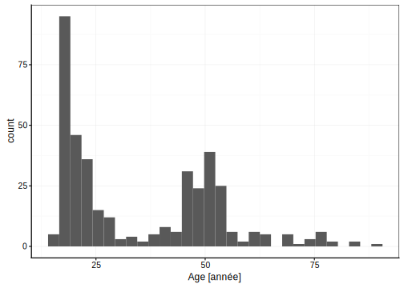

# Données qualitatives {#qualit}

Variables de type `factor`/`ordered`, transformation, découpage en classes, tableau de contigence. Choix des variables à mesurer, biométrie humaine.

> Suite d'idée afin de rédiger le chapitre 6

Vos objectifs pour ce module sont :

- Appréhender le découpage en classe d'une variable numérique, afin de réaliser une variable facteur 

- Appréhender la réalisation des tableaux de contingences.

- Acquérir des données et les encoder de manière reproductible 

## Découpage en classe

## Tableaux de contingences

## Acquisition de données scientifiques

Vous avez pour objectif de réaliser une recherche 

Thématique de la **biométrie humaine**

- Recherche bibliographique sur la thématique
- Profil de l'expérience
    + Variables mesurées afin de répondre à la thématique 
    + Analyses souhiatées 
- Acquisition des données
    + Précision & exactitude
    + Systèmes de codifications : respect de la vie privée
- Encodage des données 
    + Importation des données
    + Correction des erreurs (tidy)
- Traitement des données ( Transform, visualise, model )
    + Visualisation graphiques des données
    + Analyse statistiques des données 
- Réalisation d'un rapport structuré répondant à la question de départ

## A vous de jouer !
