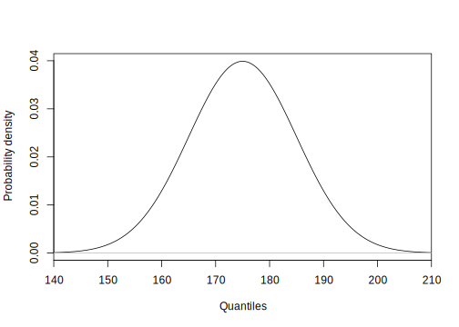

# Probabilités & distributions {#proba}


##### Objectifs {-}

- Appréhender le calculs de probabilités

- Appréhender les principales lois de distributions et leurs utilisations pratiques


##### Prérequis {-}

Vous devez être à l'aise avec l'utilisation de R, RStudio et R Markdown. Vous avez appris à maitriser ces outils dans les modules \@ref(intro) & \@ref(visu1).


## Probabilités

La vidéo suivante vous introduit la notion de probabilité et le calcul de probabilités d'une manière plaisante à partir d'un jeu de hasard proposé par un petit chat à ses amis...

<!--html_preserve--><iframe src="https://www.youtube.com/embed/5TtwG_LR0iY" width="770" height="433" frameborder="0" allowfullscreen=""></iframe><!--/html_preserve-->

<div class="note">
<p>Sachant qu'un <strong>évènement</strong> en statistique est un fait qui se produit, la <strong>probabilité</strong> que cet évènement se produise effectivement peut être quantifiée sur base de l'observation des réalisations passées. Ainsi si l'évènement en question s'est produit, disons, 9 fois sur un total de 12 réalisations, on dira que la probabilité que cet évènement se produise est de 9/12, soit 0,75. Notez qu'une probabilité est un nombre compris entre zéro (lorsqu'il ne se produit jamais) et un (lorsqu'il se produit toujours).</p>
</div>

On écrira, pour la probabilité de l'évènement *E* :

$$0 \leq \mathrm{P}(E) \leq 1$$


### Dépistage

> Voyons tout de suite une application plus proche de la biologie : le dépistage d'une maladie qui touche 8% de la population. Le test de dépistage mis en place détecte 95% des malades. De plus, le test se trompe dans 10% des cas pour les personnes saines. Comment connaitre le risque d'être malade si on est diagnostiqué positif par ce test ?

Pour résoudre ce problème, nous devons d'abord apprendre à *combiner* des probabilités. Ce n'est pas bien compliqué. Si on a affaire à des **évènements successifs indépendants** (c'est-à-dire que l'occurence de l'un ne dépend pas de l'occurence de l'autre), la **probabilité que les deux évènements successifs indépendants se produisent tous les deux est la multiplication des deux probabiltés**. On pourra écrire :

$$\mathrm{P}(E_1 \,\mathrm{et}\, E_2) = \mathrm{P}(E_1) * \mathrm{P}(E_2)$$

Vous pouvez dès lors calculer la probabilité que l'on teste un patient malade (probabilité = 0,08) et que le test soit positif (0,95) dans ce cas : 


```r
# Personne malade et détectée positive
(p_sick_positive <- 0.08 * 0.95)
```

```
# [1] 0.076
```

Ceci n'indique *pas* la probabilité que le test soit positif car il est également parfois (erronément) positif pour des patients sains. Mais au fait, quelle est la probabilité d'avoir un patient sain ? **La probabilité que l'un parmi tous les évènements possibles se produise vaut toujours un**. Les seuls évènements possibles ici sont que le patient soit sain ou malade. Donc,

$$\mathrm{P}(sain) + \mathrm{P}(malade) = 1 \rightarrow \mathrm{P}(sain) = 1 - \mathrm{P}(malade) = 0.92$$

Nous pouvons maintenant déterminer la probabilité que le test soit positif dans le cas d'une personne saine :


```r
# Personne saine et détectée positive
(p_healthy_positive <- 0.92 * 0.10)
```

```
# [1] 0.092
```

Bon, il nous reste à combiner les probabilités que le test soit positif si la personne est malade et si la personne est saine. Mais comment faire\ ? Ici, on n'a pas affaire à des évènements successifs, mais à des évènements mutuellement exclusifs. On les appellent des **évènements disjoints**. Pour déterminer si l'un parmi deux évènements disjoints se produit, il suffit d'**additionner leurs probabilités respectives**. Nous pouvons maintenant déterminer la probabilité que le test soit positif quelle que soit la personne testée :


```r
# La probabilité que le test soit positif 
(p_positive <- p_sick_positive + p_healthy_positive)
```

```
# [1] 0.168
```

Nous nous trouvons ici face à un résultat pour le moins surprenant ! En effet, nous constatons que le test est positif dans 16,8% des cas, mais seulement 7,6% du temps, il sera correct (probabilité d'une personne malade détectée). Parmi tous les cas positifs au test, il y en a...


```r
p_sick_positive / p_positive
```

```
# [1] 0.452381
```

... seulement 45,2% qui sont effectivement malades (on parle de **vrais positifs**) ! Ceci ne correspond pas du tout aux indications de départ sur les performances du test.

\BeginKnitrBlock{note}<div class="note">Dans le cas de deux faits successifs qui ne peuvent chacun que résulter en deux évènements, nous avons seulement quatre situations possibles. Si l'un des cas est qualifié de positif et l'autre de négatif, nous aurons:
  
- les **vrais positifs** (test positif alors que la personne est malade), ici 0.08 * 0.95

- les **faux positifs** (test positif alors que la personne est saine), ici 0.92 * 0.10

- **les vrais négatifs** (test négatif alors que la personne est saine), ici 0.92 * 0.90

- **les faux négatifs** (test négatif alors que la personne est malade), ici 0.08 * 0.05
</div>\EndKnitrBlock{note}

En fait, les performances finales du test de dépistage dépendent *aussi* de la prévalence de la maladie. Ainsi pour une maladie très commune qui affecterait 80% de la population, nous obtenons :


```r
# Faux positifs
0.20 * 0.10
```

```
# [1] 0.02
```

```r
# Vrais positifs
0.80 * 0.95
```

```
# [1] 0.76
```

```r
# Total des positifs
0.20 * 0.10 + 0.80 * 0.95
```

```
# [1] 0.78
```

```r
# Fractions de tests positifs qui sont corrects
(0.80 * 0.95) / (0.20 * 0.10 + 0.80 * 0.95)
```

```
# [1] 0.974359
```

Ouf ! Dans ca cas-ci le test positif est correct dans 97,4% des cas. Mais qu'en serait-il si la maladie est très rare (probabilité de 0,008)\ ?


```r
# Faux positifs
0.992 * 0.10
```

```
# [1] 0.0992
```

```r
# Vrais positifs
0.008 * 0.95
```

```
# [1] 0.0076
```

```r
# Total des positifs
0.992 * 0.10 + 0.008 * 0.95
```

```
# [1] 0.1068
```

```r
# Fractions de tests positifs qui sont corrects
(0.008 * 0.95) / (0.992 * 0.10 + 0.008 * 0.95)
```

```
# [1] 0.07116105
```

Gasp ! Dans ce cas, un test positif n'aura effectivement détecté un malade que dans ... 7,1% des cas ! Les 92,9% autres cas positifs seront en fait des personnes saines.

> Comme nous pouvons le constater ici, le calcul des probabilités est relativement simple. Mais en même temps, les résultats obtenus peuvent être complètement **contre-intuitifs**. D'où l'intérêt de faire ce genre de calcul, justement.


### Théorème de Bayes

TODO...

Il s'agit d'une probabilité conditionnelle^[une probabilité conditionnelle (conditional probability) est la probabilité qu’un événement E2 se produise si et seulement si un premier événement E1 s’est produit (E1 et E2 sont deux événements successifs). La probabilité conditionnelle s’écrit P(E2|E1)]


### Arbre des probabilités

TODO...


### Probabilités et contingence

Comme un tableau de contingence indique le nombre de fois que des évènements ont pu être observés, il peut servir de base à des calculs de probabilités. Partons du dénombrement de fumeur en fonction du revenu dans une population.


```r
tabac <- data.frame(
  revenu_faible = c(634,1846,2480),
  revenu_moyen = c(332, 1622,1954),
  revenu_eleve = c(247,1868,2115),
  total = c(1213, 5336, 6549))
rownames(tabac) <- c("fume", "ne fume pas",  "total")
knitr::kable(tabac)
```

               revenu_faible   revenu_moyen   revenu_eleve   total
------------  --------------  -------------  -------------  ------
fume                     634            332            247    1213
ne fume pas             1846           1622           1868    5336
total                   2480           1954           2115    6549

- Quelle est la probabilité d'être un fumeur $\mathrm{P}(fumeur)$\ ? Rappelons-nous de la définition de probabilité\ : nombre de cas où l'évènement se produit sur le nombre total de cas. Ici, on a 1213 fumeurs dans un effectif total de l'échantillon de 6549 perosnnes, soit :


```r
1213 / 6549
```

```
# [1] 0.1852191
```

- Quelle est la probabilité d'être fumeur si le revenu élevé $\mathrm{P}(fumeur|revenu\_eleve)$\ ? Le nombre de fumeurs à revenus élevés se monte à 247. **Attention, ici l'échantillon de référence n'est plus la population totale, mais seulement ceux qui ont des revenus élevés**, donc 2115 personnes :


```r
247 / 2115
```

```
# [1] 0.1167849
```

- Quelle est la probabilités d'avoir un revenu faible ou d'avoir un élevé ? Cette question peut s'écrire : P(revenu faible ou revenu élevé)


```r
2480/6549 + 2115/6549
```

```
# [1] 0.7016338
```

Il s'agit d'une somme de probabilités discrètes disjoints^[Si E1 et E2 sont deux événements disjoints,
la probabilité que l’un de ces deux événements se produise est : P(E1 ou E2) = P(E1) + P(E2)]

- Quels est la probabilités d'être fumeur ou d'avoir un revenu moyen ? Cette question peut s'écrire : P(fumeur ou revenu moyen). 


```r
1213/6549 + 1954/6549 - 332/6549
```

```
# [1] 0.4328905
```

Il s'agit d'une somme de probabilités discrètes non disjoints^[Si E1 et E2 sont deux événements non disjoints, la probabilité que l’un de ces deux événements se produise est : P(E1 ou E2) = P(E1) + P(E2) − P(E1 et E2)]

Dans une population, voici les proportions de différents groupes sanguins : 44% O, 42% A, 10% B, 4% AB

- Quelles est la probabalité d'obtenir 1 individu du groupe B ? Cette question peut s'écrire : P(B). 


```r
0.10
```

```
# [1] 0.1
```

- Quelle est la probabilité d'obtenir 3 individus du groupe B d'affilé ? Cette question peut s'écrire : P(B et B et B). 


```r
0.10*0.10*0.10
```

```
# [1] 0.001
```

Nous parlerons dans ce cas d'un événements successifs^[Evénements issus d’actions séparées. Souvent successifs dans le temps]  et plus précisément d'événements successifs indépendants^[lorsque les résultats de la seconde action ne sont pas influencés par les résultats de la première action. Ex. : deux jets successifs d’une pièce de monnaie, tirage au sort dans une urne avec remise.].


Dans une population de 100 personnes dont les proportions des différentes groupes sanguins sont identiques. 

- Quelles est la probabilité d'obtenir 3 individus du groupe B d'affilé ? Cette question peut s'écrire : P(B et B et B). 


```r
10/100 * 9/99 * 8/98
```

```
# [1] 0.000742115
```

Il s'agit d'événements successifs non-indépendants. 

Etant donné que les statistiques reposent sur un nombre (si possible important) de répétitions d’une expérience, les fameux réplicas (replicates), il est possible de déterminer à quelle fréquence un événement E se produit de manière expérimentale. La probabilité observée est quantifiable sur base d’un échantillon. 

La probabilité théorique est connue si le mécanisme sous-jacent est parfaitement connu. Donc, en situation réelle, seule la probabilité observée est accessible, et ce n’est qu’une approximation de la vraie valeur, ou valeur théorique.


## Lois de distributions

Une loi de distribution statistique permet de prédire de manière théorique les probabilités de tous les événements possibles.

Elle associe, donc, une probabilité théorique à un événement.

La comparaison des probabilités théoriques et observées constitue l’un des piliers de la statistique. Le raisonnement est le suivant : si les probabilités observées sont suffisamment proches des probabilités théoriques, alors, nous pouvons considérer que les événement sont générés selon un mécanisme proche de celui qui est à la base de la loi de distribution théorique correspondante.

### Distribution uniforme

La loi de la distribution uniforme émet l'hypothèse que tous les événements sont équiprobales^[la probabilité de tous les événements possibles est égale pour tous]. 

la probabilité d’un de ces événements vaut donc: $$\frac{1}{nbr \ E}$$


```r
# Uniform distribution (density probability) with parameters:
.min <- 0; .max <- 4 #  .min and .max range of possible events
.col <- 1; .add <- FALSE # Plot parameters
.x <- seq(.min-(.max-.min)/4, .max+(.max-.min)/4, l = 1000) # Quantiles
.d <- function (x) dunif(x, min = .min, max = .max)         # Distribution function
.q <- function (p) qunif(p, min = .min, max = .max)  # Quantile for lower-tail prob
.label <- bquote(U(.(.min), .(.max)))
curve(.d(x), xlim = range(.x), xaxs = "i", n = 1000, col = .col,
  add = .add, xlab = "Quantiles", ylab = "Probability density") # Curve
abline(h = 0, col = "gray") # Baseline
```


### Distribution binomiale

Partons d'un exemple pratique pour découvrir cette distribution. L'albinisme est une maladie héréditaire liée à un gène récessif. Parmi 20 familles dont le père et la mère normaux ont le gène récessif. Quelle est la probabilité d'obtenir 0, 1, 2, ..., 20 enfants albinos dans les 20 familles. 

Les conditions d'applications de la distribution binomiale sont :

- Résultats binaire
- Essais indépendants,
- n fixé à l'avance
- Probabilité de réussite constante. 

Cette distribution peut s'écrire de manière mathématiquement :

Soit une variable binaire aléatoire Y, la probabilité d’obtenir j succès parmi n essais est :

$$P(Y=j)= _n C _J \times p^j \times (1-p)^{n-j}$$

Le coefficient binomiale $_n C _J$ vaut $$\frac{n!}{j!(n-j)!}$$


```r
(.table <- data.frame(success = 0:20,
  probability = dbinom(0:20, size = 20, prob = 0.25)))
```

```
#    success  probability
# 1        0 3.171212e-03
# 2        1 2.114141e-02
# 3        2 6.694781e-02
# 4        3 1.338956e-01
# 5        4 1.896855e-01
# 6        5 2.023312e-01
# 7        6 1.686093e-01
# 8        7 1.124062e-01
# 9        8 6.088669e-02
# 10       9 2.706075e-02
# 11      10 9.922275e-03
# 12      11 3.006750e-03
# 13      12 7.516875e-04
# 14      13 1.541923e-04
# 15      14 2.569872e-05
# 16      15 3.426496e-06
# 17      16 3.569266e-07
# 18      17 2.799425e-08
# 19      18 1.555236e-09
# 20      19 5.456968e-11
# 21      20 9.094947e-13
```

On peut représenter graphiquement le résultat lié au nombre d'albinos dans ces 20 familles.


```r
plot(0:20, dbinom(0:20, size = 20, prob = 0.25), type = "h",
  col = "black", xlab = "Quantiles", ylab = "Probability mass")
```


Partons d'une maladie congénitale rare avec un cas 1/1000. Quels est la probabilité d'avoir 0, 1 ou 2  malade sur 10000 individus ? 

La distribution binomiale requiert le développement du polynome  $_n C _J$  qui revient donc à $0.001^1 \times 0.999^{9999}\ !$


```r
factorial(1)
```

```
# [1] 1
```

```r
factorial(10)
```

```
# [1] 3628800
```

```r
factorial(100)
```

```
# [1] 9.332622e+157
```

```r
factorial(1000)
```

```
# Warning in factorial(1000): value out of range in 'gammafn'
```

```
# [1] Inf
```

```r
factorial(10000)
```

```
# Warning in factorial(10000): value out of range in 'gammafn'
```

```
# [1] Inf
```

La distribution de poisson permet d'obtenir la réponse à la question posée. 

### Distribution de poisson

cette distribution discrète se caractérise par $\mu$ égale à $\sigma$ et n'a donc qu'un seul paramètre $\lambda$. Cette distribution est  **asymétrique pour de faible $\lambda$** et tend vers une distribution normale pour de grand $\lambda$.

Les conditions d'application sont 

- la probabilités de succès très faible
- très grand nombre d'essais

$$P(Y=0) = e^{-\lambda}$$

et 

$$P(Y=k) = P(Y=k-1) \times \frac{ \lambda }{k}$$
Le calcul se réalise de proche en prohce en partant de la probabilité de l'événement correspondant à aucune occurence de succès. 


```r
plot(0:(2+20), dpois(0:(2+20), lambda = 2), type = "h",
  col = "black", xlab = "Quantiles", ylab = "Probability mass")
```


Quelle est la probabilité dans un population d'obtenir une personne mesurant 191,0000 cm ? La probabilité est nulle. En effet, La variable étudié est une variable continue. Elle doit donc se traiter avec une distribution contiue. 

### Distribution normale 

La chaîne Youtube, La statistique expliquée à mon chat, dans la vidéo [Pâte à tartiner et variable continue](https://www.youtube.com/watch?v=THk2GBxkg4o) explique la notion de variable continue.

Une loi de distribution continue permet de prédire la probabilité qu'un événement se produise parmi un nombre très grand d'événement (infini, la plupart du temps). On ne s’intéresse qu’à des probabilités pour un intervalle concernant une fraction de tous les événements possibles.

La distribution normale a deux paramètre : $\mu$ & $\sigma$

$$f(y) = \frac{1}{ \sigma \sqrt{2 \pi}} e^{\frac{-1}{2} \left( \frac{y - \mu}{\sigma} \right)^2}$$

Cette distribution s'écrit Y ∼ N(μ, σ) pour la variable Y suit une distribution Normale de moyenne μ, et d’écart type σ. 


```r
# Normal distribution (density probability) with parameters:
.mu <- 175; .s <- 10 #  mu = .mu and sigma = .s
.col <- 1; .add <- FALSE # Plot parameters
.x <- seq(-3.5*.s+.mu, 3.5*.s+.mu, l = 1000)     # Quantiles
.d <- function (x) dnorm(x, mean = .mu, sd = .s) # Distribution function
.q <- function (p) qnorm(p, mean = .mu, sd = .s) # Quantile for lower-tail prob
.label <- bquote(N(.(.mu), .(.s)))               # Curve parameters
curve(.d(x), xlim = range(.x), xaxs = "i", n = 1000, col = .col,
  add = .add, xlab = "Quantiles", ylab = "Probability density") # Curve
abline(h = 0, col = "gray") # Baseline
```


La variable Y suit une distribution Normale de moyenne $\mu$ (175), et d’écart type $\sigma$ (10). 

On appelle également cette distribution, la loi de distribution Gaussienne. Cette dernière est l'une des plus employée. Pratiquement, toutes les distributions tendent vers la distribution normale pour N allant vers l'infini expliqué par [le théorème central limite](https://www.youtube.com/watch?v=4dhm2QAA2x4). 


```r
# Normal distribution (density probability) with parameters:
.mu <- 175; .s <- 10 #  mu = .mu and sigma = .s
.col <- 1; .add <- FALSE # Plot parameters
.x <- seq(-3.5*.s+.mu, 3.5*.s+.mu, l = 1000)     # Quantiles
.d <- function (x) dnorm(x, mean = .mu, sd = .s) # Distribution function
.q <- function (p) qnorm(p, mean = .mu, sd = .s) # Quantile for lower-tail prob
.label <- bquote(N(.(.mu), .(.s)))               # Curve parameters
curve(.d(x), xlim = range(.x), xaxs = "i", n = 1000, col = .col,
  add = .add, xlab = "Quantiles", ylab = "Probability density") # Curve
abline(h = 0, col = "gray") # Baseline

text(.mu+.s, .d(.mu+.s), .label, pos = 4, col = .col) # Label at right
```


* La distribution normale réduite : $\mu_z = 0$ &  $\sigma_z = 1$

$$f(z) = \frac{1}{ \sqrt{2 \pi}} e^{ - \frac{z^2}{2} }$$

La variable Y suit une distribution Normale de moyenne $\mu$ (180), et d’écart type $\sigma$ (15) qui s'écrit Y ∼ N(μ, σ) pour la variable Y suit une distribution Normale de moyenne μ, et d’écart type σ


```r
# Normal distribution (density probability) with parameters:
.mu <- 0; .s <- 1 #  mu = .mu and sigma = .s
.col <- 1; .add <- FALSE # Plot parameters
.x <- seq(-3.5*.s+.mu, 3.5*.s+.mu, l = 1000)     # Quantiles
.d <- function (x) dnorm(x, mean = .mu, sd = .s) # Distribution function
.q <- function (p) qnorm(p, mean = .mu, sd = .s) # Quantile for lower-tail prob
.label <- bquote(N(.(.mu), .(.s)))               # Curve parameters
curve(.d(x), xlim = range(.x), xaxs = "i", n = 1000, col = .col,
  add = .add, xlab = "Quantiles", ylab = "Probability density") # Curve
abline(h = 0, col = "gray") # Baseline
```




