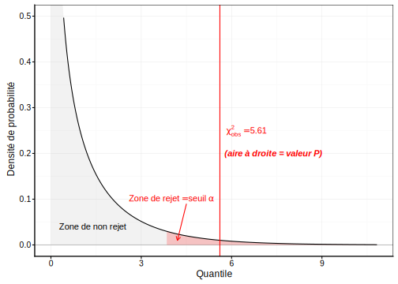

# Test Chi carré {#chi2}


Dans ce module, nous entrons dans le monde de l'inférence statistique et des tests d'hypothèses qui nous permettront de répondre à des questions biologiques sur base de données empiriques malgré une incertitude inévitables (hasard de l'échantillonnage, variabilité individuelle, erreurs de mesure, ...).


##### Objectifs {-}

- Appréhender l'inférence statistique

- Etre capable d'effectuer un échantillonnage correctement

- Comprendre ce qu'est un test d'hypothèse

- Connaitre la distribution Chi^2^ et les tests d'hypothèses basés sur cette distribution

- Développer un regard critique (positif\ !) sur le travail de ses collègues via l'évaluation d'un rapport par les pairs (initiation au "peer reviewing")


##### Prérequis {-}

Les probabilités et lois de distributions statistiques vues au module \@ref(proba) doivent être comprises avant d'attaquer cette section.


## Échantillonnage

Si nous pouvions mesurer **tous** les individus d'une population statistique à chaque fois, nous n'aurions pas besoin des statistiques. Mais ce n'est pratiquement jamais possible. Tout d'abord, le nombre d'individus est potentiellement très grand. Le travail nécessaire risque alors d'être démesuré. Afin de limiter les mesures à un nombre raisonnable de cas, nous effectuons un **échantillonnage** qui consiste à prélever un petit sous-ensemble de taille $n$ donné depuis la population de départ. Il existe différentes stratégies d'échantillonnage, mais la plus fréquente est l'**échantillonnage aléatoire** pour lequel\ :

- chaque individu dans la population a la même probabilité d'être pris dans l'échantillon,
- les mesures et les individu sont indépendants les uns des autres.

Nous n'avons pas forcément accès à tous les individus d'une population. Dans ce cas, nous devons la limiter à un sous-ensemble raisonnable. Par exemple, il est impossible de mesurer *toutes* les souris. Par contre, nous pouvons décider d'étudier la ou les souches de souris disponibles dans l'animalerie, ou chez nos fournisseurs.

Quoi qu'il en soit, l'échantillon n'est qu'un petit sous-ensemble sélectionné par un mécanisme faisant intervenir le hasard. Donc, deux échantillons de la même population ont un très forte probabilité d'être différents l'un de l'autre. Il en va également des statistiques calculées sur ces échantillons, comme les effectifs observés pour chaque niveau de variables qualitatives ou les valeurs moyennes pour les variables quantitatives, par exemple. **Cette variabilité d'un échantillon à l'autre ne nous intéresse pas car elle n'apporte pas d'information sur la population elle-même.** Ce qui nous intéresse, c'est d'estimer au mieux les valeurs (effectifs, moyennes, etc.) dans la population.

<div class="note">
<p>L'estimation de paramètres d'une population par le biais de calculs sur un échantillon représentatif issu de cette population s'appelle l'<strong>inférence statistique.</strong></p>
<div class="figure">


</div>
</div>


##### Travail préliminaire {-}

Avant de vous lancer dans l'inférence statistique, assurez-vous d'avoir effectué soigneusement les trois étapes suivantes\ :

1. Vous comprenez bien la question posée, en termes biologiques. Vous connaissez ou vous êtes documenté sur l'état de l'art en la matière (bibliographie). Que sait-on déjà du phénomène étudié\ ? Quels sont les aspects encore inconnus ou à l'état de simples hypothèses\ ?

2. Vous avez vérifié que la façon dont les mesures ont été prises permettra effectivement de répondre à la question posée. *En particulier, vous avez vérifié que l'échantillonnage a été réalisé dans les règles pour qu'il soit représentatif de la population étudiée.* En outre, vous cernez clairement quelle est la population effectivement étudiée. C'est important pour éviter plus tard de sur-généraliser les résultats obtenus (les attribuer à une population plus large que celle effectivement étudiée).

3. Vous avez effectué une analyse exploratoire des données. Vous avez représenté les données à l'aide de graphiques appropriés et vous avez interprété ces graphiques afin de comprendre ce que le jeu de données contient. Vous avez également résumé les données sous forme de tableaux synthétiques et vous avez, si nécessaire, remaniés et nettoyés vos données.


## Test d'hypothèse

Le test d'hypothèse ou test statistique est l'outil le plus simple pour répondre à une question via l'inférence. Il s'agit ici de réduire la question à sa plus simple expression en la réduisant à deux **hypothèses** contradictoires (en gros, la réponse à la question est soit "oui", soit "non" et rien d'autre).

- L'**hypothèse nulle**, notée $H_0$ est l'affirmation de base ou de référence que l'on cherchera à réfuter,
- L'**hypothèse alternative**, notée $H_1$ ou $H_a$ représente une autre affirmation qui doit nécessairement être vraie si $H_0$ est fausse.

Les deux hypothèses ne sont pas symétriques. Notre intention est de **rejeter $H_0$**. Dans ce cas, nous pourrons considérer que $H_1$ est vraie, avec un certain degré de certitude que nous pourrons également quantifier. Si nous n'y arrivons pas, nous dirons que nous ne pouvons pas rejeter $H_0$, mais nous ne pourrons jamais dire que que nous l'**acceptons** car dans ce cas, deux explications resteront possibles\ : (1) $H_0$ est effectivement vraie, ou (2) $H_0$ est fausse mais nous n'avons pas *assez* de données à disposition pour le démontrer avec le niveau de certitude recherché.


### Becs croisés des sapins

Tout cela reste très abstrait. Prenons un exemple concret simple. Le bec-croisé des sapins *Loxia curvirostra* Linné 1758 est un passereau qui a la particularité d'avoir un bec dont les deux parties se croisent, ce qui donne un outil particulièrement adapté pour extraire les graines de conifères dont il se nourrit.


Comme des individus à bec croisé à gauche et d'autres à bec croisé à droite se rencontrent dans la même population, Groth (1992) a comptabilisé les deux types dans un échantillon aléatoire et représentatif de plus de 3000 oiseaux. Il a obtenu les résultats suivants\ :


```r
(crossbill <- as.table(c(left = 1895, right = 1752)))
```

```
#  left right 
#  1895  1752
```

Les scientifiques pensent que les variétés gauches et droites se rencontrent avec un ratio 1:1 dans la population étudiée suite à une sélection présumée basée sur le rapport des deux variétés. La question se traduit sous forme d'un test d'hypothèse comme ceci\ :

- $H_0: left = right$
- $H_1:left \neq right$

Pouvons-nous rejeter $H_0$ ici\ ?


### Test Chi^2^ de Pearson

Le test Chi^2^ (ou $\chi^2$) de Pearson est un test d'hypothèse qui permet de comparer des effectifs observés notés $a_i$ à des effectifs théoriques $\alpha_i$ sous l'hypothèse nulle pour les différents niveaux $i$ allant de 1 à $n$ d'une variable qualitative. Notre tableau de contingence à simple entrée `crossbill` contient nos $a_i$. Nous devons donc calculer quels sont les effectifs théoriques $\alpha_i$. Le nombre total d'oiseaux observés est\ :


```r
sum(crossbill)
```

```
# [1] 3647
```
... et les effectifs attendus sous $H_0$ sont\ :


```r
(alpha_i <- c(left = sum(crossbill) / 2, right = sum(crossbill) / 2))
```

```
#   left  right 
# 1823.5 1823.5
```

Le principe de la **statistique $/chi^2$** consiste à sommer les écarts au carré par rapport aux $\alpha_i$ de référence divisés par ces mêmes $\alpha_i$ pour quantifier l'écart entre les valeurs observées et les valeurs théoriques. Donc\ :

$$\chi^2_\mathrm{obs} = \sum_{i=1}^n\frac{(a_i - \alpha_i)^2}{\alpha_i}$$

Notez que cette statistique prend la valeur nulle lorsque tous les $a_i$ sont strictement égaux aux $\alpha_i$. Dans tous les autres cas, des termes positifs (le carré de différences est toujours une valeur positive) apparaissent. Donc la statistique $\chi^2$ est d'autant plus grande que les observations s'éloignent de la théorie.

Calculons $\chi^2_\mathrm{obs}$ dans notre cas^[Faites également le calcul manuellement à la calculatrice pour vérifier que vous avez bien compris.]\ :


```r
(chi2_obs <- sum((crossbill - alpha_i)^2 / alpha_i))
```

```
# [1] 5.607074
```

Pour répondre à la question, il nous faut une loi de distribution statistique qui permet d'associer une probabilité au quantile $chi^2_\mathrm{obs}$ sous $H_0$. C'est là que le statisticien Karl Pearson vient à notre secours. Il a, en effet, modélisé la distribution statistique du $chi_2$. La loi du même nom admet un seul paramètre, les **degrés de libertés** (ddl) qui sont égaux au nombre de niveaux de la variable facteur étudiée $n$ - 1. Ici, ddl = 2 - 1 = 1. La Fig. \@ref(fig:chi2plot) représente la densité de probabilité typique sous $H_0$ d'une loi $\chi^2$^[Les fonctions qui permettent les calculs relatifs à la distribution Chi^2^ dans R sont `<x>chisq()`, et les snippets correspondants dans la SciViews Box sont disponibles à partir de `.ic`. Leur utilisation est similaire à celle des distributions vues au module \@ref(proba).]. C'est une distribution qui démarre à zéro, passe par un maximum et est asymptotique horizontale à + infini.

<div class="figure" style="text-align: center">

<p class="caption">(\#fig:chi2plot)Allure typique de la densité de probabilité de la distribution Chi^2^ (ici ddl = 3).</p>
</div>


### Seuil α du test

Le raisonnement est le suivant. Connaissant la densité de probabilité théorique sous $H_0$, nous savons que, plus le $\chi^2_\mathrm{obs}$ est grand, moins il est plausible. Nous devons décider d'une limite à partir de laquelle nous considèrerons que la valeur observée est suffisamment grande que pour considérer $H_0$ comme non plausible et nous pourrons alors la rejeter. Cette limite se définit sous la forme d'une **probabilité** correspondant à une zone de rejet définie dans la distribution théorique de référence sous $H_0$. Cette limite s'appelle le **seuil $\alpha$ du test**.

<div class="note">
<p><strong>Choix du seuil <span class="math inline">\(\alpha\)</span> d'un test d'hypothèse.</strong> Le seuil <span class="math inline">\(\alpha\)</span> est choisi <em>avant</em> de réaliser le test. Il est un savant compromis entre le risque de se tromper qui diminue plus <span class="math inline">\(\alpha\)</span> est petit, et la possibilité d'obtenir le rejet de <span class="math inline">\(H_0\)</span> lorsqu'elle est fausse qui augmentera avec <span class="math inline">\(\alpha\)</span>. Si on veut être absolument certain du résultat, on prend <span class="math inline">\(\alpha = 0\)</span>, mais dans ce cas on ne rejete jamais <span class="math inline">\(H_0\)</span> et on ne tire donc jamais aucune conclusion utile. Donc, nous devons assouplir les règles et accepter un petit risque de se tromper. <strong>Généralement, les statisticiens choisissent <span class="math inline">\(\alpha = 5%\)</span> dans les cas courants</strong>, et prennent 1%, ou même 0,1% dans les cas où il faut être plus strict (par exemple, si des vies dépendent du résultat). Nous pouvons nous baser sur ces références, même si nous verrons plus loin qu'elle sont récemment sujettes à caution en science.</p>
</div>

Poursuivons. Nous choisissons $\alpha = 5%$. Cela définit l'aire la plus extrême de 5% à droite de la distribution $\chi^2$ à 1 ddl comme zone de rejet (en rouge sur la Fig. \@ref(fig:chi2plot2)). Il nous suffit maintenant de voir où se place notre $\chi^2_\mathrm{obs}$. S'il se situe dans la zone en rouge, nous rejeterons $H–0$, sinon, nous ne la rejeterons pas.

<div class="figure" style="text-align: center">

<p class="caption">(\#fig:chi2plot2)Densité de probabilité sous *H*~0~ (distribution Chi^2^ à 1 ddl), zone de rejet de 5% en rouge et position de la valeur observée (trait vertical rouge).</p>
</div>

Où se situe la limite\ ? Nous pouvons facilement la calculer\ :


```r
qchisq(0.05, df = 1, lower.tail = FALSE)
```

```
# [1] 3.841459
```

Notre $\chi^2_\mathrm{obs}$ = 5,61 est plus grand que cette limite et se situe dans la zone de rejet. **Nous rejetons donc $H_0$ ici** et dirons que les becs croisés à gauche sont significativement plus nombreux que ceux à droite au seuil $\alpha$ de 5% (test $\chi^2$ = 5,61, ddl = 1, valeur *P* = 0.018). **Notez bien la façon particulière de reporter les résultats d'un test d'hypothèse\ !**

Il nous manque encore juste un élément... qu'est-ce que cette "valeur *P*" de 0.018 reportée dans le résultat\ ? En fait, c'est la valeur de probabilité associée au test et correspond ici à l'aire à droite définie depuis le $\chi^2_\mathrm{obs}$. Calculons-la\ :


```r
pchisq(5.61, df = 1, lower.tail = FALSE)
```

```
# [1] 0.01785826
```

Le test d'hypothèse reporte la valeur *P* afin qu'un lecteur qui aurait choisi un autre seuil $\alpha$ pourrait effectuer immédiatement sa propre comparaison sans devoir refaire les calculs.

Pour finir, nous ne devons heureusement pas refaire tous les calculs à la main à chaque fois que nous voulons faire un test du Chi^2 dans R. La fonction `chisq.test()` fait tout cela pour nous. Elle est également disponible dans les snippets à partir du menu `hypothesis test : contingency` ou `.hc` (test Chi^2 univarié).


```r
chisq.test(crossbill, p = c(1/2, 1/2), rescale.p = FALSE)
```

```
# 
# 	Chi-squared test for given probabilities
# 
# data:  crossbill
# X-squared = 5.6071, df = 1, p-value = 0.01789
```


##### Conditions d'application {-}

Tout test d'hypothèse impose des **conditions d'application** qu'il faudra vérifier avant d'effectuer le test. Pour le test $\chi^2$, ce sont\ :

- échantillonnage aléatoire et observations indépendantes,
- aucun effectif théorique sous $H_0$ nul.

C'est bien le cas ici.
