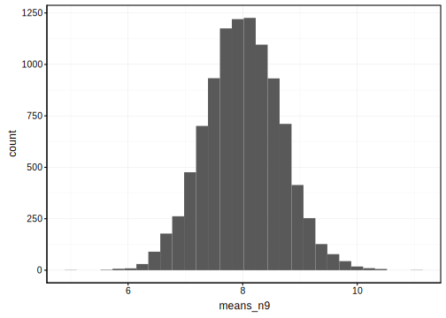
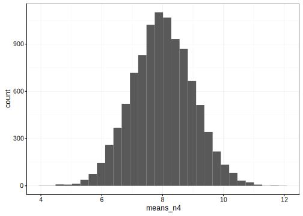
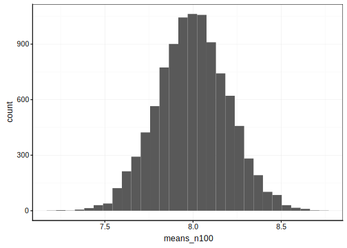
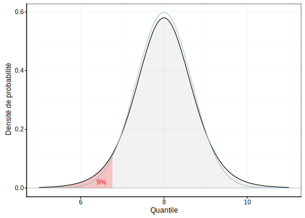
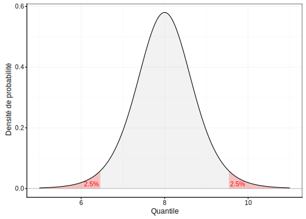
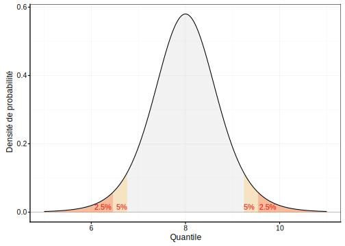
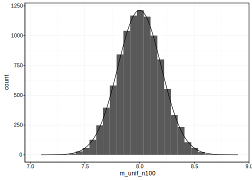
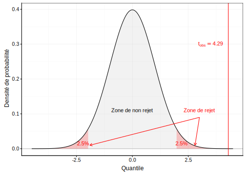
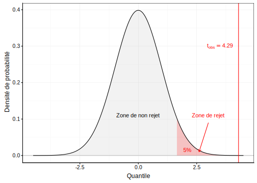

# Moyenne {#moyenne}


##### Objectifs {-}

- De manière générale, pouvoir répondre à différentes questions concernant une ou deux moyennes

- Découvrir la distribution *t* de Student

- Comprendre le principe de la distribution d'un échantillon

- Appréhender l'intervalle de confiance, savoir le calculer et l'utiliser

- Comprendre les différentes variantes du test *t* de Student et être capable de l'utiliser pour résoudre des questions pratiques en biologie

- Connaître également le test de Wilcoxon-Mann-Withney, et pouvoir déterminer quand l'utiliser à la place du test de Student


##### Prérequis {-}

Ce module élabore sur les notions vues au module \@ref(proba) concernant les lois de distribution statistiques et sur le concept de test d'hypothèse abordé dans le module \@ref(chi2). Ces deux précédents modules doivent donc être maîtrisés avant d'aller plus avant ici.


## Une histoire de bière...

Les belges, c'est connu, apprécient la bière. Mais ils ne sont pas les seuls, et c'est très heureux\ ! Car c'est en effet grâce à un certain William Sealy Gosset, brasseur et statisticien (et oui, ça ne s'invente pas) que l'un des tests d'hypothèses des plus utilisés en biologie a vu le jour\ : le test de "Student" qui permet de comparer des moyennes.

Pour la petite histoire, Gosset a travaillé pour une certaine brasserie irlandaise du nom de Guiness au début du 20^ème^siècle. C'est en étudiant la variabilité de sa bière d'un cru à l'autre que Gosset a découvert la façon dont la moyenne d'un échantillon se distribue. Il a pu dériver une formulation mathématique de cette distribution, la **distribution *t* de Student**, et à partir de là, nous verrons que de nombreuses applications en découlent. Nous pourrons, par exemple, dire si deux moyennes diffèrent *significativement* l'une de l'autre ou pas.

Mais au fait, pourquoi, cette distribution porte-t-elle le nom de "Student"\ ? Visionnez la vidéo suivante (malheureusement en anglais) pour le découvrir^[Vous pouvez activer les sous-titres en anglais via la barre de boutons en bas de la vidéo pour vous aider à comprendre l'histoire.].

<!--html_preserve--><iframe src="https://www.youtube.com/embed/GFzCIA9kppM" width="770" height="433" frameborder="0" allowfullscreen=""></iframe><!--/html_preserve-->

Le contrat que Gosset a signé avec son employeur l'empêchait de publier des résultats scientifiques sous son vrai nom. Ainsi, il décida de publier sa trouvaille qui occupe aujourd'hui une place très importante en statistiques sous le pseudonyme de "Student" (l'étudiant). Ce n'est qu'à sa mort, en 1937, que l'on pu révéler le nom de l'auteur qui est derrière cette fantastique trouvaille. Mais au fait, de quoi s'agit-il exactement\ ? Nous allons le découvrir dans la section suivante.


## Distribution d'échantillonnage

<div class="bdd">
<p>Afin d'appliquer directement les concepts vu dans ce module, ouvrez RStudio dans votre SciViews Box, puis exécutez l'instruction suivante dans la fenêtre console :</p>
<pre><code>BioDataScience::run(&quot;09a_ttest&quot;)</code></pre>
</div>

Pour rappel, nous faisons de l'**inférence** sur base d'un échantillon parce que nous sommes incapables de mesurer tous les individus d'une population. Il faut au préalable que l'échantillon soit *représentatif*, donc réalisé dans les règles de l'art (par exemple, un échantillonnage aléatoire simple de la population). Nous pouvons calculer la moyenne d'un échantillon facilement (eq. \@ref(eq:moyenne). 

\begin{equation} 
  \bar{x}=\sum_{i=1}^n{\frac{x_i}{n}}
  (\#eq:moyenne)
\end{equation} 

où $x$ est une variable quantitative (donc `numeric` dans R) et $n$ est la taille de l'échantillon, donc le nombre d'individus mesurés. On notera $\bar{x}$ la moyenne de $x$, que l'on prononcera "x barre".

Nous utiliserons également l'écart type, noté $\sigma_x$ pour la population et $s_x$ pour l'échantillon qui se calcule sur base de la somme des écarts à la moyenne au carré (eq. \@ref(eq:sd))\ :

\begin{equation} 
  s_x = \sqrt{\sum_{i=1}^n{\frac{(x_i - \bar{x})^2}{n-1}}}
  (\#eq:sd)
\end{equation} 

A noter que $s^2$ est également appelée la **variance**^[L'équation proposée est, en fait, valable pour un échantillon, et est calculé comme tel par R à l'aide des fonctions `sd()` pour l'écart type ou `var()` pour la variance. Pour la population ou pour un échantillon de taille très grande, voire infinie, nous pourrions plutôt diviser par $n$ au lieu de $n - 1$, ... mais puisque $n$ est très grand, cela ne change pas grand chose au final.].

En fait, ce qui nous intéresse, ce n'est pas vraiment la moyenne de l'échantillon, mais celle de la population que l'on notera $\mu$^[Notez que les lettres latines sont utilisées pour se référer aux variables et aux descripteurs statistiques telle que la moyenne pour l'échantillon, alors que les paramètres équivalents de la population, qui sont inconnus, sont représentés par des lettres grecques en statistiques.]. D'où la question\ : comment varie la moyenne d'un échantillon à l'autre\ ?

Nous pouvons répondre à cette question de manière empirique en utilisant le générateur pseudo-aléatoire de R. Partons d'une distribution théorique de la population qui soit normale, de moyenne *\mu$ = 8 et d'écart type $\sigma$ = 2. Nous pouvons échantillonner neuf individus. Cela donne\ :


```r
set.seed(8431641)
smpl1 <- rnorm(9, mean = 8, sd = 2)
smpl1
```

```
# [1]  9.138562  8.496824  9.573743  7.276562  8.300520  5.176688  4.209415
# [8] 10.700260  7.264703
```

```r
mean(smpl1)
```

```
# [1] 7.793031
```

Dans ce cas-ci, nous obtenons une moyenne de 7,8. Ce n'est pas égal à 8. Le hasard de l'échantillonnage en est responsable. La moyenne de l'échantillon tendra vers la moyenne de la population seulement lorsque $n \longrightarrow \infty$. Réalisons un second échantillonnage fictif.


```r
mean(rnorm(9, mean = 8, sd = 2))
```

```
# [1] 8.660309
```

Cette fois-ci, nous obtenons une moyenne de 8,7. Nous savons que la moyenne $\mu$ qui nous intéresse est très probablement différente de la moyenne de notre échantillon, **mais de conbien\ ?** Pour le déterminer, nous devons définir comment la moyenne de l'échantillon varie d'un échantillon à l'autre, c'est ce qu'on appelle la **distribution d'échantillonnage**. Nous pouvons le déterminer expérimentalement en échantillonnant un grand nombre de fois. On appelle cela une **méta-expérience.** En pratique, c'est difficile à faire, mais avec notre ordinateur et le générateur de nombres pseudo-aléatoires de R, pas de problèmes. Donc, comment se distribue la moyenne entre, ... disons dix mille échantillons différents de neufs individus tirés de la même population^[Nous utilisons pour se faire une boucle `for` dans R qui réitère un calcul sur chaque élément d'un vecteur, ici, une séquence 1, 2, 3, ..., 10000 obtenue à l'aide de l'instruction `1:10000`.]\ ?


```r
means_n9 <- numeric(10000) # Vecteur de 10000 valeurs
for (i in 1:10000)
  means_n9[i] <- mean(rnorm(9, mean = 8, sd = 2))
chart(data = NULL, ~ means_n9) +
  geom_histogram(bins = 30)
```



Nous obtenons une distribution symétrique centrée autour de 8. Elle ressemble à une distribution normale, mais ce n'en est pas une. C'est précisément ici que William Gosset intervient. Il est, en effet, arrivé à décrire cette loi de distribution de la moyenne d'échantillonnage. C'est la distribution *t* de Student qui admet trois paramètres\ : une moyenne $\mu_x$, un écart type $\sigma_x$, et des degrés de liberté ddl ou $\nu$. Les degrés de liberté sont en lien avec la taille de l'échantillon. Ils valent\ :

$$ddl = n-1$$

Concernant la moyenne, et l'écart type, nous pouvons les calculer sur base de notre distribution d'échantillonnage empirique contenue dans le vecteur `means`\ :


```r
mean(means_n9)
```

```
# [1] 8.007725
```

```r
sd(means_n9)
```

```
# [1] 0.6611474
```

La moyenne de la distribution d'échantillonnage est donc égale à la moyenne de la population. Elle peut donc être approximée par la moyenne d'un échantillon. Quant à l'écart type, il vaut 2/3 environ, soit l'écart type de la population divisé par 3.

Effectuons une autre méta-expérience toujours à partir de la même population, mais avec des échantillons plus petits, par exemple, avec $n = 4$\ :


```r
means_n4 <- numeric(10000) # Vecteur de 10000 valeurs
for (i in 1:10000)
  means_n4[i] <- mean(rnorm(4, mean = 8, sd = 2))
chart(data = NULL, ~ means_n4) +
  geom_histogram(bins = 30)
```



La distribution est plus étalée. Ses paramètres sont\ :


```r
mean(means_n4)
```

```
# [1] 7.995668
```

```r
sd(means_n4)
```

```
# [1] 1.002102
```

La moyenne vaut toujours 8, mais cette fois-ci, l'écart type est plus grand, et il vaut 1, soit 2/2. Qu'est-ce que cela donne avec un échantillon nettement plus grand, disons $n = 100$\ ?


```r
means_n100 <- numeric(10000) # Vecteur de 10000 valeurs
for (i in 1:10000)
  means_n100[i] <- mean(rnorm(100, mean = 8, sd = 2))
chart(data = NULL, ~ means_n100) +
  geom_histogram(bins = 30)
```




```r
mean(means_n100)
```

```
# [1] 7.999136
```

```r
sd(means_n100)
```

```
# [1] 0.2005426
```

On obtient toujours 8 comme moyenne, mais cette fois-ci, l'écart type est de 0,2, soit 2/10.

*Pouvez-vous deviner comment l'écart type de la distribution t de Student varie sur base de ces trois méta-expériences\ ? Réfléchissez un petit peu avant de lire la suite.*

La première bonne nouvelle, c'est que la moyenne des moyennes des échantillons vaut $\mu_x = \mu$, la moyenne de la population que nous recherchons.

La seconde bonne nouvelle, c'est que la distribution des moyennes des échantillons est plus resserrée que la distribution d'origine. En fait, son écart type dépend à la fois de l'écart type de la population de départ et de $n$, la taille de l'échantillon. Elle varie, en fait, comme $\sigma_x = \frac{\sigma}{\sqrt{n}}$. Ainsi, avec $n = 9$ nous obtenions $\sigma_x = \frac{2}{\sqrt{9}} = \frac{2}{3}$\ ; avec $n = 4$, nous avions $\sigma_x = \frac{2}{\sqrt{4}} = \frac{2}{2}$\ ; enfin, avec $n = 100$, nous observions $\sigma_x = \frac{2}{\sqrt{100}} = \frac{2}{10}$.


### Loi de distribution de Student

On dira\ :

$$\mu_x \sim t(\mu, \frac{\sigma}{\sqrt{n}}, n-1)$$

La moyenne de l'échantillon suit une distribution *t* de Student avec pour moyenne, la moyenne de la population, pour écart type, l'écart type de la population divisé par la racine carrée de *n*, et comme degrés de liberté *n* moins un. La distribution *t* de Student dans R est représentée par `<x>t()`. Donc, `qt()` calcule un quantile à partir d'une probabilité, `pt()` une probabilité à partir d'un quantile, `rt()` renvoie un ou plusieurs nombres pseudo-aléatoires selon une distribution *t*, et `dt()` renvoie la densité de probabilité de la distribution. Dans la SciViews Box, vous y accédez également via les "snippets" à partie de `.it` pour `(d)istribution: t (Student)`\ :


Le calcul est un peu plus complexe car les fonctions `<x>t()` ne considèrent que les distributions *t* de Student *réduites* (donc avec moyenne valant zéro et écart type de un). Nous devons ruser pour transformer le résultat en fonction des valeurs désirées. Mais heureusement, les "snippets" nous aident en nous prémâchant la besogne. Considérons le cas $n = 9$ avec un moyenne de 8 et un écart type de 2/3. Voici quelques exemples de calculs réalisables\ :

- Quelle est la probabilité que la moyenne d'un échantillon soit égale ou supérieure à 8,5\ ?


```r
.mu <- 8; .s <- 2/3; pt((8.5 - .mu)/.s, df = 8, lower.tail = FALSE)
```

```
# [1] 0.2373656
```

Elle est de 24% environ. Notez que nous avons renseigné la moyenne et l'écart type de la distribution *t* dans `.mu` et `.s`, respectivement. Ensuite, les degrés de liberté (9 - 1) sont indiqués dans l'argument `df =`. Enfin, nous avons précisé `lower.tail =  FALSE` pour obtenir l'aire à droite dans la distribution.

- Considérant une aire à gauche de 5%, quelle est la moyenne de l'échantillon qui la délimite\ ?


```r
.mu <- 8; .s <- 2/3; .mu + .s * qt(0.05, df = 8, lower.tail = TRUE)
```

```
# [1] 6.760301
```

Il s'agit du quantile 6,76. Le graphique correspondant est le suivant\ :

<div class="figure" style="text-align: center">

<p class="caption">(\#fig:tdistri1)Une distribution de Student avec aire à gauche de 5% mise en évidence en rouge. La distribution normale équivalente est superposée en bleu clair.</p>
</div>

Nous pouvons voir sur la Fig. \@ref(fig:tdistri1) que la distribution *t* de Student est plus resserrée en son centre, mais plus étalée aux extrémités que la distribution normale de même moyenne et écart type. Néanmoins, elle est d'autant plus proche d'une normale que les degrés de libertés sont grands. On dit qu'elle converge vers une normale lorsque $dll \longrightarrow \infty$. En pratique, pour des degrés de liberté égaux ou supérieurs à 30, nous pourrons considérer que les deux distributions sont pratiquement confondues.

Revenons à nos calculs de quantiles et probabilités. Les questions que l'on se posera seront plutôt\ :

- Quelle est la probabilité que la moyenne d'un échantillon diffère de 0,5 unités de la vraie valeur\ ? Au lieu de considérer l'aire à gauche ou à droite, on considèrera **une aire répartie symétriquement à moitié à gauche et à moitié à droite**. La réponse à la question est\ :


```r
# Aire à gauche de 8 -0.5 :
.mu <- 8; .s <- 2/3
(left_area <- pt((7.5 - .mu)/.s, df = 8, lower.tail = TRUE))
```

```
# [1] 0.2373656
```

```r
# Aire à droite de 8 + 0.5 :
(right_area <- pt((8.5 - .mu)/.s, df = 8, lower.tail = FALSE))
```

```
# [1] 0.2373656
```

```r
# Résultat final
left_area + right_area
```

```
# [1] 0.4747312
```

Vous avez remarqué quelque chose de particulier\ ? Oui, les deux aires sont identiques. C'est parce que la distribution est symétrique. On peut donc simplifier le calcul en calculant d'un seul côté et en multipliant le résultat par deux\ :


```r
.mu <- 8; .s <- 2/3
pt((7.5 - .mu)/.s, df = 8, lower.tail = TRUE) * 2
```

```
# [1] 0.4747312
```

Dans l'autre sens, il suffit donc de diviser la probabilité (= l'aire) par deux, parce qu'elle se répartit à parts égales à gauche et à droite dans les régions les plus extrêmes de la distribution. Ainsi, les quantiles qui définissent une aire extrême de 5% dans notre distribution sont (notez que la valeur de probabilité utilisée ici est 0,025, soit 2,5%)\ :


```r
# Quantile à gauche
.mu <- 8; .s <- 2/3; .mu + .s * qt(0.025, df = 8, lower.tail = TRUE)
```

```
# [1] 6.462664
```

```r
# Quantile à droite
.mu <- 8; .s <- 2/3; .mu + .s * qt(0.025, df = 8, lower.tail = FALSE)
```

```
# [1] 9.537336
```

\BeginKnitrBlock{note}<div class="note">On pourra aussi dire que la moyenne d'un échantillon de neuf observations issu de notre population théorique de référence sera comprise entre 6,5 et 9,5 (ou 8 ± 1,5) dans 95% des cas. La Fig. \@ref(fig:tdistri2) le montre graphiquement.</div>\EndKnitrBlock{note}

<div class="figure" style="text-align: center">

<p class="caption">(\#fig:tdistri2)Une distribution de Student avec aire extrême de 5% mise en évidence en rouge.</p>
</div>


### Intervalle de confiance

Le dernier exemple que nous venons de calculer (Fig. \@ref(fig:tdistri2)) n'est rien d'autre que l'**intervalle de confiance à 95%** de la moyenne.

\BeginKnitrBlock{note}<div class="note">Un **intervalle de confiance** à x% autour d'une valeur estimée définit une zone à gauche et à droite de la valeur estimée telle que la vraie valeur se situe x% du temps dans cet intervalle.</div>\EndKnitrBlock{note}

En fait, la distribution est centrée sur $\mu$, la valeur inconnue que l'on recherche, mais l'intervalle peut être translaté sur l'axe pour se centrer sur la moyenne $\bar{x}$ d'un échantillon en particulier. Il définit alors une région sur l'axe qui comprend avec une probabilité correspondante, $\mu$ la moyenne inconnue.

Avec ce nouvel outil, nous pouvons donc préciser nos estimations de la moyenne de la population $\mu$ en associant à la valeur estimée *via* la moyenne de l'échantillon $\bar{x}$ un intervalle de confiance. Si nous notons $t_p^{n-1}$ le quantile correspondant à l'aire à gauche valant *p* pour une distribution *t* réduite de $n-1$ degrés de liberté, on pourra écrire\ :

$$\mathrm{IC}(1 - \alpha) = \mu_x \pm t_{\alpha/2}^{n-1} \cdot \sigma_x$$

On notera aussi $\hat{\mu}$ ou "mu chapeau" comme l'**estimateur** de $\mu$, c'est-à-dire, la valeur que nous utilisons pour l'approximer au mieux. Ici, il s'agit de $\bar{x}$, la moyenne de notre échantillon. De même, $\hat{\sigma}$ est l'estimateur de l'écart type de la population. La valeur que nous avons à disposition est $s_x$, l'écart type de notre échantillon. Nous pourrons aussi écrire\ :

$$\mathrm{IC}(1 - \alpha) \simeq \hat{\mu} \pm t_{\alpha/2}^{n-1} \cdot \frac{\hat{\sigma}}{\sqrt{n}}$$

... et en remplaçant les estimateurs\ :

$$\mathrm{IC}(1 - \alpha) \simeq \bar{x} \pm t_{\alpha/2}^{n-1} \cdot \frac{s_x}{\sqrt{n}}$$

\BeginKnitrBlock{note}<div class="note">
Etant donné l'importance que revet $\frac{s_x}{\sqrt{n}}$, nous appelerons cette quantité **erreur standard** de x et nous la noterons $SE_x$.
</div>\EndKnitrBlock{note}

Nous pouvons tout aussi bien écrire plus simplement\ :

$$\mathrm{IC}(1 - \alpha) \simeq \bar{x} \pm t_{\alpha/2}^{n-1} \cdot SE_x$$

Ce qui est intéressant avec ces deux dernières formulations, c'est que l'IC est calculable sur base de notre échantillon uniquement.

<div class="info">
<p>Analogie avec l'homme invisible qui promène son chien. Si vous avez des difficultés à comprendre l'IC, imaginez plutôt que vous recherchez l'homme invisible (c'est <span class="math inline">\(\mu\)</span>). Vous ne savez pas où il est, mais vous savez qu'il promène son chien en laisse. Or, le chien est visible (c'est <span class="math inline">\(\bar{x}\)</span> la moyenne de l'échantillon). La laisse est également invisible, mais vous connaissez sa longueur maximale (c'est votre IC). Donc, vous pouvez dire, voyant le chien que l'homme invisible est à distance maximale d'une longueur de laisse du chien.</p>
</div>

##### Valeur α {-}

Quel est l'impact du choix de $\alpha$ sur le calcul de l'IC\ ? Plus $\alpha$ sera petit, plus le risque de se tromper sera faible. Cela peut paraître intéressant, donc, de réduire $\alpha$ le plus possible. Mais alors, la longueur de l'IC augmente. Si nous poussons à l'extrême, pour $\alpha$ = 0%, nous aurons toujours un IC compris entre $-\infty$ et $+\infty$. Et cela, nous en sommes certains à 100%\ ! Trivial, non\? Et pas très utile.

Comme pour tout en statistique, nous devons accepter un certain risque de nous tromper si nous voulons obtenir des résultats utilisables. Plus ce risque est grand, plus la réponse est précise (ici, plus l'IC sera petit, voir Fig. \@ref(fig:tdistri3)), mais plus le risque de se tromper augmente. On cherchera alors un compromis qui se matérialise souvent par le choix de $\alpha$ = 5%. Nous nous tromperons une fois sur vingt, et nous aurons un IC généralement raisonnable pour ce prix. Naturellement, rien ne vous oblige à utiliser 5%. Vous pouvez aussi choisir 1% ou 0,1% si vous voulez limiter les risques.

<div class="figure" style="text-align: center">

<p class="caption">(\#fig:tdistri3)Une distribution de Student avec comparaison de l'IC 95% (entre les aires en rouge) et l'IC 90% (entre les aires en orange).</p>
</div>


### Théorème central limite (encore)

Jusqu'ici, nous avons considéré une population au départ qui a une distribution normale, mais rien ne dit que ce soit le cas. Que se passe-t-il lorsque la distribution est différentes\ ? Ici encore, nous pouvons effectuer une méta-expérience. Considérons, par exemple, une distribution uniforme de même moyenne = 8 et écart type = 2. Sachant que l'écart type d'une distribution uniforme vaut $\frac{max - min}{\sqrt{12}}$, voir [ici](https://fr.wikiversity.org/wiki/Variables_aléatoires_continues/Loi_uniforme), l'intervalle est de\ : $2 \cdot \sqrt{12} = 6,928$. Nous avons donc\ :


```r
(xmin <- 8 - sqrt(12))
```

```
# [1] 4.535898
```

```r
(xmax <- 8 + sqrt(12))
```

```
# [1] 11.4641
```

Vérification\ :


```r
sd(runif(10000, min = xmin, max = xmax))
```

```
# [1] 1.986923
```

Quelle est la distribution de la moyenne d'échantillonnage lorsque $n$ = 4\ ?


```r
set.seed(678336)
m_unif_n4 <- numeric(10000) # Vecteur de 10000 valeurs
for (i in 1:10000)
  m_unif_n4[i] <- mean(runif(4, min = xmin, max = xmax))
# Distribution de Student correspondante pour comparaison
.mu <- 8; .s <- 2/2; .df <- 3 # .mu, .s (sigma) and .df
.x <- seq(-4.5*.s + .mu, 4.5*.s + .mu, l = 1000) # Quantiles
.d <- function(x) dt((x - .mu)/.s, df = .df)/.s  # Distribution function
chart(data = NULL, ~ m_unif_n4) +
  geom_histogram(bins = 30) +
  geom_line(aes(x = .x, y = .d(.x) * 3000))
```


Cette distribution *n'est pas* une Student. Par contre, elle y ressemble plus qu'à la distribution uniforme de départ. Avec $n$ = 9 elle s'en rapproche très, très fort, et pour $n$ = 100, nous avons une *t* de Student parfaite.

<div class="figure" style="text-align: center">

<p class="caption">(\#fig:tdistri4)Distribution d'échantillonnage à partir d'une distribution uniforme, n = 9. Ajustement d'une distribution de Student équivalente par dessus l'histogramme.</p>
</div>

<div class="figure" style="text-align: center">

<p class="caption">(\#fig:tdistri5)Une distribution de Student avec comparaison de l'IC 95% (entre les aires en rouge) et l'IC 90% (entre les aires en orange).</p>
</div>

Nous venons de montrer de manière empirique que lorsque la distribution de la population est différente d'une distribution normale, la distribution d'échantillonnage tend vers une *t* de Student pour un $n$ grand. Ceci se démontre de manière mathématique par le fameux **théorème central limite** que nous avons déjà abordé et qui est si cher aux statisticiens (nous vous épargnons cette démonstration ici).


##### Conditions de validité de l'IC {-}

L'IC sera pertinent si\ :

- l'échantillon est représentatif (par exemple, échantillonnage aléatoire),
- les observations au sein de l'échantillon sont indépendantes les unes des autres,
- la distribution de la population...
    + est normale, alors l'IC basé sur la distribution *t* de Student sera exact,
    + est approximativement normale, l'IC sera approximativement exact,
    + est non normale, l'IC sera approximativement exact si $n$ est grand.


## Test de Student

Nous allons également pouvoir utiliser la distribution *t* de Student comme distribution de référence pour comparer une moyenne par rapport à une valeur cible ou pour comparer deux moyennes. C'est le test *t* de Student... ou plutôt *les* tests de Student puisqu'il en existe plusieurs variantes.

Partons d'un exemple concret. Imaginez que vous êtes des biologistes ouest-australiens travaillant à Freemantle. Vous y étudiez le crabe *Leptographus variegatus* (Fabricius, 1793). C'est un crabe qui peut se trouver en populations abondantes sur les côtes rocheuses fortement battues. Il a un régime alimentaire partiellement détritivore et partiellement carnivore.

.](images/sdd1_09/Leptograpsus-variegatus.jpg)

Ce crabe est rapide et difficile à capturer... mais vous avez quand même réussi à en attraper et mesurer 200 d'entre eux, ce qui constitue un échantillon de taille raisonnable. Comme deux variétés co-existent, la variété bleue (`B`) et la variété orange (`O`) sur votre site d'étude, vous vous demandez si elles diffèrent d'un point de vue morphométrique. Naturellement, nous pouvons également supposer des différences entre mâles et femelles. Vous avez donc décidé de réaliser un **échantillonnage stratifié** consistant à capturer et mesurer autant de bleus que d'oranges et autant de mâles que de femelles. Vous avez donc 50 mâles bleus, 50 femelles bleues, 50 mâles oranges et 50 femelles oranges.


```r
crabs <- read("crabs", package = "MASS", lang = "fr")
skimr::skim(crabs)
```

```
# Skim summary statistics
#  n obs: 200 
#  n variables: 8 
# 
# ── Variable type:factor ──────────────────────────────────────────────────────────────────────────────────────────────────────────────────
#  variable missing complete   n n_unique            top_counts ordered
#       sex       0      200 200        2 F: 100, M: 100, NA: 0   FALSE
#   species       0      200 200        2 B: 100, O: 100, NA: 0   FALSE
# 
# ── Variable type:integer ─────────────────────────────────────────────────────────────────────────────────────────────────────────────────
#  variable missing complete   n mean    sd p0 p25  p50 p75 p100     hist
#     index       0      200 200 25.5 14.47  1  13 25.5  38   50 ▇▇▇▇▇▇▇▇
# 
# ── Variable type:numeric ─────────────────────────────────────────────────────────────────────────────────────────────────────────────────
#  variable missing complete   n  mean   sd   p0   p25   p50   p75 p100
#     depth       0      200 200 14.03 3.42  6.1 11.4  13.9  16.6  21.6
#     front       0      200 200 15.58 3.5   7.2 12.9  15.55 18.05 23.1
#    length       0      200 200 32.11 7.12 14.7 27.28 32.1  37.23 47.6
#      rear       0      200 200 12.74 2.57  6.5 11    12.8  14.3  20.2
#     width       0      200 200 36.41 7.87 17.1 31.5  36.8  42    54.6
#      hist
#  ▂▃▆▇▇▆▅▂
#  ▂▃▇▇▇▇▅▃
#  ▁▃▅▇▇▆▅▂
#  ▂▃▇▆▇▃▂▁
#  ▁▃▅▇▇▆▃▁
```

Toutes les variables qualtitatives sont des mesures effectuées sur la carapace des crabes. Nous nous posons la question suivante\ :

- Les femelles ont-elle une carapace plus large à l'arrière, en moyenne que les mâles\ ?

Voici une comparaison graphique\ :


```r
chart(data = crabs, rear ~ sex) +
  geom_boxplot()
```


Sur le graphique, il semble que les femelles (`sex == "F"`) tendent à avoir une carapace plus large à l'arrière -variable `rear`- que les mâles (`sex == "M"`), mais cette différence est-elle *significative* ou peut-elle être juste liée au hasard de l'échantillonnage\ ? Pour y répondre, nous devons élaborer un test d'hypothèse qui va confronter les hypothèses suivantes (en se basant sur les moyennes)\ :

- $H_0: \overline{rear_F} = \overline{rear_M}$
- $H_1: \overline{rear_F} \neq \overline{rear_M}$

Ici, nous n'avons aucune idée *a priori* pour $H_1$ si les femelles sont sensées avoir une carapace plus large ou non que les mâles à l'arrière. Donc, nous considérons qu'elle peut être aussi bien plus grande que plus petite. On parle ici de **test bilatéral** car la différence peut apparaître des deux côtés. Pour ce test, nous pouvons partir de la notion d'intervalle de confiance et de notre idée de calculer les quantiles de part et d'autre de la distribution théorique à parts égales, comme dans la Fig. \@ref(fig:tdistri2).

Une idée serait de calculer $\overline{rear_F} - \overline{rear_M}$, la différence des moyennes entre mesures pour les femelles et pour les mâles. Les hypothèses deviennent alors\ :

- $H_0: \overline{rear_F} - \overline{rear_M} = 0$
- $H_1: \overline{rear_F} - \overline{rear_M} \neq 0$

Appelons cette différence $\Delta rear$. Nous pouvons définir un intervalle de confiance pour  $\Delta rear$ si nous pouvons calculer la valeur *t* ainsi que l'erreur standard $SE_{\Delta rear}$ associées à cette variables calculée. Après avoir interrogé des statisticiens chevronnés, ceux-ci nous proposent l'équation suivante pour $SE_{\Delta rear}$ (avec $n_F$ le nombre de femelles et $n_M$ le nombre de mâles)\ :

$$SE_{\Delta rear} = \sqrt{SE_{rear_F}^2 + SE_{rear_M}^2} = \sqrt{\frac{s_{rear_F}^2}{n_F} + \frac{s_{rear_M}^2}{n_M}}$$

Il nous reste à déterminer les degrés de liberté associés à la distribution *t*. Les statisticiens nous disent qu'il s'agit de *n* moins deux degrés de libertés. Nous obtenons alors l'équation suivante pour l'intervalle de confiance\ :

$$\mathrm{IC}(1 - \alpha)_{\Delta rear} \simeq \Delta rear \pm t_{\alpha/2}^{n-2} \cdot SE_{\Delta rear}$$

Dans notre cas, cela donne\ :


```r
crabs %>.%
  group_by(., sex) %>.%
  summarise(., mean = mean(rear), var = var(rear), n = n()) ->
  crabs_stats
crabs_stats
```

```
# # A tibble: 2 x 4
#   sex    mean   var     n
#   <fct> <dbl> <dbl> <int>
# 1 F      13.5  7.51   100
# 2 M      12.0  4.67   100
```

```r
# Calcul de Delta rear et de son intervalle de confiance à 95%
(delta_rear <- crabs_stats$mean[1] - crabs_stats$mean[2])
```

```
# [1] 1.497
```

```r
(t <- qt(0.025, nrow(crabs) - 2))
```

```
# [1] -1.972017
```

```r
(se <- sqrt(crabs_stats$var[1] / crabs_stats$n[1] + crabs_stats$var[2] / crabs_stats$n[2]))
```

```
# [1] 0.3489874
```

```r
(ic_95 <- c(delta_rear + t * se, delta_rear - t * se))
```

```
# [1] 0.8087907 2.1852093
```

Un premier raisonnement consiste à dire que si la valeur attendue sous $H_0$ est comprise dans l'intervalle de confiance, nous ne pouvons pas rejetter l'hypothèse nulle, puisqu'elle représente une des valeurs plausibles à l'intérieur l'IC. Dans le cas présent, l'intervalle de confiance à 95% sur $\Delta rear$ va de 0.81 à 2.19. Il ne contient donc pas zéro. Dans, nous pouvons rejetter $H_0$ au seuil $\alpha$ de 5%.

Nous pouvons effectivement interpréter le test de cette façon, mais le test *t* de Student se définit de manière plus classique en comparant la valeur $t_{obs}$ à la distribution théorique, et en renvoyant une valeur *P* associée au test. Ainsi, le lecteur peut interpréter les résultats avec son propre seuil $\alpha$ éventuellement différent de celui choisi par l'auteur de l'analyse.

Le raisonnement est le suivant. Sous $H_0$, la distribution de $\Delta rear$ est connue. Elle suit une distribution *t* de Student de moyenne égale à la vraie valeur de la différence des moyennes, d'écart type égal à l'erreur standard sur cette différence, et avec $n - 2$ degrés de liberté. En pratique, nous remplaçons les valeurs de la population pour la différence des moyennes et pour les erreurs standard par celles estimées par l'intermédiaire de l'échantillon. Comme dans le cas du test $\chi^2$, nous définissons les zones de rejet et de non rejet par rapport à cette distribution théorique. Dans le cas du test de Student bilatéral, l'aire $\alpha$ est répartie à moitié à gauche et à moitié à droite (Fig. \@ref(fig:ttest1)).

<div class="figure" style="text-align: center">

<p class="caption">(\#fig:ttest1)Visualisation de la distribution de Student réduite sous l'hypothèse nulle du test bilatéral au seuil de 5%.</p>
</div>


Nous pouvons calculer la valeur *P* nous-même comme ceci, sachant la valeur de $t_{obs} = \frac{\Delta rear}{SE_{\Delta rear}}$ parce que nous travaillons avec une distribution *t* réduite\ :


```r
(t_obs <- delta_rear / se)
```

```
# [1] 4.289553
```

```r
(p_value <- pt(t_obs, df = 198, lower.tail = FALSE) * 2)
```

```
# [1] 2.797369e-05
```

<div class="warning">
<p>Ne pas oublier de multiplier la probabilité obtenue par deux, car nous avons un test bilatéral qui considère une probabilité égale à gauche et à droite de la distribution !</p>
</div>

Naturellement, R propose une fonction toute faite pour réaliser ce test afin que nous ne devions pas détailler les calculs à chaque fois. Il s'agit de la fonction `t.test()`. Dans la SciViews Box, le snippet équivalent est accessible depuis `.hm` pour `hypothesis tests: means`. Dans le menu qui apparaitn, vous choisissez `independant Student's t-test`. Les arguments de la fonction sont les suivants. Le jeu de données dans `data =`, une formule qui reprend le nom de la variable quantitative à gauche (`rear`) et celui de la variable qualitative à deux niveaux à droite (`sex`), l'idication du type d'hypothèse alternative, ici `alternative = "two-sided"` pour un test bilétéral, le niveau de confiance égal à $1 - \alpha$, donc `conf.level = 0.95` et enfin si nous considérons les variances comme égales pour les deux sous-populations `var.equal = TRUE`.


```r
t.test(data = crabs, rear ~ sex,
  alternative = "two.sided", conf.level = 0.95, var.equal = TRUE)
```

```
# 
# 	Two Sample t-test
# 
# data:  rear by sex
# t = 4.2896, df = 198, p-value = 2.797e-05
# alternative hypothesis: true difference in means is not equal to 0
# 95 percent confidence interval:
#  0.8087907 2.1852093
# sample estimates:
# mean in group F mean in group M 
#          13.487          11.990
```

Nous retrouvons exactement toutes les valeurs que nous avons calculées à la main. Dans le cas présent, rappelez-vous la façon d'interpréter le test. Nous comparons la valeur *P* à $\alpha$. Si elle est plus petit, nous rejettons $h_0$, sinon, nous ne la rejettons pas. Ici, nous rejettons $H_0$ et pourrons dire que la largeur à l'arrière de la carapace de *L. variegatus* diffère de manière significative entre les mâles et les femelles au seuil $\alpha$ de 5% (test t bilatéral, *t* = 4,29, ddl = 198, valeur *P* << 10^-3^).


##### Conditions d'application {-}

- échantillon représentatif (échantillonnage aléatoire et individus indépendants les uns des autres),
- observations indépendantes les unes des autres,
- distribution de la population...
    + normale, alors le test basé sur la distribution *t* de Student sera exact,
    + approximativement normale, le test sera approximativement exact,
    + non normale, le test sera approximativement exact si $n$ est grand.

<div class="info">
<p>Petite astuce... les mesures morphométriques sont dépendantes de la taille globale de l'animal qui varie d'un individu à l'autre, il vaut donc mieux étudier des rapports de tailles plutôt que des mesures absolues. Refaites le calcul sur base du ratio <code>rear / length</code> comme exercice et déterminez si la différence est plus ou moins nette entre les mâles et les femelles que dans le cas de <code>rear</code> seul.</p>
</div>


##### A vous de jouer ! {-}

<div class="bdd">
<p>Appliquez les test de student dans votre projet portant sur la biométrie humaine.</p>
</div>


##### Pour en savoir plus {-}

- Une [vidéo en anglais](https://www.youtube.com/watch?v=QoV_TL0IDGA) qui explique le test *t* de Student un peu différemment.


## Variantes du test *t*

Nous venons de voir ce qu'on appelle très précisément le **test *t* de Student indépendant bilatéral avec variances égales**. Nous allons maintenant étudier d'autres variantes. 


### Variances inégales

Dans le test précédent, nous avons supposé que les variances entre les valeurs $rear_F$ et $rear_M$ étaient égales, mais rien ne dit que cela soit le cas^[Il existe des tests pour le vérifier, comme le **test de Bartlett**, mais ce n'est pas le propos ici.]. Si nous ne voulons pas de cette contrainte, une variante du test permet de comparer deux moyennes même en présence de variances inégales\ : le **test de Welch**. Il consiste à ajuster les degrés de liberté en cas de variances inégales. Il suffit de préciser `var.equal = FALSE`.


```r
t.test(data = crabs, rear ~ sex,
  alternative = "two.sided", conf.level = 0.95, var.equal = FALSE)
```

```
# 
# 	Welch Two Sample t-test
# 
# data:  rear by sex
# t = 4.2896, df = 187.76, p-value = 2.862e-05
# alternative hypothesis: true difference in means is not equal to 0
# 95 percent confidence interval:
#  0.8085599 2.1854401
# sample estimates:
# mean in group F mean in group M 
#          13.487          11.990
```


### Test unilatéral

Pour rappel, nous avions considéré ceci\ :

- $H_0: \overline{rear_F} - \overline{rear_M} = 0$
- $H_1: \overline{rear_F} - \overline{rear_M} \neq 0$

L'hypothèse alternative $H_1$ est ici la plus générale. Parfois, nous avons plus d'information qui nous permet de dire que si $H_0$ n'est pas rencontrée, $\overline{rear_F} - \overline{rear_M}$ ne peut alors qu'être négatif (on parle de test **unilatéral à gauche**) ou positif (test **unilatéral à droite**). En effet, dans ce cas nous placerons la zone de rejet complètement à la gauche ou à la droite de la distribution.

En épluchant la littérature, nous réalisons que les crabes de la famille des Grapsidae dont *L. variegatus* fait partie ont systématiquement un arrière plus large chez la femelle lorsqu'un dymorphisme sexuel existe. Nous pouvons modifier nos hypothèses comme suit\ :

- $H_0: \overline{rear_F} - \overline{rear_M} = 0$
- $H_1: \overline{rear_F} - \overline{rear_M} > 0$

Notez la différence pour $H_1$. Nous avons alors ici un test unilatéral à droite. Nous indiquons `alternative = "greater"`. Pour un test unilatéral à gauche, nous utilisons `alternative = "less"`.


```r
t.test(data = crabs, rear ~ sex,
  alternative = "greater", conf.level = 0.95, var.equal = FALSE)
```

```
# 
# 	Welch Two Sample t-test
# 
# data:  rear by sex
# t = 4.2896, df = 187.76, p-value = 1.431e-05
# alternative hypothesis: true difference in means is greater than 0
# 95 percent confidence interval:
#  0.9201205       Inf
# sample estimates:
# mean in group F mean in group M 
#          13.487          11.990
```

Notez que la valeur *P* a été divisée par deux par rapport au test bilatéral. Ceci est le résultat d'une répartition différente de l'aire de rejet qui est placée ici entièrement sur la droite (Fig. \@ref(fig:ttest2)). Nous n'avons donc plus dû multiplier la valeur calculée par deux pour la répartir également de l'autre côté de la distribution.

<div class="figure" style="text-align: center">

<p class="caption">(\#fig:ttest2)Visualisation de la distribution de Student réduite sous l'hypothèse nulle d'un test unilatéral à droite au seuil de 5%. Toute la zone de rejet est à droite.</p>
</div>

Un autre exemple évident de test unilatéral\ : si nous mesurons la concentration d'une substance en solution $[S]$ et que nous nous demandons si cette substance est présente, nous aurons\ :

- $H_0: \overline{[S]} = 0$
- $H_1: \overline{[S]} > 0$

Ce test sera nécessairement unilatéral à droite car des concentrations négatives ne sont pas possibles.


## Représentation graphique

Présentation graphique: dynamite plot + barres d’erreurs. Transformation des données pour linéariser et ou rendre symétrique autour de la moyenne. Comparaison moyenne/médiane => paramétrique versus non paramétrique.


Pour terminer, bien que la moyenne est un descripteur statistique très utile, il est parfois utilisé de manière abusive. Une distribution statistique ne se résume pas à un nombre, fût-ce la moyenne. De plus, si la distribution est *asymétrique*, la moyenne est un mauvais choix (préférer alors la médiane, ou transformer les données pour rendre la distribution plus symétrique). La vidéo suivante détaille le problème qui peut se produire\ :


<!--html_preserve--><iframe src="https://www.youtube.com/embed/uIx2xvdwIIo" width="770" height="433" frameborder="0" allowfullscreen=""></iframe><!--/html_preserve-->
