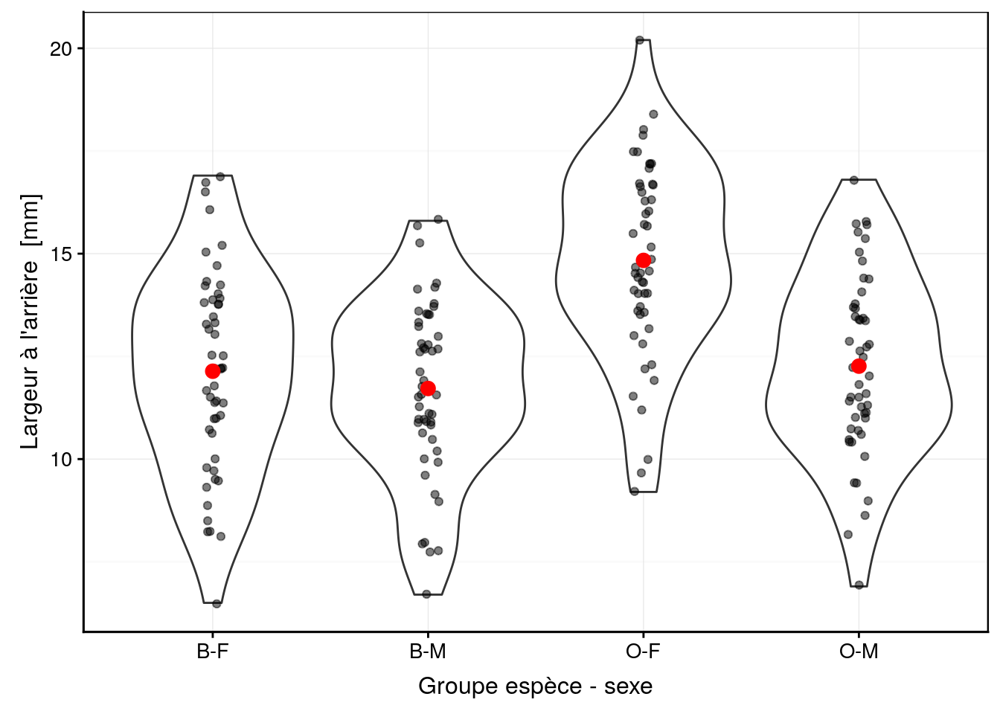
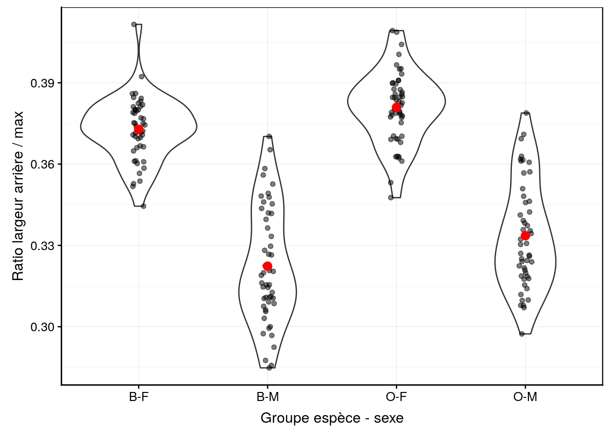
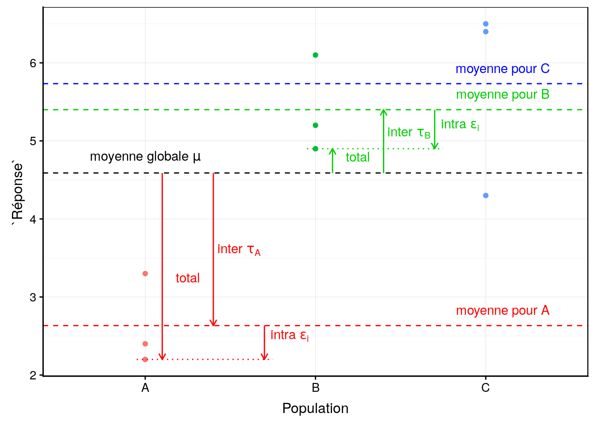
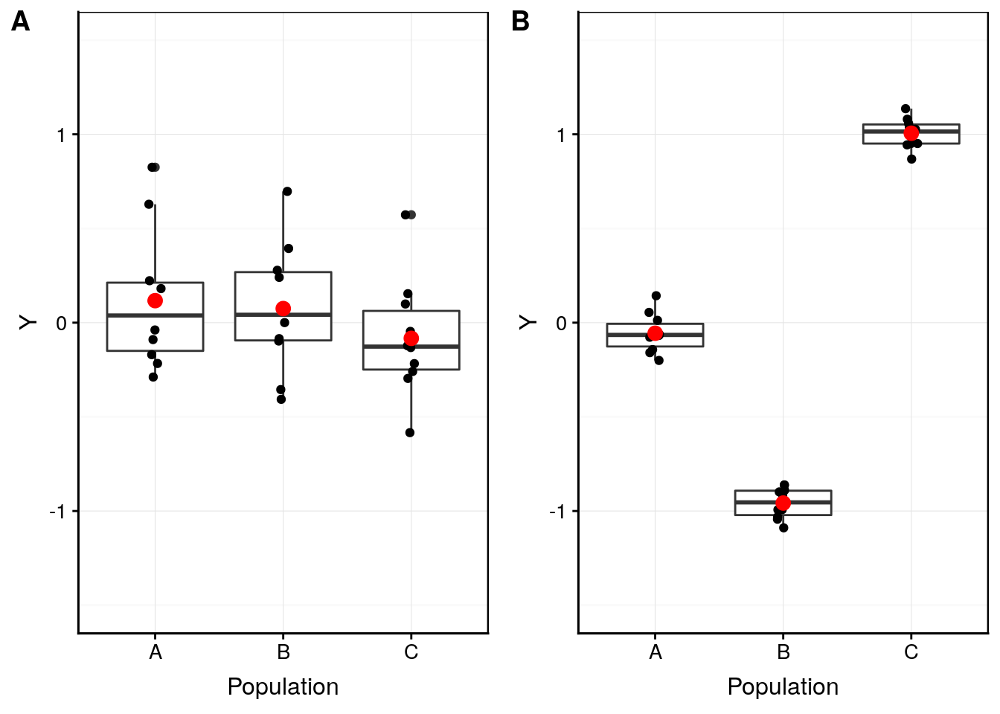
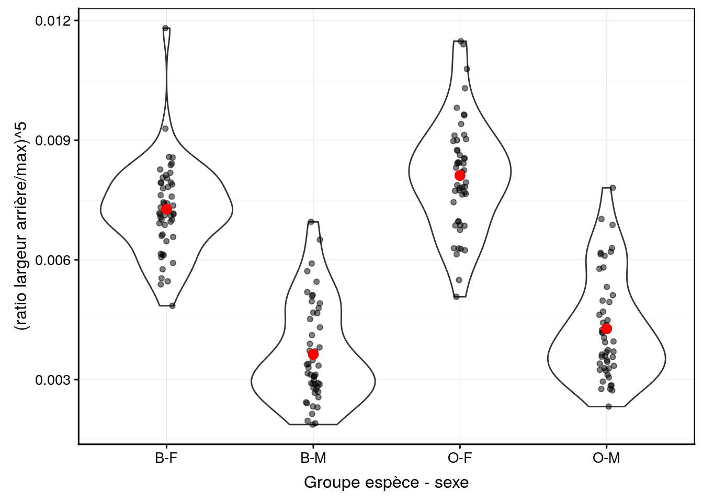

# Variance {#variance}


##### Objectifs {-}

- Pouvoir comparer plus de deux populations simultanément en utilisant des techniques de décomposition de la variance
 
- Découvrir le modèle linéaire, anciennement analyse de variance (ANOVA)
 
- Savoir effectuer des tests de comparaison multiples

- Connaitre l'équivalent non paramétrique à un facteur (test de Kruskal-Wallis)


##### Prérequis {-}

Ce module continue la comparaison de moyennes entamée, pour deux populations au module \@ref(moyenne). Assurez-vous d'avoir bien compris le test *t* de Student et les subtilités des tests d'hypothèse avant d'entamer la présente section.


## Le danger des tests multiples

Les tests *t* de Student et de Wilcoxon sont limités à la comparaison de deux populations. Poursuivons notre analyse des crabes *L. variegatus*. Rappelez-vous, nous avons deux variétés (variable `species`, `B` pour bleue et `O`pour orange). Si nous voulons comparer simultanément les mâles et les femelles des deux variétés, cela nous fait quatre sous-populations à comparer (nous utilisons ici la fonction `paste()` qui rassemble des chaînes de caractère avec trait comme caractère séparateur `sep ="-"` pour former une variable facteur à quatre niveaux, `B-F`, `B-M`, `O-F`, `O-M`). Nous transformaons cette variable en facteur à l'aide de `factor()` et nous ajoutons un label avec `labelise()`.


```r
crabs <- read("crabs", package = "MASS", lang = "fr")
crabs %>.%
  mutate(., group  = labelise(
    factor(paste(species, sex, sep = "-")),
    "Groupe espèce - sexe", units = NA)) ->
  crabs2
```

La Fig. \@ref(fig:crabs-rear) montre la largeur à l'arrière de la carapace chez les quatre groupes ainsi individualisés. Une représentation graphique adéquate avant de réaliser notre analyse ici lorsque le nombre de répliquats est important est le graphique en violon sur lequel nous superposons au moins les moyennes, et de préférence, les points également. Si le nombre de répliquats est plus faible, mais toujours supérieur à 7-8, nous pourrions utiliser le même type de graphique mais avec des boites de dispersion plutôt (voir plus loin, Fig. \@ref(fig:anova2)). Avec encore moins de répliquats nous présenterons les points et les moyennes uniquement.


```r
chart(data = crabs2, rear ~ group) +
  geom_violin() +
  geom_jitter(width = 0.05, alpha = 0.5) +
  geom_point(data = group_by(crabs2, group) %>.%
    summarise(., means = mean(rear, na.rm = TRUE)),
    f_aes(means ~ group), size = 3, col = "red")
```

<div class="figure" style="text-align: center">

<p class="caption">(\#fig:crabs-rear)Largeur arrière en fonction du groupe de crabes *L. variegatus*. Graphique adéquat pour comparer les moyennes et distributions dans le cas d'un nombre important de répliquats (moyennes en rouge + observations individuelles en noir semi-transparent superposées à des graphiques en violon).</p>
</div>

Nous en profitons également pour essayer l'astuce proposée au module précédent. Au lieu de travailler sur la variable `rear` seule, nous allons étudier l'aspect ratio entre largeur à l'arrière (`rear`) et largeur maximale (`width`) de la carapace afin de nous débarrasser d'une source de variabilité triviale qui est qu'un grand crabe est grand partout, et de même un petit crabe est petit pour toutes ses mesures. Nous prenons soin également de libeller cette nouvelle variable correctement avec `labelise()`. Enfin, nous ne conservons que les variables `species`, `sex`, `group` et `aspect` avec `select()\ :


```r
crabs2 %>.%
  mutate(., aspect = labelise(
    as.numeric(rear / width),
    "Ratio largeur arrière / max", units = NA)) %>.%
  select(., species, sex, group, aspect) ->
  crabs2
skimr::skim(crabs2)
```

```
# Skim summary statistics
#  n obs: 200 
#  n variables: 4 
# 
# ── Variable type:factor ────────────────────────────────────────────────────────
#  variable missing complete   n n_unique                         top_counts
#     group       0      200 200        4 B-F: 50, B-M: 50, O-F: 50, O-M: 50
#       sex       0      200 200        2              F: 100, M: 100, NA: 0
#   species       0      200 200        2              B: 100, O: 100, NA: 0
#  ordered
#    FALSE
#    FALSE
#    FALSE
# 
# ── Variable type:numeric ───────────────────────────────────────────────────────
#  variable missing complete   n mean   sd   p0  p25  p50  p75 p100     hist
#    aspect       0      200 200 0.35 0.03 0.28 0.32 0.36 0.38 0.41 ▂▅▅▃▅▇▆▁
```

Nous avons 50 individus dans chacun des quatre groupes. **Lorsqu'il y a le même nombre de réplicats dans tous les groupes, on appelle cela un plan balancé**. C'est une situation optimale. Nous devons toujours essayer de nous en rapprocher le plus possible car, si le nombre d'individus mesurés diffère fortement d'un groupe à l'autre, nous aurons forcément moins d'information disponible dans le ou les groupes moins nombreux, ce qui déforcera notre analyse.

Nous voyons également que la variable `aspect` semble avoir une distribution bimodale d'après le petit histogramme représenté dans le résumé. La Fig. \@ref(fig:anova0) avec `aspect montre une différence plus qu'avec `rear` seul, à la Fig. \@ref(fig:crabs_rear).


```r
chart(data = crabs2, aspect ~ group) +
  geom_violin() +
  geom_jitter(width = 0.05, alpha = 0.5) +
  geom_point(data = group_by(crabs2, group) %>.%
    summarise(., means = mean(aspect, na.rm = TRUE)),
    f_aes(means ~ group), size = 3, col = "red")
```

<div class="figure" style="text-align: center">

<p class="caption">(\#fig:anova0)Ratio largeur arrière/largeur max en fonction du groupe de crabes *L. variegatus*. Graphique adéquat pour comparer les moyennes et distributions dans le cas d'un nombre important de répliquat (moyennes en rouge + observations individuelles en noir semi-transparent superposées à des graphiques en violon).</p>
</div>

Nous voyons ici beaucoup mieux que la distribution bimodale est essentiellement dûe au dymorphiqme sexuel plutôt qu'à des différences entre les variétés, mais qu'en est-il plus précisément car si nous regardons attentivement, il semble que les moyennes pour les crabes bleus sont légèrement inférieures à ces des crabes oranges.

Comment comparer valablement ces quatre groupes\ ? Comme nous savons maintenant comparer deux groupes à l'aide d'un test *t* de Student, il est tentant d'effectuer toutes les comparaisons deux à deux et de résumer l'ensemble, par exemple, dans un tableau synthétique. Ca fait quant même beaucoup de comparaisons (`B-F` <-> `B-M`, `B-F` <-> `O-F`, `B-F` <-> `O-M`, `B-M` <-> `O-F`, `B-M`<-> `O-M`, et finalement `O-F` <-> `O-M`). Cela fait six comparaisons à réaliser.

N'oublions pas que, à chaque test, nous prenons un risque de nous tromper. **Le risque de se tromper au moins une fois dans l'ensemble des tests est alors décuplé en cas de tests multiples.** Prenons un point de vue naïf, mais qui suffira ici pour démontrer le problème qui apparaît. Admettons que le risque de nous tromper est constant, que nous rejettons ou non $H_0$, et qu'il est de l'ordre de 10% dans chaque test individuellement^[Attention\ ! vous savez bien que c'est plus compliqué que cela. D'une part, le risque de se tromper est probablement différent si on rejette $H_0$ ($\alpha$) ou non ($\beta$), et ces risques sont encore à moduler en fonction de la probabilité *a priori*, un cas similaire au dépistage d'une maladie plus ou moins rare, rappelez-vous, au module \@ref(proba).]. La seule solution acceptable est que *tous* les tests soeijnt corrects. Considérant chaque interprétation indépendante, nous pouvons multiplier les probabilités d'avoir un test correct (90%) le nombre de fois que nous faisons le test, soit $0,9 \times 0,9 \times 0,9 \times 0,9 \times 0,9 \times 0,9 = 0,9^6 = 0,53$. Tous les autres cas ayant au moins un test faux, nous constatons que notre analyse globale sera incorrecte $1 - 0,53 = 47\%$ du temps^[Dans R, vous pouvez utiliser `choose(n, j)` pour calculer le coefficient binomial. Donc votre calcul du risque de se tromper au moins une fois dans un ensemble de `n` tests dont le risque individuel est `r` sera `1 - (1 - r)^choose(n, 2)`.]. **Notre analyse sera incorrecte une fois sur deux environ.**

<div class="info">
<p>De manière générale, le nombre de combinaisons deux à deux possibles dans un set de <code>n</code> groupes distincts sera calculé à l’aide du coefficient binomial que nous avions déjà rencontré avec la distribution du même nom, ici avec <span class="math inline">\(j\)</span> valant deux.</p>
<p><span class="math display">\[C^j_n = \frac{n!}{j!(n-j)!}\]</span></p>
<p>Toujours avec notre approche naïve du risque d’erreur individuel pour un test <span class="math inline">\(r\)</span> de 10%, le risque de se tromper au moins une fois est alors :</p>
<p><span class="math display">\[1 - (1 - r)^{C^2_n}\]</span></p>
<p>Voici ce que cela donne comme risque de se tromper dans au moins un des tests en fonction du nombre de groupes à comparer  :</p>
<table>
<thead>
<tr class="header">
<th align="left">Groupes comparés 2 à 2</th>
<th align="center">2</th>
<th align="center">3</th>
<th align="center">4</th>
<th align="center">6</th>
<th align="center">8</th>
<th align="center">10</th>
</tr>
</thead>
<tbody>
<tr class="odd">
<td align="left">Risque individuel = 10%</td>
<td align="center">10%</td>
<td align="center">27%</td>
<td align="center">47%</td>
<td align="center">79%</td>
<td align="center">95%</td>
<td align="center">99%</td>
</tr>
</tbody>
</table>
<p>Clairement, on oublie cette façon de faire ! Prendre le risque de se tromper 99 fois sur 100 en comparant 10 groupes différents n’est pas du tout intéressante comme perspective.</p>
</div>

Nous allons donc travailler différemment... Ci-après nous verrons qu'une simplification des hypothèses et l'approche par décomposition de la variance est une option bien plus intéressante (ANalysis Of VAriance ou ANOVA). Ensuite, nous reviendrons vers ces comparaisons multiples deux à deux, mais en prenant des précautions pour éviter l'inflation du risque global de nous tromper.


## ANOVA à un facteur

Au lieu de s'attaquer aux comparaisons deux à deux, nous pouvons aussi considérer une hypothèse unique que les moyennes de $k$ populations (nos quatre groupes différents de crabes, par exemple) sont égales. L'hypothèse alternative sera qu'au moins une des moyennes diffère des autres. En formulation mathématique, cela donne\ :

- $H_0: \mu_1 = \mu_2 = ... = \mu_k$

- $H_1: \exists(i, j) \mathrm{\ tel\ que\ } \mu_i \neq \mu_j$

Notre hypothèse nulle est très restrictive, mais par contre, l'hypothèse alternative est très vague car nous ne savons pas **où** sont les différences à ce stade si nous rejettons $H_0$, mais nous nous en occuperons plus tard.

<div class="info">
<p><strong>Propriété d’additivité des parts de variance</strong>. La variance se calcule comme :</p>
<p><span class="math display">\[var_x = \frac{SCT}{ddl}\]</span></p>
<p>Avec <span class="math inline">\(SCT\)</span>, la somme des carrés totaux, soit <span class="math inline">\(\sum_{i = 1}^n (x_i - \bar{x})^2\)</span>, la somme des carrés des écarts à la moyenne générale. Les ddl sont les degrés de liberté déjà rencontrés à plusieurs reprises qui valent <span class="math inline">\(n - 1\)</span> dans le cas de la variance d’un échantillon.</p>
<p>Cette variance peut être <em>partitionnée</em>. C’est-à-dire que, si la variance totale se mesure d’un point A à un point C, l’on peut mesurer la part de variance d’un point A à un point B, puis l’autre part d’un point B à un point C, et dans ce cas,</p>
<p><span class="math display">\[SCT = SC_{A-C} = SC_{A-B} + SC_{B-C}\]</span></p>
<p>Cette propriété, dite d’additivité des variances, permet de décomposer la variance totale à souhait tout en sachant que la somme des différentes composantes donne toujours la même valeur que la variance totale.</p>
</div>


### Modèle de l'ANOVA

Mais qu'est-ce que cette propriété d'additivité des variances vient faire ici\ ? Nous souhaitons comparer des moyennes, non\ ? Effectivement, mais considérons le **modèle mathématique suivant\ :**

$$y_{ij} = \mu + \tau_j + \epsilon_i \mathrm{\ avec\ } \epsilon \sim N(0, \sigma)$$

Avec l'indice $j = 1 .. k$ populations et l'indice $i = 1 .. n$ observations du jeu de données. Chaque observation $y_{ij}$ correspond à deux écarts successifs de la moyenne globale $\mu$\ : une constante "tau" par population $\tau_j$ d'une part et un terme $\epsilon_i$ que l'on appelle les **résidus** et qui est propre à chaque observation individuelle. C'est ce dernier terme qui représente la partie statistique du modèle avec une distribution normale centrée sur zéro et avec un écart type $\sigma$ que nous admettrons constant et identique pour toutes les populations par construction.

Le graphique à la Fig. \@ref(fig:anova1) représente une situation typique à trois sous-populations.

<div class="figure" style="text-align: center">

<p class="caption">(\#fig:anova1)Décomposition de la variance dans un cas à trois populations A, B et C fictives.</p>
</div>

Notons que ce modèle à trois termes représente bien la situation qui nous intéresse, mais aussi, qu'il décompose la variance totale (entre $\mu$ et chaque point observé) en deux\ : ce que nous appelerons le terme **inter** représentant l'écart entre la moyenne globale $\mu$ et la moyenne de la sous-population concernées ($\tau_j$) et le terme **intra** depuis cette moyenne de la sous-population jusqu'au point observé ($\epsilon_i$).

D'une part, nous nous trouvons dans une situation d'additivité de la variance si nous décidons de calculer ces "variance inter" et "variance intra". D'autre part, sous $H_0$ nous sommes sensés avoir toutes les moyennes égales à $\mu$, et donc, tous les $\tau_j = 0$. Donc, les valeurs non nulles de $\tau_j$ ne doivent qu'être dus au hasard de l'échantillonnage et être par conséquent largement inférieurs à la variabilité entre les individus, ou variance intra $\epsilon_i$. La Fig. \@ref(fig:anova2) représente deux cas avec à gauche une situation où $H_0$ est plausible, et à droite une situation où elle est très peu plausible. Notez qu'à gauche la variation entre les observations (intra) est bien plus grande que l'écart entre les moyennes (inter), alors qu'à droite c'est l'inverse.


```
# Warning: `data_frame()` is deprecated, use `tibble()`.
# This warning is displayed once per session.
```

<div class="figure" style="text-align: center">

<p class="caption">(\#fig:anova2)A. Cas fictif avec moyennes probablement égales entre populations (étalement des points bien plus large que l'écart entre les moyennes), B. cas où les moyennes sont probablement différentes (écart des moyennes "inter" bien plus grand que l'étalement des points en "intra"-population).</p>
</div>

Intuitivement, une comparaison de "inter" et "intra" permet de différencier la situation de gauche de celle de droite dans la Fig. \@ref(fig:anova2). Si cette comparaison est faite sous forme d'un ratio "inter"/"intra", alors ce ratio sera faible et tendra vers zéro sous $H_0$ (cas A), alors qu'il sera d'autant plus élevé que $H_0$ devient de moins en moins plausible (cas B).


##### Calcul de l'ANOVA {-}

Calcul des sommes des carrés (inter- et intragroupes). Considérant\ :

- _i_ = indice des observations au sein du jeu de données de 1 à _n_,
- _j_ = facteurs (sous-populations de 1 à _k_),
- $\bar{y}$ = moyenne generale de l'échantillon,
- $\bar{y_j}$ = moyenne de la _j_^ème^ population.

La somme des carrés inter $SC_{inter}$ et la somme des carrés intra $SC_{intra}$ se calculent comme suit\ :

$$
\begin{aligned}
SC_{inter} = \sum_{i=1}^n{(\bar{y_j} - \bar{y})^2} && SC_{intra} = \sum_{i=1}^n{(y_{ij} - \bar{y_j})^2}
\end{aligned}
$$

A ces sommes des carrés, nous pouvons associer les degrés de liberté suivants\ :

- _k_ – 1 pour l’intergroupe
- _n_ – _k_ pour l’intragroupe

Sachant que les parts de variances sont les $\frac{SC}{ddl}$ et sont appelés "carrés moyens", nous construisons ce qu'on appelle le **tableau de l’ANOVA** de la façon suivante\ :

| Type            |    Ddl    | Somme carrés | Carré moyen (_CM_)  |       Statistique _F_~obs~       | P (>_F_) |
|:----------------|:---------:|:------------:|:-------------------:|:----------------------------------:|:-----:|
| Inter (facteur) | _k_ - 1   | _SC~inter~_ | _SC~inter~/ddl~inter~_ | _CM~inter~/CM~intra~_ |  ...  |
| Intra (résidus) | _n_ - _k_ | _SC~intra~_  | _SC~intra~/ddl~intra~_ |  |  |

La **statistique _F_~obs~ est le rapport des carrés moyens inter/intra.** Elle représente donc le ratio que nous avons évoqué plus haut comme moyen de quantifier l'écart par rapport à $H_0$. Le test consiste à calculer la valeur *P* associée à cette statistique. Pour cela, il nous faut une distribution statistique théorique de *F* sous $H_0$. C'est un biologiste - statisticien célèbre nommé Ronald Aylmer Fisher qui l'a calculée. C'est la distribution *F* de Fisher.


### Distribution *F*

##### A vous de jouer ! {-}

<div class="bdd">
<p>Afin d’appliquer directement les concepts vu dans ce module, ouvrez RStudio dans votre SciViews Box, puis exécutez l’instruction suivante dans la fenêtre console :</p>
<pre><code>BioDataScience::run(&quot;10a_anova&quot;)</code></pre>
</div>

La distribution *F* est une distribution asymétrique n’admettant que des valeurs nulles ou positives, d'une allure assez similaire à la distribution du $\chi^2$ que nous avons étudiée au module \@ref(chi2). Elle est appelée loi de Fisher, ou encore, loi de Fisher-Snedecor. Elle a une asymptote horizontale à $+\infty$. La distribution *F* admet deux paramètres, respectivement les degrés de liberté au numérateur (inter) et au dénominateur (intra). La Fig. \@ref(fig:fplot) représente la densité de probabilité d'une loi *F* typique^[Les fonctions qui permettent les calculs relatifs à la distribution *F* dans R sont `<x>f()`, et les snippets correspondants dans la SciViews Box sont disponibles à partir de `.if`. Leur utilisation est similaire à celle des distributions vues au module \@ref(proba).].

<div class="figure" style="text-align: center">

<p class="caption">(\#fig:fplot)Allure typique de la densité de probabilité de la distribution F (ici ddl inter = 5 et ddl intra = 20). Plus *F~obs* est grand, plus l'hypothèse nulle est suspecte. La zone de rejet est donc positionnée à droite (en rouge).</p>
</div>

Nous commençons à avoir l'habitude maintenant. La valeur *P* est calculée comme l'aire à droite du quantile correspondant à *F~obs~*. Enfin, nous rejetterons $H_0$ seulement si la valeur *P* est inférieure au seuil $\alpha$ qui a été choisi préalablement au test. Ceci revient à constater que, graphiquement, *F~obs~* vient se positionner dans la zone de rejet en rouge comme sur la Fig. \@ref(fig:fplot).

##### Conditions d’application {-}

- échantillon représentatif (par exemple, aléatoire),
- observations indépendantes,
- variable dite **réponse** quantitative,
- une variable dite **explicative** qualitative à trois niveaux ou plus,
- distribution **normale** des résidus $\epsilon_i$,
- **homoscédasticité** (même variance intragroupes, "homoscedasticity" en anglais, opposé à hétéroscédasticité = variance différente entre les groupes).

Les deux dernières conditions d'applications doivent être vérifiées. La nomralité des résidus doit être rencontrée aussi bien que possible. Un graphique quantile-quantile des résidus permet de se faire une idée, comme sur la Fig. \@ref(fig:resid1). Néanmoins, le test étant relativement robuste à des petites variations par rapport à la distribution normale, surtout si ces variations sont symétriques, nous ne seront pas excessivement stricts ici.

<div class="figure" style="text-align: center">

<p class="caption">(\#fig:resid1)Graphique quantile-quantile appliqué aux résidus d'une ANOVA pour déterminer si leur distribution se rapproche d'un loi normale.</p>
</div>

La condition d'homoscédasticité est plus sensible. Elle mérite donc d'être vérifiée systématiquement et précisément. Différents tests d'hypothèse existent pour le vérifier, comme le test de Batlett, le test de Levene, etc. Nous vous proposns ici d'utiliser le test de Batlett. Ses hypothèses sont\ :

- $H_0: var_1 = var_2 = ... = var_k$ (homoscédasticité)
- $H_1: \exists(i, j) \mathrm{\ tel\ que\ } var_i \neq var_j$ (hétéroscédasticité)

Si la valeur *P* est inférieure au seuil $\alpha$ fixé au préalable, nous devrons rechercher une transformation des variables qui stabilisera la variance. La première transformation à essayer en biologie et la transformation logarithmique surtout si les valeurs négatives de la variable réponse ne sont pas possibles, signe d'une distribution qui peut être plutôt de type log-normale pour cette variable. Si aucune transformation ne stabilise la variance, nous devrons nous rabattre vers un test non paramétrique équivalent, le test de Kruskal-Wallis que nous aborderons plus loin dans ce module.

La SciViews Box propose des snippets pour accéder à ces différentes analyses. Dans le menu `hypothesis tests: variances` ou `.hv` nous trouvons trois tests dont celui de Bartlett. Dans le menu `hypothesis tests: means` ou `.hm` se trouvent les templates pour l'ANOVA, ainsi que les graphiques d'analyse des résidus dont le graphique quantile-quantile.


##### Résolution de notre exemple {-}

Nous commençons par déterminer si nous avons homoscédasticité. Cosidérons un seuil $\alpha$ de 5% pour tous nos tests. Ensuite\ :


```r
bartlett.test(data = crabs2, aspect ~ group)
```

```
# 
# 	Bartlett test of homogeneity of variances
# 
# data:  aspect by group
# Bartlett's K-squared = 24.532, df = 3, p-value = 1.935e-05
```

Nous rejettons $H_0$. Il n'y a pas homoscédasticité. Calculons par exemple le logarithme népérien de `aspect` et réessayons\ :


```r
crabs2 %>.%
  mutate(., log_aspect = ln(aspect)) ->
  crabs2
bartlett.test(data = crabs2, log_aspect ~ group)
```

```
# 
# 	Bartlett test of homogeneity of variances
# 
# data:  log_aspect by group
# Bartlett's K-squared = 37.891, df = 3, p-value = 2.981e-08
```

Ici cela ne fonctionne pas. Cela fait pire qu'avant. La transformation inverse (`exp()`) peut être essayée mais ne stabilise pas suffisamment la variance. Après divers essais, il s'avère qu'une transformation puissance cinq stabilise bien la variance.


```r
crabs2 %>.%
  mutate(., aspect5 = aspect^5) ->
  crabs2
bartlett.test(data = crabs2, aspect5 ~ group)
```

```
# 
# 	Bartlett test of homogeneity of variances
# 
# data:  aspect5 by group
# Bartlett's K-squared = 1.7948, df = 3, p-value = 0.6161
```

La Fig. \@ref(fig:crabs1) montre la distribution dans les différents groupes de la variable transformée.


```r
chart(data = crabs2, aspect5 ~ group) +
  geom_violin() +
  geom_jitter(width = 0.05, alpha = 0.5) +
  geom_point(data = group_by(crabs2, group) %>.%
    summarise(., means = mean(aspect5, na.rm = TRUE)),
    f_aes(means ~ group), size = 3, col = "red") +
  ylab("(ratio largeur arrière/max)^5")
```

<div class="figure" style="text-align: center">

<p class="caption">(\#fig:crabs1)Transformation puissance cinq du ratio largeur arrière/largeur max en fonction du groupe de crabes *L. variegatus*.</p>
</div>

Nous poursuivons sur une description des données utile pour l'ANOVA^[Un snippet dédié est disponible dans le menu `hypothesis tests: means` à partir de `.hm`.]\ :


```r
crabs2 %>.%
  group_by(., group) %>.%
  summarise(.,
    mean  = mean(aspect5),
    sd    = sd(aspect5),
    count = sum(!is.na(aspect5)))
```

```
# # A tibble: 4 x 4
#   group    mean      sd count
#   <fct>   <dbl>   <dbl> <int>
# 1 B-F   0.00727 0.00115    50
# 2 B-M   0.00363 0.00124    50
# 3 O-F   0.00811 0.00138    50
# 4 O-M   0.00427 0.00130    50
```

Ensuite l'ANOVA proprement dite\ :


```r
anova(anova. <- lm(data = crabs2, aspect5 ~ group))
```

```
# Analysis of Variance Table
# 
# Response: aspect5
#            Df     Sum Sq    Mean Sq F value    Pr(>F)    
# group       3 0.00072741 2.4247e-04  150.53 < 2.2e-16 ***
# Residuals 196 0.00031572 1.6110e-06                      
# ---
# Signif. codes:  0 '***' 0.001 '**' 0.01 '*' 0.05 '.' 0.1 ' ' 1
```

Nous retrouvons ici le tableau de l'ANOVA. La valeur *P* est très faible et inférieure à $\alpha$. Nous rejettons $H_0$. Nous pouvons dire que le ratio largeur arrière / max à la puissance cinq diffère significativement entre les groupes (ANOVA, F = 150, ddl = 3 & 196, valeur *P* << 10^-3^).

Ce n'est qu'une fois l'ANOVA réalisée que nous pouvons calculer et visionner la distribution des résidus (Fig. \@ref(fig:anova-resid)). Cette distribution s'éloigne aux extrêmes de la distribution normale. Nous sommes dans un cas un peu limite. Soit nous considérons que l'écart est suffisamment léger pour ne pas trop influer sur l'ANOVA, soit nous devons passer à un test non paramétrique. Nous ferons les deux ici à des fins de comparaison.

<div class="figure" style="text-align: center">

<p class="caption">(\#fig:anova-resid)Graphique quantile-quantile des résidus pour l'analyse de `aspect^5`.</p>
</div>

```
# [1]  65 103
```


##### Pour en savoir plus {-}

- [L'ANOVA expliquée en trois minutes](https://www.youtube.com/watch?v=lITNHx2z5FE)

- Introduction to ANOVA (en anglais). [Part I](https://youtu.be/QUQ6YppWCeg), [part II](https://youtu.be/fFnOD7KBSbw), [part III](https://youtu.be/XdZ7BRqznSA), [part IV](https://youtu.be/WUoVftXvjiQ), and [part V](https://youtu.be/kO8t_q-AXHE).

- Explication de l'analyse de variance en détaillant le calcul par la Kahn academy. [Partie I](https://www.youtube.com/watch?v=tjolTrwJhjM), [partie II](https://youtu.be/DMo9yofC5C8) et [partie III](https://youtu.be/y8nRhsixBPs). Assez long\ : près de 3/4h en tout. Ne regardez que si vous n'avez pas compris ce que sont les sommes des carrés.


## Test "post-hoc"

Lorsque nous rejettons $H_0$ dans l'ANOVA comme dans le cas de notre exemple, nous savons qu'il y a au moins deux moyennes qui diffèrent l'une de l'autre, mais nous ne savons pas lesquelles. Notre analyse n'est pas terminée. Nous allons revisiter les tests de comparaison multiples deux à deux, mais en prenant des précautions particulières pour éviter l'inflation du risque d'erreur.

Tout d'abort, nous mettons en place un garde-fou. Nous effectuons *toujours* une ANOVA en premier lieu, et nous n'envisageons les comparaisons multiples que lorsque $H_0$ est rejettée. Cela évite beaucoup de faux positifs. On appelle cela des tests "post hoc" car ils ne sont pas planifiés d'amblée, mais suivent un conclusion préalable (ici, le rejet de $H_0$ dans un test ANOVA).

Une approche simple consisterait à modifier notre seuil $\alpha$ pour chaque test individuel vers le bas afin que le risque de se tromper dans au moins un des tests ne dépasse pas la valeur de $/alpha$ que nous nous sommes fixée. C'est la **correction de Bonferroni**. Elle consiste à diviser la valeur de $/alpha$ par le nombre de tests simultanés nécessaires, et d'utiliser cette valeur corrigée comme seuil $\alpha$ de chaque test de Student individuel. Dans le cas de quatre populations, nous avons vu qu'il y a six comparaisons multiples deux à deux. Donc, en appliquant un seuil corrigé de $\alpha/6 = 0,05 / 6 = 0,00833$ pour chaque test, on aura la probabilité suivante pour $1 - \alpha$\ :

$$(1 - 0,05/6)^6 = 0,951$$

Donc, le risque *global* pour l'ensemble des six tests est bien de 1 - 0,951 = 0,049, soit 5%. Si elle a le mérite d'être simple, cette façon de faire n'est pas considérée comme la plus efficace. Actuellement, la méthode **HSD de Tukey** est préférée. HSD veut dire "Honest Significant Difference". La technique consiste à calculer l'écart minimal des moyennes pour considérer qu'elles sont significativement différentes l'une de l'autre. Ensuite, pour chaque comparaison deux à deux, l'écart entre les moyennes est comparée à cette valeur de référence^[Nous ne détaillons pas le calcul du test de Tukey ici, mais vous pouvez aller voir [ici](https://www.itl.nist.gov/div898/handbook/prc/section4/prc471.htm).]. Le test de comparaisons multiples de Tukey est accessible à partir des "snippets" dans la SciViews Box (`.hm` pour le menu `hypothesis tests: means`, puis `anova - multiple comparisons`). Nous obtenons à la fois une version textuelle et une version graphique qui résume les comparaisons.


```r
summary(anovaComp. <- confint(multcomp::glht(anova.,
  linfct = multcomp::mcp(group = "Tukey"))))
```

```
# 
# 	 Simultaneous Tests for General Linear Hypotheses
# 
# Multiple Comparisons of Means: Tukey Contrasts
# 
# 
# Fit: lm(formula = aspect5 ~ group, data = crabs2)
# 
# Linear Hypotheses:
#                  Estimate Std. Error t value Pr(>|t|)    
# B-M - B-F == 0 -0.0036378  0.0002538 -14.331  < 0.001 ***
# O-F - B-F == 0  0.0008441  0.0002538   3.326  0.00589 ** 
# O-M - B-F == 0 -0.0029979  0.0002538 -11.810  < 0.001 ***
# O-F - B-M == 0  0.0044820  0.0002538  17.657  < 0.001 ***
# O-M - B-M == 0  0.0006399  0.0002538   2.521  0.05938 .  
# O-M - O-F == 0 -0.0038420  0.0002538 -15.136  < 0.001 ***
# ---
# Signif. codes:  0 '***' 0.001 '**' 0.01 '*' 0.05 '.' 0.1 ' ' 1
# (Adjusted p values reported -- single-step method)
```

```r
.oma <- par(oma = c(0, 5.1, 0, 0)); plot(anovaComp.); par(.oma); rm(.oma)
```


Si nous gardons notre seuil $\alpha$ de 5%, seuls les mâles ne diffèrent (tout juste) pas entre eux (``O-M - B-M`) avec une valeur *P* de 6%. Toutes les autres comparaisons deux à deux sont significativement différentes. Sur le graphique, si les intervalles autour des différences de moyennes comprennent zéro, matérialisé par un trait pointillé vertical, les différences ne sont pas significatives.

En conclusion, tous les groupes diffèrent de manière siginificative sauf les mâles (test HSD de Tukey, valeur *P* < 5%).


##### Conditions d'application {-}

Les conditions d'application pour le test post hoc de Tukey sont les mêmes que pour l'ANOVA.


## Test de Kruskal-Wallis

Les conditions d'application de l'ANOVA sont assez restrictives, en particuliers l'homoscédasticité et le normalité des résidus. Dans notre example, nous avons pu stabiliser la variance par une transformation puissance cinq, mais la distribution des résidus n'est pas optimale. Nous pouvons tout aussi bien décider de nous orienter vers la version non paramétrique équivalente\ : le **test de Kruskal-Wallis**.

<div class="warning">
<p>Le raisonnement entre ANOVA (test paramétrique) et Kruska-Wallis (test non paramétrique) est le même qu’entre le test de Student ou celui de Wilcoxon. Lorsque les conditions sont remplies, l’ANOVA est un test plus puissant à utiliser en priorité. Nous le préfèrerons donc, sauf dans les cas impossibles où aucune transformation des données ne permet d’obtenir une distribution acceptable des résidus et des variances.</p>
</div>

Le test de Kruskal-Wallis va comparer la localisation des points sur l'axe plutôt que les moyennes. Nous travaillons ici sur les **rangs**. La transformation en rangs consiste à ranger les observations de la plus petite à la plus grande et à remplacer les valeurs par leur position (leur rang) dans ce classement. Les ex-aequos reçoivent des rangs équivalents. Un petit exemple\ :


```r
# Un échantillon
x <- c(4.5, 2.1, 0.5, 2.4, 2.1, 3.5)
# Tri par ordre croissant
sort(x)
```

```
# [1] 0.5 2.1 2.1 2.4 3.5 4.5
```

```r
# Remplacement par les rangs
rank(sort(x))
```

```
# [1] 1.0 2.5 2.5 4.0 5.0 6.0
```

Donc 0,5 donne 1, 2,1 apparait deux fois en position 2 et 3, donc on leurs attribue à tous les deux le rang 2,5. 2,4 est remplacé par 4, 3,5 par 5 et enfin 4,5 est remplacé par 6.

Dans le test de Kruskal-Wallis, sous $H_0$ nous avons le même rang moyen (noté $mr$) pour chaque groupe parmi $k$. Sous $H_1$, au moins deux groupes ont des rangs moyens différents. 

- $H_0:mr_1 = mr_2 = ... = mr_k$

- $H_1: \exists(i, j) \mathrm{\ tel\ que\ } mr_i \neq mr_j$

Nous ne détaillons pas les calculs (mais voyez [ici](http://vassarstats.net/textbook/ch14a.html)). Le calcul aboutit en fait à une valeur de $\chi^2_{obs}$ à $k - 1$ degrés de liberté lorsque *k* populations sont comparées. Ainsi, nous avons déjà un loi de distribution théorique pour le calcul de la valeur *P*. La zone de rejet est située à la droite de la distribution comme dans le cas de l'ANOVA et du test de $\chi^2$.

Le test est réalisé dans R avec la fonction `kruskal.test()`. Notez que les arguments sont les mêmes que pour l'ANOVA à un facteur. Un "snippet" est disponible dans la SciViews Box (`.hn` pour `hypothesis tests: nonparametric`, ensuite `Kruskal-Wallis test`).


```r
kruskal.test(data = crabs2, aspect ~ group)
```

```
# 
# 	Kruskal-Wallis rank sum test
# 
# data:  aspect by group
# Kruskal-Wallis chi-squared = 139.68, df = 3, p-value < 2.2e-16
```

Ici, nous rejettons $H_0$ au seuil $\alpha$ de 5%. Nous pouvons dire qu'il y a au moins une différence significative entre les ratios au seuil $\alpha$ de 5% (test Kruskal-Wallis, $\chi^2$ = 140, ddl = 3, valeur *P* << 10^-3^).


##### Conditions d'application {-}

Le test de Kruskal-Wallis est naturellement moins contraignant que l'ANOVA.

- échantillon représentatif (par exemple, aléatoire),
- observations indépendantes,
- variable dite **réponse** quantitative,
- une variable dite **explicative** qualitative à trois niveaux ou plus,
- les distributions au sein des différentes sous-population sont, si possible, similaires mais de forme quelconque.


### Test "post hoc" non paramétrique

Nous devrions également réaliser des tests "pot hoc" lorsque nous rejettons $H_0$ du Kruskal-Wallis. Les version non paramétriques des tests de comparaisons multiples sont moins connus. Nous pourrions effectuer des comparaisons deux à deux avec des tests de Wilcoxon en appliquant une correction de Bonferroni.

Une autre option consiste à utiliser une version non paramétrique du test de Tukey basée sur les rangs, dit test pot hoc non paramétrique asymptotique. Les explications assez techniques sont disponibles [ici](https://onlinelibrary.wiley.com/doi/abs/10.1002/1521-4036%28200109%2943%3A5%3C553%3A%3AAID-BIMJ553%3E3.0.CO%3B2-N). Ce test est également disponible dans la SciViews Box depuis `.hn`, en sélectionnant l'entrée `Kruskal-Wallis: multiple comparisons` dans le menu déroulant.


```r
summary(kw_comp. <- nparcomp::nparcomp(data = crabs2, aspect ~ group))
```

```
# 
#  #------Nonparametric Multiple Comparisons for relative contrast effects-----# 
#  
#  - Alternative Hypothesis:  True relative contrast effect p is less or equal than 1/2 
#  - Type of Contrast : Tukey 
#  - Confidence level: 95 % 
#  - Method = Logit - Transformation 
#  - Estimation Method: Pairwise rankings 
#  
#  #---------------------------Interpretation----------------------------------# 
#  p(a,b) > 1/2 : b tends to be larger than a 
#  #---------------------------------------------------------------------------# 
#  
# 
#  #------------Nonparametric Multiple Comparisons for relative contrast effects----------# 
#  
#  - Alternative Hypothesis:  True relative contrast effect p is less or equal than 1/2 
#  - Estimation Method: Global Pseudo ranks 
#  - Type of Contrast : Tukey 
#  - Confidence Level: 95 % 
#  - Method = Logit - Transformation 
#  
#  - Estimation Method: Pairwise rankings 
#  
#  #---------------------------Interpretation--------------------------------------------# 
#  p(a,b) > 1/2 : b tends to be larger than a 
#  #-------------------------------------------------------------------------------------# 
#  
#  #----Data Info-------------------------------------------------------------------------# 
#   Sample Size
# 1    B-F   50
# 2    B-M   50
# 3    O-F   50
# 4    O-M   50
# 
#  #----Contrast--------------------------------------------------------------------------# 
#           B-F B-M O-F O-M
# B-M - B-F  -1   1   0   0
# O-F - B-F  -1   0   1   0
# O-M - B-F  -1   0   0   1
# O-F - B-M   0  -1   1   0
# O-M - B-M   0  -1   0   1
# O-M - O-F   0   0  -1   1
# 
#  #----Analysis--------------------------------------------------------------------------# 
#       Comparison Estimator Lower Upper Statistic      p.Value
# 1 p( B-F , B-M )     0.017 0.004 0.070 -7.229567 1.618261e-12
# 2 p( B-F , O-F )     0.695 0.542 0.815  3.257267 5.905270e-03
# 3 p( B-F , O-M )     0.051 0.018 0.137 -7.014700 7.867484e-12
# 4 p( B-M , O-F )     0.990 0.949 0.998  7.210499 2.279288e-12
# 5 p( B-M , O-M )     0.654 0.501 0.781  2.606445 4.792701e-02
# 6 p( O-F , O-M )     0.027 0.008 0.088 -7.385440 4.057865e-13
# 
#  #----Overall---------------------------------------------------------------------------# 
#   Quantile      p.Value
# 1 2.593391 4.057865e-13
# 
#  #--------------------------------------------------------------------------------------#
```

```r
plot(kw_comp.)
```


La présentation des résultats est plus détaillée que pour le HSD de Tukey. Le graphique est très imilaire. Ici, toutes les différences sont considérées comme significatives, même si la comparaison des mâles `B-M - O-M` avec une valeur *P* tout juste significative de 0,049 est à prendre avec des pincettes étant donné sa proximité du seuil.

Au final que conclure\ ? Lorsque l'ANOVA peut être utilisée, elle est à préférer. Ici avec une transformation puissance cinq, nous stabilisons la variance qui est le critère le plus sensible. De plus tant avec l'ANOVA qu'avec le Kruskal-Wallis, nous détectons des différences significatives. Les tests "post hoc" nous indiquent des différences significatives au seuil $\alpha$ de 5% sauf peut-être pour les mâles (il faudrait prévoir des mesures supplémentaires pour confirmer ou infirmer à ce niveau).


##### A vous de jouer {-}

<div class="bdd">
<p>Afin d’appliquer directement les concepts vu au cours dans ce module, ouvrez RStudio dans votre SciViews Box, puis exécutez l’instruction suivante dans la fenêtre console :</p>
<pre><code>BioDataScience::run(&quot;10b_anova_kruskal&quot;)</code></pre>
</div>

<div class="bdd">
<p>Appliquez l’analyse de variances ou le test de Kruskal-Wallis dans vos projets portant sur la biométrie humaine et sur le zooplankton.</p>
</div>

## Sciences des données et littérature

Vous avez à présent vu l'utilisation de plusieurs tests statistiques très courant en science (t-test, Anova, $\chi^2$,...). La restitution correcte de ce test au sein d'un publication scientifique est très importante.

<div class="bdd">
<p>Intéressez-vous à la restitution de résultat statistique au sein de la littérature. Un projet individuel est mis à votre disposition</p>
<ul>
<li><a href="https://classroom.github.com/g/bc3Lh7C6" class="uri">https://classroom.github.com/g/bc3Lh7C6</a></li>
</ul>
</div>
