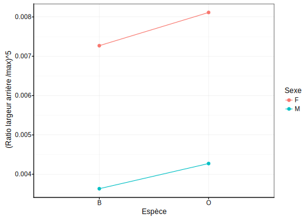

# Variance II {#variance2}


##### Objectifs {-}

- Maîtriser les différentes variantes d'ANOVA à deux facteurs
 
- Distinguer dans quel cas utiliser l'une ou l'autre de ces variantes
 
- Comprendre différents types de syntaxe dans R


##### Prérequis {-}

Ce module présente la suite de l'ANOVA initiée au module \@ref(variance). Vous devez avoir bien compris l'ANOVA à un facteur avant d'entamer le présent chapitre.

## ANOVA à deux facteurs

Dans le cadre de la'ANOVA à un facteur, nous avions une variable réponse numérique étudiée pour différents niveaux d'*une seule* variable facteur à *j* niveaux ou modalités. Le modèle utilisé était\ :

$$y_{ij} = \mu + \tau_j + \epsilon_i \mathrm{\ avec\ } \epsilon \sim N(0, \sigma)$$
Les $\tau_j$ représent les variations entre la moyenne générale $µ$ et les moyennes respectives des $j$ sous-populations. En R, nous avons utilisé la formule suivante\ :

$$y \sim fact$$

avec $y$ la variable numérique réponse et $fact$ la variable facteur explicative unique.

Si nous prenonsnotre exemple des crabes *L. variegatus*, nous avions travaillé un peu artificiellement sur une seule variable facteur en regroupant les variables `species` et `sex` en une seule variable `group`. Qu'en est-il si nous voulons quand même considérer les deux variables `species` et `sex` séparément\ ? c'est possible avec une ANOVA à deux facteurs


### Modèle sans interactions

La version la plus simple consiste à considérer simplement deux facteurs *successivement*, c'est-à-dire que la variance est décomposée d'abord selon le premier facteur, et ensuite selon le second.

$$y_{ijk} = \mu + \tau1_j + \tau2_k + \epsilon_i \mathrm{\ avec\ } \epsilon \sim N(0, \sigma)$$

avec $\tau1_j$ correspondant à l'écart de la moyenne générale $µ$ à la moyenne selon la j^ème^ population pour la variable `fact1`, et $\tau2_k$ correspondant à l'écart vers le k^ème^ niveau d'une seconde variable `fact2`. La formule qui spécifie ce modèle dans R avec les trois variables `y`, `fact1` et `fact2` s'écrit\ :

$$y \sim fact1 + fact2$$

Notez que, quel que soit le niveau considéré pour $\tau1$, un niveau donné de $\tau2$ est constant dans l'équation qui décrit ce modèle. Cela siginifie que l'on considère que les écarts pour les moyennes de la variable `fact2` sont toujours les mêmes depuis les moyennes de `fact1`. Donc, si une sous-population de `fact2` tend à avoir une moyenne, disons, supérieure pour la première sous-population de `fact1`, elle sera considérée comme ayant les mêmes écarts pour toutes les autres sous-populations de `fact1`. Evidemment, cette condition n'est pas toujours rencontrée dans la pratique. Le **graphique des interactions** (Fig.\ \@ref(fig:interactions)) permet de visualiser les écarts des moyennes respectives des différentes sous-populations.


```r
read("crabs", package = "MASS", lang = "fr") %>.%
  mutate(., aspect = labelise(
    as.numeric(rear / width),
    "Ratio largeur arrière / max", units = NA)) %>.%
  mutate(., aspect5 = labelise(
    aspect^5,
    "(Ratio largeur arrière /max)^5", units = NA)) %>.%
  select(., species, sex, aspect, aspect5) ->
  crabs2
# Graphique de base pour visualiser les interactions
#chart$base(interaction.plot(crabs2$species, crabs2$sex, crabs2$aspect5))
# Version avec ggplot2
crabs2 %>.%
  group_by(., species, sex) %>.%
  summarise(., aspect5_groups = mean(aspect5)) %>.%
  print(.) %>.% # Tableau des moyennes par groupes
  chart(data = ., aspect5_groups ~ species %col=% sex %group=% sex) +
    geom_line() +
    geom_point()
```

```
# # A tibble: 4 x 3
# # Groups:   species [?]
#   species sex   aspect5_groups
#   <fct>   <fct>          <dbl>
# 1 B       F            0.00727
# 2 B       M            0.00363
# 3 O       F            0.00811
# 4 O       M            0.00427
```

<div class="figure" style="text-align: center">

<p class="caption">(\#fig:interactions)Graphique des interactions entre les variables facteurs (espèce et sexe). Les traits (pratiquement) parallèles indiquent qu'il n'y a pas d'interactions, comme c'est le cas ici.</p>
</div>

Nous pouvons donc, ici, réaliser notre ANOVA à deux facteurs. Nous devons vérifier l'homoscédasticité, mais le test de Batlett que nous réalisons revient au même que celui que nous avons fait en décomposant toutes les sous-populations. Comme nous n'avons pas nécessairement ce calcul réalisé (la variable `group` que nous avions calculée au module \@ref(variance)), nous utilisons la fonction `interaction()` qui effectue ce calcu pour nous directement dans la formule\ :


```r
bartlett.test(data = crabs2, aspect5 ~ interaction(species, sex))
```

```
# 
# 	Bartlett test of homogeneity of variances
# 
# data:  aspect5 by interaction(species, sex)
# Bartlett's K-squared = 1.7948, df = 3, p-value = 0.6161
```

Si vous comparez avec le test que nous avions fait dans le cas de l'ANOVA à un facteur sur la variable `group`, vous constaterez qu'il donne exectement le même résultat. Nous continuons avec notre ANOVA. Nous avons un "snippet" pour cela dans le menu `hypothesis tests: means` à partir de `.hm` qui se nomme `two-way ANOVA (without interactions)`.


```r
anova(anova. <- lm(data = crabs2, aspect5 ~ species + sex))
```

```
# Analysis of Variance Table
# 
# Response: aspect5
#            Df     Sum Sq    Mean Sq F value    Pr(>F)    
# species     1 0.00002753 0.00002753   17.15  5.12e-05 ***
# sex         1 0.00069935 0.00069935  435.66 < 2.2e-16 ***
# Residuals 197 0.00031624 0.00000161                      
# ---
# Signif. codes:  0 '***' 0.001 '**' 0.01 '*' 0.05 '.' 0.1 ' ' 1
```

Comme la variance est décomposée en trois étapes (selon l'espèce, puis selon le sexe, puis les résidus), nous avons trois lignes dans le tableau de l'ANOVA. Nous effectuons deux tests. Le premier consiste à comparer les carrés moyens (`Mean Sq`) pour l'espèce par rapport aux résidus. Donc, la valeur `F` est le ratio de la somme des carrés `species` divisé par la somme des carrés des résidus, et cette valeur est reportée sur la loi de distribution théorique *F* pour obtenir une première valeur *P* (ici 5,12 . 10^-5^). De même, le seco nd test qui s'intéresse au sexe calcule la valeur *F* via la ratio de la somme des carrés pour `sex` divisé par la somme des carrés des résidus, et la loi *F* nous permet de calculer une seconde valeur *P* (ici 2,2 . 10^-16^).

Nous interprétons chacun des deux tests séparément. Dans notre cas, nous pouvons dire avec un seuil $\alpha$  de 5% que nous rejettons $H_0$ dans les deux cas. Donc le rapport largeur arrière sur largeur max de la carapace est significativement différent au seuil $\alpha$ de 5% à la fois en fonction de l'espèce (F = 17,15, ddl = 197 et 1, valeur *P* << 0,001) et du sexe (F = 436, ddl = 197 et 1, valeur *P* << 0,001)^[Notez que si vous incluez le tableau de l'ANOVA dans votre rapport ou dans une publication, il n'est pas nécessaire de répéter les résultats des tests entre parenthèses. Vous pouvez juste vous référer au tableau en question.].

La suite logique consiste à réaliser des tests "post hoc". Ils ne sont pas vraiment nécessaires ici puisque nous n'avons que deux niveaux pour chacune des deux variables, mais nous les réalisons quand même pour montrer le code correspondant. Un template est accessible via le "snippet" `anova - multiple comparisons [multcomp]` du menu `.hm`. Pensez juste à rajouter le second facteur `sex` dans les arguments de la fonction `mcp()`.


```r
summary(anovaComp. <- confint(multcomp::glht(anova.,
  linfct = multcomp::mcp(species = "Tukey", sex = "Tukey")))) # Add a second factor if you want
```

```
# 
# 	 Simultaneous Tests for General Linear Hypotheses
# 
# Multiple Comparisons of Means: Tukey Contrasts
# 
# 
# Fit: lm(formula = aspect5 ~ species + sex, data = crabs2)
# 
# Linear Hypotheses:
#                       Estimate Std. Error t value Pr(>|t|)    
# species: O - B == 0  0.0007420  0.0001792   4.141 0.000102 ***
# sex: M - F == 0     -0.0037399  0.0001792 -20.872  < 1e-10 ***
# ---
# Signif. codes:  0 '***' 0.001 '**' 0.01 '*' 0.05 '.' 0.1 ' ' 1
# (Adjusted p values reported -- single-step method)
```

```r
.oma <- par(oma = c(0, 5.1, 0, 0)); plot(anovaComp.); par(.oma); rm(.oma)
```


Il ne nous reste plus qu'à vérifier la distribution des résidus de l'ANOVA pour que notre analyse soit complète (Fig.\ \@ref(fig:anova2-resid)).

<div class="figure" style="text-align: center">

<p class="caption">(\#fig:anova2-resid)Graphique quantile-quantile des résidus pour l'ANOVA à deux facteurs sans interactions de `aspect^5`.</p>
</div>

```
# [1]  65 103
```

Encore une fois, nous voyons que les résidus sont quasiment les mêmes que précédemment, mais cela n'aurait pas été le cas si une interaction existait. La distribution s'éloigne un peu d'une Gaussienne pour les valeurs élevées surtout. Mais comme l'ANOVA est robuste à ce critère, et que l'homoscédasticité a été vérifiée sur la tranformation puissance 5 de nottre variable, nous pouvons conserver notre analyse moyennant une précaution supplémentaire\ : vérifier que les valeurs *P* sont **beaucoup** plus petites que notre seuil comme sécurité supplémentaires contre les approximations liées à la légère violoation de la contrainte de distribution normale des résidus. C'est le cas ici, et nous pouvons donc conclure notre analyse.


##### Conditions d’application {-}

- échantillon représentatif (par exemple, aléatoire),
- observations indépendantes,
- variable **réponse** quantitative,
- deux variables **explicatives** qualitatives à deux niveaux ou plus,
- distribution **normale** des résidus $\epsilon_i$,
- **homoscédasticité** (même variance intragroupes),
- pas d'**interactions** entre les deux variables explicatives.


### Modèle croisé complet

Le modèle ANOVA que nous venons de faire s'appelle un **modèle croisé** parce que ... Voyons maintenant le modèle complet qui prend en compte d'éventuelles interactions entre les deux variables facteurs. 

**Note\:** attention aux pseudo-répliquats\ !
