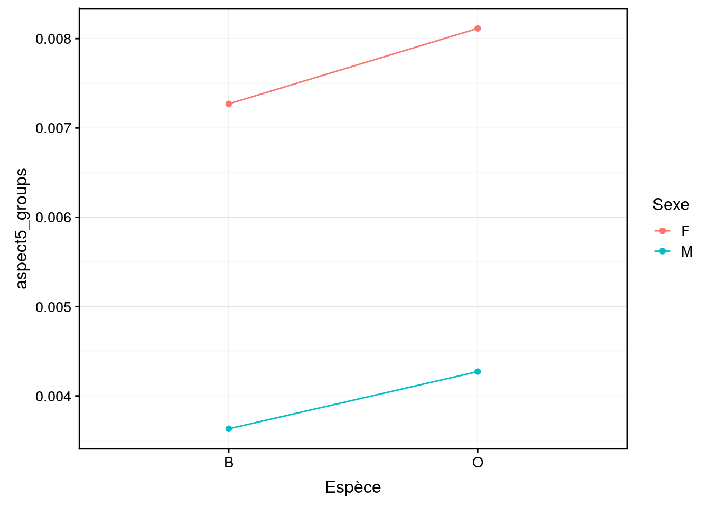
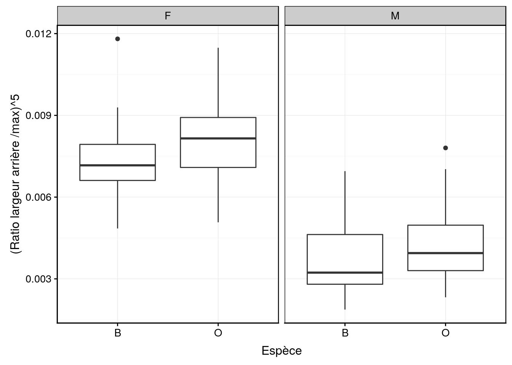
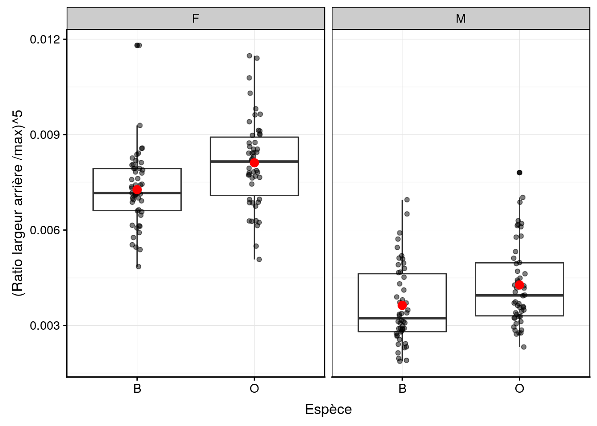
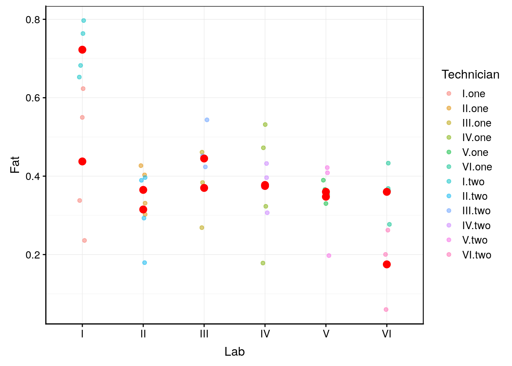

---
output:
  pdf_document: default
  html_document: default
---
# Variance II {#variance2}


##### Objectifs {-}

- Maîtriser les différentes variantes d'ANOVA à deux facteurs
 
- Distinguer dans quel cas utiliser l'une ou l'autre de ces variantes
 
- Comprendre différents types de syntaxe dans R


##### Prérequis {-}

Ce module présente la suite de l'ANOVA initiée au module \@ref(variance). Vous devez avoir bien compris l'ANOVA à un facteur avant d'entamer le présent chapitre.


## ANOVA à deux facteurs

Dans le cadre de l'ANOVA à un facteur, nous avions une variable réponse numérique étudiée pour différents niveaux d'*une seule* variable facteur à *j* niveaux ou modalités. Le modèle utilisé était\ :

$$y_{ij} = \mu + \tau_j + \epsilon_i \mathrm{\ avec\ } \epsilon \sim N(0, \sigma)$$
Les $\tau_j$ représent les variations entre la moyenne générale $µ$ et les moyennes respectives des $j$ sous-populations. En R, nous avons utilisé la formule suivante\ :

$$y \sim fact$$

avec $y$ la variable numérique réponse et $fact$ la variable facteur explicative unique.

Si nous prenons notre exemple des crabes *L. variegatus*, nous avions travaillé un peu artificiellement sur une seule variable facteur en regroupant les variables `species` et `sex` en une seule variable `group`. Qu'en est-il si nous voulons quand même considérer les deux variables `species` et `sex` séparément\ ? c'est possible avec une **ANOVA à deux facteurs**. Les sections suivantes vous présentent quelques variantes possibles de cette analyse.

##### A vous de jouer {-}

<div class="bdd">
<p>Afin d’appliquer directement les concepts vu au cours dans ce module, ouvrez RStudio dans votre SciViews Box, puis exécutez l’instruction suivante dans la fenêtre console :</p>
<pre><code>BioDataScience::run(&quot;11a_anova2&quot;)</code></pre>
</div>

## Modèle sans interactions

La version la plus simple consiste à considérer simplement deux facteurs *successivement*, c'est-à-dire que la variance est décomposée d'abord selon le premier facteur, et ensuite selon le second.

$$y_{ijk} = \mu + \tau1_j + \tau2_k + \epsilon_i \mathrm{\ avec\ } \epsilon \sim N(0, \sigma)$$

avec $\tau1_j$ correspondant à l'écart de la moyenne générale $µ$ à la moyenne selon la j^ème^ population pour la variable `fact1`, et $\tau2_k$ correspondant à l'écart vers le k^ème^ niveau d'une seconde variable `fact2`. La formule qui spécifie ce modèle dans R avec les trois variables `y`, `fact1` et `fact2` s'écrit\ :

$$y \sim fact1 + fact2$$

Notez que, quel que soit le niveau considéré pour $\tau1$, un niveau donné de $\tau2$ est constant dans l'équation qui décrit ce modèle. Cela signifie que l'on considère que les écarts pour les moyennes de la variable `fact2` sont toujours les mêmes depuis les moyennes de `fact1`. Donc, si une sous-population de `fact2` tend à avoir une moyenne, disons, supérieure pour la première sous-population de `fact1`, elle sera considérée comme ayant les mêmes écarts pour toutes les autres sous-populations de `fact1`. Evidemment, cette condition n'est pas toujours rencontrée dans la pratique. Le **graphique des interactions** (Fig.\ \@ref(fig:interactions)) permet de visualiser les écarts des moyennes respectives des différentes sous-populations.


```r
read("crabs", package = "MASS", lang = "fr") %>.%
  mutate(., aspect = labelise(
    as.numeric(rear / width),
    "Ratio largeur arrière / max", units = NA)) %>.%
  mutate(., aspect5 = labelise(
    aspect^5,
    "(Ratio largeur arrière /max)^5", units = NA)) %>.%
  select(., species, sex, aspect, aspect5) ->
  crabs2
# Graphique de base pour visualiser les interactions
#chart$base(interaction.plot(crabs2$species, crabs2$sex, crabs2$aspect5))
# Version avec ggplot2
crabs2 %>.%
  group_by(., species, sex) %>.%
  summarise(., aspect5_groups = mean(aspect5)) %>.%
  print(.) %>.% # Tableau des moyennes par groupes
  chart(data = ., aspect5_groups ~ species %col=% sex %group=% sex) +
    geom_line() +
    geom_point()
```

```
# # A tibble: 4 x 3
# # Groups:   species [2]
#   species sex   aspect5_groups
#   <fct>   <fct>          <dbl>
# 1 B       F            0.00727
# 2 B       M            0.00363
# 3 O       F            0.00811
# 4 O       M            0.00427
```

<div class="figure" style="text-align: center">

<p class="caption">(\#fig:interactions)Graphique des interactions entre les variables facteurs (espèce et sexe). Les traits (pratiquement) parallèles indiquent qu'il n'y a pas d'interactions, comme c'est le cas ici.</p>
</div>

Au niveau de la description préliminaire des données, nous pourrons utiliser un tableau qui résume la moyenne, l'écart type et le nombre d'observations pout chaque combinaison des deux variables facteurs. Le template de ce code est disponible dans un "snippet" à partir du menu `hypothesis tests: means` ou `.hm`, et ensuite `two-way ANOVA (description)`.


```r
crabs2 %>.%
  group_by(., species, sex) %>.%
  summarise(., mean = mean(aspect5), sd = sd(aspect5), count = sum(!is.na(aspect5)))
```

```
# # A tibble: 4 x 5
# # Groups:   species [2]
#   species sex      mean      sd count
#   <fct>   <fct>   <dbl>   <dbl> <int>
# 1 B       F     0.00727 0.00115    50
# 2 B       M     0.00363 0.00124    50
# 3 O       F     0.00811 0.00138    50
# 4 O       M     0.00427 0.00130    50
```

Pour la visualisation graphique, nous sommes tributaires du nombre d'observations. Avec moins d'une petite dizaine d'observations, nous représenterons des points pour chaque observation et superposerons les moyennes. Lorsque le nombre est plus grand nous pourrons utiliser soit les boites de dispersion, soit le graphique en violon si ce nombre est encore plus grand. Voyons cela sur notre exemple (les "snippets" dans le menu `chart: bivariate` peuvent être utilisés comme point de départ auquel nous ajoutons la seconde variable facteur pour les facettes multi-graphiques séparée par un `|`). La Fig.\ \@ref(fig:crabs2boxplot) montre ce que cela donne si l'on opte pour les boites de dispersion.


```r
chart(data = crabs2, aspect5 ~ species | sex) +
  geom_boxplot()
```

<div class="figure" style="text-align: center">

<p class="caption">(\#fig:crabs2boxplot)Taille relative de la carapace à l'arrière de crabes *L. variegatus* (deux variétés et deux sexes), version simple.</p>
</div>

La Fig.\ \@ref(fig:crabs2boxplot2) est une version améliorée avec les observations et les moyennes pour chaque sous-groupe ajoutées au graphique selon la même technique que nous avions utilisé pour représenter les données pour l'ANOVA à un facteur.


```r
chart(data = crabs2, aspect5 ~ species | sex) +
  geom_boxplot() +
  geom_jitter(width = 0.05, alpha = 0.5) +
  geom_point(data = group_by(crabs2, species, sex) %>.%
    summarise(., means = mean(aspect5, na.rm = TRUE)),
    f_aes(means ~ species), size = 3, col = "red")
```

<div class="figure" style="text-align: center">

<p class="caption">(\#fig:crabs2boxplot2)Taille relative de la carapace à l'arrière de crabes *L. variegatus* (deux variétés et deux sexes), version annotée.</p>
</div>

Maintenant que nous avons décrit correctement nos données par rapport à l'analyse que nous souhaitons faire, nous pouvons réaliser notre ANOVA à deux facteurs. Nous devons vérifier l'homoscédasticité, mais le test de Batlett que nous réalisons revient au même que celui que nous avons fait en décomposant toutes les sous-populations. Comme nous n'avons pas nécessairement ce calcul réalisé (la variable `group` que nous avions calculée au module \@ref(variance)), nous utilisons la fonction `interaction()` qui effectue ce calcul pour nous directement dans la formule\ :


```r
bartlett.test(data = crabs2, aspect5 ~ interaction(species, sex))
```

```
# 
# 	Bartlett test of homogeneity of variances
# 
# data:  aspect5 by interaction(species, sex)
# Bartlett's K-squared = 1.7948, df = 3, p-value = 0.6161
```

Si vous comparez avec le test que nous avions fait dans le cas de l'ANOVA à un facteur sur la variable `group`, vous constaterez qu'il donne exectement le même résultat. Nous continuons avec notre ANOVA. Nous avons un "snippet" pour cela dans le menu `hypothesis tests: means` à partir de `.hm` qui se nomme `two-way ANOVA (without interactions)`.


```r
anova(anova. <- lm(data = crabs2, aspect5 ~ species + sex))
```

```
# Analysis of Variance Table
# 
# Response: aspect5
#            Df     Sum Sq    Mean Sq F value    Pr(>F)    
# species     1 0.00002753 0.00002753   17.15  5.12e-05 ***
# sex         1 0.00069935 0.00069935  435.66 < 2.2e-16 ***
# Residuals 197 0.00031624 0.00000161                      
# ---
# Signif. codes:  0 '***' 0.001 '**' 0.01 '*' 0.05 '.' 0.1 ' ' 1
```

Comme la variance est décomposée en trois étapes (selon l'espèce, puis selon le sexe, puis les résidus), nous avons trois lignes dans le tableau de l'ANOVA. Nous effectuons deux tests. Le premier consiste à comparer les carrés moyens (`Mean Sq`) pour l'espèce par rapport aux résidus. Donc, la valeur `F` est le ratio de la somme des carrés `species` divisé par la somme des carrés des résidus, et cette valeur est reportée sur la loi de distribution théorique *F* pour obtenir une première valeur *P* (ici 5,12 . 10^-5^). De même, le second test qui s'intéresse au sexe calcule la valeur *F* via la ratio de la somme des carrés pour `sex` divisé par la somme des carrés des résidus, et la loi *F* nous permet de calculer une seconde valeur *P* (ici 2,2 . 10^-16^).

Nous interprétons chacun des deux tests séparément. Dans notre cas, nous pouvons dire avec un seuil $\alpha$  de 5% que nous rejettons $H_0$ dans les deux cas. Donc le rapport largeur arrière sur largeur max de la carapace est significativement différent au seuil $\alpha$ de 5% à la fois en fonction de l'espèce (F = 17,15, ddl = 197 et 1, valeur *P* << 0,001) et du sexe (F = 436, ddl = 197 et 1, valeur *P* << 0,001)^[Notez que si vous incluez le tableau de l'ANOVA dans votre rapport ou dans une publication, il n'est pas nécessaire de répéter les résultats des tests entre parenthèses. Vous pouvez juste vous référer au tableau en question.].

La suite logique consiste à réaliser des tests "post hoc". Ils ne sont pas vraiment nécessaires ici puisque nous n'avons que deux niveaux pour chacune des deux variables, mais nous les réalisons quand même pour montrer le code correspondant. Un template est accessible via le "snippet" `anova - multiple comparisons [multcomp]` du menu `.hm`. Pensez juste à rajouter le second facteur `sex` dans les arguments de la fonction `mcp()`.


```r
summary(anovaComp. <- confint(multcomp::glht(anova.,
  linfct = multcomp::mcp(species = "Tukey", sex = "Tukey")))) # Add a second factor if you want
```

```
# 
# 	 Simultaneous Tests for General Linear Hypotheses
# 
# Multiple Comparisons of Means: Tukey Contrasts
# 
# 
# Fit: lm(formula = aspect5 ~ species + sex, data = crabs2)
# 
# Linear Hypotheses:
#                       Estimate Std. Error t value Pr(>|t|)    
# species: O - B == 0  0.0007420  0.0001792   4.141 0.000102 ***
# sex: M - F == 0     -0.0037399  0.0001792 -20.872  < 1e-10 ***
# ---
# Signif. codes:  0 '***' 0.001 '**' 0.01 '*' 0.05 '.' 0.1 ' ' 1
# (Adjusted p values reported -- single-step method)
```

```r
.oma <- par(oma = c(0, 5.1, 0, 0)); plot(anovaComp.); par(.oma); rm(.oma)
```


Ceci confirme que les différences sont significatives au seuil $\alpha$ de 5%. Il ne nous reste plus qu'à vérifier la distribution des résidus de l'ANOVA pour que notre analyse soit complète (Fig.\ \@ref(fig:anova2-resid)).

<div class="figure" style="text-align: center">

<p class="caption">(\#fig:anova2-resid)Graphique quantile-quantile des résidus pour l'ANOVA à deux facteurs sans interactions de `aspect^5`.</p>
</div>

```
# [1]  65 103
```

Encore une fois, nous voyons que les résidus sont quasiment les mêmes que précédemment, mais cela n'aurait pas été le cas si une interaction existait. La distribution s'éloigne un peu d'une Gaussienne pour les valeurs élevées surtout. Mais comme l'ANOVA est robuste à ce critère, et que l'homoscédasticité a été vérifiée sur la tranformation puissance 5 de notre variable, nous pouvons conserver notre analyse moyennant une précaution supplémentaire\ : vérifier que les valeurs *P* sont **beaucoup** plus petites que notre seuil comme sécurité supplémentaires contre les approximations liées à la légère violation de la contrainte de distribution normale des résidus. C'est le cas ici, et nous pouvons donc conclure notre analyse.


##### Conditions d’application {-}

- échantillon représentatif (par exemple, aléatoire),
- observations indépendantes,
- variable **réponse** quantitative,
- deux variables **explicatives** qualitatives à deux niveaux ou plus,
- distribution **normale** des résidus $\epsilon_i$,
- **homoscédasticité** (même variance intragroupes),
- pas d'**interactions** entre les deux variables explicatives.


## Modèle croisé complet

Le modèle ANOVA que nous venons de faire s'appelle un **modèle croisé** parce que les mesures sont effectuées pour chaque combinaison des niveaux des deux variables facteurs explicatives, et ce, de manière indépendante (les observations d'un niveau ne sont pas dépendantes de celles d'un autre niveau)^[De plus, nous avons ici un **plan balancé** puisque le nombre de répliquats pour chaque niveau est le même. C'est une situation optimale qu'il faut toujours chercher à atteindre pour une ANOVA, même si un nombre différent d'observations par niveau est également accepté.].


```r
crabs2 %>.%
  count(., species, sex)
```

```
# # A tibble: 4 x 3
#   species sex       n
#   <fct>   <fct> <int>
# 1 B       F        50
# 2 B       M        50
# 3 O       F        50
# 4 O       M        50
```

Le modèle **croisé sans interactions** que nous avions utilisés est cependant *incomplet* puisque, pour considérer tous les cas possibles, il faut aussi considérer que ces interactions puissent exister et les inclure directement dans le modèle. Le **modèle complet** s'écrit comme ceci\ :

$$y_{ijk} = \mu + \tau1_j + \tau2_k + \tau1\tau2_{jk} + \epsilon_i \mathrm{\ avec\ } \epsilon \sim N(0, \sigma)$$

avec le nouveau terme $\tau1\tau2_{jk}$ qui correspond à la distance entre la *k*^ème^ moyenne générale (la moyenne quel que soit *j*) et la moyenne particulière pour les observations des populations particulières à *k* et *j* simultanément. Ce modèle permet ainsi que chaque moyenne $\bar{y}_{jk}$ puisse différer librement, et donc, autorise les **interactions**. Toujours considérant les trois variables `y`, `fact1` et `fact2`, ce modèle s'écrit dans R comme suit\ :

$$y \sim fact1 + fact2 + fact1:fact2$$

Avec $fact1:fact2$ étant le terme d'interactions. On peut aussi le simplifier en utilisant `*` à la place de `+` entre les deux variables facteurs, ce qui signifie implicitement de tenir également compte des interactions\ :

$$y \sim fact1 * fact2$$

Cette fois-ci, la décomposition de la variable se fait en quatre étapes\ : (1) depuis la moyenne générale µ vers les *j*^èmes^ moyennes pour `fact1`, ensuite (2) de ces moyennes vers les *k*^èmes^ moyennes pour `fact2`, puis (3) de ces dernières vers la moyenne particulière pour le sous-groupe *jk*, et enfin (4) les résidus $\epsilon_i$ pour chaque observation. Voyons ce que donne ce modèle complet sur nos données `crabs2`. Un "snippets" est utilisable (`two-way ANOVA (complete model)`).


```r
anova(anova. <- lm(data = crabs2, aspect5 ~ species * sex))
```

```
# Analysis of Variance Table
# 
# Response: aspect5
#              Df     Sum Sq    Mean Sq  F value    Pr(>F)    
# species       1 0.00002753 0.00002753  17.0913 5.279e-05 ***
# sex           1 0.00069935 0.00069935 434.1610 < 2.2e-16 ***
# species:sex   1 0.00000052 0.00000052   0.3236    0.5701    
# Residuals   196 0.00031572 0.00000161                       
# ---
# Signif. codes:  0 '***' 0.001 '**' 0.01 '*' 0.05 '.' 0.1 ' ' 1
```

Notre analyse confirme qu'il n'y a pas d'interactions. La valeur *P* (0,57) en regard du terme `species:sex` correspondant est très largement supérieure à $\alpha$ de 5%. Notez aussi que les tests relatifs à `species` et `sex` donnent des valeurs différentes de notre modèle sans interactions. Les différences entre les deux seront d'autant plus importantes que les interactions sont fortes. Les conclusions restent les mêmes que précédemment, et ici, nous démontrons par un test d'hypothèse que les interactions ne sont pas significatives. Naturellement, la description des données, les vérifications (homoscédasticité, distribution normale ou quasi-normale des résidus) et les analyses "post-hoc" en cas de rejet de $H_0$ sont à réaliser ici aussi. Nous les avons déjà faites plus haut à peu de choses prêt (les résutats seront ici très proches de ceux du modèle sans interactions, puisque ces dernières sont négligeables).

<div class="warning">
<p>Faites attention à un piège fréquent lorsque vous avez des mesures multiples sur les <em>mêmes</em> individus. Par exemple, si vous étudiez trois populations avec disons, cinq réplicats par population et que vous dénombrez des cellules marquées sur dix coupes histologiques réalisées chaque fois dans un organe du <em>même</em> individu, vous aurez 3x5x10 = 150 mesures, mais vous ne pouvez pas utiliser une ANOVA à deux facteurs croisés car les 150 observations ne sont pas indépendantes les unes des autres. Vous n’avez jamais mesuré que 15 individus au total. Si vous analysez ces données comme si vous en aviez mesuré 150, <strong>votre analyse sera incorrecte</strong>. Il s’agit ici d’une erreur qui s’appelle la <strong>pseudo-réplication</strong>. Vous devrez utiliser d’autres modèles comme le modèle à facteurs hiérarchisés (voir section suivante).</p>
</div>


##### Conditions d'application {-}

Les conditions d'application sont les mêmes que pour l'ANOVA à deux facteurs sans interactions, sauf qu'ici, les interactions sont bien évidemment permises.


##### Pour en savoir plus {-}

- Un blog en français qui explique l'[ANOVA à deux facteurs](https://statistique-et-logiciel-r.com/anova-a-2-facteurs-principe/) de manière plus détaillée qu'ici. Ensuite la [résolution de leur exemple dans R](https://statistique-et-logiciel-r.com/anova-a-2-facteurs-avec-r-tutoriel/). Enfin, des suggestions pour annoter un graphique et [indiquer quelles sont les différences qui sont significatives dessus](https://statistique-et-logiciel-r.com/comparaison-de-moyennes-indiquer-les-differences-significatives-sur-le-graph/).


## Facteurs hiérarchisés

Nous n'avons pas toujours la possibilité de croiser les deux facteurs. Considérons le cas d'une étude d'intercalibration. Nous avons un ou plusieurs échantillons répartis entre plusieurs laboratoires, et comme les analyses dépendent éventuellement aussi du technicien qui fait la mesure, nous demandons à chaque laboratoire de répéter les mesures avec deux de leurs techniciens. Problème\ : ici, il s'agit bien évidemment de techniciens *différents* dans chaque laboratoire. Comment faire, sachant que pour le modèle croisé, il faudrait que les deux *mêmes* techniciens aient fait toutes les mesures *dans tous* les laboratoires\ ?

La solution est le modèle à facteurs hiérarchisés qui s'écrit\ :

$$y_{ijk} = \mu + \tau1_j + \tau2_k(\tau1_j) + \epsilon_i \mathrm{\ avec\ } \ \epsilon_i \sim N(0, \sigma) $$

... et dans R, nous utiliserons la formule suivante\ :

$$y \sim fact1 + fact2\ \%in\%\ fact1$$

Voici un exemple concret. Un gros échantillon d'oeufs déshydratés homogène est réparti entre six laboratoires différents en vue de la détermination de la teneur en matières grasses dans cet échantillon. Le but de la manoeuvre est de déterminer si les laboratoires donnent des résultats consistants. Les deux techniciens de chaque laboratoire sont labellés `one` et `two`, mais ce sont en fait à chaque fois des techniciens *différents* dans chaque laboratoire^[La variable `Sample valant `G` ou `H` ne sera pas utilisée ici. En fait, au départ, les initiateurs de l'expérience ont fait croire aux laboratoires qu'il s'agissait de deux échantillons différents alors que c'est le même en réalité.].


```r
eggs <- read("eggs", package = "faraway")
skimr::skim(eggs)
```

```
# Skim summary statistics
#  n obs: 48 
#  n variables: 4 
# 
# ── Variable type:factor ─────────────────────────────────────────────────────────────────────────────────────────────────────────────────────────────────────────────────────────────────────────────────────────────────────────────────
#    variable missing complete  n n_unique                 top_counts
#         Lab       0       48 48        6 I: 8, II: 8, III: 8, IV: 8
#      Sample       0       48 48        2        G: 24, H: 24, NA: 0
#  Technician       0       48 48        2    one: 24, two: 24, NA: 0
#  ordered
#    FALSE
#    FALSE
#    FALSE
# 
# ── Variable type:numeric ────────────────────────────────────────────────────────────────────────────────────────────────────────────────────────────────────────────────────────────────────────────────────────────────────────────────
#  variable missing complete  n mean   sd   p0  p25  p50  p75 p100     hist
#       Fat       0       48 48 0.39 0.15 0.06 0.31 0.37 0.43  0.8 ▁▂▃▇▁▁▁▁
```

Commençons par corriger l'encodage erroné des techniciens qui ferait penser que seulement deux personnes ont travaillé dans l'ensemble des six laboratoires.


```r
eggs %>.%
  mutate(., Technician = interaction(Lab, Technician)) -> eggs
skimr::skim(eggs)
```

```
# Skim summary statistics
#  n obs: 48 
#  n variables: 4 
# 
# ── Variable type:factor ─────────────────────────────────────────────────────────────────────────────────────────────────────────────────────────────────────────────────────────────────────────────────────────────────────────────────
#    variable missing complete  n n_unique
#         Lab       0       48 48        6
#      Sample       0       48 48        2
#  Technician       0       48 48       12
#                           top_counts ordered
#  I: 8, II: 8, III: 8, IV: 8            FALSE
#         G: 24, H: 24, NA: 0            FALSE
#                           I.o: 4, II   FALSE
# 
# ── Variable type:numeric ────────────────────────────────────────────────────────────────────────────────────────────────────────────────────────────────────────────────────────────────────────────────────────────────────────────────
#  variable missing complete  n mean   sd   p0  p25  p50  p75 p100     hist
#       Fat       0       48 48 0.39 0.15 0.06 0.31 0.37 0.43  0.8 ▁▂▃▇▁▁▁▁
```

Nous avons à présent douze techniciens notés `I.one`, `I.two`, `II.one`, `II.two`, ... Nous pouvons visualiser ces données. Comme nous n'avons que quatre réplicats par technicien, nous nous limitons à la représentation des observations de départ et des moyennes.


```r
chart(data = eggs, Fat ~ Lab %col=% Technician) +
  geom_jitter(width = 0.05, alpha = 0.5) +
  geom_point(data = group_by(eggs, Lab, Technician) %>.%
    summarise(., means = mean(Fat, na.rm = TRUE)),
    f_aes(means ~ Lab), size = 3, col = "red")
```

<div class="figure" style="text-align: center">

<p class="caption">(\#fig:nested)Mesures de fractions en matières grasses dans des oeufs dans six laboratoires, par douze techniciens différents. Les points rouges sont les moyennes par technicien.</p>
</div>

Vérifions l'homoscédasticité. Ici, il suffit de considérer la variable `Technician` (une fois correctement encodée\ !) parce que dans cette forme de modèle, le facteur qui est imbriqué (`Technician`) est celui à partir duquel les résidus sont calculés. Nous utiliserons un seuil $\alpha$ classique de 5% pour l'ensemble de nos tests dans cette étude.


```r
bartlett.test(data = eggs, Fat ~ Technician)
```

```
# 
# 	Bartlett test of homogeneity of variances
# 
# data:  Fat by Technician
# Bartlett's K-squared = 13.891, df = 11, p-value = 0.2391
```

Avec une valeur *P* de 23,9%, nous pouvons considérer qu'il y a homoscédasticité. Voilà l'ANOVA (utilisez le "snippet" `two-way ANOVA (nested model)` le menu contextuel `hypothesis tests: means` que vous obtenez en tapant `.hm`).


```r
anova(anova. <- lm(data = eggs, Fat ~ Lab + Technician %in% Lab))
```

```
# Analysis of Variance Table
# 
# Response: Fat
#                Df  Sum Sq  Mean Sq F value    Pr(>F)    
# Lab             5 0.44303 0.088605  9.5904 6.989e-06 ***
# Lab:Technician  6 0.24747 0.041246  4.4644  0.001786 ** 
# Residuals      36 0.33260 0.009239                      
# ---
# Signif. codes:  0 '***' 0.001 '**' 0.01 '*' 0.05 '.' 0.1 ' ' 1
```

Nous voyons que, dans le cas présent, l'effet technicien ne peut pas être testé. Nous avons l'effet labo et les interactions entre les techniciens et les labos qui sont présentés. Les deux sont significatifs ici. Nous avons à la fois des différences significatives qui apparaissent entre labos, mais aussi, des variation d'un labo à l'autre entre techniciens (interactions).

Nous devons maintenant vérifier la distribution normale des résidus dans ce modèle (Fig.\ \@ref(fig:nestedqqplot)). Ici rien à redire, la distribution est conforme à nos attentes.

<div class="figure" style="text-align: center">

<p class="caption">(\#fig:nestedqqplot)Graphique quantile-quantile des résidus pour l'ANOVA à deux facteurs hiérarchisés pour la variable `Fat` du jeu de données `eggs`.</p>
</div>

```
# [1]  4 25
```

L'effet qui nous intéresse en priorité est l'effet laboratoire. Effectuons des tests "post hoc" sur cet effet pour déterminer quel(s) laboratoire(s) diffèrent entre eux. Le code que nous utilisons habituellement ne fonctionne pas dans le cas d'un modèle hiérarchisé, mais nous pouvons utiliser la fonction `TukeyHSD()` à la place, en partant d'un modèle similaire créé à l'aide de la fonction `aov()`.


```r
aov. <- aov(data = eggs, Fat ~ Lab + Technician %in% Lab)
(anovaComp. <- TukeyHSD(aov., "Lab"))
```

```
#   Tukey multiple comparisons of means
#     95% family-wise confidence level
# 
# Fit: aov(formula = Fat ~ Lab + Technician %in% Lab, data = eggs)
# 
# $Lab
#            diff         lwr          upr     p adj
# II-I   -0.24000 -0.38459081 -0.095409195 0.0002088
# III-I  -0.17250 -0.31709081 -0.027909195 0.0116356
# IV-I   -0.20375 -0.34834081 -0.059159195 0.0019225
# V-I    -0.22625 -0.37084081 -0.081659195 0.0004902
# VI-I   -0.31250 -0.45709081 -0.167909195 0.0000021
# III-II  0.06750 -0.07709081  0.212090805 0.7240821
# IV-II   0.03625 -0.10834081  0.180840805 0.9733269
# V-II    0.01375 -0.13084081  0.158340805 0.9997181
# VI-II  -0.07250 -0.21709081  0.072090805 0.6611505
# IV-III -0.03125 -0.17584081  0.113340805 0.9861403
# V-III  -0.05375 -0.19834081  0.090840805 0.8705387
# VI-III -0.14000 -0.28459081  0.004590805 0.0624025
# V-IV   -0.02250 -0.16709081  0.122090805 0.9969635
# VI-IV  -0.10875 -0.25334081  0.035840805 0.2356038
# VI-V   -0.08625 -0.23084081  0.058340805 0.4817411
```

```r
plot(anovaComp.)
```


Nous pouvons observer des différences significatives au seuil $\alpha$ de 5% entre le labo I et tous les autres labos. Les autres comparaisons n'apparaissent pas significatives.


### Simplification du modèle

Nous pourrions être tentés de simplifier notre analyse en ne testant *que* l'effet laboratoire. Dans ce cas, nous tomberions dans le piège de la **pseudo-réplication**. Nous pourrions aussi travailler sur la mesure moyenne des mesures pour chaque technicien. Du coup, nous aurions deux valeurs par laboratoire, chaque fois réalisée par un technicien différent. Nous pourrions donc considérer que les données sont indépendantes les unes des autres et nous pourrions réduite le problème à un effet unique, celui du laboratoire.

Si nous n'avons plus que deux mesures par laboratoire au lieu de deux fois quatre, nous gagnons d'un autre côté puisque l'écart type de la moyenne d'un échantillon et l'écart type de la population divisé par la racine carré de *n*. Donc, l'écart type sur les mesures moyennes est alors deux fois plus faible, ce qui se répercutera de manière positive sur l'ANOVA. La distribution des résidus sera une distribution de Student, mais elle est symétrique et pas trop différente d'une distribution normale. Cela pourrait passer. Mais il se peut que la réduction de l'information soit telle que le test perde complètement sa puissance. Illustrons ce phénomène avec le jeu de données `eggs`. Nous créons le jeu de données `eggs_means` reprenant les moyennes des quatre mesures par techinicien dans la variable `Fat_mean.


```r
eggs %>.%
  group_by(., Technician) %>.%
  summarise(., Fat_mean = mean(Fat), Lab = unique(Lab)) ->
  eggs_means
skimr::skim(eggs_means)
```

```
# Skim summary statistics
#  n obs: 12 
#  n variables: 3 
# 
# ── Variable type:factor ─────────────────────────────────────────────────────────────────────────────────────────────────────────────────────────────────────────────────────────────────────────────────────────────────────────────────
#    variable missing complete  n n_unique
#         Lab       0       12 12        6
#  Technician       0       12 12       12
#                           top_counts ordered
#  I: 2, II: 2, III: 2, IV: 2            FALSE
#                           I.o: 1, II   FALSE
# 
# ── Variable type:numeric ────────────────────────────────────────────────────────────────────────────────────────────────────────────────────────────────────────────────────────────────────────────────────────────────────────────────
#  variable missing complete  n mean   sd   p0  p25  p50  p75 p100     hist
#  Fat_mean       0       12 12 0.39 0.13 0.17 0.36 0.37 0.39 0.72 ▁▁▇▂▁▁▁▁
```


```r
eggs_means %>.%
  group_by(., Lab) %>.%
  summarise(., mean = mean(Fat_mean), sd = sd(Fat_mean), count = sum(!is.na(Fat_mean)))
```

```
# # A tibble: 6 x 4
#   Lab    mean      sd count
#   <fct> <dbl>   <dbl> <int>
# 1 I     0.58  0.202       2
# 2 II    0.34  0.0354      2
# 3 III   0.408 0.0530      2
# 4 IV    0.376 0.00177     2
# 5 V     0.354 0.00884     2
# 6 VI    0.267 0.131       2
```

Représentation graphique et vérification de l'homoscédasticité.


```r
chart(eggs_means, Fat_mean ~ Lab) +
  geom_point() +
  geom_point(data = group_by(eggs_means, Lab) %>.%
    summarise(., means = mean(Fat_mean, na.rm = TRUE)),
    f_aes(means ~ Lab), size = 3, col = "red")
```


```r
bartlett.test(data = eggs_means, Fat_mean ~ Lab)
```

```
# 
# 	Bartlett test of homogeneity of variances
# 
# data:  Fat_mean by Lab
# Bartlett's K-squared = 10.452, df = 5, p-value = 0.0634
```

Analyse de variance à un facteur.


```r
anova(anova. <- lm(data = eggs_means, Fat_mean ~ Lab))
```

```
# Analysis of Variance Table
# 
# Response: Fat_mean
#           Df   Sum Sq  Mean Sq F value Pr(>F)
# Lab        5 0.110756 0.022151  2.1482 0.1895
# Residuals  6 0.061869 0.010311
```


```r
anova. %>.%
  broom::augment(.) %>.%
  car::qqPlot(.$.std.resid, distribution = "norm",
    envelope = 0.95, col = "Black", xlab = "Quantiles théoriques (distri. normale)",
    ylab = "Résidus standardisés")
```


```
# [1] 1 7
```

Nous n'avons plus d'effet significatif, malgré que le labo I obtient, en moyenne, une mesure beaucoup plus forte que les autres. En fait, en réduisant de la sorte nos données, nous avons perdu tellement d'information que le test a perdu toute puissance et n'est plus capable de détecter de manière significative des différences entre moyennes pourtant importantes. Si nous avions quatre techniciens par labo qui auraient tous dosés les échantillons en duplicats (également huit mesures par labo au total), nous n'aurions pas une perte d'information aussi forte en effectuant quatre moyennes de duplicats par labo, et l'analyse simplifiée aurait peut-être été utilisable. Il faut voir au cas par cas...


## Effet aléatoire

Jusqu'à présent, nous avons considéré que nous échantillonnons toutes les modalités qui nous intéressent pour les variables facteurs explicatives. Il se peut que les modalités soient trop nombreuses et que nous ne puissons n'en étudier qu'une petite fraction. Nous avons deux possibilités.

- Soit nous choisissons aléatoirement quelques modalités, et nous les étudions *systématiquement* pour les différentes modalités de l'autre variable. Nous nous ramenons à un modèle à facteurs fixes mais nous ne pouvons donner une réponse que pour les modalités échantillonnées (restriction de la population statistique étudiée).

- Soit, nous échantillonnons aléatoirement dans la population *à chaque* mesure. Donc, entre les différentes mesures, il s'agit de cas différents.

Considérez le plan d'expérience classique en agronomie de l'étude de quatre variétés de blé différentes notées ici A, B, C, et D. Nous voulons déterminer quelle variété est la plus productive dans une région donnée constituée de centaines de fermes susceptibles de cultiver ce blé. Nous n'allons pas pouvoir effectuer des tests dans toutes les fermes. Donc, nous allons **échantillonner** quelques fermes au hasard. Si nous tirons au sort trois fermes, notée X, Y et Z, dans la région considérée, et que nous testons nos quatre variétés de blé dans ces trois fermes, et seulement celles-là, nous revenons vers un modèle à facteur fixe comme antérieurement. Malheureusement, le résultat ne sera pas extrapolable aux autres fermes. Si, par contre, nous tirons trois fermes au hasard pour chaque variété (et donc, chaque variété a été testée potentiellement dans des fermes différentes), nous avons ce qu'on appelle un **facteur aléatoire** pour l'effet ferme. Un modèle sans interactions avec un effet aléatoire s'écrit\ :

$$y_{ijk} = \mu + \tau1_j + \tau2_k + \epsilon_i \mathrm{\ avec\ } \tau2_k \sim N(0, \sigma_{\tau2}) \mathrm{\ et\ } \epsilon_i \sim N(0, \sigma) $$

L'équation du modèle n'a pas changé, mais nous avons maintenant un terme aléatoire supplémentaire, $\tau2_k$ dont il faudra tenir compte dans les calculs. Les hypothèses nulle et alternative pour ce facteur s'écrivent également différemment. Nous n'indiquons plus quelles moyennes de toutes les modalités sont égales (il peut éventuellement y en avoir une infinité possibles), mais que l'écart type de la distribution vaut zéro sour $H_0$\ :

- $H_0: \sigma_{\tau2} = 0$
- $H_1: \sigma_{\tau2} \neq 0$

Dans R, la fonction `lm()` utilisée jusqu'ici ne prend pas en compte les facteurs aléatoires. Nous devons utiliser la fonction `aov()` par exemple **à condition que le plan d'expérience soit bien balancé**.

- Pour une ANOVA à un facteur aléatoire, nous utiliserons (un facteur aléatoire s'annonce à l'intérieur de la fonction `Error()`)\ :


```r
aov(data = df, y ~ Error(fact1))
```

- Pour une ANOVA à deux facteurs croisés sans interactions, et un facteur aléatoire comme dans le cas de notre blé testé dans des fermes tirées *à chaque fois* au hasard, nous utiliserons\ :


```r
aov(data = df, y ~ fact1 + fact2 + Error(fact2))
```

**Suite à faire...**

En cas de rejet de *H_0* pour un facteur aléatoire, il n'existe pas de test "post hoc". Ce genre de test ne signifie pas grand chose dans ce cas, puisque le facteur est aléatoire et que chaque modalité étudiée est considére comme une réalisation au hasard issue de la distribution normale.


## Syntaxe de R

\BeginKnitrBlock{info}<div class="info">
Dans cette dernière section du module \@ref(variance2), nous revenons sur nos outils logiciels. C'est bien de connaître les techniques de visualisation et d'analyse des données, mais c'est encore mieux de pouvoir les appliquer en pratique, ... et pour cela il faut maîtriser un ou plusieurs logiciels. Nous avons utilisé principalement **R**, via l'interface proposée par RStudio. Nous allons maintenant approfondir quelque peu nos connaissances en R.
</div>\EndKnitrBlock{info}

Vous avez pu vous rendre compte que R n'est pas qu'un logiciel de science des données. Il comprend également un **langage informatique** du même nom^[Historiquement, ce langage s'appelait **S** à l'origine dans les années 1970 alors qu'il a été inventé par John Chambers et ses collègues aux laboratoires Bell. R est une implémentation open source de S écrite dans les années 1990 par Ross Ihaka et Robert Gentleman. Ensuite R a pris de l'importance à tel point qu'on parle maintenant du langage R (sachant bien qu'il s'agit d'un *dialecte* du langage S).] dédié à la manipulation, la visualisation et l'analyse des données.

Les langages informatiques sont, pour la plupart, conçus autour de standards bien définis. Mais R est toujours resté volontairement très libertaire à ce niveau. Comme R permet également de presque tout redéfinir dans son langage, il est apparu au cours du temps différents styles. Ces styles co-existent et co-existeront encore longtemps car ils ont tous des avantages et des inconvénients, ce qui mène à des choix personnels de chaque utilisateur dictés par l'usage qu'il fait de R, ses goûts, son caractère, et comment il a été formé (à quelle "école" il appartient). Nous n'entrerons pas dans les débats stériles autant que passionnés autour de ces questions de styles. Il est cependant utile de comprendre ces différentes approches au moins dans leurs grandes lignes.

Aujourd'hui, on peut distinguer principalement trois styles dans R, [résumés dans un aide-mémoire](http://www.amelia.mn/Syntax-cheatsheet.pdf)\ :

- La **syntaxe de base** ou **syntaxe dollar** est celle héritée du langage S. Elle fait la part belle aux instructions d'indiçage comme `v[i]` ou `df[i, j]`, et à l'opérateur dollar `$` pour extraire, par exemple la variable `x` du data frame `df` à l'aide de `df$x`, d'où son nom. Une instruction type en R de base sera `fun(df$x, df$y)`. L'objet central est le `data.frame` qui est conçu pour contenir un tableau de données de type cas par variables.

- La **syntaxe formule** qui utilise une formule (objet ressemblant à une équation mathématique et utilisant le tilde `~` pour séparer le membre de gauche et le membre de droite). Nous avons utilisé des formules dans le cadre de graphiques réalisés à l'aide de `chart()` ou pour nos ANOVAs par exemple. Une instruction se présente typiquement comme `fun(y ~ x, data = df)`, même si nous préférons dans SciViews inverser les deux arguments et écrire `fun(data = df, y ~ x)`. La syntaxe formule est souvent associée également à un `data.frame` (l'argument `data =`), même si une liste, un `tibble` (voir ci-dessous) ou tout autre objet similaire peut aussi souvent être utilisé.

- La **syntaxe "tidyverse"** qui vise à produire des instruction aussi lisibles que possible (lecture proche d'un langage naturel humain). Cette syntaxe utilise quelques astuces de programmation pour rendre les instructions plus digestes et s'affranchir du `df$x` pour pouvoir écrire uniquement `x` à la place. Elle fait également la part belle au chaînage des instructions (opérateur de "pipe") que nous avons étudié à la fin du module \@ref(import). Une instruction type sera `df %>% fun(x, y)`, même si dans SciViews nous préférons l'opérateur plus explicite `%>.%` qui donne `df %>.% fun(., x, y)`. [Tidyverse](https://www.tidyverse.org) est constitué d'un ensemble de packages R qui se conforme à un style bien défini autour d'une version spéciale de data frame appelée `tibble`.

Dans le cadre de ce cours, nous utilisons un style propre à SciViews, le style **SciViews-R**. Il est associé à une série de packages chargés à partir de l'instruction `SciViews::R`. Ce style tente de rendre l'utilisation de R plus cohérente et plus facile en reprenant le meilleur des trois styles précédents, et en y ajoutant une touche personnelle élaborée pour éliminer autant que possible les erreurs fréquentes observées lors de l'apprentissage ou de l'utilisation de R. Dans la suite de cette section, nous allons comparer quelques instructions équivalentes, mais rédigées dans différents styles pour nous familiariser avec eux et pour comprendre leurs atouts respectifs. Assurez-vous de conserver à proximité l'[aide-mémoire sur les différentes syntaxes de R](http://www.amelia.mn/Syntax-cheatsheet.pdf) pour vous aider. Mais avant toute chose, un petit complément concernant l'indiçage dans R est nécessaire.


### Indiçage dans R

Après l'opérateur particulier `<-` d'*assignation* (associer une valeur à un nom dans un langage informatique), les diverses variantes de l'indiçage de vecteurs, matrices et data frames sont caractéristiques de R. Elles sont puissantes, mais nécessitent de s'y attarder un peu pour bien les comprendre.

Les données et les calculs dans R sont **vectorisés**. Cela signifie que l'élément de base est un vecteur. Un vecteur est un ensemble d'éléments rangés dans un ordre bien défini, et éventuellement nommés. La longueur du vecteur s'obtient avec `length()`, et il est possible de spécifier un ou plusieurs éléments du vecteur à l'aide de l'opérateur `[]`.


```r
# Un vecteur contenant 4 valeurs numériques nommées a, b, c et d
v <- c(a = 2.6, b = 7.1, c = 4.9, d = 5.0)
# Le second élément du vecteur
v[2]
```

```
#   b 
# 7.1
```

```r
# Le premier et le troisième élément
v[c(1, 3)]
```

```
#   a   c 
# 2.6 4.9
```

```r
# Les 3 premiers éléments avec la séquence 1, 2, 3 issue de 1:3
v[1:3]
```

```
#   a   b   c 
# 2.6 7.1 4.9
```

Nous venons d'indicer notre vecteur `v` à l'aide de la première forme possible qui consiste à utiliser des entiers positifs pour indiquer la position des éléments que nous souhaitons retenir.

La seconde forme utilise des entiers négatifs pour **éliminer** les vecteurs aux positions correspondantes.


```r
# Tout le vecteur v, sauf le 2ème élément
v[-2]
```

```
#   a   c   d 
# 2.6 4.9 5.0
```

```r
# Elimination du 2ème et du 3ème élément
v[-(2:3)]
```

```
#   a   d 
# 2.6 5.0
```

```r
# Elimination du dernier élément
v[-length(v)]
```

```
#   a   b   c 
# 2.6 7.1 4.9
```

La troisième forme d'indiçage nécessite que le vecteur soit nommé, comme c'est le cas pour `v`. Nous pouvons alors indicer en utilisant des chaînes de caractères correspondant aux noms des différent éléments.


```r
# Elément de v s'appelant 'a'
v['a']
```

```
#   a 
# 2.6
```

```r
# Les éléments 'b' et 'd'
v[c('b', 'd')]
```

```
#   b   d 
# 7.1 5.0
```

Enfin, la quatrième forme d'indiçage utilise un vecteur booléen (`TRUE` ou `FALSE`\ ; on dit `logical` en R) de même longueur que le vecteur, sinon les valeurs sont recyclée à concurrence de la longueur du vecteur. On ne garde que les éléments correspondant à `TRUE`.


```r
# Garder le premier et le quatrième élément
v[c(TRUE, FALSE, FALSE, TRUE)]
```

```
#   a   d 
# 2.6 5.0
```

```r
# Garder le premier et le troisième (recyclage des indices une seconde fois)
v[c(TRUE, FALSE)]
```

```
#   a   c 
# 2.6 4.9
```

La dernière instruction mérite une petite explication supplémentaire. Le vecteur `logical` d'indiçage utilisé ne contient que deux éléments alors que le vecteur `v` qui est indicé en contient quatre. Les valeurs logiques sont alors recyclées comme suit. Lorsqu'on arrive  la fin, on reprend au début. Donc, `TRUE`, on garde le premier, `FALSE` on élimine le second, et puis... retour au début\ : `TRUE` on garde le troisième, `FALSE` on jette le quatrième, et ainsi de suite si `v` était plus long. Donc, un indiçage avec `c(TRUE, FALSE)` permet de ne garder que les éléments d'ordre impair quel que soit la longueur de `v`, et `c(FALSE, TRUE)` ne gardera que les éléments d'ordre pair.

La puissance de l'indiçage par valeur booléenne est immense car nous pouvons aussi utiliser une expression qui renvoie de telles valeurs. C'est le cas notamment de toutes les instruction de comparaison (opérateurs égal à `==`, différent de `!=`, plus grand que `>`, plus petit que `<`, plus grand ou égal `>=` ou plus petit ou égal `<=`). Par exemple pour ne garder que les valeurs plus grandes que 3, on fera\ :


```r
# Déterminer quel élément est plus grand que 3 dans v
v > 3
```

```
#     a     b     c     d 
# FALSE  TRUE  TRUE  TRUE
```

```r
# Utilisation de cette instruction comme indiçage pour filtrer les éléments de v
v[v > 3]
```

```
#   b   c   d 
# 7.1 4.9 5.0
```

Les instructions de comparaison peuvent être combinées entre elles à l'aide des opérateurs "et" (`&`) ou "ou" (`|`). Donc, pour récupérer les éléments qui sont plus grands que 3 **et** plus petits ou égaux à 5, on fera\ :


```r
v[v > 3 & v <= 5]
```

```
#   c   d 
# 4.9 5.0
```

Les indiçages fonctionnent aussi pour des objets bi- or multidimensionnels. Dans ce cas, nous utiliserons deux ou plusieurs instructions d'indiçage à l'intérieur des `[]`, séparées par un virgule. Pour un tableau à deux dimensions comme une matrice ou un data frame, le premier élément sélectionne les lignes et le second les colonnes.


```r
df <- tribble(
  ~x, ~y, ~z,
  1,  2,  3,
  4,  5,  6
)
df
```

```
# # A tibble: 2 x 3
#       x     y     z
#   <dbl> <dbl> <dbl>
# 1     1     2     3
# 2     4     5     6
```


```r
# Elément à la première ligne, colonnes 2 et 3
df[1, 2:3]
```

```
# # A tibble: 1 x 2
#       y     z
#   <dbl> <dbl>
# 1     2     3
```

Pour conserver toutes les lignes et/ou toutes les colonnes, il suffit de laisser la position correspondante vide.


```r
# Toute la seconde ligne
df[2, ]
```

```
# # A tibble: 1 x 3
#       x     y     z
#   <dbl> <dbl> <dbl>
# 1     4     5     6
```

```r
# Toute la seconde colonne
df[ , 2]
```

```
# # A tibble: 2 x 1
#       y
#   <dbl>
# 1     2
# 2     5
```

```r
# Tout le tableau (pas très utile !)
df[ , ]
```

```
# # A tibble: 2 x 3
#       x     y     z
#   <dbl> <dbl> <dbl>
# 1     1     2     3
# 2     4     5     6
```

Les autres formes d'indiçage fonctionnent aussi.


```r
# Lignes pour lesquelles x est plus grand que 3 et colonnes nommée 'y' et 'z'
df[df$x > 3, c('y', 'z')]
```

```
# # A tibble: 1 x 2
#       y     z
#   <dbl> <dbl>
# 1     5     6
```

Notez bien que nous n'avons pas écrit `df[x > 3, ]` mais `df[df$x > 3, ]`. La première forme n'aurait pas utilisé la variable `x` du data frame `df` (notée `df$x`), mais aurait tenté d'utiliser un vecteur `x` directement. Ce qui nous amène à l'extraction d'un élément d'un tableau ou d'une liste à l'aide des opérateur `[[]]` ou `$`. Pour extraire la colonne `y` sous *forme d'un vecteur* de `df`, nous pourrons faire\ :


```r
df[[2]]
```

```
# [1] 2 5
```

```r
df[['y']]
```

```
# [1] 2 5
```

```r
df$y
```

```
# [1] 2 5
```

Pour finir, l'indiçage peut aussi être réalisé à la gauche de l'opérateur d'assignation `<-`. Dans ce cas, la partie concernée du vecteur, de la matrice ou du data frame est remplacée par la ou les valeurs de droite.


```r
# Remplacer la troisième colonne par des nouvelles valeurs
df[ , 3] <- c(-10, -15)
df
```

```
# # A tibble: 2 x 3
#       x     y     z
#   <dbl> <dbl> <dbl>
# 1     1     2   -10
# 2     4     5   -15
```

```r
# Ceci donne le même résultat
df$z <- c(-10, -15)
df
```

```
# # A tibble: 2 x 3
#       x     y     z
#   <dbl> <dbl> <dbl>
# 1     1     2   -10
# 2     4     5   -15
```

Maintenant que nous sommes familiarisés avec les différents modes d'indiçage dans R de base, nous pouvons les comparer à d'autres styles.


##### A vous de jouer {-}

<div class="bdd">
<p>Afin d’appliquer directement les concepts vus au cours dans ce module, ouvrez RStudio dans votre SciViews Box, puis exécutez l’instruction suivante dans la fenêtre console :</p>
<pre><code>BioDataScience::run(&quot;11b_syntaxr&quot;)</code></pre>
</div>


### Comparaison de styles

Nous allons réaliser quelques opérations simples sur un jeu de données cas par variables. Nous allons créer un tableau de contingence à une entrée, sélectionner des cas et restreindre les variables du tableau,  calculer une nouvelle variable, pour finir avec une représentation graphique simple. Nous ferons le même travail en utilisant les différents styles de R à des fins de comparaison.

Prenons le jeu de données `zooplankton` qui contient 19 mesures (variables numériques) effectuées sur des images de zooplancton, ainsi que le groupe taxonomique auquel les organismes appartiennent (variable facteur  `class`). Nous avons toujours utilisé la fonction `read()` pour charger ce type de données. Cette fonction fait partie de `SciViews::R`.


```r
SciViews::R
zoo <- read("zooplankton", package = "data.io", lang = "FR")
skimr::skim(zoo)
```

```
# Skim summary statistics
#  n obs: 1262 
#  n variables: 20 
# 
# ── Variable type:factor ─────────────────────────────────────────────────────────────────────────────────────────────────────────────────────────────────────────────────────────────────────────────────────────────────────────────────
#  variable missing complete    n n_unique
#     class       0     1262 1262       17
#                              top_counts ordered
#  Cal: 288, Poe: 158, Déc: 126, Mal: 121   FALSE
# 
# ── Variable type:numeric ────────────────────────────────────────────────────────────────────────────────────────────────────────────────────────────────────────────────────────────────────────────────────────────────────────────────
#      variable missing complete    n   mean      sd    p0   p25    p50
#          area       0     1262 1262  0.72   1.74   0.06  0.23   0.35 
#        aspect       0     1262 1262  0.54   0.24   0.059 0.35   0.52 
#   circularity       0     1262 1262  0.31   0.24   0.023 0.12   0.22 
#   compactness       0     1262 1262  6.24   5.43   1.1   2.35   4.46 
#       density       0     1262 1262  0.13   0.25   0.001 0.041  0.07 
#           ecd       0     1262 1262  0.81   0.51   0.28  0.54   0.67 
#    elongation       0     1262 1262 17.44  17.17   1     5.19  11.93 
#         feret       0     1262 1262  1.81   1.55   0.31  0.93   1.34 
#         major       0     1262 1262  1.33   1.28   0.29  0.74   0.91 
#           max       0     1262 1262  0.7    0.22   0.068 0.54   0.68 
#          mean       0     1262 1262  0.21   0.12   0.016 0.13   0.2  
#           min       0     1262 1262  0.006  0.0044 0.004 0.004  0.004
#         minor       0     1262 1262  0.56   0.37   0.18  0.36   0.48 
#          mode       0     1262 1262  0.073  0.2    0.004 0.012  0.02 
#     perimeter       0     1262 1262  6.45   6.31   0.95  2.82   4.33 
#         range       0     1262 1262  0.69   0.22   0.064 0.53   0.68 
#          size       0     1262 1262  0.94   0.73   0.28  0.59   0.71 
#       std_dev       0     1262 1262  0.17   0.073  0.013 0.12   0.17 
#  transparency       0     1262 1262  0.089  0.11   0     0.011  0.052
#     p75    p100     hist
#   0.61   41.27  ▇▁▁▁▁▁▁▁
#   0.74    1     ▃▅▇▇▆▆▆▅
#   0.43    0.91  ▇▆▃▃▂▁▂▂
#   8.37   43.41  ▇▃▁▁▁▁▁▁
#   0.15    5.74  ▇▁▁▁▁▁▁▁
#   0.88    7.25  ▇▁▁▁▁▁▁▁
#  24.25  134.36  ▇▃▁▁▁▁▁▁
#   2.05   10.59  ▇▃▁▁▁▁▁▁
#   1.38   10.01  ▇▂▁▁▁▁▁▁
#   0.89    1.02  ▁▁▃▅▆▆▃▇
#   0.27    0.78  ▅▇▇▂▁▁▁▁
#   0.008   0.032 ▇▂▁▁▁▁▁▁
#   0.63    5.91  ▇▁▁▁▁▁▁▁
#   0.032   1.02  ▇▁▁▁▁▁▁▁
#   7.81   89.26  ▇▁▁▁▁▁▁▁
#   0.88    1.02  ▁▁▃▆▆▆▃▇
#   1.02    7.4   ▇▁▁▁▁▁▁▁
#   0.22    0.42  ▂▅▇▇▅▂▁▁
#   0.12    0.54  ▇▃▂▁▁▁▁▁
```

Voici comment se distribuent les organismes en fonction de `class`, en utilisant la syntaxe de base\ :


```r
table(zoo$class)
```

```
# 
#          Annélide    Appendiculaire         Calanoïde      Chaetognathe 
#                50                36               288                51 
#         Cirripède         Cladocère          Cnidaire        Cyclopoïde 
#                22                50                22                50 
#          Décapode      Oeuf_allongé         Oeuf_rond           Poisson 
#               126                50                49                50 
#       Gastéropode     Harpacticoïde      Malacostracé Poecilostomatoïde 
#                50                39               121               158 
#          Protiste 
#                50
```

La fonction `table()` crée un objet du même nom qui se comporte de manière différente d'un data frame. Ainsi, l'impression de l'objet se présente comme un ensemble de valeurs nommées par le niveau dénombré pour un tableau de contingence à une seule entrée.

Si vous voulez réaliser la même opération à l'aide d'une formule, vous pouvez utiliser la fonction `tally()` depuis le package `mosaic`. Vous pouvez charger ce package à l'aide de l'instruction `library(mosaic)`, et ensuite utiliser `tally()` comme si de rien était, ou alors vous spécifiez complètement la fonction à l'aide de `mosaic::tally()` (littéralement, "la fonction tally du package mosaic"). Cette dernière approche est favorisée par SciViews-R car elle permet de comprendre immédiatement d'où vient la fonction et d'éviter aussi d'appeler malencontreusement une fonction du même nom qui serait définie dans un autre package.


```r
#mosaic::tally(data = zoo, ~ class)
```

Tidyverse favorise l'assemblage d'un petit nombre de fonction (des "verbes") pour obtenir les mêmes résultats que des fonctions plus spécialisées dans les autres styles. Ainsi, ses instructions seront souvent plus verbeuses (inconvénient), mais aussi beaucoup plus lisibles et compréhensibles par un humain (immense avantage). La réalisation d'un tableau de contingence consiste en fait à regrouper les données en fonction de `class`, et ensuite à compter (contingenter) les observations dans chaque classe. Nous pouvons écrire une instruction qui réalise exactement ce traitement de manière explicite (sachant que la fonction `n()` sert à dénombrer)\ :


```r
zoo %>%
  group_by(class) %>%
  summarise(n())
```

```
# # A tibble: 17 x 2
#    class             `n()`
#    <fct>             <int>
#  1 Annélide             50
#  2 Appendiculaire       36
#  3 Calanoïde           288
#  4 Chaetognathe         51
#  5 Cirripède            22
#  6 Cladocère            50
#  7 Cnidaire             22
#  8 Cyclopoïde           50
#  9 Décapode            126
# 10 Oeuf_allongé         50
# 11 Oeuf_rond            49
# 12 Poisson              50
# 13 Gastéropode          50
# 14 Harpacticoïde        39
# 15 Malacostracé        121
# 16 Poecilostomatoïde   158
# 17 Protiste             50
```

Nous obtenons un objet `tibble`, et non pas un objet spécifique au traitement réalisé. C'est dans la philosophie de tidyverse que d'utiliser et réutiliser autant que possible un `tibble` qui permet de contenir des données "bien rangées" (ou "tidy data" en anglais, d'où le nom de ce style, **tidy**verse pour "univers bien rangé").

Comme contingenter des observations est une opération fréquente, il existe *exceptionnellement* une fonction dédiée qui fait le travail en une seule opération\ : `count()`.


```r
count(zoo, class)
```

```
# # A tibble: 17 x 2
#    class                 n
#    <fct>             <int>
#  1 Annélide             50
#  2 Appendiculaire       36
#  3 Calanoïde           288
#  4 Chaetognathe         51
#  5 Cirripède            22
#  6 Cladocère            50
#  7 Cnidaire             22
#  8 Cyclopoïde           50
#  9 Décapode            126
# 10 Oeuf_allongé         50
# 11 Oeuf_rond            49
# 12 Poisson              50
# 13 Gastéropode          50
# 14 Harpacticoïde        39
# 15 Malacostracé        121
# 16 Poecilostomatoïde   158
# 17 Protiste             50
```

Le résultat est le même. Comparons maintenant la fonction `table()` de base et `count()` de tidyverse du point de vue des arguments. `table()` prend un vecteur comme argument. A nous de l'extraire du data frame à l'aide de `zoo$class`, ce qui donne `table(zoo$class)`. Par contre, `count()` comme toute fonction tidyverse qui se respecte, prend comme premier argument un `tibble` ou un `data.frame`, bref un tableau cas par variables. C'est ensuite au niveau du second argument que l'on spécifie la variable que nous souhaitons utiliser à partir de ce tableau. Ici, plus besoin d'indiquer que c'est une variable qui vient du tableau `zoo`, car `count()` le sait déjà. Bien que ce ne soit pas évident au premier cou d'œil, `count()` ne respecte **pas** la syntaxe de base de R et évalue `class` de manière particulière^[Cette évaluation particulière s'appelle le "tidyeval". Son explication est hors de propos dans cette introduction à la science des données mais si vous êtes curieux, vous pouvez toujours [lire ceci](https://thinkr.fr/tidyeval/).]. Au final, l'appel à `table()` nécessite de comprendre ce que fait l'opérateur `$`. Au contraire, l'instruction tidyverse `count(zoo, class)` se lit et se comprend très bien presque comme si c'était écrit en anglais. Vous lisez en effet "compte dans zoo la classe" (avantage), mais le coût en est une évaluation non standard de ses arguments (inconvénient qui ne peut pas apparaître à ce stade mais que vous constaterez plus tard quand vous ferez des choses plus évoluées avec ces instructions).

\BeginKnitrBlock{note}<div class="note">Le style de SciViews-R accepte à la fois la syntaxe de base et celle de tidyverse, avec une préférence pour cette dernière lorsque la lisibilité des instructions est primordiale. De plus, le style formule est également abondamment utilisé dès qu'il s'agit de réaliser un graphique ou un modèle statistique (les deux étant d'ailleurs souvent associés).</div>\EndKnitrBlock{note}

Bien. Admettons maintenant que nous voulons représenter la forme (ratio d'aspect, rapport largeur / longueur) des œufs en fonction de leur taille sur un graphique (en utilisant les variables `aspect` et `area`) présents dans notre échantillon de zooplancton. Deux niveaux de la variable `class` les contiennent\ : `Oeuf_allongé` et `Oeuf_rond`. Nous voulons donc filtrer les données du tableau `zoo` pour ne garder que ces deux catégories, et éventuellement, nous voulons aussi restreindre le tableau aux trois variables `aspect`, `area` et `class` puisque nous n'avons pas besoin des autres variables. En R de base cela peut se faire en une seule étape à l'aide de l'opérateur d'indiçage `[]` comme nous avons vu plus haut.


```r
zoo2 <- zoo[zoo$class == "Oeuf_allongé" | zoo$class == "Oeuf_rond",
  c("aspect", "area", "class")]
zoo2
```

```
# # A tibble: 99 x 3
#    aspect  area class       
#     <dbl> <dbl> <fct>       
#  1  0.965 0.385 Oeuf_rond   
#  2  0.976 6.04  Oeuf_rond   
#  3  0.964 0.271 Oeuf_rond   
#  4  0.911 0.259 Oeuf_rond   
#  5  0.950 0.322 Oeuf_rond   
#  6  0.959 0.335 Oeuf_rond   
#  7  0.976 0.343 Oeuf_rond   
#  8  0.975 1.11  Oeuf_rond   
#  9  0.449 0.495 Oeuf_allongé
# 10  0.987 2.02  Oeuf_rond   
# # … with 89 more rows
```

En tidyverse, les deux opérations (filtrage des lignes et sélection des variables en colonnes) restent deux opération successives distinctes dans le code. Notez au passage que nous repassons à l'opérateur de chaînage `%>.%` de SciViews-R que nous avons l'habitude d'utiliser à la place de l'opérateur correspondant de tidyverse `%>%`.


```r
zoo %>.%
  filter(., class == "Oeuf_allongé" | class == "Oeuf_rond") %>.%
  select(., aspect, area, class) ->
  zoo2
zoo2
```

```
# # A tibble: 99 x 3
#    aspect  area class       
#     <dbl> <dbl> <fct>       
#  1  0.965 0.385 Oeuf_rond   
#  2  0.976 6.04  Oeuf_rond   
#  3  0.964 0.271 Oeuf_rond   
#  4  0.911 0.259 Oeuf_rond   
#  5  0.950 0.322 Oeuf_rond   
#  6  0.959 0.335 Oeuf_rond   
#  7  0.976 0.343 Oeuf_rond   
#  8  0.975 1.11  Oeuf_rond   
#  9  0.449 0.495 Oeuf_allongé
# 10  0.987 2.02  Oeuf_rond   
# # … with 89 more rows
```

Le résultat est le même, mais la syntaxe est très différente. Notez que les variables dans la syntaxe de base sont complètement qualifiées (`zoo$class`), ce qui nécessite de répéter plusieurs fois le nom du jeu de données `zoo` (inconvénient) mais lève toute ambiguïté (avantage). La version de tidyverse est plus "propre" (avantage), mais cela implique d'utiliser une évaluation non standard de `class` qui n'est pas une variable existante dans l'environnement où le code est évalué (inconvénient). La sélection des variables est également différente. Dans R de base, des chaînes de caractères doivent être compilées dans un vecteur d'indiçage à l'aide de `c()`, alors que `select()` de tidyverse permet de spécifier simplement les noms des variables sans autres fioritures (mais cela doit être évalué de manière non standard, encore une fois).

Pour calculer une nouvelle variable, par exemple le logarithme en base 10 de l'aire dans `log_area`, nous ferons comme ceci en R de base\ :


```r
zoo2$log_area <- log10(zoo2$area)
head(zoo2)
```

```
# # A tibble: 6 x 4
#   aspect  area class     log_area
#    <dbl> <dbl> <fct>        <dbl>
# 1  0.965 0.385 Oeuf_rond   -0.414
# 2  0.976 6.04  Oeuf_rond    0.781
# 3  0.964 0.271 Oeuf_rond   -0.568
# 4  0.911 0.259 Oeuf_rond   -0.587
# 5  0.950 0.322 Oeuf_rond   -0.492
# 6  0.959 0.335 Oeuf_rond   -0.475
```

Avec tidyverse, nous savons déjà que `mutate()` est le verbe à employer pour cette opération.


```r
zoo2 <- mutate(zoo2, log_area = log10(area))
head(zoo2)
```

```
# # A tibble: 6 x 4
#   aspect  area class     log_area
#    <dbl> <dbl> <fct>        <dbl>
# 1  0.965 0.385 Oeuf_rond   -0.414
# 2  0.976 6.04  Oeuf_rond    0.781
# 3  0.964 0.271 Oeuf_rond   -0.568
# 4  0.911 0.259 Oeuf_rond   -0.587
# 5  0.950 0.322 Oeuf_rond   -0.492
# 6  0.959 0.335 Oeuf_rond   -0.475
```

La syntaxe de tidyverse se lit mieux et est plus propre (avantage), mais elle nécessite pour y arriver une évaluation non standard de `area`, ce qui est un inconvénient par rapport à la snytaxe R de base.

Pour finir, revenons sur les différents moteurs graphiques pour faire un nuage de points en utilisant différents styles. Une petite précaution supplémentaire est nécessaire. Pour `class`, nous devons préalablement laisser tomber les niveaux non utilisés à l'aide de `droplevels()`.


```r
# Tous les niveaux sont toujours là
levels(zoo2$class)
```

```
#  [1] "Annélide"          "Appendiculaire"    "Calanoïde"        
#  [4] "Chaetognathe"      "Cirripède"         "Cladocère"        
#  [7] "Cnidaire"          "Cyclopoïde"        "Décapode"         
# [10] "Oeuf_allongé"      "Oeuf_rond"         "Poisson"          
# [13] "Gastéropode"       "Harpacticoïde"     "Malacostracé"     
# [16] "Poecilostomatoïde" "Protiste"
```

```r
# Ne retenir que les niveaux relatifs aux oeufs
zoo2$class <- droplevels(zoo2$class)
# C'est mieux
levels(zoo2$class)
```

```
# [1] "Oeuf_allongé" "Oeuf_rond"
```

Voici un graphe de base... avec également la syntaxe de base\ :


```r
plot(zoo2$log_area, zoo2$aspect, col = zoo2$class)
legend("bottomright", legend = c("Oeuf allongé", "Oeuf rond"), col = 1:2, pch = 1)
```


Le même graphique, mais en utilisant l'interface formule alternative avec `plot()`\ :


```r
plot(data = zoo2, aspect ~ log_area, col = class)
legend("bottomright", legend = c("Oeuf allongé", "Oeuf rond"), col = 1:2, pch = 1)
```


L'interface formule est également employée avec le moteur lattice via la fonction `xyplot()`. Ici, nous utilisons la version `chart()` en appelant `chart$xyplot()`.


```r
chart$xyplot(data = zoo2, aspect ~ log_area, groups = zoo2$class, auto.key = TRUE)
```


Dans tidyverse, c'est le moteur graphique ggplot2 qui est utilisé, avec sa syntaxe propre\ :


```r
ggplot(data = zoo2, aes(x = log_area, y = aspect, col = class)) +
  geom_point()
```


Dans SciViews-R, `chart()` utilise aussi par défaut le moteur graphique ggplot2, mais il est plus flexible et permet soit d'utiliser `aes()` comme `ggplot()`, soit une interface formule élargie (c'est-à-dire qu'il est possible d'y inclure d'autres "aesthetics" à l'aide des opérateurs `%aes=%`)\ :


```r
# chart() et aes() 
chart(data = zoo2, aes(x = log_area, y = aspect, col = class)) +
  geom_point()
```


```r
# chart() avec une formule élargie
chart(data = zoo2, aspect ~ log_area %col=% class) +
  geom_point()
```


Il y aurait encore beaucoup à dire sur les différents styles de syntaxe dans R, mais nous venons de discuter les éléments essentiels. SciViews-R propose d'utiliser un ensemble cohérent d'instructions qui est soigneusement choisi pour rendre l'utilisation de R plus facile (sur base de nos observations des difficultés et erreurs d'apprentissage principales). Il se base sur tidyverse avec une pincée de R de base et une bonne dose de formules là où elles se montrent utiles. Des fonctions et des opérateurs originaux sont ajoutés dans le but d'homogénéiser et/ou clarifier la syntaxe.

> De votre côté, vous êtes libre d'utiliser le style que vous préférez. si la curiosité vous pousse à essayer autre chose et à adopter un autre style que SciViews-R, nous en serons ravis. R est ouvert, il offre beaucoup et c'est à vous maintenant de créer votre propre boite à outils taillée réellement à *votre* mesure\ !

Pour finir, il parait que les belges sont forts en auto-dérision. La caricature suivante devrait vous faire sourire\ :

<center>

.](https://imgs.xkcd.com/comics/standards.png)

</center>


##### Pour en savoir plus {-}

- [Swirl](https://swirlstats.com) vous permet d'apprendre la syntaxe de base de R de manière conviviale et interactive. Le site R maintient une page de documents et tutoriaux [ici](https://cran.r-project.org/other-docs.html) (descendez jusqu'à la section concernant les documents en français si vous préférez travailler dans cette langue). Enfin, les [manuels de R](https://cran.r-project.org/manuals.html) sont un peu techniques, mais ils décrivent dans le détail la syntaxe de base.

- [Mosaic](http://mosaic-web.org) est une initiative américaine qui vise en partie un objectif assez similaire à celui de SciViews-R\ : homogénéiser l'interface de R et en faciliter l'apprentissage. [A student's guide to R](https://github.com/ProjectMOSAIC/LittleBooks/blob/master/StudentGuide/MOSAIC-StudentGuide.pdf) est un ouvrage en ligne qui vous apprendra à utiliser R selon le style mosaic qui fait la part belle à l'interface formule.

- La littérature concernant le tidyverse est abondante. Commencez par le [site web](https://www.tidyverse.org) qui pointe également vers [R for Data Science](https://r4ds.had.co.nz) que nous conseillons comme première source pour apprendre R à la sauce tidyverse (une version en français au format papier est également [disponible](https://www.eyrolles.com/Informatique/Livre/r-pour-les-data-sciences-9782212675719/)). Voyez ensuite la page "[learn the tidyverse](https://www.tidyverse.org/learn/)" pour divers ouvrages et autres matériels d'apprentissage.
