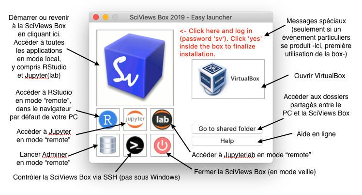
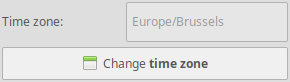
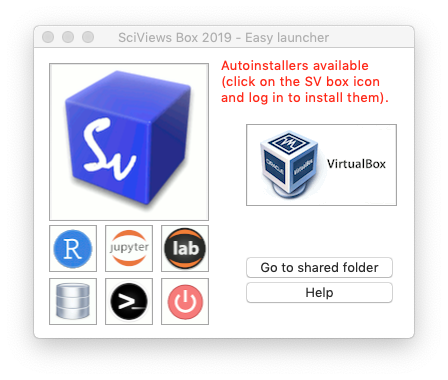

# (APPENDIX) Appendices {-}

# Installation de la SciViews Box {#svbox}

La SciViews Box est une machine virtuelle (c'est-à-dire, l'équivalent d'un ordinateur complet, mais "dématérialisé" et utilisable à l'intérieur de n'importe quel autre ordinateur physique). Elle est spécialement configurée pour analyser des données et rédiger des documents scientifiques de manière professionnelle.

<iframe width="770" height="433" src="http://www.youtube.com/embed/yIVXjl4SwVo?rel=0" frameborder="0" allowfullscreen></iframe>

Dans notre cas, le logiciel de gestion de la machine virtuelle, l'hyperviseur, est **VirtualBox**. C'est un logiciel gratuit qui existe pour Windows, MacOS et la plupart des systèmes Linux. L'avantage d'utiliser une machine virtuelle dans le contexte qui nous concerne ici est double:

1) Elle est **complètement pré-configurée et pré-testée**.

2) Comme tout le monde utilise la même machine virtuelle, les résultats obtenus chez l'un sont parfaitement **reproductibles** chez d'autres.

L'installation est simple, mais il y a quand même quelques pièges. Suivez le guide...

## Prérequis

> Avant d'installer la SciViews Box 2018, vérifiez que votre ordinateur répond aux conditions requises et qu'il est correctement configuré.

### Ordinateur

Il vous faut :

- Un ordinateur suffisamment puissant équipé d'un **processeur Intel Core i5 ou i7, ou son équivalent AMD**, récent si possible. Les tablettes et les machines basiques avec processeur Atom, par exemple, ne sont pas suffisantes. Idéalement, un processeur bi-coeur - bi-thread, ou quadri-coeur est souhaitable.
- Au moins **4Go de mémoire vive**. Le double, voire plus, est nécessaire pour analyser des gros jeux de données mais 4Go devraient suffire pour les analyses de tableaux de tailles plus modestes (tout de même comptant des dizaines de colonnes _versus_ des milliers de lignes).
- Un **disque dur rapide** (un disque SSD est un plus), avec environ 20Go libres que vous pourrez consacrer à la SciViews Box.
- Une carte graphique de bonne qualité, mais qui n'a pas besoin d'être une bête de course, et un écran confortable. Une résolution de 1024x768 est un strict minimum.
- Un **système d'exploitation récent, et si possible, 64bit**: Linux tel Debian 8 (Jessie) ou 9 (Stretch), Ubuntu 16.04 Xenial ou supérieur, ..., Windows 7 ou plus, Mac OS X 10.10 Yosemite ou plus.
- Une **connection Internet** est souhaitable, voire indispensable, en fonction des fichiers d'installation que vous possédez déjà localement ou non pour l'installation. Elle se révèlera également nécessaire à l'utilisation.

### Activation de la virtualisation

La virtualisation fait appel à un jeu d'instructions disponible sur pratiquement tous les processeurs modernes (Intel VT-x ou AMD-v). Malheureusement, elle est désactivée par défaut sur quasi tous les PC (mais les Macs sont, eux, configurés correctement en sortie d'usine). Tant que ces instructions de virtualisation ne seront pas activées, le programme d'installation de la SciViews Box va bloquer avec le message suivant:

Même si vous arriviez à l'installer quand même, vous ne pourriez pas la démarrer, et verriez juste le message suivant (issu de la version précédente de la SciViews Box):

Pour activer ce jeu d'instructions, il faut aller dans le **BIOS**, c'est-à-dire, le petit programme qui démarre votre ordinateur. Il n'y a malheureusement pas de recette unique car chaque constructeur a sa propre façon de faire. De plus, l'endroit où il faut aller dans les menus de configuration du BIOS diffère aussi d'un ordinateur à l'autre. Cependant, la procédure générale est la suivante:

- Redémarrer l'ordinateur,
- Au tout début du démarrage, il faut appuyer sur une touche ou une combinaison de touches (par exemple, `DEL`, `F2`, ...). Restez à l'affût d'un message furtif qui l'indique à l'écran,
- Une fois entré dans le BIOS, repérez l'entrée correspondant au jeu d'instructions de virtualisation. Vous aurez plus de chances en regardant dans le menu relatif au processeur, ou dans les options avancées. Recherchez une entrée de type "Virtualisation", "Intel Virtual Technology", ou "Instructions AMD-v". Activez cette option (cela n'aura aucun effet sur les logiciels que vous avez installés jusqu'ici et qui n'utilisent pas cette fonction),
- Sortez du BIOS en sauvegardant les modifications (suivez les instructions à l'écran),
- Redémarrez l'ordinateur.

Si vous n'arrivez pas à entrer dans le BIOS, ou à trouver l'entrée correspondante dans celui-ci, rechercher "BIOS Virtualization" accompagné de la marque et du modèle de votre ordinateur dans votre moteur de recherche internet favori. Vous y trouverez certainement des instructions plus précises relatives à votre ordinateur. [Ce site](https://www.tactig.com/enable-intel-vt-x-amd-virtualization-pc-vmware-virtualbox/) liste quelques uns de raccourcis claviers à utiliser en fonction de la marque des ordinateurs pour entrer dans le BIOS.

Dans le cas où vous n'arrivez pas à activer la virtualisation sur votre PC, vous pouvez toujours installer une version 32-bit de la SciViews Box en mode d'émulation logicielle de VirtualBox. Dans ce cas, votre box tournera plus lentement et vous n'aurez pas la possibilité d'utiliser plus d'un seul coeur processeur, mais au moins, vous pourrez quand même l'utiliser. La version 64-bit &quot;complète&quot; se nomme <code>svbox2018a</code>. La version 32-bit est <code>svbox2018b</code>. Si vous optez pour cette dernière, adaptez l'intitulé de la machine ou des fichiers (<code>a</code>-&gt; <code>b</code>) dans la suite de ce tutoriel.

**Si votre ordinateur est conforme aux spécifications ci-dessus, et si la virtualisation est activée, vous êtes maintenant prêt à installer votre SciViews Box!**

### Conseils pour acheter un laptop

> Attention : cette analyse est réalisée en octobre 2018. Le matériel informatique et les prix changent constamment, et les informations seront rapidement obsolètes. Les lignes directrices devraient, cependant rester valables à l'avenir pour utiliser la SciViews Box 2018.

Le choix d'un laptop (ordinateur portable) dépend naturellement de son utilisation. Pour l'analyse des données, il faut un ordinateur suffisamment puissant en calcul (processeur, mémoire vive, disque dur), mais la carte graphique ne doit pas être ultra-rapide, sauf si les calculs GPU sont prévus dessus. Ainsi, les tablettes, chromebooks et la plupart des laptops de bureautique ne sont pas assez puissants.

Dans le choix de votre laptop, il faut tout d'abord vous demander si vous voulez un ordinateur pour **apprendre** à traiter des données sur des petits tableaux, et que vous prévoyez changer dans 1 ou 2 ans, ou si vous voulez investir sur plus long terme. Naturellement, le prix sera un critère fondamental, également.

#### Caractéristiques requises

La puissance d'un ordinateur est un tout entre le processeur, la mémoire vive, le disque dur, la carte graphique, etc. Donc, avant tout, il est préférable d'avoir une **configuration homogène**. Rien ne sert d'investir dans le processeur le plus puissant si le disque dur et la mémoire vive ne sont pas à la hauteur, par exemple. Voici quelques pistes...

##### Processeur

La puissance du processeur est primordiale. Idéalement, il faut un processeur rapide et multitâche. Chez Intel, les Core i7 forment le haut de gamme dans les processeurs mobiles. Chez AMD les Ryzen 5, par exemple, conviennent très bien. Encore une fois, du haut de gamme. En dessous, _certains_ Intel Core i5 conviennent, mais d'autres sont trop lents, et à la limite, quelques uns des Intel Core i3 les plus puissants pourraient convenir également. Pas facile, donc, de s'y retrouver dans les centaines de modèles existants.

Comment déterminer si un processeur a une puissance de calcul et de gestion multitâche suffisante ? Voici quelques critères :

- Ne descendez pas en dessous de 4 "threads" (calculs pouvant être réalisés en parallèle). Certains processeurs sont capable de gérer 2 threads pour chaque coeur. Donc, le minimum est deux coeurs "multithreads" capables de gérer quatre threads en tout. Sinon, les processeurs 4 coeurs sont fréquents aujourd'hui. Donc, 4 coeurs/4threads, c'est très bien, et à partir de 4 coeurs/8 threads, c'est parfait.

- La vitesse de calcul était, un temps, proportionnelle à la vitesse du processeur exprimée en GHz. **Ce n'est plus vrai aujourd'hui.** Donc, ne vous fiez qu'à des tests de vitesse processeur fiables. Si on utilise le **[CPUMark](https://www.cpubenchmark.net)**, prenez comme référence la puissance de calcul des ordinateurs de votre salle de travaux pratiques. A la salle "Pentagone", les ordinateurs sont équipés d'Intel Core i5-6400T @ 2.20Ghz. Ce sont des processeurs 4 coeurs/4 threads avec un CPUMark de 5596. Aux salles "Escher" et "Turing", ce sont des processeurs Intel Core i5-4590 @ 3.30Ghz, également 4 coeurs/4 threads affichant un CPUMark de 7295. **Donc, vérifiez le CPUMark du processeur du laptop que vous convoitez et ne descendez pas en dessous de la puissance des machine "Pentagone", soit pas moins de 5000 CPUMark our un travail confortable... mais un CPUMark supérieur ou égal à 3500 pourrait encore convenir.** Pour vous aidez, vous pouvez partir de [cette page](https://www.cpubenchmark.net/compare/Intel-i5-4590-vs-Intel-i5-6400T/2234vs2668) qui permet de comparer directement votre processeur candidat à ceux des salles de travaux pratiques de l'UMONS.

##### Mémoire vive

Il vous faut suffisamment de mémoire pour la partager entre la machine hôte et la machine virtuelle, et garder assez de resources pour ouvrir des tableaux (moyennement) volumineux. Donc, **visez 8Go de mémoire vive** si possible. Pas moins de 4Go, et plus vous en avez, mieux c'est. Il existe des configurations laptops à 16Go. C'est utile !

##### Disque dur

Ici, vous devrez peut-être faire un choix entre espace de stockage et vitesse du disque. En effet, les disques mécaniques classiques font maintenant facilement 1To, ce qui est confortable. Par contre, ils sont plus lents que les disques SSD qui sont à privilégier. Mais ces derniers sont de capacité moindre (dans des gammes de prix raisonnables), généralement 128Go ou 256Go. Des configurations plus haut de gamme combinent deux disques : un SSD rapide pour le système et un disque de 500Go ou 1To classique pour les données. **C'est l'idéal.**

##### Carte graphique et écran

La qualité de la carte graphique est moins importante ici. La plupart des configurations actuelles conviennent. Voyez plutôt la taille (et donc, le poids) du laptop. Voulez-vous un PC de 13 ou 14 pouces plus compact et transportable, ou un 15 à 17 pouces plus confortable, mais plus lourd? Pour la résolution d'écran, ne descendez pas en dessous de 1400x900 pixels, et vérifiez visuellement si la qualité de l'écran vous convient.

##### Wifi et accessoires

Une bonne connexion Wifi sera nécessaire pour vous connecter à Internet. La norme WiFi 802.11ac est idéale. Enfin, vérifiez les connexions proposées : USB rapide (3.0, 3.1 ou C), Thunderbold, DisplayPort, HDMI, etc. pour connecter des périphériques et de écrans externes, lecteur de cartes éventuel, etc.

#### Quelques configurations possibles (octobre 2018)

A titre d'exemples, voici quelques configurations qui conviennent.

##### Configurations minimales

Evitez autant que possible de descendre en dessous de celles-ci (mais si vous possédez déjà un PC, faites un essai et décidez par vous-même si vous pouvez ou non l'utiliser de manière confortable). Il vaut mieux privilégier un petit disque dur SSD rapide qu'un gros disque plus lent. En effet, il est toujours possible d'ajouter un disque dur externe en USB 3.0 plus tard pour stocker les grosses données comme les images et les vidéos.

| Modèle                      | Processeur (c/t/cpumark) | Mémoire | Disque     | Graphique    | Ecran            | Poids  | Prix |
|-----------------------------|--------------------------|---------|------------|--------------|------------------|--------|------|
| Lenovo IdeaPad 320S-14IKB   | Core i3-7100U (2/4/3798) | 8Go     | SSD 128Go  | Intel HD620  | 14'' (1920x1080) | 1.7kg  | 600€ |
| Acer Swift 3 SF314-54-31DR  | Core i3-8130U (2/4/5061) | 4Go     | SSD 256Go  | Intel HD620  | 14'' (1920x1080) | 1.45kg | 600€ |

Dans un budget de 600€, une concession est nécessaire. Le Lenovo a 8Go de mémoire vive, mais un disque SDD de faible capacité (128Go) et un processeur un peu juste. L'Acer a un plus gros disque et un meilleur processeur (toujours i3, cependant), mais n'a que 4Go de mémoire vive. Toutefois, un seul disque dur de seulement 128Go, c'est quand même fort juste. Donc votre préférence ira si possible plutôt vers une configuration du type Acer ci-dessus^[Ce ne sont que des exemples. Recherchez des configurations équivalentes chez d'autres constructeurs aussi !].

##### Configurations correctes

Ici, vous êtes nettement plus confortable : processeur rapide **et** 8Go de mémoire vive **et** double disque (un petit rapide et un plus gros mais plus lent). Ces laptops sont parfaits pour le cours de science des données biologiques et pour bien d'autres tâches dans le cadre de vos études.

| Modèle                      | Processeur (c/t/cpumark)   | Mémoire | Disque              | Graphique      | Ecran              | Poids  | Prix  |
|-----------------------------|----------------------------|---------|---------------------|----------------|--------------------|--------|-------|
| Medion S6625                | Core i5-8250U (2/4/7667)   | 8Go     | SSD 128Go + HDD 1To | GeForce 940MX  | 15.6'' (1920x1080) | 2kg    | 800€  |
| Acer Aspire3 A315-41-R163   | Ryzen 5 2500U (4/8/10000?) | 16Go    | SSD 256Go + HDD 1To | Radeon Vega 8  | 15.6'' (1920x1080) | 2.3kg  | 800€  |
| MacBook Pro 13''            | Core i5-8259U (2/4/10938)  | 8Go     | SSD 128Go           | Intel Iris+640 | 13'' (2560x1600)   | 1.4kg  | 1500€ |

Le Medion est représentatif de ce créneau. Vous combinez un bon processeur, 8Go RAM, deux disques durs, une carte graphique accélérée et un bon écran pour un poids raisonable. L'Acer est une vraie bonne affaire : grâce à un processeur AMD qui intègre le coprocesseur graphique rapide, vous avez la possibilité d'avoir une excellente configuration à prix serré.

Nous avons aussi inclu le premier MacBook Pro 13'' à titre de comparaison : il est presque 2 fois plus cher. Même si son écran est incomparablement meilleur et son processeur ultra-rapide, pour ce prix, vous n'avez qu'un disque de 128Go (ajoutez encore 250€ pour un disque de 256Go) combiné à 8Go de RAM (+240€ pour 16Go RAM). Les MacBook Air et MacBook 12'' conviennent aussi, mais attention à leurs processeurs quand même un peu juste pour de l'analyse de données. Si possible, restez dans la gamme MacBook Pro en laptops Apple. Attention aussi au prix des adaptateurs supplémentaires souvent indispensable pour les produits Apple !

##### Configurations sans concessions

Un budget plus large permet d'acquérir un laptop de course qui sera utile pendant des années, et même pour un travail lourd plus tard... Dans ces configurations, pas de concessions. On veut un processeur i7 à 6 coeurs ou équivalent, 16Go de RAM, un disque SSD d'au moins 256Go, ou mieux deux disques, une carte graphique rapide et un excellent écran.

| Modèle                      | Processeur (c/t/cpumark)   | Mémoire | Disque              | Graphique         | Ecran              | Poids  | Prix  |
|-----------------------------|----------------------------|---------|---------------------|-------------------|--------------------|--------|-------|
| MSI GF63 8RD-051BE          | Core i7-8750H (6/12/12548) | 16Go    | SSD 256Go + HDD 1To | GeForce GTX1050Ti | 15.6'' (1920x1080) | 1.86kg | 1350€ |
| MacBook Pro 15''            | Core i7-8750H (6/12/12548) | 16Go    | SSD 256Go           | Radeon Pro 555X   | 15.4'' (2880x1800) | 1.83kg | 2800€ |

Le MSI est un PC dit "gamer". Tous les laptops dans cette catégorie sont très rapides... et conviennent parfaitement bien pour la science des données, y compris pour les calculs GPU. A titre de comparaison, l'équivalent chez Apple est également présenté (MacBook Pro 15'' "premier prix"). Ce dernier est à nouveau deux fois plus cher. Même si son écran est incomparable, il ne possède qu'un seul disque de 256Go et il faut encore rajouter 240€ pour avoir un disque de 512Go, certes SSD très rapide.

**Voilà ! En espérant que ceci pourra vous aider au mieux dans le choix de votre outil informatique...**

## Installation

Vous allez devoir d'abord installer <strong><a href="http://www.virtualbox.org">VirtualBox</a></strong>, un logiciel gratuit et libre qui se chargera de gérer votre machine virtuelle. Ensuite, vous installerez la <strong>SciViews Box</strong> en elle-même. Pour finir, vous aurez aussi besoin de <strong><a href="https://desktop.github.com">Github Desktop</a></strong>.

### VirtualBox

Récupérez l'installateur correspondant à votre système [ici](https://www.virtualbox.org/wiki/Downloads). L'installation avec tous les paramètres par défaut convient. Il se peut que vous voyiez un message vous indiquant que VirtualBox doit réinitialiser le réseau ou une autre ressource. Vérifiez que tous les documents en cours éventuels sont sauvegardés, et ensuite, vous pourrez continuer l'installation sans risques.

 

\BeginKnitrBlock{win}
De même, sous Windows, l'installateur de VirtualBox vous préviendra peut-être qu'il doit installer l'un ou l'autre périphérique. Vous pouvez également continuer sans craintes (précaution prise par Microsoft, mais ces périphériques fonctionnent bien).

\EndKnitrBlock{win}

### SciViews Box

La procédure d'installation de la SciViews Box diffère selon le système d'exploitation. Reportez-vous à la sous-section correspondante pour **Windows**, **MacOS** ou **Linux**.

#### Installation sous Windows

Chargez l'installateur [ici](http://go.sciviews.org/svbox2018a-win) ou, pour les étudiants de l'UMONS, récupérez-le depuis le disque `StudentTemp` de la salle informatique (sous-répertoire ` SDD\Software\SciViews Box 2018`). Pensez aussi à placer le fichier `svbox2018a.vdi.xz` dans le même répertoire que l'installateur `svbox2018a_win_setup.exe`. Sinon vous devrez le télécharger lors de l'installation (il pèse tout de même 2,9Gb)! Lancez l'installation. Vous verrez l'écran suivant (probablement en version française sur votre ordinateur). Vous pouvez cliquer 'Yes'/'Oui'. Il s'agit seulement d'une précaution de Microsoft lorsqu'il ne connait pas l'éditeur du programme à installer, comme c'est le cas ici.

Si le fichier `svbox2018a.vdi.xz` n'est pas présent dans le même répertoire que le programme d'installation, il est à présent téléchargé (cliquez sur "Details" pour suivre l'opération):

Une fois le téléchargement terminé, l'installation se poursuit. Vous verrez ensuite qu'il y a encore une opération obligatoire à lancer: la décompression du disque virtuel de la SciViews Box (`svbox2018a.vdi`) via '7z'.

En cliquant 'Finish', cette décompression démarre toute seule.

 

N'interrompez surtout pas la décompression du disque virtuel! Sinon, votre SciViews Box ne pourra pas démarrer et vous devrez tout recommencer à zéro en désinstallant et réinstallant complètement l'application.

Losque tout est installé, vous avez une nouvelle icône sur votre bureau. Poursuivez à la section suivante pour démarrer et paramétrer votre SciViews Box.

En option, vous pouvez épingler le nouveau programme dans la barre des tâches. Il sera plus facilement accessible (voir ci-dessous).

#### Installation sous MacOS

Chargez l'installateur [ici](http://go.sciviews.org/svbox2018a-mac) ou, pour les étudiants de l'UMONS, récupérez-le depuis le disque `StudentTemp` de la salle informatique (sous-répertoire ` SDD/Software/SciViews Box 2018`). Si vous le pouvez, placez le fichier `svbox2018a.vdi.xz` dans le dossier de téléchargements (`Téléchargements` ou `Downloads` selon la version de votre MacOS), sinon, ce fichier sera téléchargé au même emplacement (il pèse 2,9Gb)! Double-cliquez sur `svbox2018a_macos_setup.dmg`. Suivez simplement les instructions. 

- Déplacez à la souris 'SciViews Box 2018a' vers le dossier 'Applications' dans la fenêtre de l'installeur (cette partie de l'installation est très rapide, donc, vous n'aurez peut-être pas l'impression que quelque chose se passe),
- Ensuite, toujours dans cette fenêtre, double-cliquez sur le dossier 'Applications' et recherchez l'entrée 'SciViews Box 2018a'. Double-cliquez dessus,
- Si vous avez chargé l'installateur depuis Internet, il se peut que votre Mac indique un message et vous empêche de l'ouvrir. Dans ce cas, il faut cliquer avec le bouton droit de la souris et selectionner "Ouvrir" dans le menu contextuel **tout en maintenant la touche `ALT` enfoncée**, et ensuite cliquer "Ouvrir" dans la boite qui s'affiche.

Laissez l'installation se terminer. Cela peut prendre plusieurs minutes. En option, vous pouvez aussi accrocher le programme de manière permanente dans le "Dock" pour le lancer facilement depuis cet endroit. Cliquez bouton droit et dans le menu "Options", sélectionnez l'entrée "Garder dans le Dock".

#### Installation sous Linux

Il est parfaitement possible d'installer la SciViews Box sous Linux. Cependant, un programme d'installation simplifié n'a pas encore été développé pour ce système. _Voyez au cas par cas avec vos enseignants pour qu'ils vous expliquent comment installer la SciViews Box manuellement sous Linux._

### Github Desktop

Dans ce cours, nous utilisons **Git** et **Github** pour gérer les différentes versions de vos projets et les partager avec vos binômes et vos enseignants. [Github Desktop](https://desktop.github.com) facilite grandement la gestion de vos projets sous Git. Ce programme gratuit est très facile à installer: son téléchargement et le lancement de son installateur ne pose pas de problèmes particuliers. _Notez toutefois que ce programme n'est pas encore disponible pour Linux._

**A présent, tous les ligiciels requis sont installés... Il ne reste plus que quelques petites opérations de configuration à réaliser. Voyez ceci à la section suivante.**

## Configuration

Même si la SciViews Box est pré-configurée, vous allez avoir quelques manipulations simples à réaliser pour être complètement opérationnel. Ces étapes sont détaillées ci-dessous. Nous en profiterons par la même occasion par nous familiariser avec quelques uns des outils logiciels que vous utiliserez plus tard, à commencer par le lanceur rapide SciViews Box.

### Lanceur SciViews Box

L'application que vous venez d'installer est un **lanceur rapide** qui facilite le démarrage, la fermeture et la gestion de votre machine virtuelle SciViews Box 2018a. Démarrez-là et vous verrez la fenêtre suivante:

Le message en rouge n'apparait pas systématiquement. Il signale des éléments importants. Ici, il indique que la configuration de la SciViews Box doit encore être faite, et pour cela, vous devez (1) **la démarrer** à l'aide du gros bouton en haut à gauche, (2) **vous logger** (mot de passe = **sv**), et (3) **répondre `Yes`** lorsqu'une boite de dialogue vous propose d'installer 'svbox2018a v1.0.0'.

 

Cette dernière étape est importante! Ne cliquez pas <code>No</code> ici, sous peine de ne pas avoir une machine virtuelle configurée comme celle de vos collègues!

Le mot de passe vous sera redemandé, et ensuite, l'installation se poursuivra. Elle pourra prendre plusieurs minutes. Soyez patient. Vous pourrez ouvrir la fenêtre du terminal où s'opère le travail pour en suivre la progression, si vous le souhaitez.

A la fin vous verrez la fenêtre du configurateur de la SciViews Box apparaître.

### Configurateur de la Box

Prenez le temps de parcourir les différents éléments dans cette fenêtre^[Si jamais vous voulez retourner plus tard au configurateur de la SciViews Box, vous n'aurez qu'à cliquer sur son icône tout en haut à droite dans la barre supérieure.].

La partie à gauche en haut concerne la **configuration du clavier**. En effet, la machine virtuelle utilisera votre clavier physique, mais elle n'a aucun moyen de déterminer de quel modèle il est. Vous allez donc l'indiquer maintenant. Utilisez la zone de texte intitulée `Test area (type here)`  pour vérifier que la machine virtuelle interprète correctement les touches de votre clavier. Pour le changer, cliquez sur le bouton `Change keyboard layout`. 

La boite de dialogue de sélection du clavier apparait. Elle propose des configurations différentes sous forme de représentations graphiques, avec les touches caractéristiques surlignées en jaune. Vous pouvez entrer les premières lettres du type de clavier pour aller directement à la configuration correspondante dans la liste (ex.: entrez `be` pour un clavier belge). Si votre clavier ne se trouve pas dans les templates les plus courants, configurez-le à l'aide du bouton `Other keyboard...`. Fermez cette fenêtre pour retourner au configurateur lorsque vous aurez fini.

Enfin, toujours concernant le clavier, la case à cocher `Exchange left CTRL / CMD (Mac shortcuts)` permet d'utiliser les raccourcis Mac (comme `Cmd-c` pour copier et `Cmd-v` pour coller à la place de `Ctrl-c` ou `Ctrl-v` sur un PC.

Cette option n'est utile qu'aux possesseurs d'un Mac qui veulent avoir des raccourcis plus homogènes entre leur système MacOS hôte et la machine virtuelle^[Le Mac définit ses raccourcis claviers différemment du PC. Outre l'inversion de l'utilisation des touches `Ctrl` et `Cmd`, le Mac possède deux touches `Alt`, une à gauche et une à droite. Le PC a, par contre, deux touches correspondantes, mais celle de droite est nommée `Alt Gr`. Ces touches jouent des rôles différents: raccourcis claviers pour `Alt` et accès aux touches de niveau 3 et 4 pour `Alt Gr`. **Pour les utilisateurs Mac, notez que vos deux touches `Alt` ont des rôles différents dans la SciViews Box comme pour un clavier PC.** Enfin, VirtualBox réserve une touche clavier à son propre usage. Par défaut, c'est la touche `Cmd` ou `Win` de droite. **Il est déconseillé de modifier ce choix car toutes les autres touches sont indispensables dans la SciViews box!**].

Juste en dessous, vous voyez la configuration du fuseau horaire.

Ici aussi, votre machine virtuelle n'a pas l'information de votre système hôte, et peut donc ne pas afficher l'heure correctement. Vous avez la possibilité de corriger cela en cliquant sur le bouton `Change time zone`. Vous devez débloquer la boite de dialogue (bouton `Unlock` en bas, puis entrer le mot de passe pour pouvoir effectuer des changements).

Les trois boutons à gauche en bas servent à choisir le stylage des fenêtres, le set d'icônes et l'image d'arrière plan de votre SciViews Box.

C'est ici que vous pourrez la paramétrer au mieux pour qu'elle vous plaise visuellement. A noter que, si vous double-cliquez sur les entrées dans les boites de dialogue de configuration, vous allez pouvoir **prévisualiser** l'effet en live. Utile pour apprécier le rendu avant de faire son choix!

La zone en bas à droite permet de modifier le mot de passe.

Pour rappel, il s'agit d'un mot de passe simple et peu sécure par défaut: `sv`. En fait, vous n'avez pas réellement besoin d'un mot de passe à l'intérieur de votre SciViews Box telle qu'elle est configurée car vous ne pouvez y accéder qu'en local à partir de l'ordinateur hôte. Par contre, il est possible d'ouvrir l'accès. A ce moment-là, il serait utile, *et même indispensable*, de modifier le mot de passe.

Dans le cadre de votre utilisation de la SciViews Box pour ce cours, que ce soit sur les machines de la salle de T.P., ou sur votre ordinateur personnel, ne <strong>changez pas</strong> le mot de passe! Votre machine virtuelle est <em>déjà</em> protégée par votre système hôte puisque seul un accès local est autorisé.

La zone en haut à droite permet de configurer votre compte Git.

Comme vous allez utiliser Git et Github de manière intensive tout au long de ce cours, **veuillez configurer cette partie du système correctement d'amblée!** Les trois boutons du bas proposent de s'enregistrer sur trois systèmes distants d'hébergement de dépôts Git (si vous ne savez pas ce que c'est, imaginez juste que c'est là que vous allez pouvoir entreposer de manière sûre tous vos projets!): **Github**, **Gitlab** ou **Bitbucket**. Tous trois ont des avantages et des inconvénients, et ils proposent tous des utilisations gratuites dans certains cas.

Durant nos cours de Science des Données à l'UMONS, nous utiliserons <strong>Github</strong>. Cette utilisation sera gratuite pour vous, et vous allez pouvoir déjà commencer à construire <strong>votre identité professionnelle sur le Net</strong> par son intermédiaire. Donc, enregistrez-vous de manière sérieuse. Choisissez un login représentatif de vos nom et prénom, pas un truc louffoque ou rigolo sur le moment, mais que vous regretterez plus tard, sachant que votre login ne pourra <strong>pas</strong> être changé ensuite!

Vous allez donc vous créer un compte sur Github en cliquant sur le bouton correspondant, et en indiquant un login et un mot de passe. **Nous vous demandons également d'utiliser expressément et uniquement votre adresse email UMONS ici : prénom.nom@student.umons.ac.be.** En effet, ce sera, pour nous, notre seul moyen de vous identifier sans erreur sur Github lorsque nous interviendrons pour vous conseiller et/ou pour corriger vos travaux.

Une fois enregistré sur le site de Github, reportez votre login et votre adresse email dans le configurateur de la SciViews Box, pour que Git puisse vous identifier correctement en local^[A la première utilisation de Git à l'intérieur du logiciel **RStudio**, votre login et votre mot de passe vous seront également redemandés. De même, vous devrez également fournir ces informations dans **Github Desktop** et la première fois que vous naviguerez vers https://github.com depuis le navigateur Web de votre PC hôte. Mais ensuite, vous accèderez immédiatement au service.].

Une fois tout ceci effectué vous pourrez cliquer sur le bouton `OK` de la fenêtre du configurateur SciViews Box. La machine virtuelle devra redémarrer pour appliquer toutes les modifications de manière durable. Cliquez également `OK` donc dans la boite de dialogue qui apparait ensuite (sinon, elle redémarrera toute seule après 30 sec) :

### Installation des tutoriels {#install-tuto}

Nous allons maintenant installer les tutoriels liés à ces cours de science des données biologiques. Vous allez apprendre par la même occasion comment ajouter des applications dans votre SciViews Box. Cela se fait en trois étapes:

1) Télécharger l'installeur de l'application. Vous le trouverez à l'adresse http://go.sciviews.org/BioDataScience1. Assurez-vous de bien le charger dans le répertoire **Downloads** ou **Téléchargements** par défaut sur votre ordinateur^[Il pourra ainsi être replacé au bon endroit et exécuté dans la Box],

2) Rentrez dans le lanceur rapide de la SciViews Box. Il repère l'autoinstalleur et le déplace dans le dossier partagé pour le rendre utilisable par la SciViews Box. Vous devez voir un message indiquant la disponibilité d'autoinstalleur(s). Votre fichier a également disparu du répertoire de téléchargement à ce stade,

   

3) Rentrez dans la SciViews Box depuis le lanceur. Si la Box était déjà active ou si elle est réveillée du mode veille, vous allez devoir vous délogger et relogger pour que l'installation démarre, ... sinon, vous allez voir directement le message suivant qui propose d'installer l'app (cliquez sur `Yes`, bien sûr, pour l'installer).

    

Si le message n'apparait pas, voici comment se délogger (**log out**).

Ensuite, entrez votre mot de passe comme d'habitude pour vous relogger... A ce moment, le message doit apparaitre, et l'installation doit se faire après avoir cliqué le bouton `Yes`.

**Bravo! Vous avez terminé l'installation et la configuration de votre SciViews Box. Cependant, nous allons encore effectuer une petite opération qui vous facilitera la vie, et nous vous expliquerons par la même occasion comment accéder aux fichiers respectifs de la machine virtuelle et du système hôte dans la section suivante.**

### Accès aux fichiers

Le disque physique de votre ordinateur hôte, et le disque virtuel de la SciViews Box sont deux choses différentes. Cela signifie que vous avez, en réalité deux ordinateurs et deux disques indépendants. Donc, vous n'accédez **pas** aux fichiers d'une machine à partir de l'autre^[Le presse-papier est synchronisé entre les deux machines pour le texte qui y est copié.]. Ce n'est pas pratique, et ce n'est pas vrai pour un dossier particuler nommé **shared**.

Ce dossier **shared** est synchronisé en temps réel entre les deux systèmes. C'est donc l'endroit idéal pour échanger des données et pour faire collaborer vos deux machines. Inutile de préciser, donc, que nous travaillerons essentiellement à l'intérieur de ce dossier. Un sous-dossier, nommé **projects** sera utilisé pour héberger toutes nos analyses. Il est donc primordial d'y accéder facilement à la fois depuis l'ordinateur hôte et depuis la SciViews Box. Vous allez donc apprendre à retrouver ce dossier **projects** facilement.

Sur votre **ordinateur hôte**, ce dossier est un peu difficile à trouver en naviguant dans l'explorateur de fichiers (ou le Finder sur le Mac). Pour cette raison, le lanceur rapide propose un bouton pour y accéder plus facilement.

Une fois dans le dossier **shared**, nous vous conseillons d'épingler le sous-dossier **projects** dans les raccourcis rapides de votre explorateur de fichiers. Voici comment faire sous Windows et sous MacOS. 

\BeginKnitrBlock{win}
Sous Windows, cliquez bouton droit sur **projects**, et sélectionnez "épingler dans Accès rapide".

\EndKnitrBlock{win}

\BeginKnitrBlock{mac}
Sous MacOS, vous glissez-déposez **projects** dans la barre latérale du Finder.

\EndKnitrBlock{mac}

Dans la **SciViews Box**, ce dossier est accessible depuis deux endroits: `/media/sf_shared` et `~/shared` (`~` représente le répertoire de l'utilisateur, c'est-à-dire `/home/sv`). Ici aussi vous pouvez épingler votre dossier **projects** pour en facilter l'accès:

\BeginKnitrBlock{svbox}
Les deux moyens d'accéder au dossier **projects** dans la SciViews Box et comment l'épingler sur le côté.

\EndKnitrBlock{svbox}

**A retenir:** le dossier **shared** et ses sous-dossiers comme **projects** sont considérés un peu comme des dossiers réseau par la SciViews Box. Cela implique que certaines fonctions du système de fichiers n'y sont pas accessibles. Parmi celles-ci, la **poubelle**. Donc, vous ne pourrez qu'effacer complètement des items en cliquant bouton droit et sélectionnant 'Delete' dans le menu contextuel dans le gestionnaire de fichiers. Si vous essayer de placer des fichiers ou dossiers depuis **shared** dans la poubelle de la SciViews Box, cela vous sera refusé (voir copie d'écran ci-dessous). _Par contre, cela fonctionne très bien depuis l'ordinateur hôte._

Un tout dernier point concernant les ordinateurs de la salle de T.P. de l'UMONS. Pour des questions de performance, la machine virtuelle SciViews Box, et le dossier **shared** ne sont **pas** sur votre compte, mais directement sur le disque de l'ordinateur. Cela signifie qu'ils ne sont pas transportables vers un autre ordinateur. Vous pouvez créer une copie de **shared** dans **mes documents** ou sur une clé USB pour les transporter vers un autre ordinateur... mais nous verrons que cela n'est pas nécessaire pour tout ce que vous stockerez sur Github. En effet, vous avez accès à ces contenus depuis n'importe où via n'importe quelle connexion internet.

## Utilisation {#svbox_use}

Une fois votre machine virtuelle configurée, vous vous trouvez confronté à cet écran qui ressemble à votre bureau d’ordinateur hôte. 

Cette machine virtuelle utilise le système d'exploitation linux. Vous pouvez accèder au application présent sur cette machine dans l'onglet `Application`. Ce dernir offre un menu déroulant avec l'ensemble des applications disponibles. Ces applications sont rangé en dossier  tel que `Favorites`, `Recently Used` , `All`, ...

Le "dock" en bas permet de lancer des applications rapidement (accès rapide) et d'accéder aux fenêtres des applications en cours d'exécution tel que RStudio, Jupyter, Spyder,...

Pour accèder à vos dossiers, il suffit de cliquer sur l'onglet `Home` que l'on retrouve également dans le dock.

