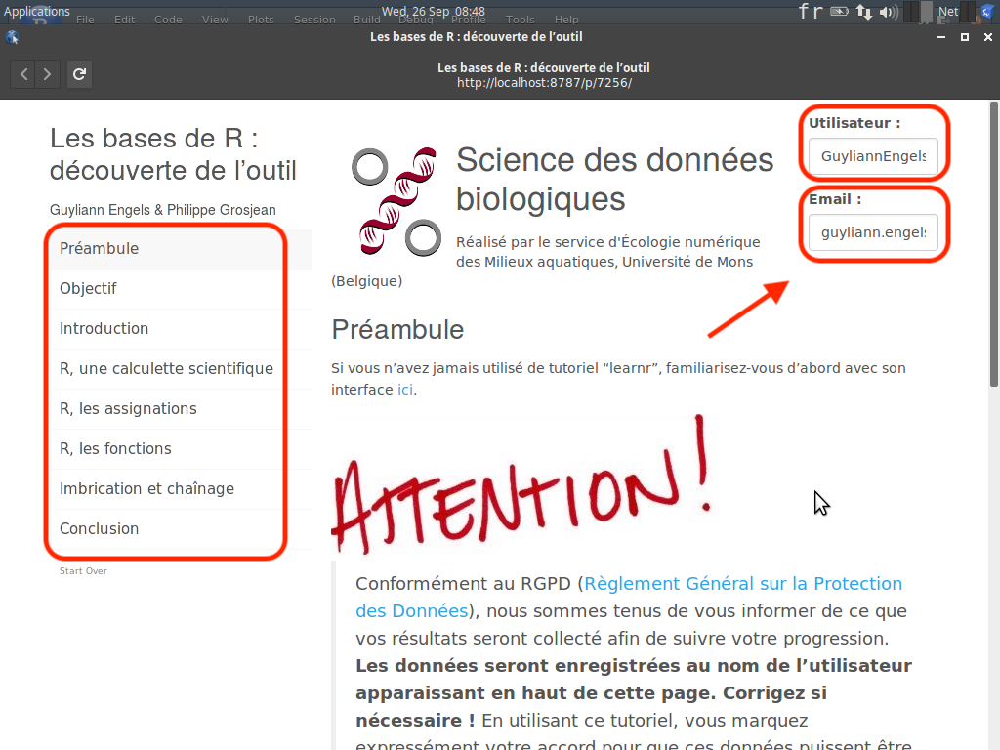
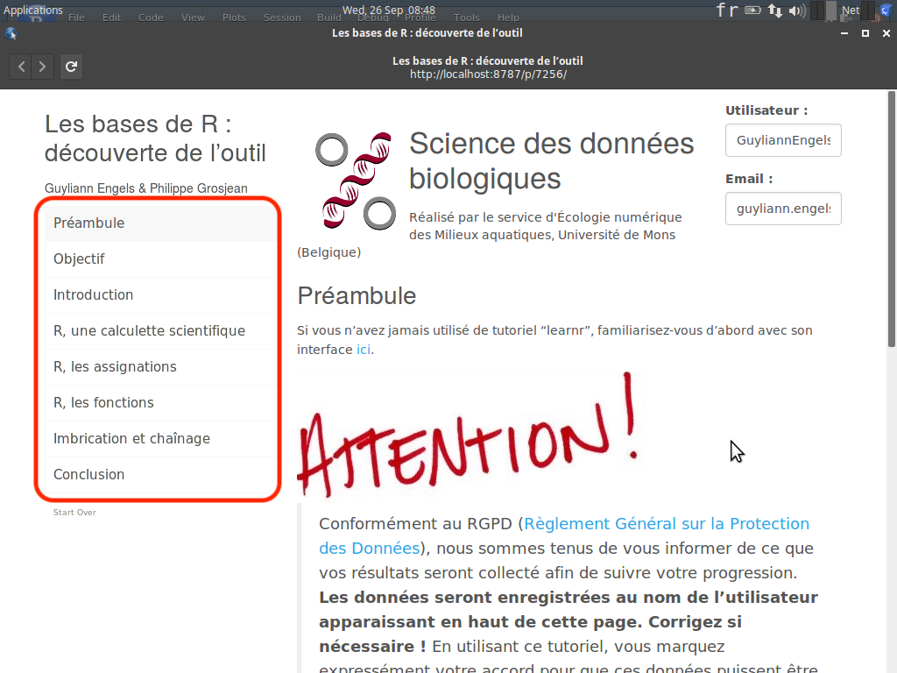
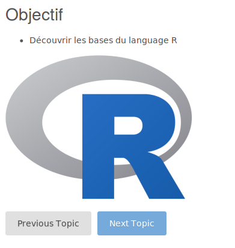
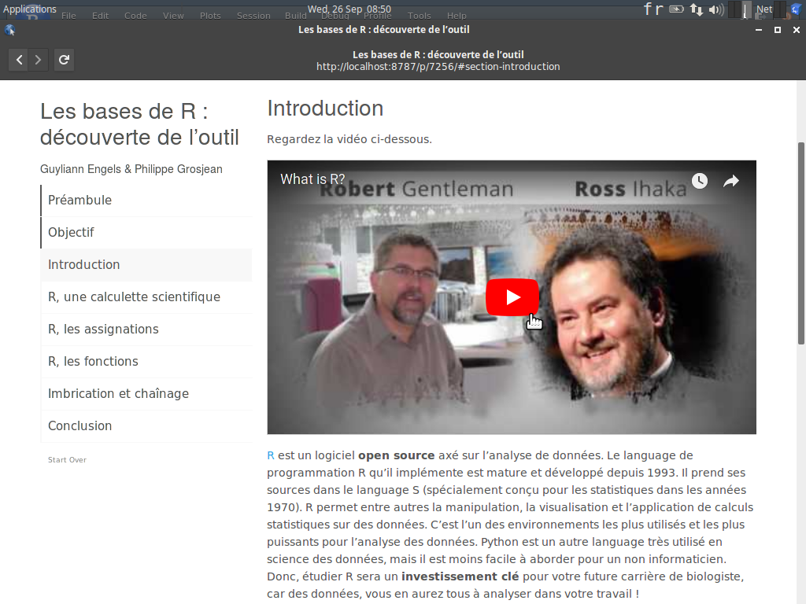
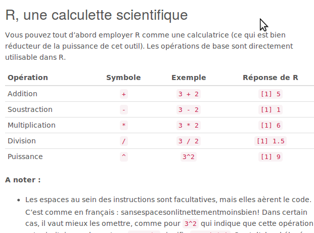
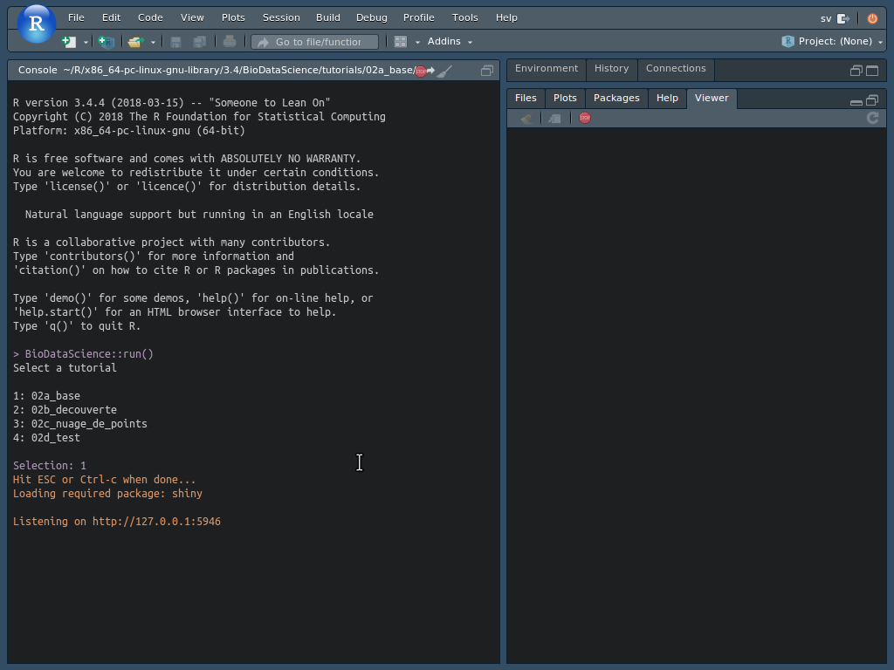

# Tutoriels "learnr" {#learnr}

En complément de ce syllabus, vous allez utiliser également des tutoriels interactifs construits avec [learnr](https://rstudio.github.io/learnr/index.html). Si ce n'est déjà fait, commencez par installer ces tutoriels dans votre SciViews Box (voir \@ref(install-tuto)).

Lors de l'écriture de l'instruction ci-dessous dans la console de RStudio

    BioDataScience::run()

La liste des tutoriels vous est proposée (ces tutoriels comme tous les autres  outils pédagogiques sont en cours de développement): 

1: 02a_base

2: 02b_decouverte

3: 02c_nuage_de_points

4: 02d_test

...

Vous êtes redirigé vers le tutoriel interactif que vous sélectionnez. En sélectionnant le numéro 1, vous êtes redirigé vers le tutoriel concernant les base de R intitulé 02a_base.  

La première chose à vérifier à l'ouverture du tutoriel interactif est le nom d'utilisateur (username dans github) et votre adresse email (adresse email de github). 

Le learnr est un outil pédagogique mis au point afin de proposer des tutoriaux interactifs comprennant, des illustrations, des questions à choix multiples, des exercices R,...

Les learnr qui vont seront proposé tout au long de votre formation seront composé de la manière suivante :

- Objectif
- introduction
- Une série d'exercice
- Conclusion

Vous retrouvez d'ailleurs cette structure en haut à gauche de ce dernier. Chaque page du tutoriel est importante et implique vitre attention. 

La section préambule n'est présente que dans le premier tutoriel afin de renvoeyer vers cette annexe. 

- Objectifs

Cette section va détailler l'ensemble des notions que vous allez devoir maitriser durant ce tutoriel. Dans le cadre de ce premier tutoriel, l'unique objectif de ce tutoriel est donc de découvrir les bases du language R. 

- Introduction

Cette section va vous replacer dans le contexte du tutoriel interactif avec un rappel succinct des notions théoriques indispensables afin de répondre à la série d'exercices. L'exemple ci-dessous propose une vidéo Youtube à ce sujet. 

- Une serie d'exercices 

Cette section peut être de longueurs très variables en fonction de la difficulté des notions à appréhender.

Il est possible d'obtenir des zones de codes R afin de rentrer ces instructions pour répondre à la question. Pour exécuter ces instructions, il faut cliquer sur `Run Code` et pour soumettre sa réponse `Submit Answer`.

- Conclusion

Cette section termine ce tutoriel et propose de laisser des commentaires avec l'utilisation de dièse `#`. Fermez la page.

En retournant dans RStudio, vous devez terminer le tutoriel en utilisant `esc` ou `ctrl-c`. 

