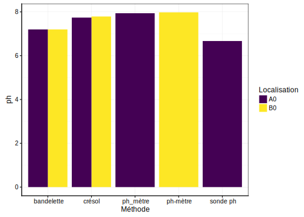

# Rédaction scientifique {#redaction_scientifique}

La rédaction scientifique respecte un certain caneva expliqué dans cette annexe. 

###### Pour en savoir plus...

- [Recherche documentaire et aide à la création (ReDAC)](https://moodle.umons.ac.be/enrol/index.php?id=5). L'Université de Mons met à disposition de ses étudiants un cours en ligne afin de trouver un maximum de renseignements sur la rédaction de rapports scientifiques.

## Organisation 

 Un rapport scientifique respecte généralement le schéma suivant :

1. Tables des matières
2. Introduction
3. Matériels et méthodes
4. Résultat
5. Discussion
6. Conclusion
7. Bibliographie
9. Annexe (si nécessaire)

Pour des travaux de plus grandes ampleurs comme les travaux de fin d'études, le schéma ci-dessus est adapté en y ajoutant généralement une partie remerciement en début de manuscrit.

## Contenu 

Le rapport sert à restituer de façon synthétique une expérience, ses résultats et les interprétations pouvant être faites. Il faut garder à l’esprit qu’un lecteur n’ayant jamais entendu parler de cette expérience doit comprendre l’intégralité du rapport.

### Tables des matières

La table des matières est d'une importance capitale afin de présenter la structure de votre rapport aux lecteurs. Heureusement, il n'est pas nécessaire de l'écrire manuellement. La table des matières est générée automatiquement dans un rapport R Markdown.

L'instruction à ajouter dans le préambule du document R Notebook afin d'obtenir une table des matières est `toc: yes` .

L'instruction à ajouter en plus de `toc: yes` dans le préambule du document R Notebook afin d'obtenir une table des matières numéri est `number_sections: yes` .

Il est également possible de modifier ces paramètres dans les paramètres de sortie du document comme le montre l'image ci-dessous.

### Introduction

L'introduction d'un rapport d'analyse (ou d'un mémoire) a pour principal objectif de replacer l'expérience réalisée dans son contexte. 

La règle la plus importante est qu'**un lecteur n’ayant jamais entendu parler de cette expérience doit comprendre l’intégralité du rapport.**

L'introduction doit donc permettre de : 

- Remettre l'expérience dans son contexte,
- Décrire l'organisme étudié
      + description de l'organisme, distribution géographique, biotope,...
      
Notez que l'ajout d'images ou d'une carte de distribution  est un plus dans la lecture d'une introduction.

### But

Le but permet de synthétiser la question posée durant cette expérience en fonction du contexte de l'expérience expliqué dans l'introduction.

### Matériel & méthodes

Le matériel & méthodes permettent de décrire les aspects techniques de l'expérience comme le matériel employé et les méthodes employées afin d'acquérir les données.

Cette section est également le lieu des descriptions des méthodes d'analyse employées, des programmes utilisés,...

### Résultats

Les résultats vont généralement contenir 2 parties : 

- Description des données : exploration des données récoltées (avec graphiques et/ou estimateurs statistiques)
- Application des outils statistiques pertinents pour répondre à la question posée 

### Discussion

Cette section comprend l'interprétation biologique des résultats. En effet, il est d'une importance capitale d'avoir un regard critique sur les résultats obtenus. 

Exemple : 

- Variation du pH de l'eau de mer de 8 à 6 

Lors de la mesure des paramètres physicochimiques de l'eau de mer, une étude monitore le pH avec différents instruments et propose le graphique suivant :

Vous observez que deux unités différentes sont étudiées (A0 et B0) et que 5 instruments différents sont employés. 

Ce graphique vous semble pertinent ? Aucune information qui y figure ne vous choque ? 

Si ce n'est pas le cas, il faut encore exercer votre oeil de biologiste. La sonde pH sur le graphique propose une valeur de pH proche de 6.5 alors que les autres instruments sont entre 7.2 et 8. 

**Nous sommes donc passé d'un pH légérement basique à un pH acide. Les organismes présents dans les aquariums serait mort à cette valeur de pH.**

Elle est également le lieu de comparaison avec d'autres études dans le domaine, de la critique du design expérimental,... 

### Conclusion & perspective

Cette section va tenir une sorte de résumé de notre expérience par rapport à au but de cette dernière et proposer des perspectives afin de continuer la recherche sur cette thématique.

### Bibliographie

La rédaction de travaux s'appuye toujours sur une recherche bibliographique au préalable. Cependant, il est capital d'insérer convenablement les sources du travail au sein de la section bibliographie afin d'éviter le **plagiat** volontaire ou involontaire. Il existe une multitude de programme permettant la gestion d'une bibliographie comme [Mendeley](https://www.mendeley.com/), [Zotero](https://www.zotero.org/) ou encore [Endnote](https://endnote.com/). 

- [Citer ses sources dans un rapport R Notebook](https://rmarkdown.rstudio.com/authoring_bibliographies_and_citations.html#citation_styles) : page en anglais présentant la manière d'introduire une bibliographie dans un rapport R Notebook.

## Nom des espèces

Le nom complet d'une espèce en biologie suit une convention particulière que vous devez appliquer dans toutes vos productions écrites : 

Partons de l'exemple de l'oursin violet, une espèce est classée de la manière suivante (Les niveaux de classification les plus importants sont mis en gras) :

- **Règne** : Animalia
- Sous-Embranchement : Echinozoa
- **Embranchement** : Echinodermata
- **Classe** : Echinoidea
- Super ordre : Echinacea
- **Ordre** : Camarodonta
- Infra-ordre : Echinidae
- **Famille** : Parachinidae
- **Genre** : *Paracentrotus*
- **Espèce** : *lividus*

Afin de former le nom binomial de l'oursin violet, on utilise le genre et l'espèce de la classification proprosée ci-dessus : 

- *Paracentrotus lividus*

Le nom binomial n'est pas suffisant afin de nommer correctement une espèce. Il faut également ajouter le **nom du naturaliste** qui a nommé et décrit l'espèce et l'année de la publication de la discription (on parle de diagnose en biologie).

- *Paracentrotus lividus* Lamarck  1816

Lors de la première citation de l'espèce étudiée dans un rapport, il est indispensable de spécifier le nom complet de l'espèce qui sera abbrégé par la suite en *P. lividus*
